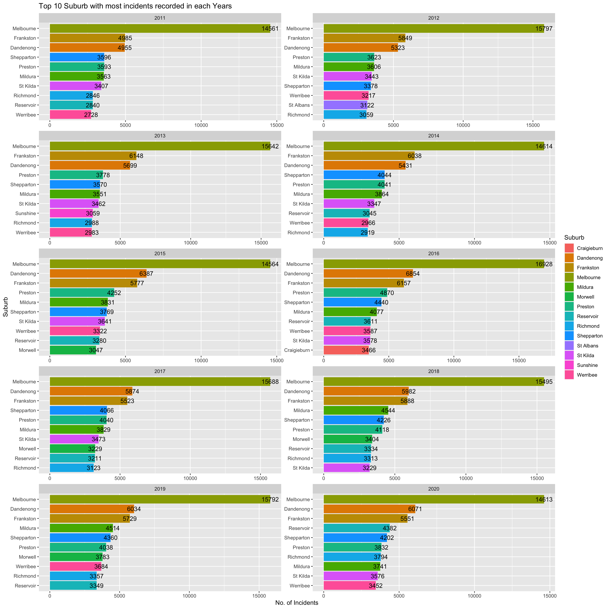
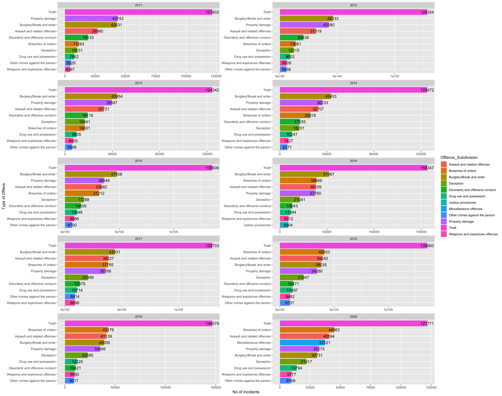

# Introduction


# Research questions:


Section 1 - Table 1

- [ ] Which police region has the greatest number of incidents recorded?
- [ ] How did the trend of incidents recorded in those police regions varied across the years?
- [ ] What is the trend of incidents recorded in North West Metro's local government areas changes over time?

Section 2

- [ ]  For each LGA , which offence_subdivision, recorded maximum incidents
- [ ] For each LGA,Which offence_subgroup was most recorded in the previous found offence_subdivision's?
- [ ] What was the trend of each offence_subgroup found over the years?

Section 3

- [ ]  For each Suburb/Town, which offence_subdivision, recorded maximum incidents
- [ ] For each Suburb/Town,Which offence_subgroup was most recorded in the previous found offence_subdivision's?


# Section 1

Note: The data for section 1 data analysis has excluded the criminal incidents where the geographic location is unknown. For further information on these geographic locations please refer to the Explanatory Notes and Glossary on the [website](https://www.crimestatistics.vic.gov.au/about-the-data/explanatory-notes#Data%20source%20%E2%80%93%20Victoria%20Police).

## Q1 Which police region has the greatest number of incidents recorded?

From the table \@ref(tab:table1), it shows an overview of the total number of incidents recorded for each police region from 2011 to 2020. It indicates that the North West Metro police region has recorded maximum incidents during the period. 

<table class="table table-striped table-hover" style="margin-left: auto; margin-right: auto;">
<caption>(\#tab:table1)Number of Incidents Recorded in different Police Region</caption>
 <thead>
  <tr>
   <th style="text-align:center;"> Police.Region </th>
   <th style="text-align:center;"> Total_Incidents </th>
  </tr>
 </thead>
<tbody>
  <tr>
   <td style="text-align:center;"> 1 North West Metro </td>
   <td style="text-align:center;"> 1442412 </td>
  </tr>
  <tr>
   <td style="text-align:center;"> 3 Southern Metro </td>
   <td style="text-align:center;"> 856043 </td>
  </tr>
  <tr>
   <td style="text-align:center;"> 2 Eastern </td>
   <td style="text-align:center;"> 798741 </td>
  </tr>
  <tr>
   <td style="text-align:center;"> 4 Western </td>
   <td style="text-align:center;"> 584529 </td>
  </tr>
  <tr>
   <td style="text-align:center;"> Justice Institutions and Immigration Facilities </td>
   <td style="text-align:center;"> 10764 </td>
  </tr>
  <tr>
   <td style="text-align:center;"> Unincorporated Vic </td>
   <td style="text-align:center;"> 973 </td>
  </tr>
</tbody>
</table>
## Q2 How did the trend of incidents recorded in those police regions varied across the years? 

Figure \@ref(fig:total) presents the movement of the incidents recorded for each police region over time. 

In the four main police regions of Victoria, it illustrates an evident fact that the number of incidents recorded has reached the peak around early 2016, then has a sudden pungle afterward.

The possible reason behind may be that the large decrease on the number of burglary and theft from 2016 to 2017, according to the report from [Victoria crime statistics](https://www.crimestatistics.vic.gov.au/crime-statistics/latest-victorian-crime-data/victim-reports-2).

Additionally, this report states that the number of deception cases is in a continuous increase, which may due to the convenience of technology of e-mail, mobile phones and the internet. Thus, it may highlight some areas for re-enforcement in the future, such as cyber security and private data privacy.

<div class="figure" style="text-align: center">

```{=html}
<div id="htmlwidget-8b444efa72c4328e790e" style="width:960px;height:768px;" class="plotly html-widget"></div>
<script type="application/json" data-for="htmlwidget-8b444efa72c4328e790e">{"x":{"data":[{"x":[2011,2012,2013,2014,2015,2016,2017,2018,2019,2020],"y":[125436,136296,133827,136799,145341,162189,144912,149908,152796,154908],"text":["Year: 2011<br />Total_Incidents: 125436<br />Police.Region: 1 North West Metro","Year: 2012<br />Total_Incidents: 136296<br />Police.Region: 1 North West Metro","Year: 2013<br />Total_Incidents: 133827<br />Police.Region: 1 North West Metro","Year: 2014<br />Total_Incidents: 136799<br />Police.Region: 1 North West Metro","Year: 2015<br />Total_Incidents: 145341<br />Police.Region: 1 North West Metro","Year: 2016<br />Total_Incidents: 162189<br />Police.Region: 1 North West Metro","Year: 2017<br />Total_Incidents: 144912<br />Police.Region: 1 North West Metro","Year: 2018<br />Total_Incidents: 149908<br />Police.Region: 1 North West Metro","Year: 2019<br />Total_Incidents: 152796<br />Police.Region: 1 North West Metro","Year: 2020<br />Total_Incidents: 154908<br />Police.Region: 1 North West Metro"],"type":"scatter","mode":"lines+markers","line":{"width":1.88976377952756,"color":"rgba(248,118,109,1)","dash":"solid"},"hoveron":"points","name":"(1 North West Metro,1)","legendgroup":"(1 North West Metro,1)","showlegend":true,"xaxis":"x","yaxis":"y","hoverinfo":"text","marker":{"autocolorscale":false,"color":"rgba(248,118,109,1)","opacity":1,"size":5.66929133858268,"symbol":"circle","line":{"width":1.88976377952756,"color":"rgba(248,118,109,1)"}},"frame":null},{"x":[2011,2012,2013,2014,2015,2016,2017,2018,2019,2020],"y":[65733,71037,72927,74393,78028,90242,83230,82729,90397,90025],"text":["Year: 2011<br />Total_Incidents:  65733<br />Police.Region: 2 Eastern","Year: 2012<br />Total_Incidents:  71037<br />Police.Region: 2 Eastern","Year: 2013<br />Total_Incidents:  72927<br />Police.Region: 2 Eastern","Year: 2014<br />Total_Incidents:  74393<br />Police.Region: 2 Eastern","Year: 2015<br />Total_Incidents:  78028<br />Police.Region: 2 Eastern","Year: 2016<br />Total_Incidents:  90242<br />Police.Region: 2 Eastern","Year: 2017<br />Total_Incidents:  83230<br />Police.Region: 2 Eastern","Year: 2018<br />Total_Incidents:  82729<br />Police.Region: 2 Eastern","Year: 2019<br />Total_Incidents:  90397<br />Police.Region: 2 Eastern","Year: 2020<br />Total_Incidents:  90025<br />Police.Region: 2 Eastern"],"type":"scatter","mode":"lines+markers","line":{"width":1.88976377952756,"color":"rgba(183,159,0,1)","dash":"solid"},"hoveron":"points","name":"(2 Eastern,2)","legendgroup":"(2 Eastern,2)","showlegend":true,"xaxis":"x2","yaxis":"y2","hoverinfo":"text","marker":{"autocolorscale":false,"color":"rgba(183,159,0,1)","opacity":1,"size":5.66929133858268,"symbol":"circle","line":{"width":1.88976377952756,"color":"rgba(183,159,0,1)"}},"frame":null},{"x":[2011,2012,2013,2014,2015,2016,2017,2018,2019,2020],"y":[70699,77025,78961,78128,86842,98859,86711,89478,93788,95552],"text":["Year: 2011<br />Total_Incidents:  70699<br />Police.Region: 3 Southern Metro","Year: 2012<br />Total_Incidents:  77025<br />Police.Region: 3 Southern Metro","Year: 2013<br />Total_Incidents:  78961<br />Police.Region: 3 Southern Metro","Year: 2014<br />Total_Incidents:  78128<br />Police.Region: 3 Southern Metro","Year: 2015<br />Total_Incidents:  86842<br />Police.Region: 3 Southern Metro","Year: 2016<br />Total_Incidents:  98859<br />Police.Region: 3 Southern Metro","Year: 2017<br />Total_Incidents:  86711<br />Police.Region: 3 Southern Metro","Year: 2018<br />Total_Incidents:  89478<br />Police.Region: 3 Southern Metro","Year: 2019<br />Total_Incidents:  93788<br />Police.Region: 3 Southern Metro","Year: 2020<br />Total_Incidents:  95552<br />Police.Region: 3 Southern Metro"],"type":"scatter","mode":"lines+markers","line":{"width":1.88976377952756,"color":"rgba(0,186,56,1)","dash":"solid"},"hoveron":"points","name":"(3 Southern Metro,3)","legendgroup":"(3 Southern Metro,3)","showlegend":true,"xaxis":"x3","yaxis":"y3","hoverinfo":"text","marker":{"autocolorscale":false,"color":"rgba(0,186,56,1)","opacity":1,"size":5.66929133858268,"symbol":"circle","line":{"width":1.88976377952756,"color":"rgba(0,186,56,1)"}},"frame":null},{"x":[2011,2012,2013,2014,2015,2016,2017,2018,2019,2020],"y":[49538,52611,52587,54688,58150,67195,62374,61817,63865,61704],"text":["Year: 2011<br />Total_Incidents:  49538<br />Police.Region: 4 Western","Year: 2012<br />Total_Incidents:  52611<br />Police.Region: 4 Western","Year: 2013<br />Total_Incidents:  52587<br />Police.Region: 4 Western","Year: 2014<br />Total_Incidents:  54688<br />Police.Region: 4 Western","Year: 2015<br />Total_Incidents:  58150<br />Police.Region: 4 Western","Year: 2016<br />Total_Incidents:  67195<br />Police.Region: 4 Western","Year: 2017<br />Total_Incidents:  62374<br />Police.Region: 4 Western","Year: 2018<br />Total_Incidents:  61817<br />Police.Region: 4 Western","Year: 2019<br />Total_Incidents:  63865<br />Police.Region: 4 Western","Year: 2020<br />Total_Incidents:  61704<br />Police.Region: 4 Western"],"type":"scatter","mode":"lines+markers","line":{"width":1.88976377952756,"color":"rgba(0,191,196,1)","dash":"solid"},"hoveron":"points","name":"(4 Western,4)","legendgroup":"(4 Western,4)","showlegend":true,"xaxis":"x4","yaxis":"y4","hoverinfo":"text","marker":{"autocolorscale":false,"color":"rgba(0,191,196,1)","opacity":1,"size":5.66929133858268,"symbol":"circle","line":{"width":1.88976377952756,"color":"rgba(0,191,196,1)"}},"frame":null},{"x":[2011,2012,2013,2014,2015,2016,2017,2018,2019,2020],"y":[720,832,1041,719,777,1016,1476,1497,1357,1329],"text":["Year: 2011<br />Total_Incidents:    720<br />Police.Region: Justice Institutions and Immigration Facilities","Year: 2012<br />Total_Incidents:    832<br />Police.Region: Justice Institutions and Immigration Facilities","Year: 2013<br />Total_Incidents:   1041<br />Police.Region: Justice Institutions and Immigration Facilities","Year: 2014<br />Total_Incidents:    719<br />Police.Region: Justice Institutions and Immigration Facilities","Year: 2015<br />Total_Incidents:    777<br />Police.Region: Justice Institutions and Immigration Facilities","Year: 2016<br />Total_Incidents:   1016<br />Police.Region: Justice Institutions and Immigration Facilities","Year: 2017<br />Total_Incidents:   1476<br />Police.Region: Justice Institutions and Immigration Facilities","Year: 2018<br />Total_Incidents:   1497<br />Police.Region: Justice Institutions and Immigration Facilities","Year: 2019<br />Total_Incidents:   1357<br />Police.Region: Justice Institutions and Immigration Facilities","Year: 2020<br />Total_Incidents:   1329<br />Police.Region: Justice Institutions and Immigration Facilities"],"type":"scatter","mode":"lines+markers","line":{"width":1.88976377952756,"color":"rgba(97,156,255,1)","dash":"solid"},"hoveron":"points","name":"(Justice Institutions and Immigration Facilities,5)","legendgroup":"(Justice Institutions and Immigration Facilities,5)","showlegend":true,"xaxis":"x5","yaxis":"y5","hoverinfo":"text","marker":{"autocolorscale":false,"color":"rgba(97,156,255,1)","opacity":1,"size":5.66929133858268,"symbol":"circle","line":{"width":1.88976377952756,"color":"rgba(97,156,255,1)"}},"frame":null},{"x":[2011,2012,2013,2014,2015,2016,2017,2018,2019,2020],"y":[124,110,66,100,93,121,119,95,108,37],"text":["Year: 2011<br />Total_Incidents:    124<br />Police.Region: Unincorporated Vic","Year: 2012<br />Total_Incidents:    110<br />Police.Region: Unincorporated Vic","Year: 2013<br />Total_Incidents:     66<br />Police.Region: Unincorporated Vic","Year: 2014<br />Total_Incidents:    100<br />Police.Region: Unincorporated Vic","Year: 2015<br />Total_Incidents:     93<br />Police.Region: Unincorporated Vic","Year: 2016<br />Total_Incidents:    121<br />Police.Region: Unincorporated Vic","Year: 2017<br />Total_Incidents:    119<br />Police.Region: Unincorporated Vic","Year: 2018<br />Total_Incidents:     95<br />Police.Region: Unincorporated Vic","Year: 2019<br />Total_Incidents:    108<br />Police.Region: Unincorporated Vic","Year: 2020<br />Total_Incidents:     37<br />Police.Region: Unincorporated Vic"],"type":"scatter","mode":"lines+markers","line":{"width":1.88976377952756,"color":"rgba(245,100,227,1)","dash":"solid"},"hoveron":"points","name":"(Unincorporated Vic,6)","legendgroup":"(Unincorporated Vic,6)","showlegend":true,"xaxis":"x6","yaxis":"y6","hoverinfo":"text","marker":{"autocolorscale":false,"color":"rgba(245,100,227,1)","opacity":1,"size":5.66929133858268,"symbol":"circle","line":{"width":1.88976377952756,"color":"rgba(245,100,227,1)"}},"frame":null}],"layout":{"margin":{"t":36.8219178082192,"r":7.30593607305936,"b":39.0867579908676,"l":60.6392694063927},"plot_bgcolor":"rgba(255,255,255,1)","paper_bgcolor":"rgba(255,255,255,1)","font":{"color":"rgba(0,0,0,1)","family":"","size":14.6118721461187},"xaxis":{"domain":[0,0.466376089663761],"automargin":true,"type":"linear","autorange":false,"range":[2010.55,2020.45],"tickmode":"array","ticktext":["2011","2013","2015","2017","2019"],"tickvals":[2011,2013,2015,2017,2019],"categoryorder":"array","categoryarray":["2011","2013","2015","2017","2019"],"nticks":null,"ticks":"outside","tickcolor":"rgba(51,51,51,1)","ticklen":3.65296803652968,"tickwidth":0.66417600664176,"showticklabels":true,"tickfont":{"color":"rgba(77,77,77,1)","family":"","size":11.689497716895},"tickangle":-0,"showline":false,"linecolor":null,"linewidth":0,"showgrid":true,"gridcolor":"rgba(235,235,235,1)","gridwidth":0.66417600664176,"zeroline":false,"anchor":"y","title":"","hoverformat":".2f"},"annotations":[{"text":"Year","x":0.5,"y":-0.0221175799086758,"showarrow":false,"ax":0,"ay":0,"font":{"color":"rgba(0,0,0,1)","family":"","size":14.6118721461187},"xref":"paper","yref":"paper","textangle":-0,"xanchor":"center","yanchor":"top","annotationType":"axis"},{"text":"Total_Incidents","x":-0.035958904109589,"y":0.5,"showarrow":false,"ax":0,"ay":0,"font":{"color":"rgba(0,0,0,1)","family":"","size":14.6118721461187},"xref":"paper","yref":"paper","textangle":-90,"xanchor":"right","yanchor":"center","annotationType":"axis"},{"text":"1 North West Metro","x":0.23318804483188,"y":1,"showarrow":false,"ax":0,"ay":0,"font":{"color":"rgba(26,26,26,1)","family":"","size":11.689497716895},"xref":"paper","yref":"paper","textangle":-0,"xanchor":"center","yanchor":"bottom"},{"text":"2 Eastern","x":0.76681195516812,"y":1,"showarrow":false,"ax":0,"ay":0,"font":{"color":"rgba(26,26,26,1)","family":"","size":11.689497716895},"xref":"paper","yref":"paper","textangle":-0,"xanchor":"center","yanchor":"bottom"},{"text":"3 Southern Metro","x":0.23318804483188,"y":0.636052303860523,"showarrow":false,"ax":0,"ay":0,"font":{"color":"rgba(26,26,26,1)","family":"","size":11.689497716895},"xref":"paper","yref":"paper","textangle":-0,"xanchor":"center","yanchor":"bottom"},{"text":"4 Western","x":0.76681195516812,"y":0.636052303860523,"showarrow":false,"ax":0,"ay":0,"font":{"color":"rgba(26,26,26,1)","family":"","size":11.689497716895},"xref":"paper","yref":"paper","textangle":-0,"xanchor":"center","yanchor":"bottom"},{"text":"Justice Institutions and Immigration Facilities","x":0.23318804483188,"y":0.30271897052719,"showarrow":false,"ax":0,"ay":0,"font":{"color":"rgba(26,26,26,1)","family":"","size":11.689497716895},"xref":"paper","yref":"paper","textangle":-0,"xanchor":"center","yanchor":"bottom"},{"text":"Unincorporated Vic","x":0.76681195516812,"y":0.30271897052719,"showarrow":false,"ax":0,"ay":0,"font":{"color":"rgba(26,26,26,1)","family":"","size":11.689497716895},"xref":"paper","yref":"paper","textangle":-0,"xanchor":"center","yanchor":"bottom"},{"text":"Police.Region","x":1.02,"y":1,"showarrow":false,"ax":0,"ay":0,"font":{"color":"rgba(0,0,0,1)","family":"","size":14.6118721461187},"xref":"paper","yref":"paper","textangle":-0,"xanchor":"left","yanchor":"bottom","legendTitle":true}],"yaxis":{"domain":[0.69728102947281,1],"automargin":true,"type":"linear","autorange":false,"range":[123598.35,164026.65],"tickmode":"array","ticktext":["130000","140000","150000","160000"],"tickvals":[130000,140000,150000,160000],"categoryorder":"array","categoryarray":["130000","140000","150000","160000"],"nticks":null,"ticks":"outside","tickcolor":"rgba(51,51,51,1)","ticklen":3.65296803652968,"tickwidth":0.66417600664176,"showticklabels":true,"tickfont":{"color":"rgba(77,77,77,1)","family":"","size":11.689497716895},"tickangle":-0,"showline":false,"linecolor":null,"linewidth":0,"showgrid":true,"gridcolor":"rgba(235,235,235,1)","gridwidth":0.66417600664176,"zeroline":false,"anchor":"x","title":"","hoverformat":".2f"},"shapes":[{"type":"rect","fillcolor":"transparent","line":{"color":"rgba(51,51,51,1)","width":0.66417600664176,"linetype":"solid"},"yref":"paper","xref":"paper","x0":0,"x1":0.466376089663761,"y0":0.69728102947281,"y1":1},{"type":"rect","fillcolor":"rgba(217,217,217,1)","line":{"color":"rgba(51,51,51,1)","width":0.66417600664176,"linetype":"solid"},"yref":"paper","xref":"paper","x0":0,"x1":0.466376089663761,"y0":0,"y1":23.37899543379,"yanchor":1,"ysizemode":"pixel"},{"type":"rect","fillcolor":"transparent","line":{"color":"rgba(51,51,51,1)","width":0.66417600664176,"linetype":"solid"},"yref":"paper","xref":"paper","x0":0.533623910336239,"x1":1,"y0":0.69728102947281,"y1":1},{"type":"rect","fillcolor":"rgba(217,217,217,1)","line":{"color":"rgba(51,51,51,1)","width":0.66417600664176,"linetype":"solid"},"yref":"paper","xref":"paper","x0":0.533623910336239,"x1":1,"y0":0,"y1":23.37899543379,"yanchor":1,"ysizemode":"pixel"},{"type":"rect","fillcolor":"transparent","line":{"color":"rgba(51,51,51,1)","width":0.66417600664176,"linetype":"solid"},"yref":"paper","xref":"paper","x0":0,"x1":0.466376089663761,"y0":0.363947696139477,"y1":0.636052303860523},{"type":"rect","fillcolor":"rgba(217,217,217,1)","line":{"color":"rgba(51,51,51,1)","width":0.66417600664176,"linetype":"solid"},"yref":"paper","xref":"paper","x0":0,"x1":0.466376089663761,"y0":0,"y1":23.37899543379,"yanchor":0.636052303860523,"ysizemode":"pixel"},{"type":"rect","fillcolor":"transparent","line":{"color":"rgba(51,51,51,1)","width":0.66417600664176,"linetype":"solid"},"yref":"paper","xref":"paper","x0":0.533623910336239,"x1":1,"y0":0.363947696139477,"y1":0.636052303860523},{"type":"rect","fillcolor":"rgba(217,217,217,1)","line":{"color":"rgba(51,51,51,1)","width":0.66417600664176,"linetype":"solid"},"yref":"paper","xref":"paper","x0":0.533623910336239,"x1":1,"y0":0,"y1":23.37899543379,"yanchor":0.636052303860523,"ysizemode":"pixel"},{"type":"rect","fillcolor":"transparent","line":{"color":"rgba(51,51,51,1)","width":0.66417600664176,"linetype":"solid"},"yref":"paper","xref":"paper","x0":0,"x1":0.466376089663761,"y0":0,"y1":0.30271897052719},{"type":"rect","fillcolor":"rgba(217,217,217,1)","line":{"color":"rgba(51,51,51,1)","width":0.66417600664176,"linetype":"solid"},"yref":"paper","xref":"paper","x0":0,"x1":0.466376089663761,"y0":0,"y1":23.37899543379,"yanchor":0.30271897052719,"ysizemode":"pixel"},{"type":"rect","fillcolor":"transparent","line":{"color":"rgba(51,51,51,1)","width":0.66417600664176,"linetype":"solid"},"yref":"paper","xref":"paper","x0":0.533623910336239,"x1":1,"y0":0,"y1":0.30271897052719},{"type":"rect","fillcolor":"rgba(217,217,217,1)","line":{"color":"rgba(51,51,51,1)","width":0.66417600664176,"linetype":"solid"},"yref":"paper","xref":"paper","x0":0.533623910336239,"x1":1,"y0":0,"y1":23.37899543379,"yanchor":0.30271897052719,"ysizemode":"pixel"}],"xaxis2":{"type":"linear","autorange":false,"range":[2010.55,2020.45],"tickmode":"array","ticktext":["2011","2013","2015","2017","2019"],"tickvals":[2011,2013,2015,2017,2019],"categoryorder":"array","categoryarray":["2011","2013","2015","2017","2019"],"nticks":null,"ticks":"outside","tickcolor":"rgba(51,51,51,1)","ticklen":3.65296803652968,"tickwidth":0.66417600664176,"showticklabels":true,"tickfont":{"color":"rgba(77,77,77,1)","family":"","size":11.689497716895},"tickangle":-0,"showline":false,"linecolor":null,"linewidth":0,"showgrid":true,"domain":[0.533623910336239,1],"gridcolor":"rgba(235,235,235,1)","gridwidth":0.66417600664176,"zeroline":false,"anchor":"y2","title":"","hoverformat":".2f"},"yaxis2":{"type":"linear","autorange":false,"range":[64499.8,91630.2],"tickmode":"array","ticktext":["65000","70000","75000","80000","85000","90000"],"tickvals":[65000,70000,75000,80000,85000,90000],"categoryorder":"array","categoryarray":["65000","70000","75000","80000","85000","90000"],"nticks":null,"ticks":"outside","tickcolor":"rgba(51,51,51,1)","ticklen":3.65296803652968,"tickwidth":0.66417600664176,"showticklabels":true,"tickfont":{"color":"rgba(77,77,77,1)","family":"","size":11.689497716895},"tickangle":-0,"showline":false,"linecolor":null,"linewidth":0,"showgrid":true,"domain":[0.69728102947281,1],"gridcolor":"rgba(235,235,235,1)","gridwidth":0.66417600664176,"zeroline":false,"anchor":"x2","title":"","hoverformat":".2f"},"xaxis3":{"type":"linear","autorange":false,"range":[2010.55,2020.45],"tickmode":"array","ticktext":["2011","2013","2015","2017","2019"],"tickvals":[2011,2013,2015,2017,2019],"categoryorder":"array","categoryarray":["2011","2013","2015","2017","2019"],"nticks":null,"ticks":"outside","tickcolor":"rgba(51,51,51,1)","ticklen":3.65296803652968,"tickwidth":0.66417600664176,"showticklabels":true,"tickfont":{"color":"rgba(77,77,77,1)","family":"","size":11.689497716895},"tickangle":-0,"showline":false,"linecolor":null,"linewidth":0,"showgrid":true,"domain":[0,0.466376089663761],"gridcolor":"rgba(235,235,235,1)","gridwidth":0.66417600664176,"zeroline":false,"anchor":"y3","title":"","hoverformat":".2f"},"yaxis3":{"type":"linear","autorange":false,"range":[69291,100267],"tickmode":"array","ticktext":["7e+04","8e+04","9e+04","1e+05"],"tickvals":[70000,80000,90000,100000],"categoryorder":"array","categoryarray":["7e+04","8e+04","9e+04","1e+05"],"nticks":null,"ticks":"outside","tickcolor":"rgba(51,51,51,1)","ticklen":3.65296803652968,"tickwidth":0.66417600664176,"showticklabels":true,"tickfont":{"color":"rgba(77,77,77,1)","family":"","size":11.689497716895},"tickangle":-0,"showline":false,"linecolor":null,"linewidth":0,"showgrid":true,"domain":[0.363947696139477,0.636052303860523],"gridcolor":"rgba(235,235,235,1)","gridwidth":0.66417600664176,"zeroline":false,"anchor":"x3","title":"","hoverformat":".2f"},"xaxis4":{"type":"linear","autorange":false,"range":[2010.55,2020.45],"tickmode":"array","ticktext":["2011","2013","2015","2017","2019"],"tickvals":[2011,2013,2015,2017,2019],"categoryorder":"array","categoryarray":["2011","2013","2015","2017","2019"],"nticks":null,"ticks":"outside","tickcolor":"rgba(51,51,51,1)","ticklen":3.65296803652968,"tickwidth":0.66417600664176,"showticklabels":true,"tickfont":{"color":"rgba(77,77,77,1)","family":"","size":11.689497716895},"tickangle":-0,"showline":false,"linecolor":null,"linewidth":0,"showgrid":true,"domain":[0.533623910336239,1],"gridcolor":"rgba(235,235,235,1)","gridwidth":0.66417600664176,"zeroline":false,"anchor":"y4","title":"","hoverformat":".2f"},"yaxis4":{"type":"linear","autorange":false,"range":[48655.15,68077.85],"tickmode":"array","ticktext":["50000","55000","60000","65000"],"tickvals":[50000,55000,60000,65000],"categoryorder":"array","categoryarray":["50000","55000","60000","65000"],"nticks":null,"ticks":"outside","tickcolor":"rgba(51,51,51,1)","ticklen":3.65296803652968,"tickwidth":0.66417600664176,"showticklabels":true,"tickfont":{"color":"rgba(77,77,77,1)","family":"","size":11.689497716895},"tickangle":-0,"showline":false,"linecolor":null,"linewidth":0,"showgrid":true,"domain":[0.363947696139477,0.636052303860523],"gridcolor":"rgba(235,235,235,1)","gridwidth":0.66417600664176,"zeroline":false,"anchor":"x4","title":"","hoverformat":".2f"},"xaxis5":{"type":"linear","autorange":false,"range":[2010.55,2020.45],"tickmode":"array","ticktext":["2011","2013","2015","2017","2019"],"tickvals":[2011,2013,2015,2017,2019],"categoryorder":"array","categoryarray":["2011","2013","2015","2017","2019"],"nticks":null,"ticks":"outside","tickcolor":"rgba(51,51,51,1)","ticklen":3.65296803652968,"tickwidth":0.66417600664176,"showticklabels":true,"tickfont":{"color":"rgba(77,77,77,1)","family":"","size":11.689497716895},"tickangle":-0,"showline":false,"linecolor":null,"linewidth":0,"showgrid":true,"domain":[0,0.466376089663761],"gridcolor":"rgba(235,235,235,1)","gridwidth":0.66417600664176,"zeroline":false,"anchor":"y5","title":"","hoverformat":".2f"},"yaxis5":{"type":"linear","autorange":false,"range":[680.1,1535.9],"tickmode":"array","ticktext":["700","900","1100","1300","1500"],"tickvals":[700,900,1100,1300,1500],"categoryorder":"array","categoryarray":["700","900","1100","1300","1500"],"nticks":null,"ticks":"outside","tickcolor":"rgba(51,51,51,1)","ticklen":3.65296803652968,"tickwidth":0.66417600664176,"showticklabels":true,"tickfont":{"color":"rgba(77,77,77,1)","family":"","size":11.689497716895},"tickangle":-0,"showline":false,"linecolor":null,"linewidth":0,"showgrid":true,"domain":[0,0.30271897052719],"gridcolor":"rgba(235,235,235,1)","gridwidth":0.66417600664176,"zeroline":false,"anchor":"x5","title":"","hoverformat":".2f"},"xaxis6":{"type":"linear","autorange":false,"range":[2010.55,2020.45],"tickmode":"array","ticktext":["2011","2013","2015","2017","2019"],"tickvals":[2011,2013,2015,2017,2019],"categoryorder":"array","categoryarray":["2011","2013","2015","2017","2019"],"nticks":null,"ticks":"outside","tickcolor":"rgba(51,51,51,1)","ticklen":3.65296803652968,"tickwidth":0.66417600664176,"showticklabels":true,"tickfont":{"color":"rgba(77,77,77,1)","family":"","size":11.689497716895},"tickangle":-0,"showline":false,"linecolor":null,"linewidth":0,"showgrid":true,"domain":[0.533623910336239,1],"gridcolor":"rgba(235,235,235,1)","gridwidth":0.66417600664176,"zeroline":false,"anchor":"y6","title":"","hoverformat":".2f"},"yaxis6":{"type":"linear","autorange":false,"range":[32.65,128.35],"tickmode":"array","ticktext":["50","75","100","125"],"tickvals":[50,75,100,125],"categoryorder":"array","categoryarray":["50","75","100","125"],"nticks":null,"ticks":"outside","tickcolor":"rgba(51,51,51,1)","ticklen":3.65296803652968,"tickwidth":0.66417600664176,"showticklabels":true,"tickfont":{"color":"rgba(77,77,77,1)","family":"","size":11.689497716895},"tickangle":-0,"showline":false,"linecolor":null,"linewidth":0,"showgrid":true,"domain":[0,0.30271897052719],"gridcolor":"rgba(235,235,235,1)","gridwidth":0.66417600664176,"zeroline":false,"anchor":"x6","title":"","hoverformat":".2f"},"showlegend":true,"legend":{"bgcolor":"rgba(255,255,255,1)","bordercolor":"transparent","borderwidth":1.88976377952756,"font":{"color":"rgba(0,0,0,1)","family":"","size":11.689497716895},"y":0.959399606299213},"hovermode":"closest","barmode":"relative"},"config":{"doubleClick":"reset","showSendToCloud":false},"source":"A","attrs":{"649841b3a27":{"x":{},"y":{},"colour":{},"type":"scatter"},"649836d968d3":{"x":{},"y":{},"colour":{}}},"cur_data":"649841b3a27","visdat":{"649841b3a27":["function (y) ","x"],"649836d968d3":["function (y) ","x"]},"highlight":{"on":"plotly_click","persistent":false,"dynamic":false,"selectize":false,"opacityDim":0.2,"selected":{"opacity":1},"debounce":0},"shinyEvents":["plotly_hover","plotly_click","plotly_selected","plotly_relayout","plotly_brushed","plotly_brushing","plotly_clickannotation","plotly_doubleclick","plotly_deselect","plotly_afterplot","plotly_sunburstclick"],"base_url":"https://plot.ly"},"evals":[],"jsHooks":[]}</script>
```

<p class="caption">(\#fig:total)Total number of incidents recorded in each police region</p>
</div>

## Q3 What is the trend of incidents recorded in North West Metro's local government areas changes over time?

The observation from table \@ref(tab:table1) triggers an interest for further investigation on the North West Metro police region. 

Since it is the most incidents recorded region, constructing a figure \@ref(fig:north) to observe the change of the number of incidents recorded in different local government areas may provide some insights. 

The figures suggest that there is a tendency that the number of incidents recorded is increasing since 2019. This can provide some suggestions to the government in terms of adjusting the public safety policy and assigning the police resources. 

Yet, few exceptions such as Hobsons Bay, Moonee Valley and Banyule, the reason maybe they are not the major resident area hance fewer criminal activities occurrence.


<div class="figure" style="text-align: center">

```{=html}
<div id="htmlwidget-ebc3efebc3e2bb5e43b9" style="width:960px;height:1056px;" class="plotly html-widget"></div>
<script type="application/json" data-for="htmlwidget-ebc3efebc3e2bb5e43b9">{"x":{"data":[{"x":[2011,2012,2013,2014,2015,2016,2017,2018,2019,2020],"y":[5603,5815,6430,6807,6857,7482,7434,7167,7047,6717],"text":["Year: 2011<br />Total_Incidents:  5603<br />Local.Government.Area: Banyule","Year: 2012<br />Total_Incidents:  5815<br />Local.Government.Area: Banyule","Year: 2013<br />Total_Incidents:  6430<br />Local.Government.Area: Banyule","Year: 2014<br />Total_Incidents:  6807<br />Local.Government.Area: Banyule","Year: 2015<br />Total_Incidents:  6857<br />Local.Government.Area: Banyule","Year: 2016<br />Total_Incidents:  7482<br />Local.Government.Area: Banyule","Year: 2017<br />Total_Incidents:  7434<br />Local.Government.Area: Banyule","Year: 2018<br />Total_Incidents:  7167<br />Local.Government.Area: Banyule","Year: 2019<br />Total_Incidents:  7047<br />Local.Government.Area: Banyule","Year: 2020<br />Total_Incidents:  6717<br />Local.Government.Area: Banyule"],"type":"scatter","mode":"lines","line":{"width":1.88976377952756,"color":"rgba(248,118,109,1)","dash":"solid"},"hoveron":"points","name":"(Banyule,1)","legendgroup":"(Banyule,1)","showlegend":true,"xaxis":"x","yaxis":"y","hoverinfo":"text","frame":null},{"x":[2011,2012,2013,2014,2015,2016,2017,2018,2019,2020],"y":[14296,15481,15273,13725,14821,15099,13247,14573,15153,15399],"text":["Year: 2011<br />Total_Incidents: 14296<br />Local.Government.Area: Brimbank","Year: 2012<br />Total_Incidents: 15481<br />Local.Government.Area: Brimbank","Year: 2013<br />Total_Incidents: 15273<br />Local.Government.Area: Brimbank","Year: 2014<br />Total_Incidents: 13725<br />Local.Government.Area: Brimbank","Year: 2015<br />Total_Incidents: 14821<br />Local.Government.Area: Brimbank","Year: 2016<br />Total_Incidents: 15099<br />Local.Government.Area: Brimbank","Year: 2017<br />Total_Incidents: 13247<br />Local.Government.Area: Brimbank","Year: 2018<br />Total_Incidents: 14573<br />Local.Government.Area: Brimbank","Year: 2019<br />Total_Incidents: 15153<br />Local.Government.Area: Brimbank","Year: 2020<br />Total_Incidents: 15399<br />Local.Government.Area: Brimbank"],"type":"scatter","mode":"lines","line":{"width":1.88976377952756,"color":"rgba(227,137,0,1)","dash":"solid"},"hoveron":"points","name":"(Brimbank,2)","legendgroup":"(Brimbank,2)","showlegend":true,"xaxis":"x2","yaxis":"y2","hoverinfo":"text","frame":null},{"x":[2011,2012,2013,2014,2015,2016,2017,2018,2019,2020],"y":[9583,9672,10018,10976,11474,13227,11445,11606,11420,12046],"text":["Year: 2011<br />Total_Incidents:  9583<br />Local.Government.Area: Darebin","Year: 2012<br />Total_Incidents:  9672<br />Local.Government.Area: Darebin","Year: 2013<br />Total_Incidents: 10018<br />Local.Government.Area: Darebin","Year: 2014<br />Total_Incidents: 10976<br />Local.Government.Area: Darebin","Year: 2015<br />Total_Incidents: 11474<br />Local.Government.Area: Darebin","Year: 2016<br />Total_Incidents: 13227<br />Local.Government.Area: Darebin","Year: 2017<br />Total_Incidents: 11445<br />Local.Government.Area: Darebin","Year: 2018<br />Total_Incidents: 11606<br />Local.Government.Area: Darebin","Year: 2019<br />Total_Incidents: 11420<br />Local.Government.Area: Darebin","Year: 2020<br />Total_Incidents: 12046<br />Local.Government.Area: Darebin"],"type":"scatter","mode":"lines","line":{"width":1.88976377952756,"color":"rgba(196,154,0,1)","dash":"solid"},"hoveron":"points","name":"(Darebin,3)","legendgroup":"(Darebin,3)","showlegend":true,"xaxis":"x3","yaxis":"y3","hoverinfo":"text","frame":null},{"x":[2011,2012,2013,2014,2015,2016,2017,2018,2019,2020],"y":[4743,5850,5446,5557,5358,5340,4908,4813,4999,4497],"text":["Year: 2011<br />Total_Incidents:  4743<br />Local.Government.Area: Hobsons Bay","Year: 2012<br />Total_Incidents:  5850<br />Local.Government.Area: Hobsons Bay","Year: 2013<br />Total_Incidents:  5446<br />Local.Government.Area: Hobsons Bay","Year: 2014<br />Total_Incidents:  5557<br />Local.Government.Area: Hobsons Bay","Year: 2015<br />Total_Incidents:  5358<br />Local.Government.Area: Hobsons Bay","Year: 2016<br />Total_Incidents:  5340<br />Local.Government.Area: Hobsons Bay","Year: 2017<br />Total_Incidents:  4908<br />Local.Government.Area: Hobsons Bay","Year: 2018<br />Total_Incidents:  4813<br />Local.Government.Area: Hobsons Bay","Year: 2019<br />Total_Incidents:  4999<br />Local.Government.Area: Hobsons Bay","Year: 2020<br />Total_Incidents:  4497<br />Local.Government.Area: Hobsons Bay"],"type":"scatter","mode":"lines","line":{"width":1.88976377952756,"color":"rgba(153,168,0,1)","dash":"solid"},"hoveron":"points","name":"(Hobsons Bay,4)","legendgroup":"(Hobsons Bay,4)","showlegend":true,"xaxis":"x4","yaxis":"y4","hoverinfo":"text","frame":null},{"x":[2011,2012,2013,2014,2015,2016,2017,2018,2019,2020],"y":[11012,11988,12030,13223,14882,17663,15048,15544,15879,16216],"text":["Year: 2011<br />Total_Incidents: 11012<br />Local.Government.Area: Hume","Year: 2012<br />Total_Incidents: 11988<br />Local.Government.Area: Hume","Year: 2013<br />Total_Incidents: 12030<br />Local.Government.Area: Hume","Year: 2014<br />Total_Incidents: 13223<br />Local.Government.Area: Hume","Year: 2015<br />Total_Incidents: 14882<br />Local.Government.Area: Hume","Year: 2016<br />Total_Incidents: 17663<br />Local.Government.Area: Hume","Year: 2017<br />Total_Incidents: 15048<br />Local.Government.Area: Hume","Year: 2018<br />Total_Incidents: 15544<br />Local.Government.Area: Hume","Year: 2019<br />Total_Incidents: 15879<br />Local.Government.Area: Hume","Year: 2020<br />Total_Incidents: 16216<br />Local.Government.Area: Hume"],"type":"scatter","mode":"lines","line":{"width":1.88976377952756,"color":"rgba(83,180,0,1)","dash":"solid"},"hoveron":"points","name":"(Hume,5)","legendgroup":"(Hume,5)","showlegend":true,"xaxis":"x5","yaxis":"y5","hoverinfo":"text","frame":null},{"x":[2011,2012,2013,2014,2015,2016,2017,2018,2019,2020],"y":[6981,7475,6956,6576,6909,7190,6466,6938,6909,7342],"text":["Year: 2011<br />Total_Incidents:  6981<br />Local.Government.Area: Maribyrnong","Year: 2012<br />Total_Incidents:  7475<br />Local.Government.Area: Maribyrnong","Year: 2013<br />Total_Incidents:  6956<br />Local.Government.Area: Maribyrnong","Year: 2014<br />Total_Incidents:  6576<br />Local.Government.Area: Maribyrnong","Year: 2015<br />Total_Incidents:  6909<br />Local.Government.Area: Maribyrnong","Year: 2016<br />Total_Incidents:  7190<br />Local.Government.Area: Maribyrnong","Year: 2017<br />Total_Incidents:  6466<br />Local.Government.Area: Maribyrnong","Year: 2018<br />Total_Incidents:  6938<br />Local.Government.Area: Maribyrnong","Year: 2019<br />Total_Incidents:  6909<br />Local.Government.Area: Maribyrnong","Year: 2020<br />Total_Incidents:  7342<br />Local.Government.Area: Maribyrnong"],"type":"scatter","mode":"lines","line":{"width":1.88976377952756,"color":"rgba(0,188,86,1)","dash":"solid"},"hoveron":"points","name":"(Maribyrnong,6)","legendgroup":"(Maribyrnong,6)","showlegend":true,"xaxis":"x6","yaxis":"y6","hoverinfo":"text","frame":null},{"x":[2011,2012,2013,2014,2015,2016,2017,2018,2019,2020],"y":[23656,24746,24624,23725,24848,28254,26518,26893,26971,26850],"text":["Year: 2011<br />Total_Incidents: 23656<br />Local.Government.Area: Melbourne","Year: 2012<br />Total_Incidents: 24746<br />Local.Government.Area: Melbourne","Year: 2013<br />Total_Incidents: 24624<br />Local.Government.Area: Melbourne","Year: 2014<br />Total_Incidents: 23725<br />Local.Government.Area: Melbourne","Year: 2015<br />Total_Incidents: 24848<br />Local.Government.Area: Melbourne","Year: 2016<br />Total_Incidents: 28254<br />Local.Government.Area: Melbourne","Year: 2017<br />Total_Incidents: 26518<br />Local.Government.Area: Melbourne","Year: 2018<br />Total_Incidents: 26893<br />Local.Government.Area: Melbourne","Year: 2019<br />Total_Incidents: 26971<br />Local.Government.Area: Melbourne","Year: 2020<br />Total_Incidents: 26850<br />Local.Government.Area: Melbourne"],"type":"scatter","mode":"lines","line":{"width":1.88976377952756,"color":"rgba(0,192,148,1)","dash":"solid"},"hoveron":"points","name":"(Melbourne,7)","legendgroup":"(Melbourne,7)","showlegend":true,"xaxis":"x7","yaxis":"y7","hoverinfo":"text","frame":null},{"x":[2011,2012,2013,2014,2015,2016,2017,2018,2019,2020],"y":[6065,6926,6828,7530,8376,9066,8049,8053,9080,10113],"text":["Year: 2011<br />Total_Incidents:  6065<br />Local.Government.Area: Melton","Year: 2012<br />Total_Incidents:  6926<br />Local.Government.Area: Melton","Year: 2013<br />Total_Incidents:  6828<br />Local.Government.Area: Melton","Year: 2014<br />Total_Incidents:  7530<br />Local.Government.Area: Melton","Year: 2015<br />Total_Incidents:  8376<br />Local.Government.Area: Melton","Year: 2016<br />Total_Incidents:  9066<br />Local.Government.Area: Melton","Year: 2017<br />Total_Incidents:  8049<br />Local.Government.Area: Melton","Year: 2018<br />Total_Incidents:  8053<br />Local.Government.Area: Melton","Year: 2019<br />Total_Incidents:  9080<br />Local.Government.Area: Melton","Year: 2020<br />Total_Incidents: 10113<br />Local.Government.Area: Melton"],"type":"scatter","mode":"lines","line":{"width":1.88976377952756,"color":"rgba(0,191,196,1)","dash":"solid"},"hoveron":"points","name":"(Melton,8)","legendgroup":"(Melton,8)","showlegend":true,"xaxis":"x8","yaxis":"y8","hoverinfo":"text","frame":null},{"x":[2011,2012,2013,2014,2015,2016,2017,2018,2019,2020],"y":[6029,6962,6248,6446,6957,7741,6668,6684,6476,6463],"text":["Year: 2011<br />Total_Incidents:  6029<br />Local.Government.Area: Moonee Valley","Year: 2012<br />Total_Incidents:  6962<br />Local.Government.Area: Moonee Valley","Year: 2013<br />Total_Incidents:  6248<br />Local.Government.Area: Moonee Valley","Year: 2014<br />Total_Incidents:  6446<br />Local.Government.Area: Moonee Valley","Year: 2015<br />Total_Incidents:  6957<br />Local.Government.Area: Moonee Valley","Year: 2016<br />Total_Incidents:  7741<br />Local.Government.Area: Moonee Valley","Year: 2017<br />Total_Incidents:  6668<br />Local.Government.Area: Moonee Valley","Year: 2018<br />Total_Incidents:  6684<br />Local.Government.Area: Moonee Valley","Year: 2019<br />Total_Incidents:  6476<br />Local.Government.Area: Moonee Valley","Year: 2020<br />Total_Incidents:  6463<br />Local.Government.Area: Moonee Valley"],"type":"scatter","mode":"lines","line":{"width":1.88976377952756,"color":"rgba(0,182,235,1)","dash":"solid"},"hoveron":"points","name":"(Moonee Valley,9)","legendgroup":"(Moonee Valley,9)","showlegend":true,"xaxis":"x9","yaxis":"y9","hoverinfo":"text","frame":null},{"x":[2011,2012,2013,2014,2015,2016,2017,2018,2019,2020],"y":[8895,9813,9243,10295,11167,12121,10525,11611,10845,10829],"text":["Year: 2011<br />Total_Incidents:  8895<br />Local.Government.Area: Moreland","Year: 2012<br />Total_Incidents:  9813<br />Local.Government.Area: Moreland","Year: 2013<br />Total_Incidents:  9243<br />Local.Government.Area: Moreland","Year: 2014<br />Total_Incidents: 10295<br />Local.Government.Area: Moreland","Year: 2015<br />Total_Incidents: 11167<br />Local.Government.Area: Moreland","Year: 2016<br />Total_Incidents: 12121<br />Local.Government.Area: Moreland","Year: 2017<br />Total_Incidents: 10525<br />Local.Government.Area: Moreland","Year: 2018<br />Total_Incidents: 11611<br />Local.Government.Area: Moreland","Year: 2019<br />Total_Incidents: 10845<br />Local.Government.Area: Moreland","Year: 2020<br />Total_Incidents: 10829<br />Local.Government.Area: Moreland"],"type":"scatter","mode":"lines","line":{"width":1.88976377952756,"color":"rgba(6,164,255,1)","dash":"solid"},"hoveron":"points","name":"(Moreland,10)","legendgroup":"(Moreland,10)","showlegend":true,"xaxis":"x10","yaxis":"y10","hoverinfo":"text","frame":null},{"x":[2011,2012,2013,2014,2015,2016,2017,2018,2019,2020],"y":[1458,1454,1600,1585,1941,2264,1845,1645,1655,1632],"text":["Year: 2011<br />Total_Incidents:  1458<br />Local.Government.Area: Nillumbik","Year: 2012<br />Total_Incidents:  1454<br />Local.Government.Area: Nillumbik","Year: 2013<br />Total_Incidents:  1600<br />Local.Government.Area: Nillumbik","Year: 2014<br />Total_Incidents:  1585<br />Local.Government.Area: Nillumbik","Year: 2015<br />Total_Incidents:  1941<br />Local.Government.Area: Nillumbik","Year: 2016<br />Total_Incidents:  2264<br />Local.Government.Area: Nillumbik","Year: 2017<br />Total_Incidents:  1845<br />Local.Government.Area: Nillumbik","Year: 2018<br />Total_Incidents:  1645<br />Local.Government.Area: Nillumbik","Year: 2019<br />Total_Incidents:  1655<br />Local.Government.Area: Nillumbik","Year: 2020<br />Total_Incidents:  1632<br />Local.Government.Area: Nillumbik"],"type":"scatter","mode":"lines","line":{"width":1.88976377952756,"color":"rgba(165,138,255,1)","dash":"solid"},"hoveron":"points","name":"(Nillumbik,11)","legendgroup":"(Nillumbik,11)","showlegend":true,"xaxis":"x11","yaxis":"y11","hoverinfo":"text","frame":null},{"x":[2011,2012,2013,2014,2015,2016,2017,2018,2019,2020],"y":[8758,9849,9986,10239,10378,13079,11342,11777,12068,12155],"text":["Year: 2011<br />Total_Incidents:  8758<br />Local.Government.Area: Whittlesea","Year: 2012<br />Total_Incidents:  9849<br />Local.Government.Area: Whittlesea","Year: 2013<br />Total_Incidents:  9986<br />Local.Government.Area: Whittlesea","Year: 2014<br />Total_Incidents: 10239<br />Local.Government.Area: Whittlesea","Year: 2015<br />Total_Incidents: 10378<br />Local.Government.Area: Whittlesea","Year: 2016<br />Total_Incidents: 13079<br />Local.Government.Area: Whittlesea","Year: 2017<br />Total_Incidents: 11342<br />Local.Government.Area: Whittlesea","Year: 2018<br />Total_Incidents: 11777<br />Local.Government.Area: Whittlesea","Year: 2019<br />Total_Incidents: 12068<br />Local.Government.Area: Whittlesea","Year: 2020<br />Total_Incidents: 12155<br />Local.Government.Area: Whittlesea"],"type":"scatter","mode":"lines","line":{"width":1.88976377952756,"color":"rgba(223,112,248,1)","dash":"solid"},"hoveron":"points","name":"(Whittlesea,12)","legendgroup":"(Whittlesea,12)","showlegend":true,"xaxis":"x12","yaxis":"y12","hoverinfo":"text","frame":null},{"x":[2011,2012,2013,2014,2015,2016,2017,2018,2019,2020],"y":[9639,11066,9941,10157,11322,12370,10855,11290,13220,13246],"text":["Year: 2011<br />Total_Incidents:  9639<br />Local.Government.Area: Wyndham","Year: 2012<br />Total_Incidents: 11066<br />Local.Government.Area: Wyndham","Year: 2013<br />Total_Incidents:  9941<br />Local.Government.Area: Wyndham","Year: 2014<br />Total_Incidents: 10157<br />Local.Government.Area: Wyndham","Year: 2015<br />Total_Incidents: 11322<br />Local.Government.Area: Wyndham","Year: 2016<br />Total_Incidents: 12370<br />Local.Government.Area: Wyndham","Year: 2017<br />Total_Incidents: 10855<br />Local.Government.Area: Wyndham","Year: 2018<br />Total_Incidents: 11290<br />Local.Government.Area: Wyndham","Year: 2019<br />Total_Incidents: 13220<br />Local.Government.Area: Wyndham","Year: 2020<br />Total_Incidents: 13246<br />Local.Government.Area: Wyndham"],"type":"scatter","mode":"lines","line":{"width":1.88976377952756,"color":"rgba(251,97,215,1)","dash":"solid"},"hoveron":"points","name":"(Wyndham,13)","legendgroup":"(Wyndham,13)","showlegend":true,"xaxis":"x13","yaxis":"y13","hoverinfo":"text","frame":null},{"x":[2011,2012,2013,2014,2015,2016,2017,2018,2019,2020],"y":[8718,9199,9204,9958,10051,11293,10562,11314,11074,11403],"text":["Year: 2011<br />Total_Incidents:  8718<br />Local.Government.Area: Yarra","Year: 2012<br />Total_Incidents:  9199<br />Local.Government.Area: Yarra","Year: 2013<br />Total_Incidents:  9204<br />Local.Government.Area: Yarra","Year: 2014<br />Total_Incidents:  9958<br />Local.Government.Area: Yarra","Year: 2015<br />Total_Incidents: 10051<br />Local.Government.Area: Yarra","Year: 2016<br />Total_Incidents: 11293<br />Local.Government.Area: Yarra","Year: 2017<br />Total_Incidents: 10562<br />Local.Government.Area: Yarra","Year: 2018<br />Total_Incidents: 11314<br />Local.Government.Area: Yarra","Year: 2019<br />Total_Incidents: 11074<br />Local.Government.Area: Yarra","Year: 2020<br />Total_Incidents: 11403<br />Local.Government.Area: Yarra"],"type":"scatter","mode":"lines","line":{"width":1.88976377952756,"color":"rgba(255,102,168,1)","dash":"solid"},"hoveron":"points","name":"(Yarra,14)","legendgroup":"(Yarra,14)","showlegend":true,"xaxis":"x14","yaxis":"y14","hoverinfo":"text","frame":null},{"x":[2016,2017,2018,2019,2015,2014,2020,2013,2012,2011],"y":[7482,7434,7167,7047,6857,6807,6717,6430,5815,5603],"text":["Year: 2016<br />Total_Incidents:  7482<br />Local.Government.Area: Banyule","Year: 2017<br />Total_Incidents:  7434<br />Local.Government.Area: Banyule","Year: 2018<br />Total_Incidents:  7167<br />Local.Government.Area: Banyule","Year: 2019<br />Total_Incidents:  7047<br />Local.Government.Area: Banyule","Year: 2015<br />Total_Incidents:  6857<br />Local.Government.Area: Banyule","Year: 2014<br />Total_Incidents:  6807<br />Local.Government.Area: Banyule","Year: 2020<br />Total_Incidents:  6717<br />Local.Government.Area: Banyule","Year: 2013<br />Total_Incidents:  6430<br />Local.Government.Area: Banyule","Year: 2012<br />Total_Incidents:  5815<br />Local.Government.Area: Banyule","Year: 2011<br />Total_Incidents:  5603<br />Local.Government.Area: Banyule"],"type":"scatter","mode":"markers","marker":{"autocolorscale":false,"color":"rgba(248,118,109,1)","opacity":1,"size":5.66929133858268,"symbol":"circle","line":{"width":1.88976377952756,"color":"rgba(248,118,109,1)"}},"hoveron":"points","name":"(Banyule,1)","legendgroup":"(Banyule,1)","showlegend":false,"xaxis":"x","yaxis":"y","hoverinfo":"text","frame":null},{"x":[2012,2020,2013,2019,2016,2015,2018,2011,2014,2017],"y":[15481,15399,15273,15153,15099,14821,14573,14296,13725,13247],"text":["Year: 2012<br />Total_Incidents: 15481<br />Local.Government.Area: Brimbank","Year: 2020<br />Total_Incidents: 15399<br />Local.Government.Area: Brimbank","Year: 2013<br />Total_Incidents: 15273<br />Local.Government.Area: Brimbank","Year: 2019<br />Total_Incidents: 15153<br />Local.Government.Area: Brimbank","Year: 2016<br />Total_Incidents: 15099<br />Local.Government.Area: Brimbank","Year: 2015<br />Total_Incidents: 14821<br />Local.Government.Area: Brimbank","Year: 2018<br />Total_Incidents: 14573<br />Local.Government.Area: Brimbank","Year: 2011<br />Total_Incidents: 14296<br />Local.Government.Area: Brimbank","Year: 2014<br />Total_Incidents: 13725<br />Local.Government.Area: Brimbank","Year: 2017<br />Total_Incidents: 13247<br />Local.Government.Area: Brimbank"],"type":"scatter","mode":"markers","marker":{"autocolorscale":false,"color":"rgba(227,137,0,1)","opacity":1,"size":5.66929133858268,"symbol":"circle","line":{"width":1.88976377952756,"color":"rgba(227,137,0,1)"}},"hoveron":"points","name":"(Brimbank,2)","legendgroup":"(Brimbank,2)","showlegend":false,"xaxis":"x2","yaxis":"y2","hoverinfo":"text","frame":null},{"x":[2016,2020,2018,2015,2017,2019,2014,2013,2012,2011],"y":[13227,12046,11606,11474,11445,11420,10976,10018,9672,9583],"text":["Year: 2016<br />Total_Incidents: 13227<br />Local.Government.Area: Darebin","Year: 2020<br />Total_Incidents: 12046<br />Local.Government.Area: Darebin","Year: 2018<br />Total_Incidents: 11606<br />Local.Government.Area: Darebin","Year: 2015<br />Total_Incidents: 11474<br />Local.Government.Area: Darebin","Year: 2017<br />Total_Incidents: 11445<br />Local.Government.Area: Darebin","Year: 2019<br />Total_Incidents: 11420<br />Local.Government.Area: Darebin","Year: 2014<br />Total_Incidents: 10976<br />Local.Government.Area: Darebin","Year: 2013<br />Total_Incidents: 10018<br />Local.Government.Area: Darebin","Year: 2012<br />Total_Incidents:  9672<br />Local.Government.Area: Darebin","Year: 2011<br />Total_Incidents:  9583<br />Local.Government.Area: Darebin"],"type":"scatter","mode":"markers","marker":{"autocolorscale":false,"color":"rgba(196,154,0,1)","opacity":1,"size":5.66929133858268,"symbol":"circle","line":{"width":1.88976377952756,"color":"rgba(196,154,0,1)"}},"hoveron":"points","name":"(Darebin,3)","legendgroup":"(Darebin,3)","showlegend":false,"xaxis":"x3","yaxis":"y3","hoverinfo":"text","frame":null},{"x":[2012,2014,2013,2015,2016,2019,2017,2018,2011,2020],"y":[5850,5557,5446,5358,5340,4999,4908,4813,4743,4497],"text":["Year: 2012<br />Total_Incidents:  5850<br />Local.Government.Area: Hobsons Bay","Year: 2014<br />Total_Incidents:  5557<br />Local.Government.Area: Hobsons Bay","Year: 2013<br />Total_Incidents:  5446<br />Local.Government.Area: Hobsons Bay","Year: 2015<br />Total_Incidents:  5358<br />Local.Government.Area: Hobsons Bay","Year: 2016<br />Total_Incidents:  5340<br />Local.Government.Area: Hobsons Bay","Year: 2019<br />Total_Incidents:  4999<br />Local.Government.Area: Hobsons Bay","Year: 2017<br />Total_Incidents:  4908<br />Local.Government.Area: Hobsons Bay","Year: 2018<br />Total_Incidents:  4813<br />Local.Government.Area: Hobsons Bay","Year: 2011<br />Total_Incidents:  4743<br />Local.Government.Area: Hobsons Bay","Year: 2020<br />Total_Incidents:  4497<br />Local.Government.Area: Hobsons Bay"],"type":"scatter","mode":"markers","marker":{"autocolorscale":false,"color":"rgba(153,168,0,1)","opacity":1,"size":5.66929133858268,"symbol":"circle","line":{"width":1.88976377952756,"color":"rgba(153,168,0,1)"}},"hoveron":"points","name":"(Hobsons Bay,4)","legendgroup":"(Hobsons Bay,4)","showlegend":false,"xaxis":"x4","yaxis":"y4","hoverinfo":"text","frame":null},{"x":[2016,2020,2019,2018,2017,2015,2014,2013,2012,2011],"y":[17663,16216,15879,15544,15048,14882,13223,12030,11988,11012],"text":["Year: 2016<br />Total_Incidents: 17663<br />Local.Government.Area: Hume","Year: 2020<br />Total_Incidents: 16216<br />Local.Government.Area: Hume","Year: 2019<br />Total_Incidents: 15879<br />Local.Government.Area: Hume","Year: 2018<br />Total_Incidents: 15544<br />Local.Government.Area: Hume","Year: 2017<br />Total_Incidents: 15048<br />Local.Government.Area: Hume","Year: 2015<br />Total_Incidents: 14882<br />Local.Government.Area: Hume","Year: 2014<br />Total_Incidents: 13223<br />Local.Government.Area: Hume","Year: 2013<br />Total_Incidents: 12030<br />Local.Government.Area: Hume","Year: 2012<br />Total_Incidents: 11988<br />Local.Government.Area: Hume","Year: 2011<br />Total_Incidents: 11012<br />Local.Government.Area: Hume"],"type":"scatter","mode":"markers","marker":{"autocolorscale":false,"color":"rgba(83,180,0,1)","opacity":1,"size":5.66929133858268,"symbol":"circle","line":{"width":1.88976377952756,"color":"rgba(83,180,0,1)"}},"hoveron":"points","name":"(Hume,5)","legendgroup":"(Hume,5)","showlegend":false,"xaxis":"x5","yaxis":"y5","hoverinfo":"text","frame":null},{"x":[2012,2020,2016,2011,2013,2018,2015,2019,2014,2017],"y":[7475,7342,7190,6981,6956,6938,6909,6909,6576,6466],"text":["Year: 2012<br />Total_Incidents:  7475<br />Local.Government.Area: Maribyrnong","Year: 2020<br />Total_Incidents:  7342<br />Local.Government.Area: Maribyrnong","Year: 2016<br />Total_Incidents:  7190<br />Local.Government.Area: Maribyrnong","Year: 2011<br />Total_Incidents:  6981<br />Local.Government.Area: Maribyrnong","Year: 2013<br />Total_Incidents:  6956<br />Local.Government.Area: Maribyrnong","Year: 2018<br />Total_Incidents:  6938<br />Local.Government.Area: Maribyrnong","Year: 2015<br />Total_Incidents:  6909<br />Local.Government.Area: Maribyrnong","Year: 2019<br />Total_Incidents:  6909<br />Local.Government.Area: Maribyrnong","Year: 2014<br />Total_Incidents:  6576<br />Local.Government.Area: Maribyrnong","Year: 2017<br />Total_Incidents:  6466<br />Local.Government.Area: Maribyrnong"],"type":"scatter","mode":"markers","marker":{"autocolorscale":false,"color":"rgba(0,188,86,1)","opacity":1,"size":5.66929133858268,"symbol":"circle","line":{"width":1.88976377952756,"color":"rgba(0,188,86,1)"}},"hoveron":"points","name":"(Maribyrnong,6)","legendgroup":"(Maribyrnong,6)","showlegend":false,"xaxis":"x6","yaxis":"y6","hoverinfo":"text","frame":null},{"x":[2016,2019,2018,2020,2017,2015,2012,2013,2014,2011],"y":[28254,26971,26893,26850,26518,24848,24746,24624,23725,23656],"text":["Year: 2016<br />Total_Incidents: 28254<br />Local.Government.Area: Melbourne","Year: 2019<br />Total_Incidents: 26971<br />Local.Government.Area: Melbourne","Year: 2018<br />Total_Incidents: 26893<br />Local.Government.Area: Melbourne","Year: 2020<br />Total_Incidents: 26850<br />Local.Government.Area: Melbourne","Year: 2017<br />Total_Incidents: 26518<br />Local.Government.Area: Melbourne","Year: 2015<br />Total_Incidents: 24848<br />Local.Government.Area: Melbourne","Year: 2012<br />Total_Incidents: 24746<br />Local.Government.Area: Melbourne","Year: 2013<br />Total_Incidents: 24624<br />Local.Government.Area: Melbourne","Year: 2014<br />Total_Incidents: 23725<br />Local.Government.Area: Melbourne","Year: 2011<br />Total_Incidents: 23656<br />Local.Government.Area: Melbourne"],"type":"scatter","mode":"markers","marker":{"autocolorscale":false,"color":"rgba(0,192,148,1)","opacity":1,"size":5.66929133858268,"symbol":"circle","line":{"width":1.88976377952756,"color":"rgba(0,192,148,1)"}},"hoveron":"points","name":"(Melbourne,7)","legendgroup":"(Melbourne,7)","showlegend":false,"xaxis":"x7","yaxis":"y7","hoverinfo":"text","frame":null},{"x":[2020,2019,2016,2015,2018,2017,2014,2012,2013,2011],"y":[10113,9080,9066,8376,8053,8049,7530,6926,6828,6065],"text":["Year: 2020<br />Total_Incidents: 10113<br />Local.Government.Area: Melton","Year: 2019<br />Total_Incidents:  9080<br />Local.Government.Area: Melton","Year: 2016<br />Total_Incidents:  9066<br />Local.Government.Area: Melton","Year: 2015<br />Total_Incidents:  8376<br />Local.Government.Area: Melton","Year: 2018<br />Total_Incidents:  8053<br />Local.Government.Area: Melton","Year: 2017<br />Total_Incidents:  8049<br />Local.Government.Area: Melton","Year: 2014<br />Total_Incidents:  7530<br />Local.Government.Area: Melton","Year: 2012<br />Total_Incidents:  6926<br />Local.Government.Area: Melton","Year: 2013<br />Total_Incidents:  6828<br />Local.Government.Area: Melton","Year: 2011<br />Total_Incidents:  6065<br />Local.Government.Area: Melton"],"type":"scatter","mode":"markers","marker":{"autocolorscale":false,"color":"rgba(0,191,196,1)","opacity":1,"size":5.66929133858268,"symbol":"circle","line":{"width":1.88976377952756,"color":"rgba(0,191,196,1)"}},"hoveron":"points","name":"(Melton,8)","legendgroup":"(Melton,8)","showlegend":false,"xaxis":"x8","yaxis":"y8","hoverinfo":"text","frame":null},{"x":[2016,2012,2015,2018,2017,2019,2020,2014,2013,2011],"y":[7741,6962,6957,6684,6668,6476,6463,6446,6248,6029],"text":["Year: 2016<br />Total_Incidents:  7741<br />Local.Government.Area: Moonee Valley","Year: 2012<br />Total_Incidents:  6962<br />Local.Government.Area: Moonee Valley","Year: 2015<br />Total_Incidents:  6957<br />Local.Government.Area: Moonee Valley","Year: 2018<br />Total_Incidents:  6684<br />Local.Government.Area: Moonee Valley","Year: 2017<br />Total_Incidents:  6668<br />Local.Government.Area: Moonee Valley","Year: 2019<br />Total_Incidents:  6476<br />Local.Government.Area: Moonee Valley","Year: 2020<br />Total_Incidents:  6463<br />Local.Government.Area: Moonee Valley","Year: 2014<br />Total_Incidents:  6446<br />Local.Government.Area: Moonee Valley","Year: 2013<br />Total_Incidents:  6248<br />Local.Government.Area: Moonee Valley","Year: 2011<br />Total_Incidents:  6029<br />Local.Government.Area: Moonee Valley"],"type":"scatter","mode":"markers","marker":{"autocolorscale":false,"color":"rgba(0,182,235,1)","opacity":1,"size":5.66929133858268,"symbol":"circle","line":{"width":1.88976377952756,"color":"rgba(0,182,235,1)"}},"hoveron":"points","name":"(Moonee Valley,9)","legendgroup":"(Moonee Valley,9)","showlegend":false,"xaxis":"x9","yaxis":"y9","hoverinfo":"text","frame":null},{"x":[2016,2018,2015,2019,2020,2017,2014,2012,2013,2011],"y":[12121,11611,11167,10845,10829,10525,10295,9813,9243,8895],"text":["Year: 2016<br />Total_Incidents: 12121<br />Local.Government.Area: Moreland","Year: 2018<br />Total_Incidents: 11611<br />Local.Government.Area: Moreland","Year: 2015<br />Total_Incidents: 11167<br />Local.Government.Area: Moreland","Year: 2019<br />Total_Incidents: 10845<br />Local.Government.Area: Moreland","Year: 2020<br />Total_Incidents: 10829<br />Local.Government.Area: Moreland","Year: 2017<br />Total_Incidents: 10525<br />Local.Government.Area: Moreland","Year: 2014<br />Total_Incidents: 10295<br />Local.Government.Area: Moreland","Year: 2012<br />Total_Incidents:  9813<br />Local.Government.Area: Moreland","Year: 2013<br />Total_Incidents:  9243<br />Local.Government.Area: Moreland","Year: 2011<br />Total_Incidents:  8895<br />Local.Government.Area: Moreland"],"type":"scatter","mode":"markers","marker":{"autocolorscale":false,"color":"rgba(6,164,255,1)","opacity":1,"size":5.66929133858268,"symbol":"circle","line":{"width":1.88976377952756,"color":"rgba(6,164,255,1)"}},"hoveron":"points","name":"(Moreland,10)","legendgroup":"(Moreland,10)","showlegend":false,"xaxis":"x10","yaxis":"y10","hoverinfo":"text","frame":null},{"x":[2016,2015,2017,2019,2018,2020,2013,2014,2011,2012],"y":[2264,1941,1845,1655,1645,1632,1600,1585,1458,1454],"text":["Year: 2016<br />Total_Incidents:  2264<br />Local.Government.Area: Nillumbik","Year: 2015<br />Total_Incidents:  1941<br />Local.Government.Area: Nillumbik","Year: 2017<br />Total_Incidents:  1845<br />Local.Government.Area: Nillumbik","Year: 2019<br />Total_Incidents:  1655<br />Local.Government.Area: Nillumbik","Year: 2018<br />Total_Incidents:  1645<br />Local.Government.Area: Nillumbik","Year: 2020<br />Total_Incidents:  1632<br />Local.Government.Area: Nillumbik","Year: 2013<br />Total_Incidents:  1600<br />Local.Government.Area: Nillumbik","Year: 2014<br />Total_Incidents:  1585<br />Local.Government.Area: Nillumbik","Year: 2011<br />Total_Incidents:  1458<br />Local.Government.Area: Nillumbik","Year: 2012<br />Total_Incidents:  1454<br />Local.Government.Area: Nillumbik"],"type":"scatter","mode":"markers","marker":{"autocolorscale":false,"color":"rgba(165,138,255,1)","opacity":1,"size":5.66929133858268,"symbol":"circle","line":{"width":1.88976377952756,"color":"rgba(165,138,255,1)"}},"hoveron":"points","name":"(Nillumbik,11)","legendgroup":"(Nillumbik,11)","showlegend":false,"xaxis":"x11","yaxis":"y11","hoverinfo":"text","frame":null},{"x":[2016,2020,2019,2018,2017,2015,2014,2013,2012,2011],"y":[13079,12155,12068,11777,11342,10378,10239,9986,9849,8758],"text":["Year: 2016<br />Total_Incidents: 13079<br />Local.Government.Area: Whittlesea","Year: 2020<br />Total_Incidents: 12155<br />Local.Government.Area: Whittlesea","Year: 2019<br />Total_Incidents: 12068<br />Local.Government.Area: Whittlesea","Year: 2018<br />Total_Incidents: 11777<br />Local.Government.Area: Whittlesea","Year: 2017<br />Total_Incidents: 11342<br />Local.Government.Area: Whittlesea","Year: 2015<br />Total_Incidents: 10378<br />Local.Government.Area: Whittlesea","Year: 2014<br />Total_Incidents: 10239<br />Local.Government.Area: Whittlesea","Year: 2013<br />Total_Incidents:  9986<br />Local.Government.Area: Whittlesea","Year: 2012<br />Total_Incidents:  9849<br />Local.Government.Area: Whittlesea","Year: 2011<br />Total_Incidents:  8758<br />Local.Government.Area: Whittlesea"],"type":"scatter","mode":"markers","marker":{"autocolorscale":false,"color":"rgba(223,112,248,1)","opacity":1,"size":5.66929133858268,"symbol":"circle","line":{"width":1.88976377952756,"color":"rgba(223,112,248,1)"}},"hoveron":"points","name":"(Whittlesea,12)","legendgroup":"(Whittlesea,12)","showlegend":false,"xaxis":"x12","yaxis":"y12","hoverinfo":"text","frame":null},{"x":[2020,2019,2016,2015,2018,2012,2017,2014,2013,2011],"y":[13246,13220,12370,11322,11290,11066,10855,10157,9941,9639],"text":["Year: 2020<br />Total_Incidents: 13246<br />Local.Government.Area: Wyndham","Year: 2019<br />Total_Incidents: 13220<br />Local.Government.Area: Wyndham","Year: 2016<br />Total_Incidents: 12370<br />Local.Government.Area: Wyndham","Year: 2015<br />Total_Incidents: 11322<br />Local.Government.Area: Wyndham","Year: 2018<br />Total_Incidents: 11290<br />Local.Government.Area: Wyndham","Year: 2012<br />Total_Incidents: 11066<br />Local.Government.Area: Wyndham","Year: 2017<br />Total_Incidents: 10855<br />Local.Government.Area: Wyndham","Year: 2014<br />Total_Incidents: 10157<br />Local.Government.Area: Wyndham","Year: 2013<br />Total_Incidents:  9941<br />Local.Government.Area: Wyndham","Year: 2011<br />Total_Incidents:  9639<br />Local.Government.Area: Wyndham"],"type":"scatter","mode":"markers","marker":{"autocolorscale":false,"color":"rgba(251,97,215,1)","opacity":1,"size":5.66929133858268,"symbol":"circle","line":{"width":1.88976377952756,"color":"rgba(251,97,215,1)"}},"hoveron":"points","name":"(Wyndham,13)","legendgroup":"(Wyndham,13)","showlegend":false,"xaxis":"x13","yaxis":"y13","hoverinfo":"text","frame":null},{"x":[2020,2018,2016,2019,2017,2015,2014,2013,2012,2011],"y":[11403,11314,11293,11074,10562,10051,9958,9204,9199,8718],"text":["Year: 2020<br />Total_Incidents: 11403<br />Local.Government.Area: Yarra","Year: 2018<br />Total_Incidents: 11314<br />Local.Government.Area: Yarra","Year: 2016<br />Total_Incidents: 11293<br />Local.Government.Area: Yarra","Year: 2019<br />Total_Incidents: 11074<br />Local.Government.Area: Yarra","Year: 2017<br />Total_Incidents: 10562<br />Local.Government.Area: Yarra","Year: 2015<br />Total_Incidents: 10051<br />Local.Government.Area: Yarra","Year: 2014<br />Total_Incidents:  9958<br />Local.Government.Area: Yarra","Year: 2013<br />Total_Incidents:  9204<br />Local.Government.Area: Yarra","Year: 2012<br />Total_Incidents:  9199<br />Local.Government.Area: Yarra","Year: 2011<br />Total_Incidents:  8718<br />Local.Government.Area: Yarra"],"type":"scatter","mode":"markers","marker":{"autocolorscale":false,"color":"rgba(255,102,168,1)","opacity":1,"size":5.66929133858268,"symbol":"circle","line":{"width":1.88976377952756,"color":"rgba(255,102,168,1)"}},"hoveron":"points","name":"(Yarra,14)","legendgroup":"(Yarra,14)","showlegend":false,"xaxis":"x14","yaxis":"y14","hoverinfo":"text","frame":null}],"layout":{"margin":{"t":34.3312577833126,"r":7.30593607305936,"b":36.596097965961,"l":48.9497716894977},"plot_bgcolor":"rgba(255,255,255,1)","paper_bgcolor":"rgba(255,255,255,1)","font":{"color":"rgba(0,0,0,1)","family":"","size":14.6118721461187},"xaxis":{"domain":[0,0.470942299709423],"automargin":true,"type":"linear","autorange":false,"range":[2010.55,2020.45],"tickmode":"array","ticktext":["2011","2013","2015","2017","2019"],"tickvals":[2011,2013,2015,2017,2019],"categoryorder":"array","categoryarray":["2011","2013","2015","2017","2019"],"nticks":null,"ticks":"outside","tickcolor":"rgba(51,51,51,1)","ticklen":3.65296803652968,"tickwidth":0.66417600664176,"showticklabels":true,"tickfont":{"color":"rgba(77,77,77,1)","family":"","size":11.689497716895},"tickangle":-0,"showline":false,"linecolor":null,"linewidth":0,"showgrid":true,"gridcolor":"rgba(235,235,235,1)","gridwidth":0.66417600664176,"zeroline":false,"anchor":"y","title":"","hoverformat":".2f"},"annotations":[{"text":"Year","x":0.5,"y":-0.0160855126608551,"showarrow":false,"ax":0,"ay":0,"font":{"color":"rgba(0,0,0,1)","family":"","size":14.6118721461187},"xref":"paper","yref":"paper","textangle":-0,"xanchor":"center","yanchor":"top","annotationType":"axis"},{"text":"Total_Incidents","x":-0.0268264840182648,"y":0.5,"showarrow":false,"ax":0,"ay":0,"font":{"color":"rgba(0,0,0,1)","family":"","size":14.6118721461187},"xref":"paper","yref":"paper","textangle":-90,"xanchor":"right","yanchor":"center","annotationType":"axis"},{"text":"Banyule","x":0.235471149854711,"y":1,"showarrow":false,"ax":0,"ay":0,"font":{"color":"rgba(26,26,26,1)","family":"","size":11.689497716895},"xref":"paper","yref":"paper","textangle":-0,"xanchor":"center","yanchor":"bottom"},{"text":"Brimbank","x":0.764528850145288,"y":1,"showarrow":false,"ax":0,"ay":0,"font":{"color":"rgba(26,26,26,1)","family":"","size":11.689497716895},"xref":"paper","yref":"paper","textangle":-0,"xanchor":"center","yanchor":"bottom"},{"text":"Darebin","x":0.235471149854711,"y":0.834877866011116,"showarrow":false,"ax":0,"ay":0,"font":{"color":"rgba(26,26,26,1)","family":"","size":11.689497716895},"xref":"paper","yref":"paper","textangle":-0,"xanchor":"center","yanchor":"bottom"},{"text":"Hobsons Bay","x":0.764528850145288,"y":0.834877866011116,"showarrow":false,"ax":0,"ay":0,"font":{"color":"rgba(26,26,26,1)","family":"","size":11.689497716895},"xref":"paper","yref":"paper","textangle":-0,"xanchor":"center","yanchor":"bottom"},{"text":"Hume","x":0.235471149854711,"y":0.692020723153973,"showarrow":false,"ax":0,"ay":0,"font":{"color":"rgba(26,26,26,1)","family":"","size":11.689497716895},"xref":"paper","yref":"paper","textangle":-0,"xanchor":"center","yanchor":"bottom"},{"text":"Maribyrnong","x":0.764528850145288,"y":0.692020723153973,"showarrow":false,"ax":0,"ay":0,"font":{"color":"rgba(26,26,26,1)","family":"","size":11.689497716895},"xref":"paper","yref":"paper","textangle":-0,"xanchor":"center","yanchor":"bottom"},{"text":"Melbourne","x":0.235471149854711,"y":0.549163580296831,"showarrow":false,"ax":0,"ay":0,"font":{"color":"rgba(26,26,26,1)","family":"","size":11.689497716895},"xref":"paper","yref":"paper","textangle":-0,"xanchor":"center","yanchor":"bottom"},{"text":"Melton","x":0.764528850145288,"y":0.549163580296831,"showarrow":false,"ax":0,"ay":0,"font":{"color":"rgba(26,26,26,1)","family":"","size":11.689497716895},"xref":"paper","yref":"paper","textangle":-0,"xanchor":"center","yanchor":"bottom"},{"text":"Moonee Valley","x":0.235471149854711,"y":0.406306437439688,"showarrow":false,"ax":0,"ay":0,"font":{"color":"rgba(26,26,26,1)","family":"","size":11.689497716895},"xref":"paper","yref":"paper","textangle":-0,"xanchor":"center","yanchor":"bottom"},{"text":"Moreland","x":0.764528850145288,"y":0.406306437439688,"showarrow":false,"ax":0,"ay":0,"font":{"color":"rgba(26,26,26,1)","family":"","size":11.689497716895},"xref":"paper","yref":"paper","textangle":-0,"xanchor":"center","yanchor":"bottom"},{"text":"Nillumbik","x":0.235471149854711,"y":0.263449294582545,"showarrow":false,"ax":0,"ay":0,"font":{"color":"rgba(26,26,26,1)","family":"","size":11.689497716895},"xref":"paper","yref":"paper","textangle":-0,"xanchor":"center","yanchor":"bottom"},{"text":"Whittlesea","x":0.764528850145288,"y":0.263449294582545,"showarrow":false,"ax":0,"ay":0,"font":{"color":"rgba(26,26,26,1)","family":"","size":11.689497716895},"xref":"paper","yref":"paper","textangle":-0,"xanchor":"center","yanchor":"bottom"},{"text":"Wyndham","x":0.235471149854711,"y":0.120592151725402,"showarrow":false,"ax":0,"ay":0,"font":{"color":"rgba(26,26,26,1)","family":"","size":11.689497716895},"xref":"paper","yref":"paper","textangle":-0,"xanchor":"center","yanchor":"bottom"},{"text":"Yarra","x":0.764528850145288,"y":0.120592151725402,"showarrow":false,"ax":0,"ay":0,"font":{"color":"rgba(26,26,26,1)","family":"","size":11.689497716895},"xref":"paper","yref":"paper","textangle":-0,"xanchor":"center","yanchor":"bottom"},{"text":"Local.Government.Area","x":1.02,"y":1,"showarrow":false,"ax":0,"ay":0,"font":{"color":"rgba(0,0,0,1)","family":"","size":14.6118721461187},"xref":"paper","yref":"paper","textangle":-0,"xanchor":"left","yanchor":"bottom","legendTitle":true}],"yaxis":{"domain":[0.879407848274598,1],"automargin":true,"type":"linear","autorange":false,"range":[5509.05,7575.95],"tickmode":"array","ticktext":["6000","6500","7000","7500"],"tickvals":[6000,6500,7000,7500],"categoryorder":"array","categoryarray":["6000","6500","7000","7500"],"nticks":null,"ticks":"outside","tickcolor":"rgba(51,51,51,1)","ticklen":3.65296803652968,"tickwidth":0.66417600664176,"showticklabels":true,"tickfont":{"color":"rgba(77,77,77,1)","family":"","size":11.689497716895},"tickangle":-0,"showline":false,"linecolor":null,"linewidth":0,"showgrid":true,"gridcolor":"rgba(235,235,235,1)","gridwidth":0.66417600664176,"zeroline":false,"anchor":"x","title":"","hoverformat":".2f"},"shapes":[{"type":"rect","fillcolor":"transparent","line":{"color":"rgba(51,51,51,1)","width":0.66417600664176,"linetype":"solid"},"yref":"paper","xref":"paper","x0":0,"x1":0.470942299709423,"y0":0.879407848274598,"y1":1},{"type":"rect","fillcolor":"rgba(217,217,217,1)","line":{"color":"rgba(51,51,51,1)","width":0.66417600664176,"linetype":"solid"},"yref":"paper","xref":"paper","x0":0,"x1":0.470942299709423,"y0":0,"y1":23.37899543379,"yanchor":1,"ysizemode":"pixel"},{"type":"rect","fillcolor":"transparent","line":{"color":"rgba(51,51,51,1)","width":0.66417600664176,"linetype":"solid"},"yref":"paper","xref":"paper","x0":0.529057700290577,"x1":1,"y0":0.879407848274598,"y1":1},{"type":"rect","fillcolor":"rgba(217,217,217,1)","line":{"color":"rgba(51,51,51,1)","width":0.66417600664176,"linetype":"solid"},"yref":"paper","xref":"paper","x0":0.529057700290577,"x1":1,"y0":0,"y1":23.37899543379,"yanchor":1,"ysizemode":"pixel"},{"type":"rect","fillcolor":"transparent","line":{"color":"rgba(51,51,51,1)","width":0.66417600664176,"linetype":"solid"},"yref":"paper","xref":"paper","x0":0,"x1":0.470942299709423,"y0":0.736550705417455,"y1":0.834877866011116},{"type":"rect","fillcolor":"rgba(217,217,217,1)","line":{"color":"rgba(51,51,51,1)","width":0.66417600664176,"linetype":"solid"},"yref":"paper","xref":"paper","x0":0,"x1":0.470942299709423,"y0":0,"y1":23.37899543379,"yanchor":0.834877866011116,"ysizemode":"pixel"},{"type":"rect","fillcolor":"transparent","line":{"color":"rgba(51,51,51,1)","width":0.66417600664176,"linetype":"solid"},"yref":"paper","xref":"paper","x0":0.529057700290577,"x1":1,"y0":0.736550705417455,"y1":0.834877866011116},{"type":"rect","fillcolor":"rgba(217,217,217,1)","line":{"color":"rgba(51,51,51,1)","width":0.66417600664176,"linetype":"solid"},"yref":"paper","xref":"paper","x0":0.529057700290577,"x1":1,"y0":0,"y1":23.37899543379,"yanchor":0.834877866011116,"ysizemode":"pixel"},{"type":"rect","fillcolor":"transparent","line":{"color":"rgba(51,51,51,1)","width":0.66417600664176,"linetype":"solid"},"yref":"paper","xref":"paper","x0":0,"x1":0.470942299709423,"y0":0.593693562560312,"y1":0.692020723153973},{"type":"rect","fillcolor":"rgba(217,217,217,1)","line":{"color":"rgba(51,51,51,1)","width":0.66417600664176,"linetype":"solid"},"yref":"paper","xref":"paper","x0":0,"x1":0.470942299709423,"y0":0,"y1":23.37899543379,"yanchor":0.692020723153973,"ysizemode":"pixel"},{"type":"rect","fillcolor":"transparent","line":{"color":"rgba(51,51,51,1)","width":0.66417600664176,"linetype":"solid"},"yref":"paper","xref":"paper","x0":0.529057700290577,"x1":1,"y0":0.593693562560312,"y1":0.692020723153973},{"type":"rect","fillcolor":"rgba(217,217,217,1)","line":{"color":"rgba(51,51,51,1)","width":0.66417600664176,"linetype":"solid"},"yref":"paper","xref":"paper","x0":0.529057700290577,"x1":1,"y0":0,"y1":23.37899543379,"yanchor":0.692020723153973,"ysizemode":"pixel"},{"type":"rect","fillcolor":"transparent","line":{"color":"rgba(51,51,51,1)","width":0.66417600664176,"linetype":"solid"},"yref":"paper","xref":"paper","x0":0,"x1":0.470942299709423,"y0":0.450836419703169,"y1":0.549163580296831},{"type":"rect","fillcolor":"rgba(217,217,217,1)","line":{"color":"rgba(51,51,51,1)","width":0.66417600664176,"linetype":"solid"},"yref":"paper","xref":"paper","x0":0,"x1":0.470942299709423,"y0":0,"y1":23.37899543379,"yanchor":0.549163580296831,"ysizemode":"pixel"},{"type":"rect","fillcolor":"transparent","line":{"color":"rgba(51,51,51,1)","width":0.66417600664176,"linetype":"solid"},"yref":"paper","xref":"paper","x0":0.529057700290577,"x1":1,"y0":0.450836419703169,"y1":0.549163580296831},{"type":"rect","fillcolor":"rgba(217,217,217,1)","line":{"color":"rgba(51,51,51,1)","width":0.66417600664176,"linetype":"solid"},"yref":"paper","xref":"paper","x0":0.529057700290577,"x1":1,"y0":0,"y1":23.37899543379,"yanchor":0.549163580296831,"ysizemode":"pixel"},{"type":"rect","fillcolor":"transparent","line":{"color":"rgba(51,51,51,1)","width":0.66417600664176,"linetype":"solid"},"yref":"paper","xref":"paper","x0":0,"x1":0.470942299709423,"y0":0.307979276846027,"y1":0.406306437439688},{"type":"rect","fillcolor":"rgba(217,217,217,1)","line":{"color":"rgba(51,51,51,1)","width":0.66417600664176,"linetype":"solid"},"yref":"paper","xref":"paper","x0":0,"x1":0.470942299709423,"y0":0,"y1":23.37899543379,"yanchor":0.406306437439688,"ysizemode":"pixel"},{"type":"rect","fillcolor":"transparent","line":{"color":"rgba(51,51,51,1)","width":0.66417600664176,"linetype":"solid"},"yref":"paper","xref":"paper","x0":0.529057700290577,"x1":1,"y0":0.307979276846027,"y1":0.406306437439688},{"type":"rect","fillcolor":"rgba(217,217,217,1)","line":{"color":"rgba(51,51,51,1)","width":0.66417600664176,"linetype":"solid"},"yref":"paper","xref":"paper","x0":0.529057700290577,"x1":1,"y0":0,"y1":23.37899543379,"yanchor":0.406306437439688,"ysizemode":"pixel"},{"type":"rect","fillcolor":"transparent","line":{"color":"rgba(51,51,51,1)","width":0.66417600664176,"linetype":"solid"},"yref":"paper","xref":"paper","x0":0,"x1":0.470942299709423,"y0":0.165122133988884,"y1":0.263449294582545},{"type":"rect","fillcolor":"rgba(217,217,217,1)","line":{"color":"rgba(51,51,51,1)","width":0.66417600664176,"linetype":"solid"},"yref":"paper","xref":"paper","x0":0,"x1":0.470942299709423,"y0":0,"y1":23.37899543379,"yanchor":0.263449294582545,"ysizemode":"pixel"},{"type":"rect","fillcolor":"transparent","line":{"color":"rgba(51,51,51,1)","width":0.66417600664176,"linetype":"solid"},"yref":"paper","xref":"paper","x0":0.529057700290577,"x1":1,"y0":0.165122133988884,"y1":0.263449294582545},{"type":"rect","fillcolor":"rgba(217,217,217,1)","line":{"color":"rgba(51,51,51,1)","width":0.66417600664176,"linetype":"solid"},"yref":"paper","xref":"paper","x0":0.529057700290577,"x1":1,"y0":0,"y1":23.37899543379,"yanchor":0.263449294582545,"ysizemode":"pixel"},{"type":"rect","fillcolor":"transparent","line":{"color":"rgba(51,51,51,1)","width":0.66417600664176,"linetype":"solid"},"yref":"paper","xref":"paper","x0":0,"x1":0.470942299709423,"y0":0,"y1":0.120592151725402},{"type":"rect","fillcolor":"rgba(217,217,217,1)","line":{"color":"rgba(51,51,51,1)","width":0.66417600664176,"linetype":"solid"},"yref":"paper","xref":"paper","x0":0,"x1":0.470942299709423,"y0":0,"y1":23.37899543379,"yanchor":0.120592151725402,"ysizemode":"pixel"},{"type":"rect","fillcolor":"transparent","line":{"color":"rgba(51,51,51,1)","width":0.66417600664176,"linetype":"solid"},"yref":"paper","xref":"paper","x0":0.529057700290577,"x1":1,"y0":0,"y1":0.120592151725402},{"type":"rect","fillcolor":"rgba(217,217,217,1)","line":{"color":"rgba(51,51,51,1)","width":0.66417600664176,"linetype":"solid"},"yref":"paper","xref":"paper","x0":0.529057700290577,"x1":1,"y0":0,"y1":23.37899543379,"yanchor":0.120592151725402,"ysizemode":"pixel"}],"xaxis2":{"type":"linear","autorange":false,"range":[2010.55,2020.45],"tickmode":"array","ticktext":["2011","2013","2015","2017","2019"],"tickvals":[2011,2013,2015,2017,2019],"categoryorder":"array","categoryarray":["2011","2013","2015","2017","2019"],"nticks":null,"ticks":"outside","tickcolor":"rgba(51,51,51,1)","ticklen":3.65296803652968,"tickwidth":0.66417600664176,"showticklabels":true,"tickfont":{"color":"rgba(77,77,77,1)","family":"","size":11.689497716895},"tickangle":-0,"showline":false,"linecolor":null,"linewidth":0,"showgrid":true,"domain":[0.529057700290577,1],"gridcolor":"rgba(235,235,235,1)","gridwidth":0.66417600664176,"zeroline":false,"anchor":"y2","title":"","hoverformat":".2f"},"yaxis2":{"type":"linear","autorange":false,"range":[13135.3,15592.7],"tickmode":"array","ticktext":["13500","14000","14500","15000","15500"],"tickvals":[13500,14000,14500,15000,15500],"categoryorder":"array","categoryarray":["13500","14000","14500","15000","15500"],"nticks":null,"ticks":"outside","tickcolor":"rgba(51,51,51,1)","ticklen":3.65296803652968,"tickwidth":0.66417600664176,"showticklabels":true,"tickfont":{"color":"rgba(77,77,77,1)","family":"","size":11.689497716895},"tickangle":-0,"showline":false,"linecolor":null,"linewidth":0,"showgrid":true,"domain":[0.879407848274598,1],"gridcolor":"rgba(235,235,235,1)","gridwidth":0.66417600664176,"zeroline":false,"anchor":"x2","title":"","hoverformat":".2f"},"xaxis3":{"type":"linear","autorange":false,"range":[2010.55,2020.45],"tickmode":"array","ticktext":["2011","2013","2015","2017","2019"],"tickvals":[2011,2013,2015,2017,2019],"categoryorder":"array","categoryarray":["2011","2013","2015","2017","2019"],"nticks":null,"ticks":"outside","tickcolor":"rgba(51,51,51,1)","ticklen":3.65296803652968,"tickwidth":0.66417600664176,"showticklabels":true,"tickfont":{"color":"rgba(77,77,77,1)","family":"","size":11.689497716895},"tickangle":-0,"showline":false,"linecolor":null,"linewidth":0,"showgrid":true,"domain":[0,0.470942299709423],"gridcolor":"rgba(235,235,235,1)","gridwidth":0.66417600664176,"zeroline":false,"anchor":"y3","title":"","hoverformat":".2f"},"yaxis3":{"type":"linear","autorange":false,"range":[9400.8,13409.2],"tickmode":"array","ticktext":["10000","11000","12000","13000"],"tickvals":[10000,11000,12000,13000],"categoryorder":"array","categoryarray":["10000","11000","12000","13000"],"nticks":null,"ticks":"outside","tickcolor":"rgba(51,51,51,1)","ticklen":3.65296803652968,"tickwidth":0.66417600664176,"showticklabels":true,"tickfont":{"color":"rgba(77,77,77,1)","family":"","size":11.689497716895},"tickangle":-0,"showline":false,"linecolor":null,"linewidth":0,"showgrid":true,"domain":[0.736550705417455,0.834877866011116],"gridcolor":"rgba(235,235,235,1)","gridwidth":0.66417600664176,"zeroline":false,"anchor":"x3","title":"","hoverformat":".2f"},"xaxis4":{"type":"linear","autorange":false,"range":[2010.55,2020.45],"tickmode":"array","ticktext":["2011","2013","2015","2017","2019"],"tickvals":[2011,2013,2015,2017,2019],"categoryorder":"array","categoryarray":["2011","2013","2015","2017","2019"],"nticks":null,"ticks":"outside","tickcolor":"rgba(51,51,51,1)","ticklen":3.65296803652968,"tickwidth":0.66417600664176,"showticklabels":true,"tickfont":{"color":"rgba(77,77,77,1)","family":"","size":11.689497716895},"tickangle":-0,"showline":false,"linecolor":null,"linewidth":0,"showgrid":true,"domain":[0.529057700290577,1],"gridcolor":"rgba(235,235,235,1)","gridwidth":0.66417600664176,"zeroline":false,"anchor":"y4","title":"","hoverformat":".2f"},"yaxis4":{"type":"linear","autorange":false,"range":[4429.35,5917.65],"tickmode":"array","ticktext":["4800","5200","5600"],"tickvals":[4800,5200,5600],"categoryorder":"array","categoryarray":["4800","5200","5600"],"nticks":null,"ticks":"outside","tickcolor":"rgba(51,51,51,1)","ticklen":3.65296803652968,"tickwidth":0.66417600664176,"showticklabels":true,"tickfont":{"color":"rgba(77,77,77,1)","family":"","size":11.689497716895},"tickangle":-0,"showline":false,"linecolor":null,"linewidth":0,"showgrid":true,"domain":[0.736550705417455,0.834877866011116],"gridcolor":"rgba(235,235,235,1)","gridwidth":0.66417600664176,"zeroline":false,"anchor":"x4","title":"","hoverformat":".2f"},"xaxis5":{"type":"linear","autorange":false,"range":[2010.55,2020.45],"tickmode":"array","ticktext":["2011","2013","2015","2017","2019"],"tickvals":[2011,2013,2015,2017,2019],"categoryorder":"array","categoryarray":["2011","2013","2015","2017","2019"],"nticks":null,"ticks":"outside","tickcolor":"rgba(51,51,51,1)","ticklen":3.65296803652968,"tickwidth":0.66417600664176,"showticklabels":true,"tickfont":{"color":"rgba(77,77,77,1)","family":"","size":11.689497716895},"tickangle":-0,"showline":false,"linecolor":null,"linewidth":0,"showgrid":true,"domain":[0,0.470942299709423],"gridcolor":"rgba(235,235,235,1)","gridwidth":0.66417600664176,"zeroline":false,"anchor":"y5","title":"","hoverformat":".2f"},"yaxis5":{"type":"linear","autorange":false,"range":[10679.45,17995.55],"tickmode":"array","ticktext":["12000","14000","16000"],"tickvals":[12000,14000,16000],"categoryorder":"array","categoryarray":["12000","14000","16000"],"nticks":null,"ticks":"outside","tickcolor":"rgba(51,51,51,1)","ticklen":3.65296803652968,"tickwidth":0.66417600664176,"showticklabels":true,"tickfont":{"color":"rgba(77,77,77,1)","family":"","size":11.689497716895},"tickangle":-0,"showline":false,"linecolor":null,"linewidth":0,"showgrid":true,"domain":[0.593693562560312,0.692020723153973],"gridcolor":"rgba(235,235,235,1)","gridwidth":0.66417600664176,"zeroline":false,"anchor":"x5","title":"","hoverformat":".2f"},"xaxis6":{"type":"linear","autorange":false,"range":[2010.55,2020.45],"tickmode":"array","ticktext":["2011","2013","2015","2017","2019"],"tickvals":[2011,2013,2015,2017,2019],"categoryorder":"array","categoryarray":["2011","2013","2015","2017","2019"],"nticks":null,"ticks":"outside","tickcolor":"rgba(51,51,51,1)","ticklen":3.65296803652968,"tickwidth":0.66417600664176,"showticklabels":true,"tickfont":{"color":"rgba(77,77,77,1)","family":"","size":11.689497716895},"tickangle":-0,"showline":false,"linecolor":null,"linewidth":0,"showgrid":true,"domain":[0.529057700290577,1],"gridcolor":"rgba(235,235,235,1)","gridwidth":0.66417600664176,"zeroline":false,"anchor":"y6","title":"","hoverformat":".2f"},"yaxis6":{"type":"linear","autorange":false,"range":[6415.55,7525.45],"tickmode":"array","ticktext":["6500","6750","7000","7250","7500"],"tickvals":[6500,6750,7000,7250,7500],"categoryorder":"array","categoryarray":["6500","6750","7000","7250","7500"],"nticks":null,"ticks":"outside","tickcolor":"rgba(51,51,51,1)","ticklen":3.65296803652968,"tickwidth":0.66417600664176,"showticklabels":true,"tickfont":{"color":"rgba(77,77,77,1)","family":"","size":11.689497716895},"tickangle":-0,"showline":false,"linecolor":null,"linewidth":0,"showgrid":true,"domain":[0.593693562560312,0.692020723153973],"gridcolor":"rgba(235,235,235,1)","gridwidth":0.66417600664176,"zeroline":false,"anchor":"x6","title":"","hoverformat":".2f"},"xaxis7":{"type":"linear","autorange":false,"range":[2010.55,2020.45],"tickmode":"array","ticktext":["2011","2013","2015","2017","2019"],"tickvals":[2011,2013,2015,2017,2019],"categoryorder":"array","categoryarray":["2011","2013","2015","2017","2019"],"nticks":null,"ticks":"outside","tickcolor":"rgba(51,51,51,1)","ticklen":3.65296803652968,"tickwidth":0.66417600664176,"showticklabels":true,"tickfont":{"color":"rgba(77,77,77,1)","family":"","size":11.689497716895},"tickangle":-0,"showline":false,"linecolor":null,"linewidth":0,"showgrid":true,"domain":[0,0.470942299709423],"gridcolor":"rgba(235,235,235,1)","gridwidth":0.66417600664176,"zeroline":false,"anchor":"y7","title":"","hoverformat":".2f"},"yaxis7":{"type":"linear","autorange":false,"range":[23426.1,28483.9],"tickmode":"array","ticktext":["24000","25000","26000","27000","28000"],"tickvals":[24000,25000,26000,27000,28000],"categoryorder":"array","categoryarray":["24000","25000","26000","27000","28000"],"nticks":null,"ticks":"outside","tickcolor":"rgba(51,51,51,1)","ticklen":3.65296803652968,"tickwidth":0.66417600664176,"showticklabels":true,"tickfont":{"color":"rgba(77,77,77,1)","family":"","size":11.689497716895},"tickangle":-0,"showline":false,"linecolor":null,"linewidth":0,"showgrid":true,"domain":[0.450836419703169,0.549163580296831],"gridcolor":"rgba(235,235,235,1)","gridwidth":0.66417600664176,"zeroline":false,"anchor":"x7","title":"","hoverformat":".2f"},"xaxis8":{"type":"linear","autorange":false,"range":[2010.55,2020.45],"tickmode":"array","ticktext":["2011","2013","2015","2017","2019"],"tickvals":[2011,2013,2015,2017,2019],"categoryorder":"array","categoryarray":["2011","2013","2015","2017","2019"],"nticks":null,"ticks":"outside","tickcolor":"rgba(51,51,51,1)","ticklen":3.65296803652968,"tickwidth":0.66417600664176,"showticklabels":true,"tickfont":{"color":"rgba(77,77,77,1)","family":"","size":11.689497716895},"tickangle":-0,"showline":false,"linecolor":null,"linewidth":0,"showgrid":true,"domain":[0.529057700290577,1],"gridcolor":"rgba(235,235,235,1)","gridwidth":0.66417600664176,"zeroline":false,"anchor":"y8","title":"","hoverformat":".2f"},"yaxis8":{"type":"linear","autorange":false,"range":[5862.6,10315.4],"tickmode":"array","ticktext":["6000","7000","8000","9000","10000"],"tickvals":[6000,7000,8000,9000,10000],"categoryorder":"array","categoryarray":["6000","7000","8000","9000","10000"],"nticks":null,"ticks":"outside","tickcolor":"rgba(51,51,51,1)","ticklen":3.65296803652968,"tickwidth":0.66417600664176,"showticklabels":true,"tickfont":{"color":"rgba(77,77,77,1)","family":"","size":11.689497716895},"tickangle":-0,"showline":false,"linecolor":null,"linewidth":0,"showgrid":true,"domain":[0.450836419703169,0.549163580296831],"gridcolor":"rgba(235,235,235,1)","gridwidth":0.66417600664176,"zeroline":false,"anchor":"x8","title":"","hoverformat":".2f"},"xaxis9":{"type":"linear","autorange":false,"range":[2010.55,2020.45],"tickmode":"array","ticktext":["2011","2013","2015","2017","2019"],"tickvals":[2011,2013,2015,2017,2019],"categoryorder":"array","categoryarray":["2011","2013","2015","2017","2019"],"nticks":null,"ticks":"outside","tickcolor":"rgba(51,51,51,1)","ticklen":3.65296803652968,"tickwidth":0.66417600664176,"showticklabels":true,"tickfont":{"color":"rgba(77,77,77,1)","family":"","size":11.689497716895},"tickangle":-0,"showline":false,"linecolor":null,"linewidth":0,"showgrid":true,"domain":[0,0.470942299709423],"gridcolor":"rgba(235,235,235,1)","gridwidth":0.66417600664176,"zeroline":false,"anchor":"y9","title":"","hoverformat":".2f"},"yaxis9":{"type":"linear","autorange":false,"range":[5943.4,7826.6],"tickmode":"array","ticktext":["6000","6500","7000","7500"],"tickvals":[6000,6500,7000,7500],"categoryorder":"array","categoryarray":["6000","6500","7000","7500"],"nticks":null,"ticks":"outside","tickcolor":"rgba(51,51,51,1)","ticklen":3.65296803652968,"tickwidth":0.66417600664176,"showticklabels":true,"tickfont":{"color":"rgba(77,77,77,1)","family":"","size":11.689497716895},"tickangle":-0,"showline":false,"linecolor":null,"linewidth":0,"showgrid":true,"domain":[0.307979276846027,0.406306437439688],"gridcolor":"rgba(235,235,235,1)","gridwidth":0.66417600664176,"zeroline":false,"anchor":"x9","title":"","hoverformat":".2f"},"xaxis10":{"type":"linear","autorange":false,"range":[2010.55,2020.45],"tickmode":"array","ticktext":["2011","2013","2015","2017","2019"],"tickvals":[2011,2013,2015,2017,2019],"categoryorder":"array","categoryarray":["2011","2013","2015","2017","2019"],"nticks":null,"ticks":"outside","tickcolor":"rgba(51,51,51,1)","ticklen":3.65296803652968,"tickwidth":0.66417600664176,"showticklabels":true,"tickfont":{"color":"rgba(77,77,77,1)","family":"","size":11.689497716895},"tickangle":-0,"showline":false,"linecolor":null,"linewidth":0,"showgrid":true,"domain":[0.529057700290577,1],"gridcolor":"rgba(235,235,235,1)","gridwidth":0.66417600664176,"zeroline":false,"anchor":"y10","title":"","hoverformat":".2f"},"yaxis10":{"type":"linear","autorange":false,"range":[8733.7,12282.3],"tickmode":"array","ticktext":["9000","10000","11000","12000"],"tickvals":[9000,10000,11000,12000],"categoryorder":"array","categoryarray":["9000","10000","11000","12000"],"nticks":null,"ticks":"outside","tickcolor":"rgba(51,51,51,1)","ticklen":3.65296803652968,"tickwidth":0.66417600664176,"showticklabels":true,"tickfont":{"color":"rgba(77,77,77,1)","family":"","size":11.689497716895},"tickangle":-0,"showline":false,"linecolor":null,"linewidth":0,"showgrid":true,"domain":[0.307979276846027,0.406306437439688],"gridcolor":"rgba(235,235,235,1)","gridwidth":0.66417600664176,"zeroline":false,"anchor":"x10","title":"","hoverformat":".2f"},"xaxis11":{"type":"linear","autorange":false,"range":[2010.55,2020.45],"tickmode":"array","ticktext":["2011","2013","2015","2017","2019"],"tickvals":[2011,2013,2015,2017,2019],"categoryorder":"array","categoryarray":["2011","2013","2015","2017","2019"],"nticks":null,"ticks":"outside","tickcolor":"rgba(51,51,51,1)","ticklen":3.65296803652968,"tickwidth":0.66417600664176,"showticklabels":true,"tickfont":{"color":"rgba(77,77,77,1)","family":"","size":11.689497716895},"tickangle":-0,"showline":false,"linecolor":null,"linewidth":0,"showgrid":true,"domain":[0,0.470942299709423],"gridcolor":"rgba(235,235,235,1)","gridwidth":0.66417600664176,"zeroline":false,"anchor":"y11","title":"","hoverformat":".2f"},"yaxis11":{"type":"linear","autorange":false,"range":[1413.5,2304.5],"tickmode":"array","ticktext":["1600","1800","2000","2200"],"tickvals":[1600,1800,2000,2200],"categoryorder":"array","categoryarray":["1600","1800","2000","2200"],"nticks":null,"ticks":"outside","tickcolor":"rgba(51,51,51,1)","ticklen":3.65296803652968,"tickwidth":0.66417600664176,"showticklabels":true,"tickfont":{"color":"rgba(77,77,77,1)","family":"","size":11.689497716895},"tickangle":-0,"showline":false,"linecolor":null,"linewidth":0,"showgrid":true,"domain":[0.165122133988884,0.263449294582545],"gridcolor":"rgba(235,235,235,1)","gridwidth":0.66417600664176,"zeroline":false,"anchor":"x11","title":"","hoverformat":".2f"},"xaxis12":{"type":"linear","autorange":false,"range":[2010.55,2020.45],"tickmode":"array","ticktext":["2011","2013","2015","2017","2019"],"tickvals":[2011,2013,2015,2017,2019],"categoryorder":"array","categoryarray":["2011","2013","2015","2017","2019"],"nticks":null,"ticks":"outside","tickcolor":"rgba(51,51,51,1)","ticklen":3.65296803652968,"tickwidth":0.66417600664176,"showticklabels":true,"tickfont":{"color":"rgba(77,77,77,1)","family":"","size":11.689497716895},"tickangle":-0,"showline":false,"linecolor":null,"linewidth":0,"showgrid":true,"domain":[0.529057700290577,1],"gridcolor":"rgba(235,235,235,1)","gridwidth":0.66417600664176,"zeroline":false,"anchor":"y12","title":"","hoverformat":".2f"},"yaxis12":{"type":"linear","autorange":false,"range":[8541.95,13295.05],"tickmode":"array","ticktext":["9000","10000","11000","12000","13000"],"tickvals":[9000,10000,11000,12000,13000],"categoryorder":"array","categoryarray":["9000","10000","11000","12000","13000"],"nticks":null,"ticks":"outside","tickcolor":"rgba(51,51,51,1)","ticklen":3.65296803652968,"tickwidth":0.66417600664176,"showticklabels":true,"tickfont":{"color":"rgba(77,77,77,1)","family":"","size":11.689497716895},"tickangle":-0,"showline":false,"linecolor":null,"linewidth":0,"showgrid":true,"domain":[0.165122133988884,0.263449294582545],"gridcolor":"rgba(235,235,235,1)","gridwidth":0.66417600664176,"zeroline":false,"anchor":"x12","title":"","hoverformat":".2f"},"xaxis13":{"type":"linear","autorange":false,"range":[2010.55,2020.45],"tickmode":"array","ticktext":["2011","2013","2015","2017","2019"],"tickvals":[2011,2013,2015,2017,2019],"categoryorder":"array","categoryarray":["2011","2013","2015","2017","2019"],"nticks":null,"ticks":"outside","tickcolor":"rgba(51,51,51,1)","ticklen":3.65296803652968,"tickwidth":0.66417600664176,"showticklabels":true,"tickfont":{"color":"rgba(77,77,77,1)","family":"","size":11.689497716895},"tickangle":-0,"showline":false,"linecolor":null,"linewidth":0,"showgrid":true,"domain":[0,0.470942299709423],"gridcolor":"rgba(235,235,235,1)","gridwidth":0.66417600664176,"zeroline":false,"anchor":"y13","title":"","hoverformat":".2f"},"yaxis13":{"type":"linear","autorange":false,"range":[9458.65,13426.35],"tickmode":"array","ticktext":["10000","11000","12000","13000"],"tickvals":[10000,11000,12000,13000],"categoryorder":"array","categoryarray":["10000","11000","12000","13000"],"nticks":null,"ticks":"outside","tickcolor":"rgba(51,51,51,1)","ticklen":3.65296803652968,"tickwidth":0.66417600664176,"showticklabels":true,"tickfont":{"color":"rgba(77,77,77,1)","family":"","size":11.689497716895},"tickangle":-0,"showline":false,"linecolor":null,"linewidth":0,"showgrid":true,"domain":[0,0.120592151725402],"gridcolor":"rgba(235,235,235,1)","gridwidth":0.66417600664176,"zeroline":false,"anchor":"x13","title":"","hoverformat":".2f"},"xaxis14":{"type":"linear","autorange":false,"range":[2010.55,2020.45],"tickmode":"array","ticktext":["2011","2013","2015","2017","2019"],"tickvals":[2011,2013,2015,2017,2019],"categoryorder":"array","categoryarray":["2011","2013","2015","2017","2019"],"nticks":null,"ticks":"outside","tickcolor":"rgba(51,51,51,1)","ticklen":3.65296803652968,"tickwidth":0.66417600664176,"showticklabels":true,"tickfont":{"color":"rgba(77,77,77,1)","family":"","size":11.689497716895},"tickangle":-0,"showline":false,"linecolor":null,"linewidth":0,"showgrid":true,"domain":[0.529057700290577,1],"gridcolor":"rgba(235,235,235,1)","gridwidth":0.66417600664176,"zeroline":false,"anchor":"y14","title":"","hoverformat":".2f"},"yaxis14":{"type":"linear","autorange":false,"range":[8583.75,11537.25],"tickmode":"array","ticktext":["9000","9500","10000","10500","11000","11500"],"tickvals":[9000,9500,10000,10500,11000,11500],"categoryorder":"array","categoryarray":["9000","9500","10000","10500","11000","11500"],"nticks":null,"ticks":"outside","tickcolor":"rgba(51,51,51,1)","ticklen":3.65296803652968,"tickwidth":0.66417600664176,"showticklabels":true,"tickfont":{"color":"rgba(77,77,77,1)","family":"","size":11.689497716895},"tickangle":-0,"showline":false,"linecolor":null,"linewidth":0,"showgrid":true,"domain":[0,0.120592151725402],"gridcolor":"rgba(235,235,235,1)","gridwidth":0.66417600664176,"zeroline":false,"anchor":"x14","title":"","hoverformat":".2f"},"showlegend":true,"legend":{"bgcolor":"rgba(255,255,255,1)","bordercolor":"transparent","borderwidth":1.88976377952756,"font":{"color":"rgba(0,0,0,1)","family":"","size":11.689497716895},"y":0.970472440944882},"hovermode":"closest","barmode":"relative"},"config":{"doubleClick":"reset","showSendToCloud":false},"source":"A","attrs":{"649839bf17f6":{"x":{},"y":{},"colour":{},"type":"scatter"},"649851157f02":{"x":{},"y":{},"colour":{}}},"cur_data":"649839bf17f6","visdat":{"649839bf17f6":["function (y) ","x"],"649851157f02":["function (y) ","x"]},"highlight":{"on":"plotly_click","persistent":false,"dynamic":false,"selectize":false,"opacityDim":0.2,"selected":{"opacity":1},"debounce":0},"shinyEvents":["plotly_hover","plotly_click","plotly_selected","plotly_relayout","plotly_brushed","plotly_brushing","plotly_clickannotation","plotly_doubleclick","plotly_deselect","plotly_afterplot","plotly_sunburstclick"],"base_url":"https://plot.ly"},"evals":[],"jsHooks":[]}</script>
```

<p class="caption">(\#fig:north)Crimial activity trend in different suburbs from North West Metro</p>
</div>


# Section 2

## For each LGA , which offence_subdivision, recorded maximum incidents


<div class="figure" style="text-align: center">

```{=html}
<div id="htmlwidget-add345446551e1115290" style="width:864px;height:1152px;" class="plotly html-widget"></div>
<script type="application/json" data-for="htmlwidget-add345446551e1115290">{"x":{"data":[{"orientation":"v","width":[775,1710,29823,22664,4939,7683,15040,1922,26544,57351,576,7258,14596,52655,1709,3101,1495,49948,7201,34864,1053,20495,3090,1515,20630,43319,57040,15219,1895,416,21049,3118,51734,1058,31456,30814,20956,945,4493,13653,917,31746,19763,90868,31001,12126,6219,3597,33449,29273,5331,47685,24971,1862,1294,1312,6022,1404,39771,1015,463,2433,1902,34975,1248,3972,3234,437,4080,4931,6917,279,26603,44585,7045,45072,44066,17617,589],"base":[6.55,19.55,59.55,54.55,34.55,42.55,46.55,23.55,56.55,77.55,4.55,41.55,45.55,75.55,18.55,26.55,16.55,73.55,40.55,65.55,10.55,50.55,25.55,17.55,51.55,68.55,76.55,47.55,21.55,1.55,53.55,27.55,74.55,11.55,62.55,60.55,52.55,8.55,32.55,44.55,7.55,63.55,49.55,78.55,61.55,43.55,37.55,29.55,64.55,58.55,35.55,72.55,55.55,20.55,13.55,14.55,36.55,15.55,67.55,9.55,3.55,24.55,22.55,66.55,12.55,30.55,28.55,2.55,31.55,33.55,38.55,0.55,57.55,70.55,39.55,71.55,69.55,48.55,5.55],"x":[387.5,855,14911.5,11332,2469.5,3841.5,7520,961,13272,28675.5,288,3629,7298,26327.5,854.5,1550.5,747.5,24974,3600.5,17432,526.5,10247.5,1545,757.5,10315,21659.5,28520,7609.5,947.5,208,10524.5,1559,25867,529,15728,15407,10478,472.5,2246.5,6826.5,458.5,15873,9881.5,45434,15500.5,6063,3109.5,1798.5,16724.5,14636.5,2665.5,23842.5,12485.5,931,647,656,3011,702,19885.5,507.5,231.5,1216.5,951,17487.5,624,1986,1617,218.5,2040,2465.5,3458.5,139.5,13301.5,22292.5,3522.5,22536,22033,8808.5,294.5],"y":[0.9,0.899999999999999,0.900000000000006,0.900000000000006,0.900000000000006,0.900000000000006,0.900000000000006,0.899999999999999,0.900000000000006,0.900000000000006,0.9,0.900000000000006,0.900000000000006,0.900000000000006,0.899999999999999,0.899999999999999,0.899999999999999,0.900000000000006,0.900000000000006,0.900000000000006,0.899999999999999,0.900000000000006,0.899999999999999,0.899999999999999,0.900000000000006,0.900000000000006,0.900000000000006,0.900000000000006,0.899999999999999,0.9,0.900000000000006,0.899999999999999,0.900000000000006,0.899999999999999,0.900000000000006,0.900000000000006,0.900000000000006,0.899999999999999,0.900000000000006,0.900000000000006,0.899999999999999,0.900000000000006,0.900000000000006,0.900000000000006,0.900000000000006,0.900000000000006,0.900000000000006,0.899999999999999,0.900000000000006,0.900000000000006,0.900000000000006,0.900000000000006,0.900000000000006,0.899999999999999,0.899999999999999,0.899999999999999,0.900000000000006,0.899999999999999,0.900000000000006,0.899999999999999,0.9,0.899999999999999,0.899999999999999,0.900000000000006,0.899999999999999,0.899999999999999,0.899999999999999,0.9,0.900000000000002,0.900000000000006,0.900000000000006,0.9,0.900000000000006,0.900000000000006,0.900000000000006,0.900000000000006,0.900000000000006,0.900000000000006,0.9],"text":["incidents:   775<br />reorder(`Local Government Area`, incidents): Alpine<br />Offence Subdivision: Theft","incidents:  1710<br />reorder(`Local Government Area`, incidents): Ararat<br />Offence Subdivision: Theft","incidents: 29823<br />reorder(`Local Government Area`, incidents): Ballarat<br />Offence Subdivision: Theft","incidents: 22664<br />reorder(`Local Government Area`, incidents): Banyule<br />Offence Subdivision: Theft","incidents:  4939<br />reorder(`Local Government Area`, incidents): Bass Coast<br />Offence Subdivision: Theft","incidents:  7683<br />reorder(`Local Government Area`, incidents): Baw Baw<br />Offence Subdivision: Theft","incidents: 15040<br />reorder(`Local Government Area`, incidents): Bayside<br />Offence Subdivision: Theft","incidents:  1922<br />reorder(`Local Government Area`, incidents): Benalla<br />Offence Subdivision: Theft","incidents: 26544<br />reorder(`Local Government Area`, incidents): Boroondara<br />Offence Subdivision: Theft","incidents: 57351<br />reorder(`Local Government Area`, incidents): Brimbank<br />Offence Subdivision: Theft","incidents:   576<br />reorder(`Local Government Area`, incidents): Buloke<br />Offence Subdivision: Theft","incidents:  7258<br />reorder(`Local Government Area`, incidents): Campaspe<br />Offence Subdivision: Theft","incidents: 14596<br />reorder(`Local Government Area`, incidents): Cardinia<br />Offence Subdivision: Theft","incidents: 52655<br />reorder(`Local Government Area`, incidents): Casey<br />Offence Subdivision: Theft","incidents:  1709<br />reorder(`Local Government Area`, incidents): Central Goldfields<br />Offence Subdivision: Theft","incidents:  3101<br />reorder(`Local Government Area`, incidents): Colac-Otway<br />Offence Subdivision: Theft","incidents:  1495<br />reorder(`Local Government Area`, incidents): Corangamite<br />Offence Subdivision: Theft","incidents: 49948<br />reorder(`Local Government Area`, incidents): Darebin<br />Offence Subdivision: Theft","incidents:  7201<br />reorder(`Local Government Area`, incidents): East Gippsland<br />Offence Subdivision: Theft","incidents: 34864<br />reorder(`Local Government Area`, incidents): Frankston<br />Offence Subdivision: Theft","incidents:  1053<br />reorder(`Local Government Area`, incidents): Gannawarra<br />Offence Subdivision: Theft","incidents: 20495<br />reorder(`Local Government Area`, incidents): Glen Eira<br />Offence Subdivision: Theft","incidents:  3090<br />reorder(`Local Government Area`, incidents): Glenelg<br />Offence Subdivision: Theft","incidents:  1515<br />reorder(`Local Government Area`, incidents): Golden Plains<br />Offence Subdivision: Theft","incidents: 20630<br />reorder(`Local Government Area`, incidents): Greater Bendigo<br />Offence Subdivision: Theft","incidents: 43319<br />reorder(`Local Government Area`, incidents): Greater Dandenong<br />Offence Subdivision: Theft","incidents: 57040<br />reorder(`Local Government Area`, incidents): Greater Geelong<br />Offence Subdivision: Theft","incidents: 15219<br />reorder(`Local Government Area`, incidents): Greater Shepparton<br />Offence Subdivision: Theft","incidents:  1895<br />reorder(`Local Government Area`, incidents): Hepburn<br />Offence Subdivision: Theft","incidents:   416<br />reorder(`Local Government Area`, incidents): Hindmarsh<br />Offence Subdivision: Theft","incidents: 21049<br />reorder(`Local Government Area`, incidents): Hobsons Bay<br />Offence Subdivision: Theft","incidents:  3118<br />reorder(`Local Government Area`, incidents): Horsham<br />Offence Subdivision: Theft","incidents: 51734<br />reorder(`Local Government Area`, incidents): Hume<br />Offence Subdivision: Theft","incidents:  1058<br />reorder(`Local Government Area`, incidents): Indigo<br />Offence Subdivision: Theft","incidents: 31456<br />reorder(`Local Government Area`, incidents): Kingston<br />Offence Subdivision: Theft","incidents: 30814<br />reorder(`Local Government Area`, incidents): Knox<br />Offence Subdivision: Theft","incidents: 20956<br />reorder(`Local Government Area`, incidents): Latrobe<br />Offence Subdivision: Theft","incidents:   945<br />reorder(`Local Government Area`, incidents): Loddon<br />Offence Subdivision: Theft","incidents:  4493<br />reorder(`Local Government Area`, incidents): Macedon Ranges<br />Offence Subdivision: Theft","incidents: 13653<br />reorder(`Local Government Area`, incidents): Manningham<br />Offence Subdivision: Theft","incidents:   917<br />reorder(`Local Government Area`, incidents): Mansfield<br />Offence Subdivision: Theft","incidents: 31746<br />reorder(`Local Government Area`, incidents): Maribyrnong<br />Offence Subdivision: Theft","incidents: 19763<br />reorder(`Local Government Area`, incidents): Maroondah<br />Offence Subdivision: Theft","incidents: 90868<br />reorder(`Local Government Area`, incidents): Melbourne<br />Offence Subdivision: Theft","incidents: 31001<br />reorder(`Local Government Area`, incidents): Melton<br />Offence Subdivision: Theft","incidents: 12126<br />reorder(`Local Government Area`, incidents): Mildura<br />Offence Subdivision: Theft","incidents:  6219<br />reorder(`Local Government Area`, incidents): Mitchell<br />Offence Subdivision: Theft","incidents:  3597<br />reorder(`Local Government Area`, incidents): Moira<br />Offence Subdivision: Theft","incidents: 33449<br />reorder(`Local Government Area`, incidents): Monash<br />Offence Subdivision: Theft","incidents: 29273<br />reorder(`Local Government Area`, incidents): Moonee Valley<br />Offence Subdivision: Theft","incidents:  5331<br />reorder(`Local Government Area`, incidents): Moorabool<br />Offence Subdivision: Theft","incidents: 47685<br />reorder(`Local Government Area`, incidents): Moreland<br />Offence Subdivision: Theft","incidents: 24971<br />reorder(`Local Government Area`, incidents): Mornington Peninsula<br />Offence Subdivision: Theft","incidents:  1862<br />reorder(`Local Government Area`, incidents): Mount Alexander<br />Offence Subdivision: Theft","incidents:  1294<br />reorder(`Local Government Area`, incidents): Moyne<br />Offence Subdivision: Theft","incidents:  1312<br />reorder(`Local Government Area`, incidents): Murrindindi<br />Offence Subdivision: Theft","incidents:  6022<br />reorder(`Local Government Area`, incidents): Nillumbik<br />Offence Subdivision: Theft","incidents:  1404<br />reorder(`Local Government Area`, incidents): Northern Grampians<br />Offence Subdivision: Theft","incidents: 39771<br />reorder(`Local Government Area`, incidents): Port Phillip<br />Offence Subdivision: Theft","incidents:  1015<br />reorder(`Local Government Area`, incidents): Pyrenees<br />Offence Subdivision: Theft","incidents:   463<br />reorder(`Local Government Area`, incidents): Queenscliffe<br />Offence Subdivision: Theft","incidents:  2433<br />reorder(`Local Government Area`, incidents): South Gippsland<br />Offence Subdivision: Theft","incidents:  1902<br />reorder(`Local Government Area`, incidents): Southern Grampians<br />Offence Subdivision: Theft","incidents: 34975<br />reorder(`Local Government Area`, incidents): Stonnington<br />Offence Subdivision: Theft","incidents:  1248<br />reorder(`Local Government Area`, incidents): Strathbogie<br />Offence Subdivision: Theft","incidents:  3972<br />reorder(`Local Government Area`, incidents): Surf Coast<br />Offence Subdivision: Theft","incidents:  3234<br />reorder(`Local Government Area`, incidents): Swan Hill<br />Offence Subdivision: Theft","incidents:   437<br />reorder(`Local Government Area`, incidents): Towong<br />Offence Subdivision: Theft","incidents:  4080<br />reorder(`Local Government Area`, incidents): Wangaratta<br />Offence Subdivision: Theft","incidents:  4931<br />reorder(`Local Government Area`, incidents): Warrnambool<br />Offence Subdivision: Theft","incidents:  6917<br />reorder(`Local Government Area`, incidents): Wellington<br />Offence Subdivision: Theft","incidents:   279<br />reorder(`Local Government Area`, incidents): West Wimmera<br />Offence Subdivision: Theft","incidents: 26603<br />reorder(`Local Government Area`, incidents): Whitehorse<br />Offence Subdivision: Theft","incidents: 44585<br />reorder(`Local Government Area`, incidents): Whittlesea<br />Offence Subdivision: Theft","incidents:  7045<br />reorder(`Local Government Area`, incidents): Wodonga<br />Offence Subdivision: Theft","incidents: 45072<br />reorder(`Local Government Area`, incidents): Wyndham<br />Offence Subdivision: Theft","incidents: 44066<br />reorder(`Local Government Area`, incidents): Yarra<br />Offence Subdivision: Theft","incidents: 17617<br />reorder(`Local Government Area`, incidents): Yarra Ranges<br />Offence Subdivision: Theft","incidents:   589<br />reorder(`Local Government Area`, incidents): Yarriambiack<br />Offence Subdivision: Theft"],"type":"bar","marker":{"autocolorscale":false,"color":"rgba(248,118,109,1)","line":{"width":1.88976377952756,"color":"transparent"}},"name":"Theft","legendgroup":"Theft","showlegend":true,"xaxis":"x","yaxis":"y","hoverinfo":"text","frame":null},{"x":[775,1710,29823,22664,4939,7683,15040,1922,26544,57351,576,7258,14596,52655,1709,3101,1495,49948,7201,34864,1053,20495,3090,1515,20630,43319,57040,15219,1895,416,21049,3118,51734,1058,31456,30814,20956,945,4493,13653,917,31746,19763,90868,31001,12126,6219,3597,33449,29273,5331,47685,24971,1862,1294,1312,6022,1404,39771,1015,463,2433,1902,34975,1248,3972,3234,437,4080,4931,6917,279,26603,44585,7045,45072,44066,17617,589],"y":[7,20,60,55,35,43,47,24,57,78,5,42,46,76,19,27,17,74,41,66,11,51,26,18,52,69,77,48,22,2,54,28,75,12,63,61,53,9,33,45,8,64,50,79,62,44,38,30,65,59,36,73,56,21,14,15,37,16,68,10,4,25,23,67,13,31,29,3,32,34,39,1,58,71,40,72,70,49,6],"text":[775,1710,29823,22664,4939,7683,15040,1922,26544,57351,576,7258,14596,52655,1709,3101,1495,49948,7201,34864,1053,20495,3090,1515,20630,43319,57040,15219,1895,416,21049,3118,51734,1058,31456,30814,20956,945,4493,13653,917,31746,19763,90868,31001,12126,6219,3597,33449,29273,5331,47685,24971,1862,1294,1312,6022,1404,39771,1015,463,2433,1902,34975,1248,3972,3234,437,4080,4931,6917,279,26603,44585,7045,45072,44066,17617,589],"hovertext":["incidents:   775<br />incidents:   775<br />reorder(`Local Government Area`, incidents): Alpine<br />Offence Subdivision: Theft","incidents:  1710<br />incidents:  1710<br />reorder(`Local Government Area`, incidents): Ararat<br />Offence Subdivision: Theft","incidents: 29823<br />incidents: 29823<br />reorder(`Local Government Area`, incidents): Ballarat<br />Offence Subdivision: Theft","incidents: 22664<br />incidents: 22664<br />reorder(`Local Government Area`, incidents): Banyule<br />Offence Subdivision: Theft","incidents:  4939<br />incidents:  4939<br />reorder(`Local Government Area`, incidents): Bass Coast<br />Offence Subdivision: Theft","incidents:  7683<br />incidents:  7683<br />reorder(`Local Government Area`, incidents): Baw Baw<br />Offence Subdivision: Theft","incidents: 15040<br />incidents: 15040<br />reorder(`Local Government Area`, incidents): Bayside<br />Offence Subdivision: Theft","incidents:  1922<br />incidents:  1922<br />reorder(`Local Government Area`, incidents): Benalla<br />Offence Subdivision: Theft","incidents: 26544<br />incidents: 26544<br />reorder(`Local Government Area`, incidents): Boroondara<br />Offence Subdivision: Theft","incidents: 57351<br />incidents: 57351<br />reorder(`Local Government Area`, incidents): Brimbank<br />Offence Subdivision: Theft","incidents:   576<br />incidents:   576<br />reorder(`Local Government Area`, incidents): Buloke<br />Offence Subdivision: Theft","incidents:  7258<br />incidents:  7258<br />reorder(`Local Government Area`, incidents): Campaspe<br />Offence Subdivision: Theft","incidents: 14596<br />incidents: 14596<br />reorder(`Local Government Area`, incidents): Cardinia<br />Offence Subdivision: Theft","incidents: 52655<br />incidents: 52655<br />reorder(`Local Government Area`, incidents): Casey<br />Offence Subdivision: Theft","incidents:  1709<br />incidents:  1709<br />reorder(`Local Government Area`, incidents): Central Goldfields<br />Offence Subdivision: Theft","incidents:  3101<br />incidents:  3101<br />reorder(`Local Government Area`, incidents): Colac-Otway<br />Offence Subdivision: Theft","incidents:  1495<br />incidents:  1495<br />reorder(`Local Government Area`, incidents): Corangamite<br />Offence Subdivision: Theft","incidents: 49948<br />incidents: 49948<br />reorder(`Local Government Area`, incidents): Darebin<br />Offence Subdivision: Theft","incidents:  7201<br />incidents:  7201<br />reorder(`Local Government Area`, incidents): East Gippsland<br />Offence Subdivision: Theft","incidents: 34864<br />incidents: 34864<br />reorder(`Local Government Area`, incidents): Frankston<br />Offence Subdivision: Theft","incidents:  1053<br />incidents:  1053<br />reorder(`Local Government Area`, incidents): Gannawarra<br />Offence Subdivision: Theft","incidents: 20495<br />incidents: 20495<br />reorder(`Local Government Area`, incidents): Glen Eira<br />Offence Subdivision: Theft","incidents:  3090<br />incidents:  3090<br />reorder(`Local Government Area`, incidents): Glenelg<br />Offence Subdivision: Theft","incidents:  1515<br />incidents:  1515<br />reorder(`Local Government Area`, incidents): Golden Plains<br />Offence Subdivision: Theft","incidents: 20630<br />incidents: 20630<br />reorder(`Local Government Area`, incidents): Greater Bendigo<br />Offence Subdivision: Theft","incidents: 43319<br />incidents: 43319<br />reorder(`Local Government Area`, incidents): Greater Dandenong<br />Offence Subdivision: Theft","incidents: 57040<br />incidents: 57040<br />reorder(`Local Government Area`, incidents): Greater Geelong<br />Offence Subdivision: Theft","incidents: 15219<br />incidents: 15219<br />reorder(`Local Government Area`, incidents): Greater Shepparton<br />Offence Subdivision: Theft","incidents:  1895<br />incidents:  1895<br />reorder(`Local Government Area`, incidents): Hepburn<br />Offence Subdivision: Theft","incidents:   416<br />incidents:   416<br />reorder(`Local Government Area`, incidents): Hindmarsh<br />Offence Subdivision: Theft","incidents: 21049<br />incidents: 21049<br />reorder(`Local Government Area`, incidents): Hobsons Bay<br />Offence Subdivision: Theft","incidents:  3118<br />incidents:  3118<br />reorder(`Local Government Area`, incidents): Horsham<br />Offence Subdivision: Theft","incidents: 51734<br />incidents: 51734<br />reorder(`Local Government Area`, incidents): Hume<br />Offence Subdivision: Theft","incidents:  1058<br />incidents:  1058<br />reorder(`Local Government Area`, incidents): Indigo<br />Offence Subdivision: Theft","incidents: 31456<br />incidents: 31456<br />reorder(`Local Government Area`, incidents): Kingston<br />Offence Subdivision: Theft","incidents: 30814<br />incidents: 30814<br />reorder(`Local Government Area`, incidents): Knox<br />Offence Subdivision: Theft","incidents: 20956<br />incidents: 20956<br />reorder(`Local Government Area`, incidents): Latrobe<br />Offence Subdivision: Theft","incidents:   945<br />incidents:   945<br />reorder(`Local Government Area`, incidents): Loddon<br />Offence Subdivision: Theft","incidents:  4493<br />incidents:  4493<br />reorder(`Local Government Area`, incidents): Macedon Ranges<br />Offence Subdivision: Theft","incidents: 13653<br />incidents: 13653<br />reorder(`Local Government Area`, incidents): Manningham<br />Offence Subdivision: Theft","incidents:   917<br />incidents:   917<br />reorder(`Local Government Area`, incidents): Mansfield<br />Offence Subdivision: Theft","incidents: 31746<br />incidents: 31746<br />reorder(`Local Government Area`, incidents): Maribyrnong<br />Offence Subdivision: Theft","incidents: 19763<br />incidents: 19763<br />reorder(`Local Government Area`, incidents): Maroondah<br />Offence Subdivision: Theft","incidents: 90868<br />incidents: 90868<br />reorder(`Local Government Area`, incidents): Melbourne<br />Offence Subdivision: Theft","incidents: 31001<br />incidents: 31001<br />reorder(`Local Government Area`, incidents): Melton<br />Offence Subdivision: Theft","incidents: 12126<br />incidents: 12126<br />reorder(`Local Government Area`, incidents): Mildura<br />Offence Subdivision: Theft","incidents:  6219<br />incidents:  6219<br />reorder(`Local Government Area`, incidents): Mitchell<br />Offence Subdivision: Theft","incidents:  3597<br />incidents:  3597<br />reorder(`Local Government Area`, incidents): Moira<br />Offence Subdivision: Theft","incidents: 33449<br />incidents: 33449<br />reorder(`Local Government Area`, incidents): Monash<br />Offence Subdivision: Theft","incidents: 29273<br />incidents: 29273<br />reorder(`Local Government Area`, incidents): Moonee Valley<br />Offence Subdivision: Theft","incidents:  5331<br />incidents:  5331<br />reorder(`Local Government Area`, incidents): Moorabool<br />Offence Subdivision: Theft","incidents: 47685<br />incidents: 47685<br />reorder(`Local Government Area`, incidents): Moreland<br />Offence Subdivision: Theft","incidents: 24971<br />incidents: 24971<br />reorder(`Local Government Area`, incidents): Mornington Peninsula<br />Offence Subdivision: Theft","incidents:  1862<br />incidents:  1862<br />reorder(`Local Government Area`, incidents): Mount Alexander<br />Offence Subdivision: Theft","incidents:  1294<br />incidents:  1294<br />reorder(`Local Government Area`, incidents): Moyne<br />Offence Subdivision: Theft","incidents:  1312<br />incidents:  1312<br />reorder(`Local Government Area`, incidents): Murrindindi<br />Offence Subdivision: Theft","incidents:  6022<br />incidents:  6022<br />reorder(`Local Government Area`, incidents): Nillumbik<br />Offence Subdivision: Theft","incidents:  1404<br />incidents:  1404<br />reorder(`Local Government Area`, incidents): Northern Grampians<br />Offence Subdivision: Theft","incidents: 39771<br />incidents: 39771<br />reorder(`Local Government Area`, incidents): Port Phillip<br />Offence Subdivision: Theft","incidents:  1015<br />incidents:  1015<br />reorder(`Local Government Area`, incidents): Pyrenees<br />Offence Subdivision: Theft","incidents:   463<br />incidents:   463<br />reorder(`Local Government Area`, incidents): Queenscliffe<br />Offence Subdivision: Theft","incidents:  2433<br />incidents:  2433<br />reorder(`Local Government Area`, incidents): South Gippsland<br />Offence Subdivision: Theft","incidents:  1902<br />incidents:  1902<br />reorder(`Local Government Area`, incidents): Southern Grampians<br />Offence Subdivision: Theft","incidents: 34975<br />incidents: 34975<br />reorder(`Local Government Area`, incidents): Stonnington<br />Offence Subdivision: Theft","incidents:  1248<br />incidents:  1248<br />reorder(`Local Government Area`, incidents): Strathbogie<br />Offence Subdivision: Theft","incidents:  3972<br />incidents:  3972<br />reorder(`Local Government Area`, incidents): Surf Coast<br />Offence Subdivision: Theft","incidents:  3234<br />incidents:  3234<br />reorder(`Local Government Area`, incidents): Swan Hill<br />Offence Subdivision: Theft","incidents:   437<br />incidents:   437<br />reorder(`Local Government Area`, incidents): Towong<br />Offence Subdivision: Theft","incidents:  4080<br />incidents:  4080<br />reorder(`Local Government Area`, incidents): Wangaratta<br />Offence Subdivision: Theft","incidents:  4931<br />incidents:  4931<br />reorder(`Local Government Area`, incidents): Warrnambool<br />Offence Subdivision: Theft","incidents:  6917<br />incidents:  6917<br />reorder(`Local Government Area`, incidents): Wellington<br />Offence Subdivision: Theft","incidents:   279<br />incidents:   279<br />reorder(`Local Government Area`, incidents): West Wimmera<br />Offence Subdivision: Theft","incidents: 26603<br />incidents: 26603<br />reorder(`Local Government Area`, incidents): Whitehorse<br />Offence Subdivision: Theft","incidents: 44585<br />incidents: 44585<br />reorder(`Local Government Area`, incidents): Whittlesea<br />Offence Subdivision: Theft","incidents:  7045<br />incidents:  7045<br />reorder(`Local Government Area`, incidents): Wodonga<br />Offence Subdivision: Theft","incidents: 45072<br />incidents: 45072<br />reorder(`Local Government Area`, incidents): Wyndham<br />Offence Subdivision: Theft","incidents: 44066<br />incidents: 44066<br />reorder(`Local Government Area`, incidents): Yarra<br />Offence Subdivision: Theft","incidents: 17617<br />incidents: 17617<br />reorder(`Local Government Area`, incidents): Yarra Ranges<br />Offence Subdivision: Theft","incidents:   589<br />incidents:   589<br />reorder(`Local Government Area`, incidents): Yarriambiack<br />Offence Subdivision: Theft"],"textfont":{"size":14.6645669291339,"color":"rgba(0,0,0,1)"},"type":"scatter","mode":"text","hoveron":"points","name":"Theft","legendgroup":"Theft","showlegend":false,"xaxis":"x","yaxis":"y","hoverinfo":"text","frame":null}],"layout":{"margin":{"t":21.4794520547945,"r":7.30593607305936,"b":23.7442922374429,"l":142.465753424658},"plot_bgcolor":"rgba(235,235,235,1)","paper_bgcolor":"rgba(255,255,255,1)","font":{"color":"rgba(0,0,0,1)","family":"","size":14.6118721461187},"xaxis":{"domain":[0,1],"automargin":true,"type":"linear","autorange":false,"range":[-4543.4,95411.4],"tickmode":"array","ticktext":["0","25000","50000","75000"],"tickvals":[0,25000,50000,75000],"categoryorder":"array","categoryarray":["0","25000","50000","75000"],"nticks":null,"ticks":"outside","tickcolor":"rgba(51,51,51,1)","ticklen":3.65296803652968,"tickwidth":0.66417600664176,"showticklabels":false,"tickfont":{"color":null,"family":null,"size":0},"tickangle":-0,"showline":false,"linecolor":null,"linewidth":0,"showgrid":true,"gridcolor":"rgba(255,255,255,1)","gridwidth":0.66417600664176,"zeroline":false,"anchor":"y","title":{"text":"No. of Incidents","font":{"color":"rgba(0,0,0,1)","family":"","size":14.6118721461187}},"hoverformat":".2f"},"yaxis":{"domain":[0,1],"automargin":true,"type":"linear","autorange":false,"range":[0.4,79.6],"tickmode":"array","ticktext":["West Wimmera","Hindmarsh","Towong","Queenscliffe","Buloke","Yarriambiack","Alpine","Mansfield","Loddon","Pyrenees","Gannawarra","Indigo","Strathbogie","Moyne","Murrindindi","Northern Grampians","Corangamite","Golden Plains","Central Goldfields","Ararat","Mount Alexander","Hepburn","Southern Grampians","Benalla","South Gippsland","Glenelg","Colac-Otway","Horsham","Swan Hill","Moira","Surf Coast","Wangaratta","Macedon Ranges","Warrnambool","Bass Coast","Moorabool","Nillumbik","Mitchell","Wellington","Wodonga","East Gippsland","Campaspe","Baw Baw","Mildura","Manningham","Cardinia","Bayside","Greater Shepparton","Yarra Ranges","Maroondah","Glen Eira","Greater Bendigo","Latrobe","Hobsons Bay","Banyule","Mornington Peninsula","Boroondara","Whitehorse","Moonee Valley","Ballarat","Knox","Melton","Kingston","Maribyrnong","Monash","Frankston","Stonnington","Port Phillip","Greater Dandenong","Yarra","Whittlesea","Wyndham","Moreland","Darebin","Hume","Casey","Greater Geelong","Brimbank","Melbourne"],"tickvals":[1,2,3,4,5,6,7,8,9,10,11,12,13,14,15,16,17,18,19,20,21,22,23,24,25,26,27,28,29,30,31,32,33,34,35,36,37,38,39,40,41,42,43,44,45,46,47,48,49,50,51,52,53,54,55,56,57,58,59,60,61,62,63,64,65,66,67,68,69,70,71,72,73,74,75,76,77,78,79],"categoryorder":"array","categoryarray":["West Wimmera","Hindmarsh","Towong","Queenscliffe","Buloke","Yarriambiack","Alpine","Mansfield","Loddon","Pyrenees","Gannawarra","Indigo","Strathbogie","Moyne","Murrindindi","Northern Grampians","Corangamite","Golden Plains","Central Goldfields","Ararat","Mount Alexander","Hepburn","Southern Grampians","Benalla","South Gippsland","Glenelg","Colac-Otway","Horsham","Swan Hill","Moira","Surf Coast","Wangaratta","Macedon Ranges","Warrnambool","Bass Coast","Moorabool","Nillumbik","Mitchell","Wellington","Wodonga","East Gippsland","Campaspe","Baw Baw","Mildura","Manningham","Cardinia","Bayside","Greater Shepparton","Yarra Ranges","Maroondah","Glen Eira","Greater Bendigo","Latrobe","Hobsons Bay","Banyule","Mornington Peninsula","Boroondara","Whitehorse","Moonee Valley","Ballarat","Knox","Melton","Kingston","Maribyrnong","Monash","Frankston","Stonnington","Port Phillip","Greater Dandenong","Yarra","Whittlesea","Wyndham","Moreland","Darebin","Hume","Casey","Greater Geelong","Brimbank","Melbourne"],"nticks":null,"ticks":"outside","tickcolor":"rgba(51,51,51,1)","ticklen":3.65296803652968,"tickwidth":0.66417600664176,"showticklabels":true,"tickfont":{"color":"rgba(77,77,77,1)","family":"","size":11.689497716895},"tickangle":-0,"showline":false,"linecolor":null,"linewidth":0,"showgrid":true,"gridcolor":"rgba(255,255,255,1)","gridwidth":0.66417600664176,"zeroline":false,"anchor":"x","title":{"text":"Local Government Area","font":{"color":"rgba(0,0,0,1)","family":"","size":14.6118721461187}},"hoverformat":".2f"},"shapes":[{"type":"rect","fillcolor":null,"line":{"color":null,"width":0,"linetype":[]},"yref":"paper","xref":"paper","x0":0,"x1":1,"y0":0,"y1":1}],"showlegend":true,"legend":{"bgcolor":"rgba(255,255,255,1)","bordercolor":"transparent","borderwidth":1.88976377952756,"font":{"color":"rgba(0,0,0,1)","family":"","size":11.689497716895},"y":0.972933070866142},"annotations":[{"text":"Offence Subdivision","x":1.02,"y":1,"showarrow":false,"ax":0,"ay":0,"font":{"color":"rgba(0,0,0,1)","family":"","size":14.6118721461187},"xref":"paper","yref":"paper","textangle":-0,"xanchor":"left","yanchor":"bottom","legendTitle":true}],"hovermode":"closest","barmode":"relative"},"config":{"doubleClick":"reset","showSendToCloud":false},"source":"A","attrs":{"6498141e445f":{"x":{},"y":{},"fill":{},"type":"bar"},"64987e1d21d":{"label":{},"x":{},"y":{},"fill":{}}},"cur_data":"6498141e445f","visdat":{"6498141e445f":["function (y) ","x"],"64987e1d21d":["function (y) ","x"]},"highlight":{"on":"plotly_click","persistent":false,"dynamic":false,"selectize":false,"opacityDim":0.2,"selected":{"opacity":1},"debounce":0},"shinyEvents":["plotly_hover","plotly_click","plotly_selected","plotly_relayout","plotly_brushed","plotly_brushing","plotly_clickannotation","plotly_doubleclick","plotly_deselect","plotly_afterplot","plotly_sunburstclick"],"base_url":"https://plot.ly"},"evals":[],"jsHooks":[]}</script>
```

<p class="caption">(\#fig:vis1)No .of Imcidents of top offennce in each LGA</p>
</div>
The figure \@ref(fig:vis1)  shows, theft was the most common crime in each region, with Melbourne in particular recording some 90,900 burglaries in the past five years.
<div class="figure" style="text-align: center">

```{=html}
<div id="htmlwidget-0b1059229c0f6c4f6d4a" style="width:960px;height:480px;" class="plotly html-widget"></div>
<script type="application/json" data-for="htmlwidget-0b1059229c0f6c4f6d4a">{"x":{"data":[{"x":[2011,2012,2013,2014,2015,2016,2017,2018,2019,2020],"y":[2844,3295,3415,3324,3356,3727,3028,3040,2769,2033],"text":["as.numeric(Year): 2011<br />incidents:   2844<br />Offence Subdivision: Arson","as.numeric(Year): 2012<br />incidents:   3295<br />Offence Subdivision: Arson","as.numeric(Year): 2013<br />incidents:   3415<br />Offence Subdivision: Arson","as.numeric(Year): 2014<br />incidents:   3324<br />Offence Subdivision: Arson","as.numeric(Year): 2015<br />incidents:   3356<br />Offence Subdivision: Arson","as.numeric(Year): 2016<br />incidents:   3727<br />Offence Subdivision: Arson","as.numeric(Year): 2017<br />incidents:   3028<br />Offence Subdivision: Arson","as.numeric(Year): 2018<br />incidents:   3040<br />Offence Subdivision: Arson","as.numeric(Year): 2019<br />incidents:   2769<br />Offence Subdivision: Arson","as.numeric(Year): 2020<br />incidents:   2033<br />Offence Subdivision: Arson"],"type":"scatter","mode":"lines+markers","line":{"width":1.88976377952756,"color":"rgba(248,118,109,1)","dash":"solid"},"hoveron":"points","name":"Arson","legendgroup":"Arson","showlegend":true,"xaxis":"x","yaxis":"y","hoverinfo":"text","marker":{"autocolorscale":false,"color":"rgba(248,118,109,1)","opacity":1,"size":5.66929133858268,"symbol":"circle","line":{"width":1.88976377952756,"color":"rgba(248,118,109,1)"}},"frame":null},{"x":[2011,2012,2013,2014,2015,2016,2017,2018,2019,2020],"y":[26990,31319,32721,32707,33682,38109,38227,39240,41139,40594],"text":["as.numeric(Year): 2011<br />incidents:  26990<br />Offence Subdivision: Assault and related offences","as.numeric(Year): 2012<br />incidents:  31319<br />Offence Subdivision: Assault and related offences","as.numeric(Year): 2013<br />incidents:  32721<br />Offence Subdivision: Assault and related offences","as.numeric(Year): 2014<br />incidents:  32707<br />Offence Subdivision: Assault and related offences","as.numeric(Year): 2015<br />incidents:  33682<br />Offence Subdivision: Assault and related offences","as.numeric(Year): 2016<br />incidents:  38109<br />Offence Subdivision: Assault and related offences","as.numeric(Year): 2017<br />incidents:  38227<br />Offence Subdivision: Assault and related offences","as.numeric(Year): 2018<br />incidents:  39240<br />Offence Subdivision: Assault and related offences","as.numeric(Year): 2019<br />incidents:  41139<br />Offence Subdivision: Assault and related offences","as.numeric(Year): 2020<br />incidents:  40594<br />Offence Subdivision: Assault and related offences"],"type":"scatter","mode":"lines+markers","line":{"width":1.88976377952756,"color":"rgba(237,129,65,1)","dash":"solid"},"hoveron":"points","name":"Assault and related offences","legendgroup":"Assault and related offences","showlegend":true,"xaxis":"x","yaxis":"y","hoverinfo":"text","marker":{"autocolorscale":false,"color":"rgba(237,129,65,1)","opacity":1,"size":5.66929133858268,"symbol":"circle","line":{"width":1.88976377952756,"color":"rgba(237,129,65,1)"}},"frame":null},{"x":[2011,2012,2013,2014,2015,2016,2017,2018,2019,2020],"y":[11283,13661,16601,26016,31212,38669,37765,40933,43176,44863],"text":["as.numeric(Year): 2011<br />incidents:  11283<br />Offence Subdivision: Breaches of orders","as.numeric(Year): 2012<br />incidents:  13661<br />Offence Subdivision: Breaches of orders","as.numeric(Year): 2013<br />incidents:  16601<br />Offence Subdivision: Breaches of orders","as.numeric(Year): 2014<br />incidents:  26016<br />Offence Subdivision: Breaches of orders","as.numeric(Year): 2015<br />incidents:  31212<br />Offence Subdivision: Breaches of orders","as.numeric(Year): 2016<br />incidents:  38669<br />Offence Subdivision: Breaches of orders","as.numeric(Year): 2017<br />incidents:  37765<br />Offence Subdivision: Breaches of orders","as.numeric(Year): 2018<br />incidents:  40933<br />Offence Subdivision: Breaches of orders","as.numeric(Year): 2019<br />incidents:  43176<br />Offence Subdivision: Breaches of orders","as.numeric(Year): 2020<br />incidents:  44863<br />Offence Subdivision: Breaches of orders"],"type":"scatter","mode":"lines+markers","line":{"width":1.88976377952756,"color":"rgba(224,139,0,1)","dash":"solid"},"hoveron":"points","name":"Breaches of orders","legendgroup":"Breaches of orders","showlegend":true,"xaxis":"x","yaxis":"y","hoverinfo":"text","marker":{"autocolorscale":false,"color":"rgba(224,139,0,1)","opacity":1,"size":5.66929133858268,"symbol":"circle","line":{"width":1.88976377952756,"color":"rgba(224,139,0,1)"}},"frame":null},{"x":[2011,2012,2013,2014,2015,2016,2017,2018,2019,2020],"y":[22,8,5,13,10,4,4,4,4,3],"text":["as.numeric(Year): 2011<br />incidents:     22<br />Offence Subdivision: Bribery","as.numeric(Year): 2012<br />incidents:      8<br />Offence Subdivision: Bribery","as.numeric(Year): 2013<br />incidents:      5<br />Offence Subdivision: Bribery","as.numeric(Year): 2014<br />incidents:     13<br />Offence Subdivision: Bribery","as.numeric(Year): 2015<br />incidents:     10<br />Offence Subdivision: Bribery","as.numeric(Year): 2016<br />incidents:      4<br />Offence Subdivision: Bribery","as.numeric(Year): 2017<br />incidents:      4<br />Offence Subdivision: Bribery","as.numeric(Year): 2018<br />incidents:      4<br />Offence Subdivision: Bribery","as.numeric(Year): 2019<br />incidents:      4<br />Offence Subdivision: Bribery","as.numeric(Year): 2020<br />incidents:      3<br />Offence Subdivision: Bribery"],"type":"scatter","mode":"lines+markers","line":{"width":1.88976377952756,"color":"rgba(207,148,0,1)","dash":"solid"},"hoveron":"points","name":"Bribery","legendgroup":"Bribery","showlegend":true,"xaxis":"x","yaxis":"y","hoverinfo":"text","marker":{"autocolorscale":false,"color":"rgba(207,148,0,1)","opacity":1,"size":5.66929133858268,"symbol":"circle","line":{"width":1.88976377952756,"color":"rgba(207,148,0,1)"}},"frame":null},{"x":[2011,2012,2013,2014,2015,2016,2017,2018,2019,2020],"y":[42631,46233,43954,43453,47608,51987,43831,38035,39059,30731],"text":["as.numeric(Year): 2011<br />incidents:  42631<br />Offence Subdivision: Burglary/Break and enter","as.numeric(Year): 2012<br />incidents:  46233<br />Offence Subdivision: Burglary/Break and enter","as.numeric(Year): 2013<br />incidents:  43954<br />Offence Subdivision: Burglary/Break and enter","as.numeric(Year): 2014<br />incidents:  43453<br />Offence Subdivision: Burglary/Break and enter","as.numeric(Year): 2015<br />incidents:  47608<br />Offence Subdivision: Burglary/Break and enter","as.numeric(Year): 2016<br />incidents:  51987<br />Offence Subdivision: Burglary/Break and enter","as.numeric(Year): 2017<br />incidents:  43831<br />Offence Subdivision: Burglary/Break and enter","as.numeric(Year): 2018<br />incidents:  38035<br />Offence Subdivision: Burglary/Break and enter","as.numeric(Year): 2019<br />incidents:  39059<br />Offence Subdivision: Burglary/Break and enter","as.numeric(Year): 2020<br />incidents:  30731<br />Offence Subdivision: Burglary/Break and enter"],"type":"scatter","mode":"lines+markers","line":{"width":1.88976377952756,"color":"rgba(187,157,0,1)","dash":"solid"},"hoveron":"points","name":"Burglary/Break and enter","legendgroup":"Burglary/Break and enter","showlegend":true,"xaxis":"x","yaxis":"y","hoverinfo":"text","marker":{"autocolorscale":false,"color":"rgba(187,157,0,1)","opacity":1,"size":5.66929133858268,"symbol":"circle","line":{"width":1.88976377952756,"color":"rgba(187,157,0,1)"}},"frame":null},{"x":[2011,2012,2013,2014,2015,2016,2017,2018,2019,2020],"y":[847,988,1120,1089,1219,1098,976,1021,1158,1550],"text":["as.numeric(Year): 2011<br />incidents:    847<br />Offence Subdivision: Cultivate or manufacture drugs","as.numeric(Year): 2012<br />incidents:    988<br />Offence Subdivision: Cultivate or manufacture drugs","as.numeric(Year): 2013<br />incidents:   1120<br />Offence Subdivision: Cultivate or manufacture drugs","as.numeric(Year): 2014<br />incidents:   1089<br />Offence Subdivision: Cultivate or manufacture drugs","as.numeric(Year): 2015<br />incidents:   1219<br />Offence Subdivision: Cultivate or manufacture drugs","as.numeric(Year): 2016<br />incidents:   1098<br />Offence Subdivision: Cultivate or manufacture drugs","as.numeric(Year): 2017<br />incidents:    976<br />Offence Subdivision: Cultivate or manufacture drugs","as.numeric(Year): 2018<br />incidents:   1021<br />Offence Subdivision: Cultivate or manufacture drugs","as.numeric(Year): 2019<br />incidents:   1158<br />Offence Subdivision: Cultivate or manufacture drugs","as.numeric(Year): 2020<br />incidents:   1550<br />Offence Subdivision: Cultivate or manufacture drugs"],"type":"scatter","mode":"lines+markers","line":{"width":1.88976377952756,"color":"rgba(163,165,0,1)","dash":"solid"},"hoveron":"points","name":"Cultivate or manufacture drugs","legendgroup":"Cultivate or manufacture drugs","showlegend":true,"xaxis":"x","yaxis":"y","hoverinfo":"text","marker":{"autocolorscale":false,"color":"rgba(163,165,0,1)","opacity":1,"size":5.66929133858268,"symbol":"circle","line":{"width":1.88976377952756,"color":"rgba(163,165,0,1)"}},"frame":null},{"x":[2011,2012,2013,2014,2015,2016,2017,2018,2019,2020],"y":[2068,2334,2566,2906,3252,4125,4334,4133,3829,4192],"text":["as.numeric(Year): 2011<br />incidents:   2068<br />Offence Subdivision: Dangerous and negligent acts endangering people","as.numeric(Year): 2012<br />incidents:   2334<br />Offence Subdivision: Dangerous and negligent acts endangering people","as.numeric(Year): 2013<br />incidents:   2566<br />Offence Subdivision: Dangerous and negligent acts endangering people","as.numeric(Year): 2014<br />incidents:   2906<br />Offence Subdivision: Dangerous and negligent acts endangering people","as.numeric(Year): 2015<br />incidents:   3252<br />Offence Subdivision: Dangerous and negligent acts endangering people","as.numeric(Year): 2016<br />incidents:   4125<br />Offence Subdivision: Dangerous and negligent acts endangering people","as.numeric(Year): 2017<br />incidents:   4334<br />Offence Subdivision: Dangerous and negligent acts endangering people","as.numeric(Year): 2018<br />incidents:   4133<br />Offence Subdivision: Dangerous and negligent acts endangering people","as.numeric(Year): 2019<br />incidents:   3829<br />Offence Subdivision: Dangerous and negligent acts endangering people","as.numeric(Year): 2020<br />incidents:   4192<br />Offence Subdivision: Dangerous and negligent acts endangering people"],"type":"scatter","mode":"lines+markers","line":{"width":1.88976377952756,"color":"rgba(133,173,0,1)","dash":"solid"},"hoveron":"points","name":"Dangerous and negligent acts endangering people","legendgroup":"Dangerous and negligent acts endangering people","showlegend":true,"xaxis":"x","yaxis":"y","hoverinfo":"text","marker":{"autocolorscale":false,"color":"rgba(133,173,0,1)","opacity":1,"size":5.66929133858268,"symbol":"circle","line":{"width":1.88976377952756,"color":"rgba(133,173,0,1)"}},"frame":null},{"x":[2011,2012,2013,2014,2015,2016,2017,2018,2019,2020],"y":[10031,12015,16641,16201,17288,21041,20399,21847,22585,21917],"text":["as.numeric(Year): 2011<br />incidents:  10031<br />Offence Subdivision: Deception","as.numeric(Year): 2012<br />incidents:  12015<br />Offence Subdivision: Deception","as.numeric(Year): 2013<br />incidents:  16641<br />Offence Subdivision: Deception","as.numeric(Year): 2014<br />incidents:  16201<br />Offence Subdivision: Deception","as.numeric(Year): 2015<br />incidents:  17288<br />Offence Subdivision: Deception","as.numeric(Year): 2016<br />incidents:  21041<br />Offence Subdivision: Deception","as.numeric(Year): 2017<br />incidents:  20399<br />Offence Subdivision: Deception","as.numeric(Year): 2018<br />incidents:  21847<br />Offence Subdivision: Deception","as.numeric(Year): 2019<br />incidents:  22585<br />Offence Subdivision: Deception","as.numeric(Year): 2020<br />incidents:  21917<br />Offence Subdivision: Deception"],"type":"scatter","mode":"lines+markers","line":{"width":1.88976377952756,"color":"rgba(91,179,0,1)","dash":"solid"},"hoveron":"points","name":"Deception","legendgroup":"Deception","showlegend":true,"xaxis":"x","yaxis":"y","hoverinfo":"text","marker":{"autocolorscale":false,"color":"rgba(91,179,0,1)","opacity":1,"size":5.66929133858268,"symbol":"circle","line":{"width":1.88976377952756,"color":"rgba(91,179,0,1)"}},"frame":null},{"x":[2011,2012,2013,2014,2015,2016,2017,2018,2019,2020],"y":[19133,20438,19116,17155,14609,13043,12979,12471,10421,7210],"text":["as.numeric(Year): 2011<br />incidents:  19133<br />Offence Subdivision: Disorderly and offensive conduct","as.numeric(Year): 2012<br />incidents:  20438<br />Offence Subdivision: Disorderly and offensive conduct","as.numeric(Year): 2013<br />incidents:  19116<br />Offence Subdivision: Disorderly and offensive conduct","as.numeric(Year): 2014<br />incidents:  17155<br />Offence Subdivision: Disorderly and offensive conduct","as.numeric(Year): 2015<br />incidents:  14609<br />Offence Subdivision: Disorderly and offensive conduct","as.numeric(Year): 2016<br />incidents:  13043<br />Offence Subdivision: Disorderly and offensive conduct","as.numeric(Year): 2017<br />incidents:  12979<br />Offence Subdivision: Disorderly and offensive conduct","as.numeric(Year): 2018<br />incidents:  12471<br />Offence Subdivision: Disorderly and offensive conduct","as.numeric(Year): 2019<br />incidents:  10421<br />Offence Subdivision: Disorderly and offensive conduct","as.numeric(Year): 2020<br />incidents:   7210<br />Offence Subdivision: Disorderly and offensive conduct"],"type":"scatter","mode":"lines+markers","line":{"width":1.88976377952756,"color":"rgba(0,184,31,1)","dash":"solid"},"hoveron":"points","name":"Disorderly and offensive conduct","legendgroup":"Disorderly and offensive conduct","showlegend":true,"xaxis":"x","yaxis":"y","hoverinfo":"text","marker":{"autocolorscale":false,"color":"rgba(0,184,31,1)","opacity":1,"size":5.66929133858268,"symbol":"circle","line":{"width":1.88976377952756,"color":"rgba(0,184,31,1)"}},"frame":null},{"x":[2011,2012,2013,2014,2015,2016,2017,2018,2019,2020],"y":[2029,2286,2647,2811,3192,3114,2742,3006,3070,3484],"text":["as.numeric(Year): 2011<br />incidents:   2029<br />Offence Subdivision: Drug dealing and trafficking","as.numeric(Year): 2012<br />incidents:   2286<br />Offence Subdivision: Drug dealing and trafficking","as.numeric(Year): 2013<br />incidents:   2647<br />Offence Subdivision: Drug dealing and trafficking","as.numeric(Year): 2014<br />incidents:   2811<br />Offence Subdivision: Drug dealing and trafficking","as.numeric(Year): 2015<br />incidents:   3192<br />Offence Subdivision: Drug dealing and trafficking","as.numeric(Year): 2016<br />incidents:   3114<br />Offence Subdivision: Drug dealing and trafficking","as.numeric(Year): 2017<br />incidents:   2742<br />Offence Subdivision: Drug dealing and trafficking","as.numeric(Year): 2018<br />incidents:   3006<br />Offence Subdivision: Drug dealing and trafficking","as.numeric(Year): 2019<br />incidents:   3070<br />Offence Subdivision: Drug dealing and trafficking","as.numeric(Year): 2020<br />incidents:   3484<br />Offence Subdivision: Drug dealing and trafficking"],"type":"scatter","mode":"lines+markers","line":{"width":1.88976377952756,"color":"rgba(0,188,89,1)","dash":"solid"},"hoveron":"points","name":"Drug dealing and trafficking","legendgroup":"Drug dealing and trafficking","showlegend":true,"xaxis":"x","yaxis":"y","hoverinfo":"text","marker":{"autocolorscale":false,"color":"rgba(0,188,89,1)","opacity":1,"size":5.66929133858268,"symbol":"circle","line":{"width":1.88976377952756,"color":"rgba(0,188,89,1)"}},"frame":null},{"x":[2011,2012,2013,2014,2015,2016,2017,2018,2019,2020],"y":[7662,9002,9805,10247,10948,11394,10714,11497,12325,13794],"text":["as.numeric(Year): 2011<br />incidents:   7662<br />Offence Subdivision: Drug use and possession","as.numeric(Year): 2012<br />incidents:   9002<br />Offence Subdivision: Drug use and possession","as.numeric(Year): 2013<br />incidents:   9805<br />Offence Subdivision: Drug use and possession","as.numeric(Year): 2014<br />incidents:  10247<br />Offence Subdivision: Drug use and possession","as.numeric(Year): 2015<br />incidents:  10948<br />Offence Subdivision: Drug use and possession","as.numeric(Year): 2016<br />incidents:  11394<br />Offence Subdivision: Drug use and possession","as.numeric(Year): 2017<br />incidents:  10714<br />Offence Subdivision: Drug use and possession","as.numeric(Year): 2018<br />incidents:  11497<br />Offence Subdivision: Drug use and possession","as.numeric(Year): 2019<br />incidents:  12325<br />Offence Subdivision: Drug use and possession","as.numeric(Year): 2020<br />incidents:  13794<br />Offence Subdivision: Drug use and possession"],"type":"scatter","mode":"lines+markers","line":{"width":1.88976377952756,"color":"rgba(0,191,125,1)","dash":"solid"},"hoveron":"points","name":"Drug use and possession","legendgroup":"Drug use and possession","showlegend":true,"xaxis":"x","yaxis":"y","hoverinfo":"text","marker":{"autocolorscale":false,"color":"rgba(0,191,125,1)","opacity":1,"size":5.66929133858268,"symbol":"circle","line":{"width":1.88976377952756,"color":"rgba(0,191,125,1)"}},"frame":null},{"x":[2011,2012,2013,2014,2015,2016,2017,2018,2019,2020],"y":[2358,3118,3043,2931,4655,8904,7210,7433,7745,8782],"text":["as.numeric(Year): 2011<br />incidents:   2358<br />Offence Subdivision: Justice procedures","as.numeric(Year): 2012<br />incidents:   3118<br />Offence Subdivision: Justice procedures","as.numeric(Year): 2013<br />incidents:   3043<br />Offence Subdivision: Justice procedures","as.numeric(Year): 2014<br />incidents:   2931<br />Offence Subdivision: Justice procedures","as.numeric(Year): 2015<br />incidents:   4655<br />Offence Subdivision: Justice procedures","as.numeric(Year): 2016<br />incidents:   8904<br />Offence Subdivision: Justice procedures","as.numeric(Year): 2017<br />incidents:   7210<br />Offence Subdivision: Justice procedures","as.numeric(Year): 2018<br />incidents:   7433<br />Offence Subdivision: Justice procedures","as.numeric(Year): 2019<br />incidents:   7745<br />Offence Subdivision: Justice procedures","as.numeric(Year): 2020<br />incidents:   8782<br />Offence Subdivision: Justice procedures"],"type":"scatter","mode":"lines+markers","line":{"width":1.88976377952756,"color":"rgba(0,193,156,1)","dash":"solid"},"hoveron":"points","name":"Justice procedures","legendgroup":"Justice procedures","showlegend":true,"xaxis":"x","yaxis":"y","hoverinfo":"text","marker":{"autocolorscale":false,"color":"rgba(0,193,156,1)","opacity":1,"size":5.66929133858268,"symbol":"circle","line":{"width":1.88976377952756,"color":"rgba(0,193,156,1)"}},"frame":null},{"x":[2011,2012,2013,2014,2015,2016,2017,2018,2019,2020],"y":[212,262,257,293,301,213,219,334,261,37221],"text":["as.numeric(Year): 2011<br />incidents:    212<br />Offence Subdivision: Miscellaneous offences","as.numeric(Year): 2012<br />incidents:    262<br />Offence Subdivision: Miscellaneous offences","as.numeric(Year): 2013<br />incidents:    257<br />Offence Subdivision: Miscellaneous offences","as.numeric(Year): 2014<br />incidents:    293<br />Offence Subdivision: Miscellaneous offences","as.numeric(Year): 2015<br />incidents:    301<br />Offence Subdivision: Miscellaneous offences","as.numeric(Year): 2016<br />incidents:    213<br />Offence Subdivision: Miscellaneous offences","as.numeric(Year): 2017<br />incidents:    219<br />Offence Subdivision: Miscellaneous offences","as.numeric(Year): 2018<br />incidents:    334<br />Offence Subdivision: Miscellaneous offences","as.numeric(Year): 2019<br />incidents:    261<br />Offence Subdivision: Miscellaneous offences","as.numeric(Year): 2020<br />incidents:  37221<br />Offence Subdivision: Miscellaneous offences"],"type":"scatter","mode":"lines+markers","line":{"width":1.88976377952756,"color":"rgba(0,192,184,1)","dash":"solid"},"hoveron":"points","name":"Miscellaneous offences","legendgroup":"Miscellaneous offences","showlegend":true,"xaxis":"x","yaxis":"y","hoverinfo":"text","marker":{"autocolorscale":false,"color":"rgba(0,192,184,1)","opacity":1,"size":5.66929133858268,"symbol":"circle","line":{"width":1.88976377952756,"color":"rgba(0,192,184,1)"}},"frame":null},{"x":[2011,2012,2013,2014,2015,2016,2017,2018,2019,2020],"y":[5029,5668,5968,6371,6700,7859,8814,9157,9017,9168],"text":["as.numeric(Year): 2011<br />incidents:   5029<br />Offence Subdivision: Other crimes against the person","as.numeric(Year): 2012<br />incidents:   5668<br />Offence Subdivision: Other crimes against the person","as.numeric(Year): 2013<br />incidents:   5968<br />Offence Subdivision: Other crimes against the person","as.numeric(Year): 2014<br />incidents:   6371<br />Offence Subdivision: Other crimes against the person","as.numeric(Year): 2015<br />incidents:   6700<br />Offence Subdivision: Other crimes against the person","as.numeric(Year): 2016<br />incidents:   7859<br />Offence Subdivision: Other crimes against the person","as.numeric(Year): 2017<br />incidents:   8814<br />Offence Subdivision: Other crimes against the person","as.numeric(Year): 2018<br />incidents:   9157<br />Offence Subdivision: Other crimes against the person","as.numeric(Year): 2019<br />incidents:   9017<br />Offence Subdivision: Other crimes against the person","as.numeric(Year): 2020<br />incidents:   9168<br />Offence Subdivision: Other crimes against the person"],"type":"scatter","mode":"lines+markers","line":{"width":1.88976377952756,"color":"rgba(0,189,208,1)","dash":"solid"},"hoveron":"points","name":"Other crimes against the person","legendgroup":"Other crimes against the person","showlegend":true,"xaxis":"x","yaxis":"y","hoverinfo":"text","marker":{"autocolorscale":false,"color":"rgba(0,189,208,1)","opacity":1,"size":5.66929133858268,"symbol":"circle","line":{"width":1.88976377952756,"color":"rgba(0,189,208,1)"}},"frame":null},{"x":[2011,2012,2013,2014,2015,2016,2017,2018,2019,2020],"y":[17,25,22,20,18,31,35,30,40,29],"text":["as.numeric(Year): 2011<br />incidents:     17<br />Offence Subdivision: Other drug offences","as.numeric(Year): 2012<br />incidents:     25<br />Offence Subdivision: Other drug offences","as.numeric(Year): 2013<br />incidents:     22<br />Offence Subdivision: Other drug offences","as.numeric(Year): 2014<br />incidents:     20<br />Offence Subdivision: Other drug offences","as.numeric(Year): 2015<br />incidents:     18<br />Offence Subdivision: Other drug offences","as.numeric(Year): 2016<br />incidents:     31<br />Offence Subdivision: Other drug offences","as.numeric(Year): 2017<br />incidents:     35<br />Offence Subdivision: Other drug offences","as.numeric(Year): 2018<br />incidents:     30<br />Offence Subdivision: Other drug offences","as.numeric(Year): 2019<br />incidents:     40<br />Offence Subdivision: Other drug offences","as.numeric(Year): 2020<br />incidents:     29<br />Offence Subdivision: Other drug offences"],"type":"scatter","mode":"lines+markers","line":{"width":1.88976377952756,"color":"rgba(0,184,229,1)","dash":"solid"},"hoveron":"points","name":"Other drug offences","legendgroup":"Other drug offences","showlegend":true,"xaxis":"x","yaxis":"y","hoverinfo":"text","marker":{"autocolorscale":false,"color":"rgba(0,184,229,1)","opacity":1,"size":5.66929133858268,"symbol":"circle","line":{"width":1.88976377952756,"color":"rgba(0,184,229,1)"}},"frame":null},{"x":[2011,2012,2013,2014,2015,2016,2017,2018,2019,2020],"y":[531,454,343,267,242,213,188,216,180,186],"text":["as.numeric(Year): 2011<br />incidents:    531<br />Offence Subdivision: Other government regulatory offences","as.numeric(Year): 2012<br />incidents:    454<br />Offence Subdivision: Other government regulatory offences","as.numeric(Year): 2013<br />incidents:    343<br />Offence Subdivision: Other government regulatory offences","as.numeric(Year): 2014<br />incidents:    267<br />Offence Subdivision: Other government regulatory offences","as.numeric(Year): 2015<br />incidents:    242<br />Offence Subdivision: Other government regulatory offences","as.numeric(Year): 2016<br />incidents:    213<br />Offence Subdivision: Other government regulatory offences","as.numeric(Year): 2017<br />incidents:    188<br />Offence Subdivision: Other government regulatory offences","as.numeric(Year): 2018<br />incidents:    216<br />Offence Subdivision: Other government regulatory offences","as.numeric(Year): 2019<br />incidents:    180<br />Offence Subdivision: Other government regulatory offences","as.numeric(Year): 2020<br />incidents:    186<br />Offence Subdivision: Other government regulatory offences"],"type":"scatter","mode":"lines+markers","line":{"width":1.88976377952756,"color":"rgba(0,176,246,1)","dash":"solid"},"hoveron":"points","name":"Other government regulatory offences","legendgroup":"Other government regulatory offences","showlegend":true,"xaxis":"x","yaxis":"y","hoverinfo":"text","marker":{"autocolorscale":false,"color":"rgba(0,176,246,1)","opacity":1,"size":5.66929133858268,"symbol":"circle","line":{"width":1.88976377952756,"color":"rgba(0,176,246,1)"}},"frame":null},{"x":[2011,2012,2013,2014,2015,2016,2017,2018,2019,2020],"y":[43743,42580,39587,36233,36046,37760,35766,34280,34956,32275],"text":["as.numeric(Year): 2011<br />incidents:  43743<br />Offence Subdivision: Property damage","as.numeric(Year): 2012<br />incidents:  42580<br />Offence Subdivision: Property damage","as.numeric(Year): 2013<br />incidents:  39587<br />Offence Subdivision: Property damage","as.numeric(Year): 2014<br />incidents:  36233<br />Offence Subdivision: Property damage","as.numeric(Year): 2015<br />incidents:  36046<br />Offence Subdivision: Property damage","as.numeric(Year): 2016<br />incidents:  37760<br />Offence Subdivision: Property damage","as.numeric(Year): 2017<br />incidents:  35766<br />Offence Subdivision: Property damage","as.numeric(Year): 2018<br />incidents:  34280<br />Offence Subdivision: Property damage","as.numeric(Year): 2019<br />incidents:  34956<br />Offence Subdivision: Property damage","as.numeric(Year): 2020<br />incidents:  32275<br />Offence Subdivision: Property damage"],"type":"scatter","mode":"lines+markers","line":{"width":1.88976377952756,"color":"rgba(0,165,255,1)","dash":"solid"},"hoveron":"points","name":"Property damage","legendgroup":"Property damage","showlegend":true,"xaxis":"x","yaxis":"y","hoverinfo":"text","marker":{"autocolorscale":false,"color":"rgba(0,165,255,1)","opacity":1,"size":5.66929133858268,"symbol":"circle","line":{"width":1.88976377952756,"color":"rgba(0,165,255,1)"}},"frame":null},{"x":[2011,2012,2013,2014,2015,2016,2017,2018,2019,2020],"y":[1166,1415,1437,1294,1533,1967,1941,2030,2088,2137],"text":["as.numeric(Year): 2011<br />incidents:   1166<br />Offence Subdivision: Public nuisance offences","as.numeric(Year): 2012<br />incidents:   1415<br />Offence Subdivision: Public nuisance offences","as.numeric(Year): 2013<br />incidents:   1437<br />Offence Subdivision: Public nuisance offences","as.numeric(Year): 2014<br />incidents:   1294<br />Offence Subdivision: Public nuisance offences","as.numeric(Year): 2015<br />incidents:   1533<br />Offence Subdivision: Public nuisance offences","as.numeric(Year): 2016<br />incidents:   1967<br />Offence Subdivision: Public nuisance offences","as.numeric(Year): 2017<br />incidents:   1941<br />Offence Subdivision: Public nuisance offences","as.numeric(Year): 2018<br />incidents:   2030<br />Offence Subdivision: Public nuisance offences","as.numeric(Year): 2019<br />incidents:   2088<br />Offence Subdivision: Public nuisance offences","as.numeric(Year): 2020<br />incidents:   2137<br />Offence Subdivision: Public nuisance offences"],"type":"scatter","mode":"lines+markers","line":{"width":1.88976377952756,"color":"rgba(121,151,255,1)","dash":"solid"},"hoveron":"points","name":"Public nuisance offences","legendgroup":"Public nuisance offences","showlegend":true,"xaxis":"x","yaxis":"y","hoverinfo":"text","marker":{"autocolorscale":false,"color":"rgba(121,151,255,1)","opacity":1,"size":5.66929133858268,"symbol":"circle","line":{"width":1.88976377952756,"color":"rgba(121,151,255,1)"}},"frame":null},{"x":[2011,2012,2013,2014,2015,2016,2017,2018,2019,2020],"y":[40,41,34,29,26,30,52,20,38,34],"text":["as.numeric(Year): 2011<br />incidents:     40<br />Offence Subdivision: Public security offences","as.numeric(Year): 2012<br />incidents:     41<br />Offence Subdivision: Public security offences","as.numeric(Year): 2013<br />incidents:     34<br />Offence Subdivision: Public security offences","as.numeric(Year): 2014<br />incidents:     29<br />Offence Subdivision: Public security offences","as.numeric(Year): 2015<br />incidents:     26<br />Offence Subdivision: Public security offences","as.numeric(Year): 2016<br />incidents:     30<br />Offence Subdivision: Public security offences","as.numeric(Year): 2017<br />incidents:     52<br />Offence Subdivision: Public security offences","as.numeric(Year): 2018<br />incidents:     20<br />Offence Subdivision: Public security offences","as.numeric(Year): 2019<br />incidents:     38<br />Offence Subdivision: Public security offences","as.numeric(Year): 2020<br />incidents:     34<br />Offence Subdivision: Public security offences"],"type":"scatter","mode":"lines+markers","line":{"width":1.88976377952756,"color":"rgba(172,136,255,1)","dash":"solid"},"hoveron":"points","name":"Public security offences","legendgroup":"Public security offences","showlegend":true,"xaxis":"x","yaxis":"y","hoverinfo":"text","marker":{"autocolorscale":false,"color":"rgba(172,136,255,1)","opacity":1,"size":5.66929133858268,"symbol":"circle","line":{"width":1.88976377952756,"color":"rgba(172,136,255,1)"}},"frame":null},{"x":[2011,2012,2013,2014,2015,2016,2017,2018,2019,2020],"y":[15,19,17,29,17,10,7,3,15,8],"text":["as.numeric(Year): 2011<br />incidents:     15<br />Offence Subdivision: Regulatory driving offences","as.numeric(Year): 2012<br />incidents:     19<br />Offence Subdivision: Regulatory driving offences","as.numeric(Year): 2013<br />incidents:     17<br />Offence Subdivision: Regulatory driving offences","as.numeric(Year): 2014<br />incidents:     29<br />Offence Subdivision: Regulatory driving offences","as.numeric(Year): 2015<br />incidents:     17<br />Offence Subdivision: Regulatory driving offences","as.numeric(Year): 2016<br />incidents:     10<br />Offence Subdivision: Regulatory driving offences","as.numeric(Year): 2017<br />incidents:      7<br />Offence Subdivision: Regulatory driving offences","as.numeric(Year): 2018<br />incidents:      3<br />Offence Subdivision: Regulatory driving offences","as.numeric(Year): 2019<br />incidents:     15<br />Offence Subdivision: Regulatory driving offences","as.numeric(Year): 2020<br />incidents:      8<br />Offence Subdivision: Regulatory driving offences"],"type":"scatter","mode":"lines+markers","line":{"width":1.88976377952756,"color":"rgba(207,120,255,1)","dash":"solid"},"hoveron":"points","name":"Regulatory driving offences","legendgroup":"Regulatory driving offences","showlegend":true,"xaxis":"x","yaxis":"y","hoverinfo":"text","marker":{"autocolorscale":false,"color":"rgba(207,120,255,1)","opacity":1,"size":5.66929133858268,"symbol":"circle","line":{"width":1.88976377952756,"color":"rgba(207,120,255,1)"}},"frame":null},{"x":[2011,2012,2013,2014,2015,2016,2017,2018,2019,2020],"y":[2498,2318,1972,1741,1925,2418,2555,2495,3158,2212],"text":["as.numeric(Year): 2011<br />incidents:   2498<br />Offence Subdivision: Robbery","as.numeric(Year): 2012<br />incidents:   2318<br />Offence Subdivision: Robbery","as.numeric(Year): 2013<br />incidents:   1972<br />Offence Subdivision: Robbery","as.numeric(Year): 2014<br />incidents:   1741<br />Offence Subdivision: Robbery","as.numeric(Year): 2015<br />incidents:   1925<br />Offence Subdivision: Robbery","as.numeric(Year): 2016<br />incidents:   2418<br />Offence Subdivision: Robbery","as.numeric(Year): 2017<br />incidents:   2555<br />Offence Subdivision: Robbery","as.numeric(Year): 2018<br />incidents:   2495<br />Offence Subdivision: Robbery","as.numeric(Year): 2019<br />incidents:   3158<br />Offence Subdivision: Robbery","as.numeric(Year): 2020<br />incidents:   2212<br />Offence Subdivision: Robbery"],"type":"scatter","mode":"lines+markers","line":{"width":1.88976377952756,"color":"rgba(231,107,243,1)","dash":"solid"},"hoveron":"points","name":"Robbery","legendgroup":"Robbery","showlegend":true,"xaxis":"x","yaxis":"y","hoverinfo":"text","marker":{"autocolorscale":false,"color":"rgba(231,107,243,1)","opacity":1,"size":5.66929133858268,"symbol":"circle","line":{"width":1.88976377952756,"color":"rgba(231,107,243,1)"}},"frame":null},{"x":[2011,2012,2013,2014,2015,2016,2017,2018,2019,2020],"y":[3744,4881,5511,5734,5987,6753,6728,7064,7414,8053],"text":["as.numeric(Year): 2011<br />incidents:   3744<br />Offence Subdivision: Stalking, harassment and threatening behaviour","as.numeric(Year): 2012<br />incidents:   4881<br />Offence Subdivision: Stalking, harassment and threatening behaviour","as.numeric(Year): 2013<br />incidents:   5511<br />Offence Subdivision: Stalking, harassment and threatening behaviour","as.numeric(Year): 2014<br />incidents:   5734<br />Offence Subdivision: Stalking, harassment and threatening behaviour","as.numeric(Year): 2015<br />incidents:   5987<br />Offence Subdivision: Stalking, harassment and threatening behaviour","as.numeric(Year): 2016<br />incidents:   6753<br />Offence Subdivision: Stalking, harassment and threatening behaviour","as.numeric(Year): 2017<br />incidents:   6728<br />Offence Subdivision: Stalking, harassment and threatening behaviour","as.numeric(Year): 2018<br />incidents:   7064<br />Offence Subdivision: Stalking, harassment and threatening behaviour","as.numeric(Year): 2019<br />incidents:   7414<br />Offence Subdivision: Stalking, harassment and threatening behaviour","as.numeric(Year): 2020<br />incidents:   8053<br />Offence Subdivision: Stalking, harassment and threatening behaviour"],"type":"scatter","mode":"lines+markers","line":{"width":1.88976377952756,"color":"rgba(247,99,224,1)","dash":"solid"},"hoveron":"points","name":"Stalking, harassment and threatening behaviour","legendgroup":"Stalking, harassment and threatening behaviour","showlegend":true,"xaxis":"x","yaxis":"y","hoverinfo":"text","marker":{"autocolorscale":false,"color":"rgba(247,99,224,1)","opacity":1,"size":5.66929133858268,"symbol":"circle","line":{"width":1.88976377952756,"color":"rgba(247,99,224,1)"}},"frame":null},{"x":[2011,2012,2013,2014,2015,2016,2017,2018,2019,2020],"y":[121802,128354,124342,125472,135606,156347,129703,135900,146579,121771],"text":["as.numeric(Year): 2011<br />incidents: 121802<br />Offence Subdivision: Theft","as.numeric(Year): 2012<br />incidents: 128354<br />Offence Subdivision: Theft","as.numeric(Year): 2013<br />incidents: 124342<br />Offence Subdivision: Theft","as.numeric(Year): 2014<br />incidents: 125472<br />Offence Subdivision: Theft","as.numeric(Year): 2015<br />incidents: 135606<br />Offence Subdivision: Theft","as.numeric(Year): 2016<br />incidents: 156347<br />Offence Subdivision: Theft","as.numeric(Year): 2017<br />incidents: 129703<br />Offence Subdivision: Theft","as.numeric(Year): 2018<br />incidents: 135900<br />Offence Subdivision: Theft","as.numeric(Year): 2019<br />incidents: 146579<br />Offence Subdivision: Theft","as.numeric(Year): 2020<br />incidents: 121771<br />Offence Subdivision: Theft"],"type":"scatter","mode":"lines+markers","line":{"width":1.88976377952756,"color":"rgba(255,97,201,1)","dash":"solid"},"hoveron":"points","name":"Theft","legendgroup":"Theft","showlegend":true,"xaxis":"x","yaxis":"y","hoverinfo":"text","marker":{"autocolorscale":false,"color":"rgba(255,97,201,1)","opacity":1,"size":5.66929133858268,"symbol":"circle","line":{"width":1.88976377952756,"color":"rgba(255,97,201,1)"}},"frame":null},{"x":[2011,2012,2013,2014,2015,2016,2017,2018,2019,2020],"y":[324,246,223,245,243,357,314,261,230,165],"text":["as.numeric(Year): 2011<br />incidents:    324<br />Offence Subdivision: Transport regulation offences","as.numeric(Year): 2012<br />incidents:    246<br />Offence Subdivision: Transport regulation offences","as.numeric(Year): 2013<br />incidents:    223<br />Offence Subdivision: Transport regulation offences","as.numeric(Year): 2014<br />incidents:    245<br />Offence Subdivision: Transport regulation offences","as.numeric(Year): 2015<br />incidents:    243<br />Offence Subdivision: Transport regulation offences","as.numeric(Year): 2016<br />incidents:    357<br />Offence Subdivision: Transport regulation offences","as.numeric(Year): 2017<br />incidents:    314<br />Offence Subdivision: Transport regulation offences","as.numeric(Year): 2018<br />incidents:    261<br />Offence Subdivision: Transport regulation offences","as.numeric(Year): 2019<br />incidents:    230<br />Offence Subdivision: Transport regulation offences","as.numeric(Year): 2020<br />incidents:    165<br />Offence Subdivision: Transport regulation offences"],"type":"scatter","mode":"lines+markers","line":{"width":1.88976377952756,"color":"rgba(255,101,174,1)","dash":"solid"},"hoveron":"points","name":"Transport regulation offences","legendgroup":"Transport regulation offences","showlegend":true,"xaxis":"x","yaxis":"y","hoverinfo":"text","marker":{"autocolorscale":false,"color":"rgba(255,101,174,1)","opacity":1,"size":5.66929133858268,"symbol":"circle","line":{"width":1.88976377952756,"color":"rgba(255,101,174,1)"}},"frame":null},{"x":[2011,2012,2013,2014,2015,2016,2017,2018,2019,2020],"y":[4387,6009,6955,7427,8686,9312,8696,9482,9590,9777],"text":["as.numeric(Year): 2011<br />incidents:   4387<br />Offence Subdivision: Weapons and explosives offences","as.numeric(Year): 2012<br />incidents:   6009<br />Offence Subdivision: Weapons and explosives offences","as.numeric(Year): 2013<br />incidents:   6955<br />Offence Subdivision: Weapons and explosives offences","as.numeric(Year): 2014<br />incidents:   7427<br />Offence Subdivision: Weapons and explosives offences","as.numeric(Year): 2015<br />incidents:   8686<br />Offence Subdivision: Weapons and explosives offences","as.numeric(Year): 2016<br />incidents:   9312<br />Offence Subdivision: Weapons and explosives offences","as.numeric(Year): 2017<br />incidents:   8696<br />Offence Subdivision: Weapons and explosives offences","as.numeric(Year): 2018<br />incidents:   9482<br />Offence Subdivision: Weapons and explosives offences","as.numeric(Year): 2019<br />incidents:   9590<br />Offence Subdivision: Weapons and explosives offences","as.numeric(Year): 2020<br />incidents:   9777<br />Offence Subdivision: Weapons and explosives offences"],"type":"scatter","mode":"lines+markers","line":{"width":1.88976377952756,"color":"rgba(255,108,145,1)","dash":"solid"},"hoveron":"points","name":"Weapons and explosives offences","legendgroup":"Weapons and explosives offences","showlegend":true,"xaxis":"x","yaxis":"y","hoverinfo":"text","marker":{"autocolorscale":false,"color":"rgba(255,108,145,1)","opacity":1,"size":5.66929133858268,"symbol":"circle","line":{"width":1.88976377952756,"color":"rgba(255,108,145,1)"}},"frame":null}],"layout":{"margin":{"t":30.6118721461187,"r":7.30593607305936,"b":44.5662100456621,"l":60.6392694063927},"plot_bgcolor":"rgba(235,235,235,1)","paper_bgcolor":"rgba(255,255,255,1)","font":{"color":"rgba(0,0,0,1)","family":"","size":14.6118721461187},"xaxis":{"domain":[0,1],"automargin":true,"type":"linear","autorange":false,"range":[2010.55,2020.45],"tickmode":"array","ticktext":["2011","2013","2015","2017","2019"],"tickvals":[2011,2013,2015,2017,2019],"categoryorder":"array","categoryarray":["2011","2013","2015","2017","2019"],"nticks":null,"ticks":"outside","tickcolor":"rgba(51,51,51,1)","ticklen":3.65296803652968,"tickwidth":0.66417600664176,"showticklabels":true,"tickfont":{"color":"rgba(77,77,77,1)","family":"","size":11.689497716895},"tickangle":-0,"showline":false,"linecolor":null,"linewidth":0,"showgrid":true,"gridcolor":"rgba(255,255,255,1)","gridwidth":0.66417600664176,"zeroline":false,"anchor":"y","title":{"text":"Year","font":{"color":"rgba(0,0,0,1)","family":"","size":14.6118721461187}},"hoverformat":".2f"},"yaxis":{"domain":[0,1],"automargin":true,"type":"linear","autorange":false,"range":[-7814.2,164164.2],"tickmode":"array","ticktext":["0","50000","100000","150000"],"tickvals":[0,50000,100000,150000],"categoryorder":"array","categoryarray":["0","50000","100000","150000"],"nticks":null,"ticks":"outside","tickcolor":"rgba(51,51,51,1)","ticklen":3.65296803652968,"tickwidth":0.66417600664176,"showticklabels":true,"tickfont":{"color":"rgba(77,77,77,1)","family":"","size":11.689497716895},"tickangle":-0,"showline":false,"linecolor":null,"linewidth":0,"showgrid":true,"gridcolor":"rgba(255,255,255,1)","gridwidth":0.66417600664176,"zeroline":false,"anchor":"x","title":{"text":"No. of Incidents","font":{"color":"rgba(0,0,0,1)","family":"","size":14.6118721461187}},"hoverformat":".2f"},"shapes":[{"type":"rect","fillcolor":null,"line":{"color":null,"width":0,"linetype":[]},"yref":"paper","xref":"paper","x0":0,"x1":1,"y0":0,"y1":1}],"showlegend":false,"legend":{"bgcolor":"rgba(255,255,255,1)","bordercolor":"transparent","borderwidth":1.88976377952756,"font":{"color":"rgba(0,0,0,1)","family":"","size":11.689497716895},"y":0.93503937007874},"annotations":[],"hovermode":"closest","barmode":"relative"},"config":{"doubleClick":"reset","showSendToCloud":false},"source":"A","attrs":{"64985968fcf":{"x":{},"y":{},"colour":{},"type":"scatter"},"649859d6622f":{"x":{},"y":{},"colour":{}}},"cur_data":"64985968fcf","visdat":{"64985968fcf":["function (y) ","x"],"649859d6622f":["function (y) ","x"]},".hideLegend":true,"highlight":{"on":"plotly_click","persistent":false,"dynamic":false,"selectize":false,"opacityDim":0.2,"selected":{"opacity":1},"debounce":0},"shinyEvents":["plotly_hover","plotly_click","plotly_selected","plotly_relayout","plotly_brushed","plotly_brushing","plotly_clickannotation","plotly_doubleclick","plotly_deselect","plotly_afterplot","plotly_sunburstclick"],"base_url":"https://plot.ly"},"evals":[],"jsHooks":[]}</script>
```

<p class="caption">(\#fig:vis2)Trend of each Offence_subdivision from year 2011-2020</p>
</div>
The figure \@ref(fig:vis2)  shows

- Theft cases have far exceeded other types of crime in the past five years, especially reaching a peak (about 156,000) in 2016, but the number has declined in the past two years.

- Burlary/Break and Enter (about 38,000) and Assault and Related Offence (about 37,000) rank second and third, respectively.


## For each LGA,Which offence_subgroup was most recorded in the previous found offence_subdivision's?

<div class="figure" style="text-align: center">

```{=html}
<div id="htmlwidget-f1c9129ec5c55a15d75f" style="width:864px;height:1152px;" class="plotly html-widget"></div>
<script type="application/json" data-for="htmlwidget-f1c9129ec5c55a15d75f">{"x":{"data":[{"orientation":"v","width":[1,6,8,2,6,5,19,9,14,1,1,17,2,19,16,4,53,5,1,1,20,1,25,42,17,4,19,21,106,4,2,13,30,2,31,2,1,3,7,11,1,1,3,17,9,1,10,16,13],"base":[17.55,59.55,54.55,41.55,45.55,56.55,77.55,44.55,75.55,25.55,13.55,73.55,40.55,65.55,50.55,51.55,68.55,76.55,46.55,20.55,53.55,26.55,74.55,62.55,60.55,52.55,63.55,49.55,78.55,61.55,37.55,64.55,58.55,34.55,72.55,55.55,19.55,36.55,67.55,66.55,27.55,32.55,38.55,57.55,70.55,39.55,71.55,69.55,48.55],"x":[1709.5,29820,22660,7682,15037,26541.5,57341.5,14591.5,52648,3100.5,1494.5,49939.5,7200,34854.5,20487,20628,43292.5,57037.5,15218.5,1894.5,21039,3117.5,51721.5,31435,30805.5,20954,31736.5,19752.5,90815,30999,6218,33442.5,29258,5330,47669.5,24970,1861.5,6020.5,39767.5,34969.5,3233.5,4930.5,6915.5,26594.5,44580.5,7044.5,45067,44058,17610.5],"y":[0.899999999999999,0.900000000000006,0.900000000000006,0.900000000000006,0.900000000000006,0.900000000000006,0.900000000000006,0.900000000000006,0.900000000000006,0.899999999999999,0.899999999999999,0.900000000000006,0.900000000000006,0.900000000000006,0.900000000000006,0.900000000000006,0.900000000000006,0.900000000000006,0.900000000000006,0.899999999999999,0.900000000000006,0.899999999999999,0.900000000000006,0.900000000000006,0.900000000000006,0.900000000000006,0.900000000000006,0.900000000000006,0.900000000000006,0.900000000000006,0.900000000000006,0.900000000000006,0.900000000000006,0.900000000000006,0.900000000000006,0.900000000000006,0.899999999999999,0.900000000000006,0.900000000000006,0.900000000000006,0.899999999999999,0.900000000000006,0.900000000000006,0.900000000000006,0.900000000000006,0.900000000000006,0.900000000000006,0.900000000000006,0.900000000000006],"text":["incidents:     1<br />reorder(`Local Government Area`, incidents): Ararat<br />Offence Subgroup: Fare evasion","incidents:     6<br />reorder(`Local Government Area`, incidents): Ballarat<br />Offence Subgroup: Fare evasion","incidents:     8<br />reorder(`Local Government Area`, incidents): Banyule<br />Offence Subgroup: Fare evasion","incidents:     2<br />reorder(`Local Government Area`, incidents): Baw Baw<br />Offence Subgroup: Fare evasion","incidents:     6<br />reorder(`Local Government Area`, incidents): Bayside<br />Offence Subgroup: Fare evasion","incidents:     5<br />reorder(`Local Government Area`, incidents): Boroondara<br />Offence Subgroup: Fare evasion","incidents:    19<br />reorder(`Local Government Area`, incidents): Brimbank<br />Offence Subgroup: Fare evasion","incidents:     9<br />reorder(`Local Government Area`, incidents): Cardinia<br />Offence Subgroup: Fare evasion","incidents:    14<br />reorder(`Local Government Area`, incidents): Casey<br />Offence Subgroup: Fare evasion","incidents:     1<br />reorder(`Local Government Area`, incidents): Colac-Otway<br />Offence Subgroup: Fare evasion","incidents:     1<br />reorder(`Local Government Area`, incidents): Corangamite<br />Offence Subgroup: Fare evasion","incidents:    17<br />reorder(`Local Government Area`, incidents): Darebin<br />Offence Subgroup: Fare evasion","incidents:     2<br />reorder(`Local Government Area`, incidents): East Gippsland<br />Offence Subgroup: Fare evasion","incidents:    19<br />reorder(`Local Government Area`, incidents): Frankston<br />Offence Subgroup: Fare evasion","incidents:    16<br />reorder(`Local Government Area`, incidents): Glen Eira<br />Offence Subgroup: Fare evasion","incidents:     4<br />reorder(`Local Government Area`, incidents): Greater Bendigo<br />Offence Subgroup: Fare evasion","incidents:    53<br />reorder(`Local Government Area`, incidents): Greater Dandenong<br />Offence Subgroup: Fare evasion","incidents:     5<br />reorder(`Local Government Area`, incidents): Greater Geelong<br />Offence Subgroup: Fare evasion","incidents:     1<br />reorder(`Local Government Area`, incidents): Greater Shepparton<br />Offence Subgroup: Fare evasion","incidents:     1<br />reorder(`Local Government Area`, incidents): Hepburn<br />Offence Subgroup: Fare evasion","incidents:    20<br />reorder(`Local Government Area`, incidents): Hobsons Bay<br />Offence Subgroup: Fare evasion","incidents:     1<br />reorder(`Local Government Area`, incidents): Horsham<br />Offence Subgroup: Fare evasion","incidents:    25<br />reorder(`Local Government Area`, incidents): Hume<br />Offence Subgroup: Fare evasion","incidents:    42<br />reorder(`Local Government Area`, incidents): Kingston<br />Offence Subgroup: Fare evasion","incidents:    17<br />reorder(`Local Government Area`, incidents): Knox<br />Offence Subgroup: Fare evasion","incidents:     4<br />reorder(`Local Government Area`, incidents): Latrobe<br />Offence Subgroup: Fare evasion","incidents:    19<br />reorder(`Local Government Area`, incidents): Maribyrnong<br />Offence Subgroup: Fare evasion","incidents:    21<br />reorder(`Local Government Area`, incidents): Maroondah<br />Offence Subgroup: Fare evasion","incidents:   106<br />reorder(`Local Government Area`, incidents): Melbourne<br />Offence Subgroup: Fare evasion","incidents:     4<br />reorder(`Local Government Area`, incidents): Melton<br />Offence Subgroup: Fare evasion","incidents:     2<br />reorder(`Local Government Area`, incidents): Mitchell<br />Offence Subgroup: Fare evasion","incidents:    13<br />reorder(`Local Government Area`, incidents): Monash<br />Offence Subgroup: Fare evasion","incidents:    30<br />reorder(`Local Government Area`, incidents): Moonee Valley<br />Offence Subgroup: Fare evasion","incidents:     2<br />reorder(`Local Government Area`, incidents): Moorabool<br />Offence Subgroup: Fare evasion","incidents:    31<br />reorder(`Local Government Area`, incidents): Moreland<br />Offence Subgroup: Fare evasion","incidents:     2<br />reorder(`Local Government Area`, incidents): Mornington Peninsula<br />Offence Subgroup: Fare evasion","incidents:     1<br />reorder(`Local Government Area`, incidents): Mount Alexander<br />Offence Subgroup: Fare evasion","incidents:     3<br />reorder(`Local Government Area`, incidents): Nillumbik<br />Offence Subgroup: Fare evasion","incidents:     7<br />reorder(`Local Government Area`, incidents): Port Phillip<br />Offence Subgroup: Fare evasion","incidents:    11<br />reorder(`Local Government Area`, incidents): Stonnington<br />Offence Subgroup: Fare evasion","incidents:     1<br />reorder(`Local Government Area`, incidents): Swan Hill<br />Offence Subgroup: Fare evasion","incidents:     1<br />reorder(`Local Government Area`, incidents): Warrnambool<br />Offence Subgroup: Fare evasion","incidents:     3<br />reorder(`Local Government Area`, incidents): Wellington<br />Offence Subgroup: Fare evasion","incidents:    17<br />reorder(`Local Government Area`, incidents): Whitehorse<br />Offence Subgroup: Fare evasion","incidents:     9<br />reorder(`Local Government Area`, incidents): Whittlesea<br />Offence Subgroup: Fare evasion","incidents:     1<br />reorder(`Local Government Area`, incidents): Wodonga<br />Offence Subgroup: Fare evasion","incidents:    10<br />reorder(`Local Government Area`, incidents): Wyndham<br />Offence Subgroup: Fare evasion","incidents:    16<br />reorder(`Local Government Area`, incidents): Yarra<br />Offence Subgroup: Fare evasion","incidents:    13<br />reorder(`Local Government Area`, incidents): Yarra Ranges<br />Offence Subgroup: Fare evasion"],"type":"bar","marker":{"autocolorscale":false,"color":"rgba(248,118,109,1)","line":{"width":1.88976377952756,"color":"transparent"}},"name":"Fare evasion","legendgroup":"Fare evasion","showlegend":true,"xaxis":"x","yaxis":"y","hoverinfo":"text","frame":null},{"orientation":"v","width":[50,129,3514,2713,327,823,1195,133,2273,7931,26,716,1652,6514,176,272,210,7394,342,3604,110,2080,219,209,1824,6127,6321,1359,246,37,2132,164,8791,88,2709,3384,1738,88,443,1026,59,3646,2033,5518,3648,1399,769,390,4028,3053,588,6861,2189,158,104,151,636,112,4288,98,35,237,109,2643,115,387,262,35,218,322,476,14,2739,6220,640,4678,4056,2137,30],"base":[6.55,17.55,59.55,54.55,35.55,41.55,45.55,23.55,56.55,77.55,4.55,42.55,44.55,75.55,21.55,25.55,13.55,73.55,40.55,65.55,10.55,50.55,28.55,18.55,51.55,68.55,76.55,46.55,20.55,1.55,53.55,26.55,74.55,11.55,62.55,60.55,52.55,8.55,33.55,47.55,7.55,63.55,49.55,78.55,61.55,43.55,37.55,29.55,64.55,58.55,34.55,72.55,55.55,19.55,14.55,15.55,36.55,16.55,67.55,9.55,3.55,24.55,22.55,66.55,12.55,30.55,27.55,2.55,31.55,32.55,38.55,0.55,57.55,70.55,39.55,71.55,69.55,48.55,5.55],"x":[750,1644.5,28060,21299.5,4775.5,7269.5,14436.5,1855.5,25402.5,53366.5,563,6900,13761,49384,1621,2964,1389,46234,7028,33043,998,19439,2980.5,1410.5,19714,40202.5,53874.5,14538.5,1771,397.5,19963,3035,47313.5,1014,30059.5,29105,20083,901,4271.5,13140,887.5,29904,18725.5,88003,29173,11426.5,5832.5,3402,31422,27716.5,5035,44223.5,23874.5,1782,1242,1236.5,5701,1348,37620,966,445.5,2314.5,1847.5,33642.5,1190.5,3778.5,3102,419.5,3971,4769,6676,272,25216.5,41466,6724,42723,42022,16535.5,574],"y":[0.9,0.899999999999999,0.900000000000006,0.900000000000006,0.900000000000006,0.900000000000006,0.900000000000006,0.899999999999999,0.900000000000006,0.900000000000006,0.9,0.900000000000006,0.900000000000006,0.900000000000006,0.899999999999999,0.899999999999999,0.899999999999999,0.900000000000006,0.900000000000006,0.900000000000006,0.899999999999999,0.900000000000006,0.899999999999999,0.899999999999999,0.900000000000006,0.900000000000006,0.900000000000006,0.900000000000006,0.899999999999999,0.9,0.900000000000006,0.899999999999999,0.900000000000006,0.899999999999999,0.900000000000006,0.900000000000006,0.900000000000006,0.899999999999999,0.900000000000006,0.900000000000006,0.899999999999999,0.900000000000006,0.900000000000006,0.900000000000006,0.900000000000006,0.900000000000006,0.900000000000006,0.899999999999999,0.900000000000006,0.900000000000006,0.900000000000006,0.900000000000006,0.900000000000006,0.899999999999999,0.899999999999999,0.899999999999999,0.900000000000006,0.899999999999999,0.900000000000006,0.899999999999999,0.9,0.899999999999999,0.899999999999999,0.900000000000006,0.899999999999999,0.899999999999999,0.899999999999999,0.9,0.900000000000002,0.900000000000006,0.900000000000006,0.9,0.900000000000006,0.900000000000006,0.900000000000006,0.900000000000006,0.900000000000006,0.900000000000006,0.9],"text":["incidents:    50<br />reorder(`Local Government Area`, incidents): Alpine<br />Offence Subgroup: Motor vehicle theft","incidents:   129<br />reorder(`Local Government Area`, incidents): Ararat<br />Offence Subgroup: Motor vehicle theft","incidents:  3514<br />reorder(`Local Government Area`, incidents): Ballarat<br />Offence Subgroup: Motor vehicle theft","incidents:  2713<br />reorder(`Local Government Area`, incidents): Banyule<br />Offence Subgroup: Motor vehicle theft","incidents:   327<br />reorder(`Local Government Area`, incidents): Bass Coast<br />Offence Subgroup: Motor vehicle theft","incidents:   823<br />reorder(`Local Government Area`, incidents): Baw Baw<br />Offence Subgroup: Motor vehicle theft","incidents:  1195<br />reorder(`Local Government Area`, incidents): Bayside<br />Offence Subgroup: Motor vehicle theft","incidents:   133<br />reorder(`Local Government Area`, incidents): Benalla<br />Offence Subgroup: Motor vehicle theft","incidents:  2273<br />reorder(`Local Government Area`, incidents): Boroondara<br />Offence Subgroup: Motor vehicle theft","incidents:  7931<br />reorder(`Local Government Area`, incidents): Brimbank<br />Offence Subgroup: Motor vehicle theft","incidents:    26<br />reorder(`Local Government Area`, incidents): Buloke<br />Offence Subgroup: Motor vehicle theft","incidents:   716<br />reorder(`Local Government Area`, incidents): Campaspe<br />Offence Subgroup: Motor vehicle theft","incidents:  1652<br />reorder(`Local Government Area`, incidents): Cardinia<br />Offence Subgroup: Motor vehicle theft","incidents:  6514<br />reorder(`Local Government Area`, incidents): Casey<br />Offence Subgroup: Motor vehicle theft","incidents:   176<br />reorder(`Local Government Area`, incidents): Central Goldfields<br />Offence Subgroup: Motor vehicle theft","incidents:   272<br />reorder(`Local Government Area`, incidents): Colac-Otway<br />Offence Subgroup: Motor vehicle theft","incidents:   210<br />reorder(`Local Government Area`, incidents): Corangamite<br />Offence Subgroup: Motor vehicle theft","incidents:  7394<br />reorder(`Local Government Area`, incidents): Darebin<br />Offence Subgroup: Motor vehicle theft","incidents:   342<br />reorder(`Local Government Area`, incidents): East Gippsland<br />Offence Subgroup: Motor vehicle theft","incidents:  3604<br />reorder(`Local Government Area`, incidents): Frankston<br />Offence Subgroup: Motor vehicle theft","incidents:   110<br />reorder(`Local Government Area`, incidents): Gannawarra<br />Offence Subgroup: Motor vehicle theft","incidents:  2080<br />reorder(`Local Government Area`, incidents): Glen Eira<br />Offence Subgroup: Motor vehicle theft","incidents:   219<br />reorder(`Local Government Area`, incidents): Glenelg<br />Offence Subgroup: Motor vehicle theft","incidents:   209<br />reorder(`Local Government Area`, incidents): Golden Plains<br />Offence Subgroup: Motor vehicle theft","incidents:  1824<br />reorder(`Local Government Area`, incidents): Greater Bendigo<br />Offence Subgroup: Motor vehicle theft","incidents:  6127<br />reorder(`Local Government Area`, incidents): Greater Dandenong<br />Offence Subgroup: Motor vehicle theft","incidents:  6321<br />reorder(`Local Government Area`, incidents): Greater Geelong<br />Offence Subgroup: Motor vehicle theft","incidents:  1359<br />reorder(`Local Government Area`, incidents): Greater Shepparton<br />Offence Subgroup: Motor vehicle theft","incidents:   246<br />reorder(`Local Government Area`, incidents): Hepburn<br />Offence Subgroup: Motor vehicle theft","incidents:    37<br />reorder(`Local Government Area`, incidents): Hindmarsh<br />Offence Subgroup: Motor vehicle theft","incidents:  2132<br />reorder(`Local Government Area`, incidents): Hobsons Bay<br />Offence Subgroup: Motor vehicle theft","incidents:   164<br />reorder(`Local Government Area`, incidents): Horsham<br />Offence Subgroup: Motor vehicle theft","incidents:  8791<br />reorder(`Local Government Area`, incidents): Hume<br />Offence Subgroup: Motor vehicle theft","incidents:    88<br />reorder(`Local Government Area`, incidents): Indigo<br />Offence Subgroup: Motor vehicle theft","incidents:  2709<br />reorder(`Local Government Area`, incidents): Kingston<br />Offence Subgroup: Motor vehicle theft","incidents:  3384<br />reorder(`Local Government Area`, incidents): Knox<br />Offence Subgroup: Motor vehicle theft","incidents:  1738<br />reorder(`Local Government Area`, incidents): Latrobe<br />Offence Subgroup: Motor vehicle theft","incidents:    88<br />reorder(`Local Government Area`, incidents): Loddon<br />Offence Subgroup: Motor vehicle theft","incidents:   443<br />reorder(`Local Government Area`, incidents): Macedon Ranges<br />Offence Subgroup: Motor vehicle theft","incidents:  1026<br />reorder(`Local Government Area`, incidents): Manningham<br />Offence Subgroup: Motor vehicle theft","incidents:    59<br />reorder(`Local Government Area`, incidents): Mansfield<br />Offence Subgroup: Motor vehicle theft","incidents:  3646<br />reorder(`Local Government Area`, incidents): Maribyrnong<br />Offence Subgroup: Motor vehicle theft","incidents:  2033<br />reorder(`Local Government Area`, incidents): Maroondah<br />Offence Subgroup: Motor vehicle theft","incidents:  5518<br />reorder(`Local Government Area`, incidents): Melbourne<br />Offence Subgroup: Motor vehicle theft","incidents:  3648<br />reorder(`Local Government Area`, incidents): Melton<br />Offence Subgroup: Motor vehicle theft","incidents:  1399<br />reorder(`Local Government Area`, incidents): Mildura<br />Offence Subgroup: Motor vehicle theft","incidents:   769<br />reorder(`Local Government Area`, incidents): Mitchell<br />Offence Subgroup: Motor vehicle theft","incidents:   390<br />reorder(`Local Government Area`, incidents): Moira<br />Offence Subgroup: Motor vehicle theft","incidents:  4028<br />reorder(`Local Government Area`, incidents): Monash<br />Offence Subgroup: Motor vehicle theft","incidents:  3053<br />reorder(`Local Government Area`, incidents): Moonee Valley<br />Offence Subgroup: Motor vehicle theft","incidents:   588<br />reorder(`Local Government Area`, incidents): Moorabool<br />Offence Subgroup: Motor vehicle theft","incidents:  6861<br />reorder(`Local Government Area`, incidents): Moreland<br />Offence Subgroup: Motor vehicle theft","incidents:  2189<br />reorder(`Local Government Area`, incidents): Mornington Peninsula<br />Offence Subgroup: Motor vehicle theft","incidents:   158<br />reorder(`Local Government Area`, incidents): Mount Alexander<br />Offence Subgroup: Motor vehicle theft","incidents:   104<br />reorder(`Local Government Area`, incidents): Moyne<br />Offence Subgroup: Motor vehicle theft","incidents:   151<br />reorder(`Local Government Area`, incidents): Murrindindi<br />Offence Subgroup: Motor vehicle theft","incidents:   636<br />reorder(`Local Government Area`, incidents): Nillumbik<br />Offence Subgroup: Motor vehicle theft","incidents:   112<br />reorder(`Local Government Area`, incidents): Northern Grampians<br />Offence Subgroup: Motor vehicle theft","incidents:  4288<br />reorder(`Local Government Area`, incidents): Port Phillip<br />Offence Subgroup: Motor vehicle theft","incidents:    98<br />reorder(`Local Government Area`, incidents): Pyrenees<br />Offence Subgroup: Motor vehicle theft","incidents:    35<br />reorder(`Local Government Area`, incidents): Queenscliffe<br />Offence Subgroup: Motor vehicle theft","incidents:   237<br />reorder(`Local Government Area`, incidents): South Gippsland<br />Offence Subgroup: Motor vehicle theft","incidents:   109<br />reorder(`Local Government Area`, incidents): Southern Grampians<br />Offence Subgroup: Motor vehicle theft","incidents:  2643<br />reorder(`Local Government Area`, incidents): Stonnington<br />Offence Subgroup: Motor vehicle theft","incidents:   115<br />reorder(`Local Government Area`, incidents): Strathbogie<br />Offence Subgroup: Motor vehicle theft","incidents:   387<br />reorder(`Local Government Area`, incidents): Surf Coast<br />Offence Subgroup: Motor vehicle theft","incidents:   262<br />reorder(`Local Government Area`, incidents): Swan Hill<br />Offence Subgroup: Motor vehicle theft","incidents:    35<br />reorder(`Local Government Area`, incidents): Towong<br />Offence Subgroup: Motor vehicle theft","incidents:   218<br />reorder(`Local Government Area`, incidents): Wangaratta<br />Offence Subgroup: Motor vehicle theft","incidents:   322<br />reorder(`Local Government Area`, incidents): Warrnambool<br />Offence Subgroup: Motor vehicle theft","incidents:   476<br />reorder(`Local Government Area`, incidents): Wellington<br />Offence Subgroup: Motor vehicle theft","incidents:    14<br />reorder(`Local Government Area`, incidents): West Wimmera<br />Offence Subgroup: Motor vehicle theft","incidents:  2739<br />reorder(`Local Government Area`, incidents): Whitehorse<br />Offence Subgroup: Motor vehicle theft","incidents:  6220<br />reorder(`Local Government Area`, incidents): Whittlesea<br />Offence Subgroup: Motor vehicle theft","incidents:   640<br />reorder(`Local Government Area`, incidents): Wodonga<br />Offence Subgroup: Motor vehicle theft","incidents:  4678<br />reorder(`Local Government Area`, incidents): Wyndham<br />Offence Subgroup: Motor vehicle theft","incidents:  4056<br />reorder(`Local Government Area`, incidents): Yarra<br />Offence Subgroup: Motor vehicle theft","incidents:  2137<br />reorder(`Local Government Area`, incidents): Yarra Ranges<br />Offence Subgroup: Motor vehicle theft","incidents:    30<br />reorder(`Local Government Area`, incidents): Yarriambiack<br />Offence Subgroup: Motor vehicle theft"],"type":"bar","marker":{"autocolorscale":false,"color":"rgba(196,154,0,1)","line":{"width":1.88976377952756,"color":"transparent"}},"name":"Motor vehicle theft","legendgroup":"Motor vehicle theft","showlegend":true,"xaxis":"x","yaxis":"y","hoverinfo":"text","frame":null},{"orientation":"v","width":[376,829,8081,5034,2206,2696,3070,804,5641,16767,352,2606,4635,14054,768,1330,803,9838,3019,8449,498,4469,1359,856,7149,11272,16352,4387,862,248,6555,1203,15291,579,7894,6952,6322,579,1995,3623,508,7303,5097,36287,10981,4368,2585,1551,8032,7236,2231,11272,8156,942,750,703,1833,721,10379,657,167,1215,923,8598,770,1595,1241,247,1609,1732,2880,196,6918,13997,2234,15669,12032,5325,334],"base":[6.55,17.55,59.55,54.55,35.55,41.55,45.55,23.55,56.55,77.55,4.55,42.55,44.55,75.55,21.55,25.55,13.55,73.55,40.55,65.55,10.55,50.55,28.55,18.55,51.55,68.55,76.55,46.55,20.55,1.55,53.55,26.55,74.55,11.55,62.55,60.55,52.55,8.55,33.55,47.55,7.55,63.55,49.55,78.55,61.55,43.55,37.55,29.55,64.55,58.55,34.55,72.55,55.55,19.55,14.55,15.55,36.55,16.55,67.55,9.55,3.55,24.55,22.55,66.55,12.55,30.55,27.55,2.55,31.55,32.55,38.55,0.55,57.55,70.55,39.55,71.55,69.55,48.55,5.55],"x":[537,1165.5,22262.5,17426,3509,5510,12304,1387,21445.5,41017.5,374,5239,10617.5,39100,1149,2163,882.5,37618,5347.5,27016.5,694,16164.5,2191.5,878,15227.5,31503,42538,11665.5,1217,255,15619.5,2351.5,35272.5,680.5,24758,23937,16053,567.5,3052.5,10815.5,604,24429.5,15160.5,67100.5,21858.5,8543,4155.5,2431.5,25392,22572,3625.5,35157,18702,1232,815,809.5,4466.5,931.5,30286.5,588.5,344.5,1588.5,1331.5,28022,748,2787.5,2350.5,278.5,3057.5,3742,4998,167,20388,31357.5,5287,32549.5,33978,12804.5,392],"y":[0.9,0.899999999999999,0.900000000000006,0.900000000000006,0.900000000000006,0.900000000000006,0.900000000000006,0.899999999999999,0.900000000000006,0.900000000000006,0.9,0.900000000000006,0.900000000000006,0.900000000000006,0.899999999999999,0.899999999999999,0.899999999999999,0.900000000000006,0.900000000000006,0.900000000000006,0.899999999999999,0.900000000000006,0.899999999999999,0.899999999999999,0.900000000000006,0.900000000000006,0.900000000000006,0.900000000000006,0.899999999999999,0.9,0.900000000000006,0.899999999999999,0.900000000000006,0.899999999999999,0.900000000000006,0.900000000000006,0.900000000000006,0.899999999999999,0.900000000000006,0.900000000000006,0.899999999999999,0.900000000000006,0.900000000000006,0.900000000000006,0.900000000000006,0.900000000000006,0.900000000000006,0.899999999999999,0.900000000000006,0.900000000000006,0.900000000000006,0.900000000000006,0.900000000000006,0.899999999999999,0.899999999999999,0.899999999999999,0.900000000000006,0.899999999999999,0.900000000000006,0.899999999999999,0.9,0.899999999999999,0.899999999999999,0.900000000000006,0.899999999999999,0.899999999999999,0.899999999999999,0.9,0.900000000000002,0.900000000000006,0.900000000000006,0.9,0.900000000000006,0.900000000000006,0.900000000000006,0.900000000000006,0.900000000000006,0.900000000000006,0.9],"text":["incidents:   376<br />reorder(`Local Government Area`, incidents): Alpine<br />Offence Subgroup: Other theft","incidents:   829<br />reorder(`Local Government Area`, incidents): Ararat<br />Offence Subgroup: Other theft","incidents:  8081<br />reorder(`Local Government Area`, incidents): Ballarat<br />Offence Subgroup: Other theft","incidents:  5034<br />reorder(`Local Government Area`, incidents): Banyule<br />Offence Subgroup: Other theft","incidents:  2206<br />reorder(`Local Government Area`, incidents): Bass Coast<br />Offence Subgroup: Other theft","incidents:  2696<br />reorder(`Local Government Area`, incidents): Baw Baw<br />Offence Subgroup: Other theft","incidents:  3070<br />reorder(`Local Government Area`, incidents): Bayside<br />Offence Subgroup: Other theft","incidents:   804<br />reorder(`Local Government Area`, incidents): Benalla<br />Offence Subgroup: Other theft","incidents:  5641<br />reorder(`Local Government Area`, incidents): Boroondara<br />Offence Subgroup: Other theft","incidents: 16767<br />reorder(`Local Government Area`, incidents): Brimbank<br />Offence Subgroup: Other theft","incidents:   352<br />reorder(`Local Government Area`, incidents): Buloke<br />Offence Subgroup: Other theft","incidents:  2606<br />reorder(`Local Government Area`, incidents): Campaspe<br />Offence Subgroup: Other theft","incidents:  4635<br />reorder(`Local Government Area`, incidents): Cardinia<br />Offence Subgroup: Other theft","incidents: 14054<br />reorder(`Local Government Area`, incidents): Casey<br />Offence Subgroup: Other theft","incidents:   768<br />reorder(`Local Government Area`, incidents): Central Goldfields<br />Offence Subgroup: Other theft","incidents:  1330<br />reorder(`Local Government Area`, incidents): Colac-Otway<br />Offence Subgroup: Other theft","incidents:   803<br />reorder(`Local Government Area`, incidents): Corangamite<br />Offence Subgroup: Other theft","incidents:  9838<br />reorder(`Local Government Area`, incidents): Darebin<br />Offence Subgroup: Other theft","incidents:  3019<br />reorder(`Local Government Area`, incidents): East Gippsland<br />Offence Subgroup: Other theft","incidents:  8449<br />reorder(`Local Government Area`, incidents): Frankston<br />Offence Subgroup: Other theft","incidents:   498<br />reorder(`Local Government Area`, incidents): Gannawarra<br />Offence Subgroup: Other theft","incidents:  4469<br />reorder(`Local Government Area`, incidents): Glen Eira<br />Offence Subgroup: Other theft","incidents:  1359<br />reorder(`Local Government Area`, incidents): Glenelg<br />Offence Subgroup: Other theft","incidents:   856<br />reorder(`Local Government Area`, incidents): Golden Plains<br />Offence Subgroup: Other theft","incidents:  7149<br />reorder(`Local Government Area`, incidents): Greater Bendigo<br />Offence Subgroup: Other theft","incidents: 11272<br />reorder(`Local Government Area`, incidents): Greater Dandenong<br />Offence Subgroup: Other theft","incidents: 16352<br />reorder(`Local Government Area`, incidents): Greater Geelong<br />Offence Subgroup: Other theft","incidents:  4387<br />reorder(`Local Government Area`, incidents): Greater Shepparton<br />Offence Subgroup: Other theft","incidents:   862<br />reorder(`Local Government Area`, incidents): Hepburn<br />Offence Subgroup: Other theft","incidents:   248<br />reorder(`Local Government Area`, incidents): Hindmarsh<br />Offence Subgroup: Other theft","incidents:  6555<br />reorder(`Local Government Area`, incidents): Hobsons Bay<br />Offence Subgroup: Other theft","incidents:  1203<br />reorder(`Local Government Area`, incidents): Horsham<br />Offence Subgroup: Other theft","incidents: 15291<br />reorder(`Local Government Area`, incidents): Hume<br />Offence Subgroup: Other theft","incidents:   579<br />reorder(`Local Government Area`, incidents): Indigo<br />Offence Subgroup: Other theft","incidents:  7894<br />reorder(`Local Government Area`, incidents): Kingston<br />Offence Subgroup: Other theft","incidents:  6952<br />reorder(`Local Government Area`, incidents): Knox<br />Offence Subgroup: Other theft","incidents:  6322<br />reorder(`Local Government Area`, incidents): Latrobe<br />Offence Subgroup: Other theft","incidents:   579<br />reorder(`Local Government Area`, incidents): Loddon<br />Offence Subgroup: Other theft","incidents:  1995<br />reorder(`Local Government Area`, incidents): Macedon Ranges<br />Offence Subgroup: Other theft","incidents:  3623<br />reorder(`Local Government Area`, incidents): Manningham<br />Offence Subgroup: Other theft","incidents:   508<br />reorder(`Local Government Area`, incidents): Mansfield<br />Offence Subgroup: Other theft","incidents:  7303<br />reorder(`Local Government Area`, incidents): Maribyrnong<br />Offence Subgroup: Other theft","incidents:  5097<br />reorder(`Local Government Area`, incidents): Maroondah<br />Offence Subgroup: Other theft","incidents: 36287<br />reorder(`Local Government Area`, incidents): Melbourne<br />Offence Subgroup: Other theft","incidents: 10981<br />reorder(`Local Government Area`, incidents): Melton<br />Offence Subgroup: Other theft","incidents:  4368<br />reorder(`Local Government Area`, incidents): Mildura<br />Offence Subgroup: Other theft","incidents:  2585<br />reorder(`Local Government Area`, incidents): Mitchell<br />Offence Subgroup: Other theft","incidents:  1551<br />reorder(`Local Government Area`, incidents): Moira<br />Offence Subgroup: Other theft","incidents:  8032<br />reorder(`Local Government Area`, incidents): Monash<br />Offence Subgroup: Other theft","incidents:  7236<br />reorder(`Local Government Area`, incidents): Moonee Valley<br />Offence Subgroup: Other theft","incidents:  2231<br />reorder(`Local Government Area`, incidents): Moorabool<br />Offence Subgroup: Other theft","incidents: 11272<br />reorder(`Local Government Area`, incidents): Moreland<br />Offence Subgroup: Other theft","incidents:  8156<br />reorder(`Local Government Area`, incidents): Mornington Peninsula<br />Offence Subgroup: Other theft","incidents:   942<br />reorder(`Local Government Area`, incidents): Mount Alexander<br />Offence Subgroup: Other theft","incidents:   750<br />reorder(`Local Government Area`, incidents): Moyne<br />Offence Subgroup: Other theft","incidents:   703<br />reorder(`Local Government Area`, incidents): Murrindindi<br />Offence Subgroup: Other theft","incidents:  1833<br />reorder(`Local Government Area`, incidents): Nillumbik<br />Offence Subgroup: Other theft","incidents:   721<br />reorder(`Local Government Area`, incidents): Northern Grampians<br />Offence Subgroup: Other theft","incidents: 10379<br />reorder(`Local Government Area`, incidents): Port Phillip<br />Offence Subgroup: Other theft","incidents:   657<br />reorder(`Local Government Area`, incidents): Pyrenees<br />Offence Subgroup: Other theft","incidents:   167<br />reorder(`Local Government Area`, incidents): Queenscliffe<br />Offence Subgroup: Other theft","incidents:  1215<br />reorder(`Local Government Area`, incidents): South Gippsland<br />Offence Subgroup: Other theft","incidents:   923<br />reorder(`Local Government Area`, incidents): Southern Grampians<br />Offence Subgroup: Other theft","incidents:  8598<br />reorder(`Local Government Area`, incidents): Stonnington<br />Offence Subgroup: Other theft","incidents:   770<br />reorder(`Local Government Area`, incidents): Strathbogie<br />Offence Subgroup: Other theft","incidents:  1595<br />reorder(`Local Government Area`, incidents): Surf Coast<br />Offence Subgroup: Other theft","incidents:  1241<br />reorder(`Local Government Area`, incidents): Swan Hill<br />Offence Subgroup: Other theft","incidents:   247<br />reorder(`Local Government Area`, incidents): Towong<br />Offence Subgroup: Other theft","incidents:  1609<br />reorder(`Local Government Area`, incidents): Wangaratta<br />Offence Subgroup: Other theft","incidents:  1732<br />reorder(`Local Government Area`, incidents): Warrnambool<br />Offence Subgroup: Other theft","incidents:  2880<br />reorder(`Local Government Area`, incidents): Wellington<br />Offence Subgroup: Other theft","incidents:   196<br />reorder(`Local Government Area`, incidents): West Wimmera<br />Offence Subgroup: Other theft","incidents:  6918<br />reorder(`Local Government Area`, incidents): Whitehorse<br />Offence Subgroup: Other theft","incidents: 13997<br />reorder(`Local Government Area`, incidents): Whittlesea<br />Offence Subgroup: Other theft","incidents:  2234<br />reorder(`Local Government Area`, incidents): Wodonga<br />Offence Subgroup: Other theft","incidents: 15669<br />reorder(`Local Government Area`, incidents): Wyndham<br />Offence Subgroup: Other theft","incidents: 12032<br />reorder(`Local Government Area`, incidents): Yarra<br />Offence Subgroup: Other theft","incidents:  5325<br />reorder(`Local Government Area`, incidents): Yarra Ranges<br />Offence Subgroup: Other theft","incidents:   334<br />reorder(`Local Government Area`, incidents): Yarriambiack<br />Offence Subgroup: Other theft"],"type":"bar","marker":{"autocolorscale":false,"color":"rgba(83,180,0,1)","line":{"width":1.88976377952756,"color":"transparent"}},"name":"Other theft","legendgroup":"Other theft","showlegend":true,"xaxis":"x","yaxis":"y","hoverinfo":"text","frame":null},{"orientation":"v","width":[48,120,1163,1258,175,510,431,110,608,2692,20,435,737,2347,86,175,65,2078,297,2048,67,592,159,53,1124,2384,2365,856,51,32,862,204,2588,51,1256,1474,1168,29,243,487,42,1397,1005,3868,1482,562,478,242,1205,1126,226,1725,1071,80,44,53,196,89,1543,35,119,147,1200,53,86,209,9,261,286,354,15,880,1925,554,1821,2184,952,32],"base":[6.55,17.55,59.55,54.55,35.55,41.55,45.55,23.55,56.55,77.55,4.55,42.55,44.55,75.55,21.55,25.55,13.55,73.55,40.55,65.55,10.55,50.55,28.55,18.55,51.55,68.55,76.55,46.55,20.55,1.55,53.55,26.55,74.55,11.55,62.55,60.55,52.55,8.55,33.55,47.55,7.55,63.55,49.55,78.55,61.55,43.55,37.55,29.55,64.55,58.55,34.55,72.55,55.55,19.55,14.55,15.55,36.55,16.55,67.55,9.55,24.55,22.55,66.55,12.55,30.55,27.55,2.55,31.55,32.55,38.55,0.55,57.55,70.55,39.55,71.55,69.55,48.55,5.55],"x":[325,691,17640.5,14280,2318.5,3907,10553.5,930,18321,31288,188,3718.5,7931.5,30899.5,722,1410.5,448.5,31660,3689.5,21768,411.5,13634,1432.5,423.5,11091,24675,33179.5,9044,760.5,115,11911,1648,26333,365.5,20183,19724,12308,263.5,1933.5,8760.5,329,20079.5,12109.5,47023,15627,6078,2624,1535,20773.5,18391,2397,28658.5,14088.5,721,418,431.5,3452,526.5,24325.5,242.5,921.5,796.5,23123,336.5,1947,1625.5,150.5,2122.5,2733,3381,61.5,16489,23396.5,3893,23804.5,26870,9666,209],"y":[0.9,0.899999999999999,0.900000000000006,0.900000000000006,0.900000000000006,0.900000000000006,0.900000000000006,0.899999999999999,0.900000000000006,0.900000000000006,0.9,0.900000000000006,0.900000000000006,0.900000000000006,0.899999999999999,0.899999999999999,0.899999999999999,0.900000000000006,0.900000000000006,0.900000000000006,0.899999999999999,0.900000000000006,0.899999999999999,0.899999999999999,0.900000000000006,0.900000000000006,0.900000000000006,0.900000000000006,0.899999999999999,0.9,0.900000000000006,0.899999999999999,0.900000000000006,0.899999999999999,0.900000000000006,0.900000000000006,0.900000000000006,0.899999999999999,0.900000000000006,0.900000000000006,0.899999999999999,0.900000000000006,0.900000000000006,0.900000000000006,0.900000000000006,0.900000000000006,0.900000000000006,0.899999999999999,0.900000000000006,0.900000000000006,0.900000000000006,0.900000000000006,0.900000000000006,0.899999999999999,0.899999999999999,0.899999999999999,0.900000000000006,0.899999999999999,0.900000000000006,0.899999999999999,0.899999999999999,0.899999999999999,0.900000000000006,0.899999999999999,0.899999999999999,0.899999999999999,0.9,0.900000000000002,0.900000000000006,0.900000000000006,0.9,0.900000000000006,0.900000000000006,0.900000000000006,0.900000000000006,0.900000000000006,0.900000000000006,0.9],"text":["incidents:    48<br />reorder(`Local Government Area`, incidents): Alpine<br />Offence Subgroup: Receiving or handling stolen goods","incidents:   120<br />reorder(`Local Government Area`, incidents): Ararat<br />Offence Subgroup: Receiving or handling stolen goods","incidents:  1163<br />reorder(`Local Government Area`, incidents): Ballarat<br />Offence Subgroup: Receiving or handling stolen goods","incidents:  1258<br />reorder(`Local Government Area`, incidents): Banyule<br />Offence Subgroup: Receiving or handling stolen goods","incidents:   175<br />reorder(`Local Government Area`, incidents): Bass Coast<br />Offence Subgroup: Receiving or handling stolen goods","incidents:   510<br />reorder(`Local Government Area`, incidents): Baw Baw<br />Offence Subgroup: Receiving or handling stolen goods","incidents:   431<br />reorder(`Local Government Area`, incidents): Bayside<br />Offence Subgroup: Receiving or handling stolen goods","incidents:   110<br />reorder(`Local Government Area`, incidents): Benalla<br />Offence Subgroup: Receiving or handling stolen goods","incidents:   608<br />reorder(`Local Government Area`, incidents): Boroondara<br />Offence Subgroup: Receiving or handling stolen goods","incidents:  2692<br />reorder(`Local Government Area`, incidents): Brimbank<br />Offence Subgroup: Receiving or handling stolen goods","incidents:    20<br />reorder(`Local Government Area`, incidents): Buloke<br />Offence Subgroup: Receiving or handling stolen goods","incidents:   435<br />reorder(`Local Government Area`, incidents): Campaspe<br />Offence Subgroup: Receiving or handling stolen goods","incidents:   737<br />reorder(`Local Government Area`, incidents): Cardinia<br />Offence Subgroup: Receiving or handling stolen goods","incidents:  2347<br />reorder(`Local Government Area`, incidents): Casey<br />Offence Subgroup: Receiving or handling stolen goods","incidents:    86<br />reorder(`Local Government Area`, incidents): Central Goldfields<br />Offence Subgroup: Receiving or handling stolen goods","incidents:   175<br />reorder(`Local Government Area`, incidents): Colac-Otway<br />Offence Subgroup: Receiving or handling stolen goods","incidents:    65<br />reorder(`Local Government Area`, incidents): Corangamite<br />Offence Subgroup: Receiving or handling stolen goods","incidents:  2078<br />reorder(`Local Government Area`, incidents): Darebin<br />Offence Subgroup: Receiving or handling stolen goods","incidents:   297<br />reorder(`Local Government Area`, incidents): East Gippsland<br />Offence Subgroup: Receiving or handling stolen goods","incidents:  2048<br />reorder(`Local Government Area`, incidents): Frankston<br />Offence Subgroup: Receiving or handling stolen goods","incidents:    67<br />reorder(`Local Government Area`, incidents): Gannawarra<br />Offence Subgroup: Receiving or handling stolen goods","incidents:   592<br />reorder(`Local Government Area`, incidents): Glen Eira<br />Offence Subgroup: Receiving or handling stolen goods","incidents:   159<br />reorder(`Local Government Area`, incidents): Glenelg<br />Offence Subgroup: Receiving or handling stolen goods","incidents:    53<br />reorder(`Local Government Area`, incidents): Golden Plains<br />Offence Subgroup: Receiving or handling stolen goods","incidents:  1124<br />reorder(`Local Government Area`, incidents): Greater Bendigo<br />Offence Subgroup: Receiving or handling stolen goods","incidents:  2384<br />reorder(`Local Government Area`, incidents): Greater Dandenong<br />Offence Subgroup: Receiving or handling stolen goods","incidents:  2365<br />reorder(`Local Government Area`, incidents): Greater Geelong<br />Offence Subgroup: Receiving or handling stolen goods","incidents:   856<br />reorder(`Local Government Area`, incidents): Greater Shepparton<br />Offence Subgroup: Receiving or handling stolen goods","incidents:    51<br />reorder(`Local Government Area`, incidents): Hepburn<br />Offence Subgroup: Receiving or handling stolen goods","incidents:    32<br />reorder(`Local Government Area`, incidents): Hindmarsh<br />Offence Subgroup: Receiving or handling stolen goods","incidents:   862<br />reorder(`Local Government Area`, incidents): Hobsons Bay<br />Offence Subgroup: Receiving or handling stolen goods","incidents:   204<br />reorder(`Local Government Area`, incidents): Horsham<br />Offence Subgroup: Receiving or handling stolen goods","incidents:  2588<br />reorder(`Local Government Area`, incidents): Hume<br />Offence Subgroup: Receiving or handling stolen goods","incidents:    51<br />reorder(`Local Government Area`, incidents): Indigo<br />Offence Subgroup: Receiving or handling stolen goods","incidents:  1256<br />reorder(`Local Government Area`, incidents): Kingston<br />Offence Subgroup: Receiving or handling stolen goods","incidents:  1474<br />reorder(`Local Government Area`, incidents): Knox<br />Offence Subgroup: Receiving or handling stolen goods","incidents:  1168<br />reorder(`Local Government Area`, incidents): Latrobe<br />Offence Subgroup: Receiving or handling stolen goods","incidents:    29<br />reorder(`Local Government Area`, incidents): Loddon<br />Offence Subgroup: Receiving or handling stolen goods","incidents:   243<br />reorder(`Local Government Area`, incidents): Macedon Ranges<br />Offence Subgroup: Receiving or handling stolen goods","incidents:   487<br />reorder(`Local Government Area`, incidents): Manningham<br />Offence Subgroup: Receiving or handling stolen goods","incidents:    42<br />reorder(`Local Government Area`, incidents): Mansfield<br />Offence Subgroup: Receiving or handling stolen goods","incidents:  1397<br />reorder(`Local Government Area`, incidents): Maribyrnong<br />Offence Subgroup: Receiving or handling stolen goods","incidents:  1005<br />reorder(`Local Government Area`, incidents): Maroondah<br />Offence Subgroup: Receiving or handling stolen goods","incidents:  3868<br />reorder(`Local Government Area`, incidents): Melbourne<br />Offence Subgroup: Receiving or handling stolen goods","incidents:  1482<br />reorder(`Local Government Area`, incidents): Melton<br />Offence Subgroup: Receiving or handling stolen goods","incidents:   562<br />reorder(`Local Government Area`, incidents): Mildura<br />Offence Subgroup: Receiving or handling stolen goods","incidents:   478<br />reorder(`Local Government Area`, incidents): Mitchell<br />Offence Subgroup: Receiving or handling stolen goods","incidents:   242<br />reorder(`Local Government Area`, incidents): Moira<br />Offence Subgroup: Receiving or handling stolen goods","incidents:  1205<br />reorder(`Local Government Area`, incidents): Monash<br />Offence Subgroup: Receiving or handling stolen goods","incidents:  1126<br />reorder(`Local Government Area`, incidents): Moonee Valley<br />Offence Subgroup: Receiving or handling stolen goods","incidents:   226<br />reorder(`Local Government Area`, incidents): Moorabool<br />Offence Subgroup: Receiving or handling stolen goods","incidents:  1725<br />reorder(`Local Government Area`, incidents): Moreland<br />Offence Subgroup: Receiving or handling stolen goods","incidents:  1071<br />reorder(`Local Government Area`, incidents): Mornington Peninsula<br />Offence Subgroup: Receiving or handling stolen goods","incidents:    80<br />reorder(`Local Government Area`, incidents): Mount Alexander<br />Offence Subgroup: Receiving or handling stolen goods","incidents:    44<br />reorder(`Local Government Area`, incidents): Moyne<br />Offence Subgroup: Receiving or handling stolen goods","incidents:    53<br />reorder(`Local Government Area`, incidents): Murrindindi<br />Offence Subgroup: Receiving or handling stolen goods","incidents:   196<br />reorder(`Local Government Area`, incidents): Nillumbik<br />Offence Subgroup: Receiving or handling stolen goods","incidents:    89<br />reorder(`Local Government Area`, incidents): Northern Grampians<br />Offence Subgroup: Receiving or handling stolen goods","incidents:  1543<br />reorder(`Local Government Area`, incidents): Port Phillip<br />Offence Subgroup: Receiving or handling stolen goods","incidents:    35<br />reorder(`Local Government Area`, incidents): Pyrenees<br />Offence Subgroup: Receiving or handling stolen goods","incidents:   119<br />reorder(`Local Government Area`, incidents): South Gippsland<br />Offence Subgroup: Receiving or handling stolen goods","incidents:   147<br />reorder(`Local Government Area`, incidents): Southern Grampians<br />Offence Subgroup: Receiving or handling stolen goods","incidents:  1200<br />reorder(`Local Government Area`, incidents): Stonnington<br />Offence Subgroup: Receiving or handling stolen goods","incidents:    53<br />reorder(`Local Government Area`, incidents): Strathbogie<br />Offence Subgroup: Receiving or handling stolen goods","incidents:    86<br />reorder(`Local Government Area`, incidents): Surf Coast<br />Offence Subgroup: Receiving or handling stolen goods","incidents:   209<br />reorder(`Local Government Area`, incidents): Swan Hill<br />Offence Subgroup: Receiving or handling stolen goods","incidents:     9<br />reorder(`Local Government Area`, incidents): Towong<br />Offence Subgroup: Receiving or handling stolen goods","incidents:   261<br />reorder(`Local Government Area`, incidents): Wangaratta<br />Offence Subgroup: Receiving or handling stolen goods","incidents:   286<br />reorder(`Local Government Area`, incidents): Warrnambool<br />Offence Subgroup: Receiving or handling stolen goods","incidents:   354<br />reorder(`Local Government Area`, incidents): Wellington<br />Offence Subgroup: Receiving or handling stolen goods","incidents:    15<br />reorder(`Local Government Area`, incidents): West Wimmera<br />Offence Subgroup: Receiving or handling stolen goods","incidents:   880<br />reorder(`Local Government Area`, incidents): Whitehorse<br />Offence Subgroup: Receiving or handling stolen goods","incidents:  1925<br />reorder(`Local Government Area`, incidents): Whittlesea<br />Offence Subgroup: Receiving or handling stolen goods","incidents:   554<br />reorder(`Local Government Area`, incidents): Wodonga<br />Offence Subgroup: Receiving or handling stolen goods","incidents:  1821<br />reorder(`Local Government Area`, incidents): Wyndham<br />Offence Subgroup: Receiving or handling stolen goods","incidents:  2184<br />reorder(`Local Government Area`, incidents): Yarra<br />Offence Subgroup: Receiving or handling stolen goods","incidents:   952<br />reorder(`Local Government Area`, incidents): Yarra Ranges<br />Offence Subgroup: Receiving or handling stolen goods","incidents:    32<br />reorder(`Local Government Area`, incidents): Yarriambiack<br />Offence Subgroup: Receiving or handling stolen goods"],"type":"bar","marker":{"autocolorscale":false,"color":"rgba(0,192,148,1)","line":{"width":1.88976377952756,"color":"transparent"}},"name":"Receiving or handling stolen goods","legendgroup":"Receiving or handling stolen goods","showlegend":true,"xaxis":"x","yaxis":"y","hoverinfo":"text","frame":null},{"orientation":"v","width":[141,404,12020,10318,1259,2689,8136,448,13929,22891,142,2168,5348,21164,350,807,292,20341,1844,12616,241,9877,924,357,6057,16332,21897,4895,544,66,8390,788,19978,251,12310,13205,6784,149,1363,5409,214,12363,7346,17553,11804,3638,1737,907,15263,12674,1693,20349,9615,367,292,288,2569,283,16011,199,158,646,393,13453,245,1466,813,118,904,1351,1850,47,11429,16288,2246,15856,15804,6223,144],"base":[6.55,17.55,59.55,54.55,35.55,41.55,45.55,23.55,56.55,77.55,4.55,42.55,44.55,75.55,21.55,25.55,13.55,73.55,40.55,65.55,10.55,50.55,28.55,18.55,51.55,68.55,76.55,46.55,20.55,1.55,53.55,26.55,74.55,11.55,62.55,60.55,52.55,8.55,33.55,47.55,7.55,63.55,49.55,78.55,61.55,43.55,37.55,29.55,64.55,58.55,34.55,72.55,55.55,19.55,14.55,15.55,36.55,16.55,67.55,9.55,3.55,24.55,22.55,66.55,12.55,30.55,27.55,2.55,31.55,32.55,38.55,0.55,57.55,70.55,39.55,71.55,69.55,48.55,5.55],"x":[230.5,429,11049,8492,1601.5,2307.5,6270,651,11052.5,18496.5,107,2417,4889,19144,504,919.5,270,20450.5,2619,14436,257.5,8399.5,891,218.5,7500.5,15317,21048.5,6168.5,463,66,7285,1152,15050,214.5,13400,12384.5,8332,174.5,1130.5,5812.5,201,13199.5,7934,36312.5,8984,3978,1516.5,960.5,12539.5,11491,1437.5,17621.5,8745.5,497.5,250,261,2069.5,340.5,15548.5,125.5,182,539,526.5,15796.5,187.5,1171,1114.5,87,1540,1914.5,2279,30.5,10334.5,14290,2493,14966,17876,6078.5,121],"y":[0.9,0.899999999999999,0.900000000000006,0.900000000000006,0.900000000000006,0.900000000000006,0.900000000000006,0.899999999999999,0.900000000000006,0.900000000000006,0.9,0.900000000000006,0.900000000000006,0.900000000000006,0.899999999999999,0.899999999999999,0.899999999999999,0.900000000000006,0.900000000000006,0.900000000000006,0.899999999999999,0.900000000000006,0.899999999999999,0.899999999999999,0.900000000000006,0.900000000000006,0.900000000000006,0.900000000000006,0.899999999999999,0.9,0.900000000000006,0.899999999999999,0.900000000000006,0.899999999999999,0.900000000000006,0.900000000000006,0.900000000000006,0.899999999999999,0.900000000000006,0.900000000000006,0.899999999999999,0.900000000000006,0.900000000000006,0.900000000000006,0.900000000000006,0.900000000000006,0.900000000000006,0.899999999999999,0.900000000000006,0.900000000000006,0.900000000000006,0.900000000000006,0.900000000000006,0.899999999999999,0.899999999999999,0.899999999999999,0.900000000000006,0.899999999999999,0.900000000000006,0.899999999999999,0.9,0.899999999999999,0.899999999999999,0.900000000000006,0.899999999999999,0.899999999999999,0.899999999999999,0.9,0.900000000000002,0.900000000000006,0.900000000000006,0.9,0.900000000000006,0.900000000000006,0.900000000000006,0.900000000000006,0.900000000000006,0.900000000000006,0.9],"text":["incidents:   141<br />reorder(`Local Government Area`, incidents): Alpine<br />Offence Subgroup: Steal from a motor vehicle","incidents:   404<br />reorder(`Local Government Area`, incidents): Ararat<br />Offence Subgroup: Steal from a motor vehicle","incidents: 12020<br />reorder(`Local Government Area`, incidents): Ballarat<br />Offence Subgroup: Steal from a motor vehicle","incidents: 10318<br />reorder(`Local Government Area`, incidents): Banyule<br />Offence Subgroup: Steal from a motor vehicle","incidents:  1259<br />reorder(`Local Government Area`, incidents): Bass Coast<br />Offence Subgroup: Steal from a motor vehicle","incidents:  2689<br />reorder(`Local Government Area`, incidents): Baw Baw<br />Offence Subgroup: Steal from a motor vehicle","incidents:  8136<br />reorder(`Local Government Area`, incidents): Bayside<br />Offence Subgroup: Steal from a motor vehicle","incidents:   448<br />reorder(`Local Government Area`, incidents): Benalla<br />Offence Subgroup: Steal from a motor vehicle","incidents: 13929<br />reorder(`Local Government Area`, incidents): Boroondara<br />Offence Subgroup: Steal from a motor vehicle","incidents: 22891<br />reorder(`Local Government Area`, incidents): Brimbank<br />Offence Subgroup: Steal from a motor vehicle","incidents:   142<br />reorder(`Local Government Area`, incidents): Buloke<br />Offence Subgroup: Steal from a motor vehicle","incidents:  2168<br />reorder(`Local Government Area`, incidents): Campaspe<br />Offence Subgroup: Steal from a motor vehicle","incidents:  5348<br />reorder(`Local Government Area`, incidents): Cardinia<br />Offence Subgroup: Steal from a motor vehicle","incidents: 21164<br />reorder(`Local Government Area`, incidents): Casey<br />Offence Subgroup: Steal from a motor vehicle","incidents:   350<br />reorder(`Local Government Area`, incidents): Central Goldfields<br />Offence Subgroup: Steal from a motor vehicle","incidents:   807<br />reorder(`Local Government Area`, incidents): Colac-Otway<br />Offence Subgroup: Steal from a motor vehicle","incidents:   292<br />reorder(`Local Government Area`, incidents): Corangamite<br />Offence Subgroup: Steal from a motor vehicle","incidents: 20341<br />reorder(`Local Government Area`, incidents): Darebin<br />Offence Subgroup: Steal from a motor vehicle","incidents:  1844<br />reorder(`Local Government Area`, incidents): East Gippsland<br />Offence Subgroup: Steal from a motor vehicle","incidents: 12616<br />reorder(`Local Government Area`, incidents): Frankston<br />Offence Subgroup: Steal from a motor vehicle","incidents:   241<br />reorder(`Local Government Area`, incidents): Gannawarra<br />Offence Subgroup: Steal from a motor vehicle","incidents:  9877<br />reorder(`Local Government Area`, incidents): Glen Eira<br />Offence Subgroup: Steal from a motor vehicle","incidents:   924<br />reorder(`Local Government Area`, incidents): Glenelg<br />Offence Subgroup: Steal from a motor vehicle","incidents:   357<br />reorder(`Local Government Area`, incidents): Golden Plains<br />Offence Subgroup: Steal from a motor vehicle","incidents:  6057<br />reorder(`Local Government Area`, incidents): Greater Bendigo<br />Offence Subgroup: Steal from a motor vehicle","incidents: 16332<br />reorder(`Local Government Area`, incidents): Greater Dandenong<br />Offence Subgroup: Steal from a motor vehicle","incidents: 21897<br />reorder(`Local Government Area`, incidents): Greater Geelong<br />Offence Subgroup: Steal from a motor vehicle","incidents:  4895<br />reorder(`Local Government Area`, incidents): Greater Shepparton<br />Offence Subgroup: Steal from a motor vehicle","incidents:   544<br />reorder(`Local Government Area`, incidents): Hepburn<br />Offence Subgroup: Steal from a motor vehicle","incidents:    66<br />reorder(`Local Government Area`, incidents): Hindmarsh<br />Offence Subgroup: Steal from a motor vehicle","incidents:  8390<br />reorder(`Local Government Area`, incidents): Hobsons Bay<br />Offence Subgroup: Steal from a motor vehicle","incidents:   788<br />reorder(`Local Government Area`, incidents): Horsham<br />Offence Subgroup: Steal from a motor vehicle","incidents: 19978<br />reorder(`Local Government Area`, incidents): Hume<br />Offence Subgroup: Steal from a motor vehicle","incidents:   251<br />reorder(`Local Government Area`, incidents): Indigo<br />Offence Subgroup: Steal from a motor vehicle","incidents: 12310<br />reorder(`Local Government Area`, incidents): Kingston<br />Offence Subgroup: Steal from a motor vehicle","incidents: 13205<br />reorder(`Local Government Area`, incidents): Knox<br />Offence Subgroup: Steal from a motor vehicle","incidents:  6784<br />reorder(`Local Government Area`, incidents): Latrobe<br />Offence Subgroup: Steal from a motor vehicle","incidents:   149<br />reorder(`Local Government Area`, incidents): Loddon<br />Offence Subgroup: Steal from a motor vehicle","incidents:  1363<br />reorder(`Local Government Area`, incidents): Macedon Ranges<br />Offence Subgroup: Steal from a motor vehicle","incidents:  5409<br />reorder(`Local Government Area`, incidents): Manningham<br />Offence Subgroup: Steal from a motor vehicle","incidents:   214<br />reorder(`Local Government Area`, incidents): Mansfield<br />Offence Subgroup: Steal from a motor vehicle","incidents: 12363<br />reorder(`Local Government Area`, incidents): Maribyrnong<br />Offence Subgroup: Steal from a motor vehicle","incidents:  7346<br />reorder(`Local Government Area`, incidents): Maroondah<br />Offence Subgroup: Steal from a motor vehicle","incidents: 17553<br />reorder(`Local Government Area`, incidents): Melbourne<br />Offence Subgroup: Steal from a motor vehicle","incidents: 11804<br />reorder(`Local Government Area`, incidents): Melton<br />Offence Subgroup: Steal from a motor vehicle","incidents:  3638<br />reorder(`Local Government Area`, incidents): Mildura<br />Offence Subgroup: Steal from a motor vehicle","incidents:  1737<br />reorder(`Local Government Area`, incidents): Mitchell<br />Offence Subgroup: Steal from a motor vehicle","incidents:   907<br />reorder(`Local Government Area`, incidents): Moira<br />Offence Subgroup: Steal from a motor vehicle","incidents: 15263<br />reorder(`Local Government Area`, incidents): Monash<br />Offence Subgroup: Steal from a motor vehicle","incidents: 12674<br />reorder(`Local Government Area`, incidents): Moonee Valley<br />Offence Subgroup: Steal from a motor vehicle","incidents:  1693<br />reorder(`Local Government Area`, incidents): Moorabool<br />Offence Subgroup: Steal from a motor vehicle","incidents: 20349<br />reorder(`Local Government Area`, incidents): Moreland<br />Offence Subgroup: Steal from a motor vehicle","incidents:  9615<br />reorder(`Local Government Area`, incidents): Mornington Peninsula<br />Offence Subgroup: Steal from a motor vehicle","incidents:   367<br />reorder(`Local Government Area`, incidents): Mount Alexander<br />Offence Subgroup: Steal from a motor vehicle","incidents:   292<br />reorder(`Local Government Area`, incidents): Moyne<br />Offence Subgroup: Steal from a motor vehicle","incidents:   288<br />reorder(`Local Government Area`, incidents): Murrindindi<br />Offence Subgroup: Steal from a motor vehicle","incidents:  2569<br />reorder(`Local Government Area`, incidents): Nillumbik<br />Offence Subgroup: Steal from a motor vehicle","incidents:   283<br />reorder(`Local Government Area`, incidents): Northern Grampians<br />Offence Subgroup: Steal from a motor vehicle","incidents: 16011<br />reorder(`Local Government Area`, incidents): Port Phillip<br />Offence Subgroup: Steal from a motor vehicle","incidents:   199<br />reorder(`Local Government Area`, incidents): Pyrenees<br />Offence Subgroup: Steal from a motor vehicle","incidents:   158<br />reorder(`Local Government Area`, incidents): Queenscliffe<br />Offence Subgroup: Steal from a motor vehicle","incidents:   646<br />reorder(`Local Government Area`, incidents): South Gippsland<br />Offence Subgroup: Steal from a motor vehicle","incidents:   393<br />reorder(`Local Government Area`, incidents): Southern Grampians<br />Offence Subgroup: Steal from a motor vehicle","incidents: 13453<br />reorder(`Local Government Area`, incidents): Stonnington<br />Offence Subgroup: Steal from a motor vehicle","incidents:   245<br />reorder(`Local Government Area`, incidents): Strathbogie<br />Offence Subgroup: Steal from a motor vehicle","incidents:  1466<br />reorder(`Local Government Area`, incidents): Surf Coast<br />Offence Subgroup: Steal from a motor vehicle","incidents:   813<br />reorder(`Local Government Area`, incidents): Swan Hill<br />Offence Subgroup: Steal from a motor vehicle","incidents:   118<br />reorder(`Local Government Area`, incidents): Towong<br />Offence Subgroup: Steal from a motor vehicle","incidents:   904<br />reorder(`Local Government Area`, incidents): Wangaratta<br />Offence Subgroup: Steal from a motor vehicle","incidents:  1351<br />reorder(`Local Government Area`, incidents): Warrnambool<br />Offence Subgroup: Steal from a motor vehicle","incidents:  1850<br />reorder(`Local Government Area`, incidents): Wellington<br />Offence Subgroup: Steal from a motor vehicle","incidents:    47<br />reorder(`Local Government Area`, incidents): West Wimmera<br />Offence Subgroup: Steal from a motor vehicle","incidents: 11429<br />reorder(`Local Government Area`, incidents): Whitehorse<br />Offence Subgroup: Steal from a motor vehicle","incidents: 16288<br />reorder(`Local Government Area`, incidents): Whittlesea<br />Offence Subgroup: Steal from a motor vehicle","incidents:  2246<br />reorder(`Local Government Area`, incidents): Wodonga<br />Offence Subgroup: Steal from a motor vehicle","incidents: 15856<br />reorder(`Local Government Area`, incidents): Wyndham<br />Offence Subgroup: Steal from a motor vehicle","incidents: 15804<br />reorder(`Local Government Area`, incidents): Yarra<br />Offence Subgroup: Steal from a motor vehicle","incidents:  6223<br />reorder(`Local Government Area`, incidents): Yarra Ranges<br />Offence Subgroup: Steal from a motor vehicle","incidents:   144<br />reorder(`Local Government Area`, incidents): Yarriambiack<br />Offence Subgroup: Steal from a motor vehicle"],"type":"bar","marker":{"autocolorscale":false,"color":"rgba(0,182,235,1)","line":{"width":1.88976377952756,"color":"transparent"}},"name":"Steal from a motor vehicle","legendgroup":"Steal from a motor vehicle","showlegend":true,"xaxis":"x","yaxis":"y","hoverinfo":"text","frame":null},{"orientation":"v","width":[90,150,4214,2704,697,840,1182,309,3075,6158,29,967,1836,7809,279,348,98,7794,1329,7305,111,2010,343,30,3726,6412,8165,2971,160,21,2159,512,4589,59,5699,5211,4411,93,325,2972,50,5372,3849,17891,2714,1663,554,369,3934,4112,458,3900,2946,205,55,103,614,152,3034,20,47,173,245,6987,45,243,597,22,772,1012,915,7,3934,5713,1017,5948,5019,2635,30],"base":[6.55,17.55,59.55,54.55,35.55,41.55,45.55,23.55,56.55,77.55,4.55,42.55,44.55,75.55,21.55,25.55,13.55,73.55,40.55,65.55,10.55,50.55,28.55,18.55,51.55,68.55,76.55,46.55,20.55,1.55,53.55,26.55,74.55,11.55,62.55,60.55,52.55,8.55,33.55,47.55,7.55,63.55,49.55,78.55,61.55,43.55,37.55,29.55,64.55,58.55,34.55,72.55,55.55,19.55,14.55,15.55,36.55,16.55,67.55,9.55,3.55,24.55,22.55,66.55,12.55,30.55,27.55,2.55,31.55,32.55,38.55,0.55,57.55,70.55,39.55,71.55,69.55,48.55,5.55],"x":[115,152,2932,1981,623.5,543,1611,272.5,2550.5,3972,21.5,849.5,1297,4657.5,189.5,342,75,6383,1032.5,4475.5,81.5,2456,257.5,25,2609,3945,6017.5,2235.5,111,22.5,2010.5,502,2766.5,59.5,4395.5,3176.5,2734.5,53.5,286.5,1622,69,4332,2336.5,18590.5,1725,1327.5,371,322.5,2941,3098,362,5497,2465,211.5,76.5,65.5,478,123,6026,16,79.5,129.5,207.5,5576.5,42.5,316.5,409.5,17,702,733,896.5,3.5,2653,3289.5,861.5,4064,7464.5,1649.5,34],"y":[0.9,0.899999999999999,0.900000000000006,0.900000000000006,0.900000000000006,0.900000000000006,0.900000000000006,0.899999999999999,0.900000000000006,0.900000000000006,0.9,0.900000000000006,0.900000000000006,0.900000000000006,0.899999999999999,0.899999999999999,0.899999999999999,0.900000000000006,0.900000000000006,0.900000000000006,0.899999999999999,0.900000000000006,0.899999999999999,0.899999999999999,0.900000000000006,0.900000000000006,0.900000000000006,0.900000000000006,0.899999999999999,0.9,0.900000000000006,0.899999999999999,0.900000000000006,0.899999999999999,0.900000000000006,0.900000000000006,0.900000000000006,0.899999999999999,0.900000000000006,0.900000000000006,0.899999999999999,0.900000000000006,0.900000000000006,0.900000000000006,0.900000000000006,0.900000000000006,0.900000000000006,0.899999999999999,0.900000000000006,0.900000000000006,0.900000000000006,0.900000000000006,0.900000000000006,0.899999999999999,0.899999999999999,0.899999999999999,0.900000000000006,0.899999999999999,0.900000000000006,0.899999999999999,0.9,0.899999999999999,0.899999999999999,0.900000000000006,0.899999999999999,0.899999999999999,0.899999999999999,0.9,0.900000000000002,0.900000000000006,0.900000000000006,0.9,0.900000000000006,0.900000000000006,0.900000000000006,0.900000000000006,0.900000000000006,0.900000000000006,0.9],"text":["incidents:    90<br />reorder(`Local Government Area`, incidents): Alpine<br />Offence Subgroup: Steal from a retail store","incidents:   150<br />reorder(`Local Government Area`, incidents): Ararat<br />Offence Subgroup: Steal from a retail store","incidents:  4214<br />reorder(`Local Government Area`, incidents): Ballarat<br />Offence Subgroup: Steal from a retail store","incidents:  2704<br />reorder(`Local Government Area`, incidents): Banyule<br />Offence Subgroup: Steal from a retail store","incidents:   697<br />reorder(`Local Government Area`, incidents): Bass Coast<br />Offence Subgroup: Steal from a retail store","incidents:   840<br />reorder(`Local Government Area`, incidents): Baw Baw<br />Offence Subgroup: Steal from a retail store","incidents:  1182<br />reorder(`Local Government Area`, incidents): Bayside<br />Offence Subgroup: Steal from a retail store","incidents:   309<br />reorder(`Local Government Area`, incidents): Benalla<br />Offence Subgroup: Steal from a retail store","incidents:  3075<br />reorder(`Local Government Area`, incidents): Boroondara<br />Offence Subgroup: Steal from a retail store","incidents:  6158<br />reorder(`Local Government Area`, incidents): Brimbank<br />Offence Subgroup: Steal from a retail store","incidents:    29<br />reorder(`Local Government Area`, incidents): Buloke<br />Offence Subgroup: Steal from a retail store","incidents:   967<br />reorder(`Local Government Area`, incidents): Campaspe<br />Offence Subgroup: Steal from a retail store","incidents:  1836<br />reorder(`Local Government Area`, incidents): Cardinia<br />Offence Subgroup: Steal from a retail store","incidents:  7809<br />reorder(`Local Government Area`, incidents): Casey<br />Offence Subgroup: Steal from a retail store","incidents:   279<br />reorder(`Local Government Area`, incidents): Central Goldfields<br />Offence Subgroup: Steal from a retail store","incidents:   348<br />reorder(`Local Government Area`, incidents): Colac-Otway<br />Offence Subgroup: Steal from a retail store","incidents:    98<br />reorder(`Local Government Area`, incidents): Corangamite<br />Offence Subgroup: Steal from a retail store","incidents:  7794<br />reorder(`Local Government Area`, incidents): Darebin<br />Offence Subgroup: Steal from a retail store","incidents:  1329<br />reorder(`Local Government Area`, incidents): East Gippsland<br />Offence Subgroup: Steal from a retail store","incidents:  7305<br />reorder(`Local Government Area`, incidents): Frankston<br />Offence Subgroup: Steal from a retail store","incidents:   111<br />reorder(`Local Government Area`, incidents): Gannawarra<br />Offence Subgroup: Steal from a retail store","incidents:  2010<br />reorder(`Local Government Area`, incidents): Glen Eira<br />Offence Subgroup: Steal from a retail store","incidents:   343<br />reorder(`Local Government Area`, incidents): Glenelg<br />Offence Subgroup: Steal from a retail store","incidents:    30<br />reorder(`Local Government Area`, incidents): Golden Plains<br />Offence Subgroup: Steal from a retail store","incidents:  3726<br />reorder(`Local Government Area`, incidents): Greater Bendigo<br />Offence Subgroup: Steal from a retail store","incidents:  6412<br />reorder(`Local Government Area`, incidents): Greater Dandenong<br />Offence Subgroup: Steal from a retail store","incidents:  8165<br />reorder(`Local Government Area`, incidents): Greater Geelong<br />Offence Subgroup: Steal from a retail store","incidents:  2971<br />reorder(`Local Government Area`, incidents): Greater Shepparton<br />Offence Subgroup: Steal from a retail store","incidents:   160<br />reorder(`Local Government Area`, incidents): Hepburn<br />Offence Subgroup: Steal from a retail store","incidents:    21<br />reorder(`Local Government Area`, incidents): Hindmarsh<br />Offence Subgroup: Steal from a retail store","incidents:  2159<br />reorder(`Local Government Area`, incidents): Hobsons Bay<br />Offence Subgroup: Steal from a retail store","incidents:   512<br />reorder(`Local Government Area`, incidents): Horsham<br />Offence Subgroup: Steal from a retail store","incidents:  4589<br />reorder(`Local Government Area`, incidents): Hume<br />Offence Subgroup: Steal from a retail store","incidents:    59<br />reorder(`Local Government Area`, incidents): Indigo<br />Offence Subgroup: Steal from a retail store","incidents:  5699<br />reorder(`Local Government Area`, incidents): Kingston<br />Offence Subgroup: Steal from a retail store","incidents:  5211<br />reorder(`Local Government Area`, incidents): Knox<br />Offence Subgroup: Steal from a retail store","incidents:  4411<br />reorder(`Local Government Area`, incidents): Latrobe<br />Offence Subgroup: Steal from a retail store","incidents:    93<br />reorder(`Local Government Area`, incidents): Loddon<br />Offence Subgroup: Steal from a retail store","incidents:   325<br />reorder(`Local Government Area`, incidents): Macedon Ranges<br />Offence Subgroup: Steal from a retail store","incidents:  2972<br />reorder(`Local Government Area`, incidents): Manningham<br />Offence Subgroup: Steal from a retail store","incidents:    50<br />reorder(`Local Government Area`, incidents): Mansfield<br />Offence Subgroup: Steal from a retail store","incidents:  5372<br />reorder(`Local Government Area`, incidents): Maribyrnong<br />Offence Subgroup: Steal from a retail store","incidents:  3849<br />reorder(`Local Government Area`, incidents): Maroondah<br />Offence Subgroup: Steal from a retail store","incidents: 17891<br />reorder(`Local Government Area`, incidents): Melbourne<br />Offence Subgroup: Steal from a retail store","incidents:  2714<br />reorder(`Local Government Area`, incidents): Melton<br />Offence Subgroup: Steal from a retail store","incidents:  1663<br />reorder(`Local Government Area`, incidents): Mildura<br />Offence Subgroup: Steal from a retail store","incidents:   554<br />reorder(`Local Government Area`, incidents): Mitchell<br />Offence Subgroup: Steal from a retail store","incidents:   369<br />reorder(`Local Government Area`, incidents): Moira<br />Offence Subgroup: Steal from a retail store","incidents:  3934<br />reorder(`Local Government Area`, incidents): Monash<br />Offence Subgroup: Steal from a retail store","incidents:  4112<br />reorder(`Local Government Area`, incidents): Moonee Valley<br />Offence Subgroup: Steal from a retail store","incidents:   458<br />reorder(`Local Government Area`, incidents): Moorabool<br />Offence Subgroup: Steal from a retail store","incidents:  3900<br />reorder(`Local Government Area`, incidents): Moreland<br />Offence Subgroup: Steal from a retail store","incidents:  2946<br />reorder(`Local Government Area`, incidents): Mornington Peninsula<br />Offence Subgroup: Steal from a retail store","incidents:   205<br />reorder(`Local Government Area`, incidents): Mount Alexander<br />Offence Subgroup: Steal from a retail store","incidents:    55<br />reorder(`Local Government Area`, incidents): Moyne<br />Offence Subgroup: Steal from a retail store","incidents:   103<br />reorder(`Local Government Area`, incidents): Murrindindi<br />Offence Subgroup: Steal from a retail store","incidents:   614<br />reorder(`Local Government Area`, incidents): Nillumbik<br />Offence Subgroup: Steal from a retail store","incidents:   152<br />reorder(`Local Government Area`, incidents): Northern Grampians<br />Offence Subgroup: Steal from a retail store","incidents:  3034<br />reorder(`Local Government Area`, incidents): Port Phillip<br />Offence Subgroup: Steal from a retail store","incidents:    20<br />reorder(`Local Government Area`, incidents): Pyrenees<br />Offence Subgroup: Steal from a retail store","incidents:    47<br />reorder(`Local Government Area`, incidents): Queenscliffe<br />Offence Subgroup: Steal from a retail store","incidents:   173<br />reorder(`Local Government Area`, incidents): South Gippsland<br />Offence Subgroup: Steal from a retail store","incidents:   245<br />reorder(`Local Government Area`, incidents): Southern Grampians<br />Offence Subgroup: Steal from a retail store","incidents:  6987<br />reorder(`Local Government Area`, incidents): Stonnington<br />Offence Subgroup: Steal from a retail store","incidents:    45<br />reorder(`Local Government Area`, incidents): Strathbogie<br />Offence Subgroup: Steal from a retail store","incidents:   243<br />reorder(`Local Government Area`, incidents): Surf Coast<br />Offence Subgroup: Steal from a retail store","incidents:   597<br />reorder(`Local Government Area`, incidents): Swan Hill<br />Offence Subgroup: Steal from a retail store","incidents:    22<br />reorder(`Local Government Area`, incidents): Towong<br />Offence Subgroup: Steal from a retail store","incidents:   772<br />reorder(`Local Government Area`, incidents): Wangaratta<br />Offence Subgroup: Steal from a retail store","incidents:  1012<br />reorder(`Local Government Area`, incidents): Warrnambool<br />Offence Subgroup: Steal from a retail store","incidents:   915<br />reorder(`Local Government Area`, incidents): Wellington<br />Offence Subgroup: Steal from a retail store","incidents:     7<br />reorder(`Local Government Area`, incidents): West Wimmera<br />Offence Subgroup: Steal from a retail store","incidents:  3934<br />reorder(`Local Government Area`, incidents): Whitehorse<br />Offence Subgroup: Steal from a retail store","incidents:  5713<br />reorder(`Local Government Area`, incidents): Whittlesea<br />Offence Subgroup: Steal from a retail store","incidents:  1017<br />reorder(`Local Government Area`, incidents): Wodonga<br />Offence Subgroup: Steal from a retail store","incidents:  5948<br />reorder(`Local Government Area`, incidents): Wyndham<br />Offence Subgroup: Steal from a retail store","incidents:  5019<br />reorder(`Local Government Area`, incidents): Yarra<br />Offence Subgroup: Steal from a retail store","incidents:  2635<br />reorder(`Local Government Area`, incidents): Yarra Ranges<br />Offence Subgroup: Steal from a retail store","incidents:    30<br />reorder(`Local Government Area`, incidents): Yarriambiack<br />Offence Subgroup: Steal from a retail store"],"type":"bar","marker":{"autocolorscale":false,"color":"rgba(165,138,255,1)","line":{"width":1.88976377952756,"color":"transparent"}},"name":"Steal from a retail store","legendgroup":"Steal from a retail store","showlegend":true,"xaxis":"x","yaxis":"y","hoverinfo":"text","frame":null},{"orientation":"v","width":[70,77,825,629,275,123,1020,118,1013,893,7,366,379,753,50,168,26,2486,368,823,26,1451,86,10,746,739,1935,750,31,12,931,246,472,30,1546,571,529,7,124,136,44,1646,412,9645,368,496,94,138,974,1042,133,3547,992,109,49,14,171,47,4509,6,56,43,85,2083,20,195,111,6,316,227,439,686,433,353,1090,4955,332,19],"base":[6.55,17.55,59.55,54.55,35.55,41.55,45.55,23.55,56.55,77.55,4.55,42.55,44.55,75.55,21.55,25.55,13.55,73.55,40.55,65.55,10.55,50.55,28.55,18.55,51.55,68.55,76.55,46.55,20.55,1.55,53.55,26.55,74.55,11.55,62.55,60.55,52.55,8.55,33.55,47.55,7.55,63.55,49.55,78.55,61.55,43.55,37.55,29.55,64.55,58.55,34.55,72.55,55.55,19.55,14.55,15.55,36.55,16.55,67.55,9.55,3.55,24.55,22.55,66.55,12.55,30.55,27.55,2.55,31.55,32.55,38.55,57.55,70.55,39.55,71.55,69.55,48.55,5.55],"x":[35,38.5,412.5,314.5,137.5,61.5,510,59,506.5,446.5,3.5,183,189.5,376.5,25,84,13,1243,184,411.5,13,725.5,43,5,373,369.5,967.5,375,15.5,6,465.5,123,236,15,773,285.5,264.5,3.5,62,68,22,823,206,4822.5,184,248,47,69,487,521,66.5,1773.5,496,54.5,24.5,7,85.5,23.5,2254.5,3,28,21.5,42.5,1041.5,10,97.5,55.5,3,158,113.5,219.5,343,216.5,176.5,545,2477.5,166,9.5],"y":[0.9,0.899999999999999,0.900000000000006,0.900000000000006,0.900000000000006,0.900000000000006,0.900000000000006,0.899999999999999,0.900000000000006,0.900000000000006,0.9,0.900000000000006,0.900000000000006,0.900000000000006,0.899999999999999,0.899999999999999,0.899999999999999,0.900000000000006,0.900000000000006,0.900000000000006,0.899999999999999,0.900000000000006,0.899999999999999,0.899999999999999,0.900000000000006,0.900000000000006,0.900000000000006,0.900000000000006,0.899999999999999,0.9,0.900000000000006,0.899999999999999,0.900000000000006,0.899999999999999,0.900000000000006,0.900000000000006,0.900000000000006,0.899999999999999,0.900000000000006,0.900000000000006,0.899999999999999,0.900000000000006,0.900000000000006,0.900000000000006,0.900000000000006,0.900000000000006,0.900000000000006,0.899999999999999,0.900000000000006,0.900000000000006,0.900000000000006,0.900000000000006,0.900000000000006,0.899999999999999,0.899999999999999,0.899999999999999,0.900000000000006,0.899999999999999,0.900000000000006,0.899999999999999,0.9,0.899999999999999,0.899999999999999,0.900000000000006,0.899999999999999,0.899999999999999,0.899999999999999,0.9,0.900000000000002,0.900000000000006,0.900000000000006,0.900000000000006,0.900000000000006,0.900000000000006,0.900000000000006,0.900000000000006,0.900000000000006,0.9],"text":["incidents:    70<br />reorder(`Local Government Area`, incidents): Alpine<br />Offence Subgroup: Theft of a bicycle","incidents:    77<br />reorder(`Local Government Area`, incidents): Ararat<br />Offence Subgroup: Theft of a bicycle","incidents:   825<br />reorder(`Local Government Area`, incidents): Ballarat<br />Offence Subgroup: Theft of a bicycle","incidents:   629<br />reorder(`Local Government Area`, incidents): Banyule<br />Offence Subgroup: Theft of a bicycle","incidents:   275<br />reorder(`Local Government Area`, incidents): Bass Coast<br />Offence Subgroup: Theft of a bicycle","incidents:   123<br />reorder(`Local Government Area`, incidents): Baw Baw<br />Offence Subgroup: Theft of a bicycle","incidents:  1020<br />reorder(`Local Government Area`, incidents): Bayside<br />Offence Subgroup: Theft of a bicycle","incidents:   118<br />reorder(`Local Government Area`, incidents): Benalla<br />Offence Subgroup: Theft of a bicycle","incidents:  1013<br />reorder(`Local Government Area`, incidents): Boroondara<br />Offence Subgroup: Theft of a bicycle","incidents:   893<br />reorder(`Local Government Area`, incidents): Brimbank<br />Offence Subgroup: Theft of a bicycle","incidents:     7<br />reorder(`Local Government Area`, incidents): Buloke<br />Offence Subgroup: Theft of a bicycle","incidents:   366<br />reorder(`Local Government Area`, incidents): Campaspe<br />Offence Subgroup: Theft of a bicycle","incidents:   379<br />reorder(`Local Government Area`, incidents): Cardinia<br />Offence Subgroup: Theft of a bicycle","incidents:   753<br />reorder(`Local Government Area`, incidents): Casey<br />Offence Subgroup: Theft of a bicycle","incidents:    50<br />reorder(`Local Government Area`, incidents): Central Goldfields<br />Offence Subgroup: Theft of a bicycle","incidents:   168<br />reorder(`Local Government Area`, incidents): Colac-Otway<br />Offence Subgroup: Theft of a bicycle","incidents:    26<br />reorder(`Local Government Area`, incidents): Corangamite<br />Offence Subgroup: Theft of a bicycle","incidents:  2486<br />reorder(`Local Government Area`, incidents): Darebin<br />Offence Subgroup: Theft of a bicycle","incidents:   368<br />reorder(`Local Government Area`, incidents): East Gippsland<br />Offence Subgroup: Theft of a bicycle","incidents:   823<br />reorder(`Local Government Area`, incidents): Frankston<br />Offence Subgroup: Theft of a bicycle","incidents:    26<br />reorder(`Local Government Area`, incidents): Gannawarra<br />Offence Subgroup: Theft of a bicycle","incidents:  1451<br />reorder(`Local Government Area`, incidents): Glen Eira<br />Offence Subgroup: Theft of a bicycle","incidents:    86<br />reorder(`Local Government Area`, incidents): Glenelg<br />Offence Subgroup: Theft of a bicycle","incidents:    10<br />reorder(`Local Government Area`, incidents): Golden Plains<br />Offence Subgroup: Theft of a bicycle","incidents:   746<br />reorder(`Local Government Area`, incidents): Greater Bendigo<br />Offence Subgroup: Theft of a bicycle","incidents:   739<br />reorder(`Local Government Area`, incidents): Greater Dandenong<br />Offence Subgroup: Theft of a bicycle","incidents:  1935<br />reorder(`Local Government Area`, incidents): Greater Geelong<br />Offence Subgroup: Theft of a bicycle","incidents:   750<br />reorder(`Local Government Area`, incidents): Greater Shepparton<br />Offence Subgroup: Theft of a bicycle","incidents:    31<br />reorder(`Local Government Area`, incidents): Hepburn<br />Offence Subgroup: Theft of a bicycle","incidents:    12<br />reorder(`Local Government Area`, incidents): Hindmarsh<br />Offence Subgroup: Theft of a bicycle","incidents:   931<br />reorder(`Local Government Area`, incidents): Hobsons Bay<br />Offence Subgroup: Theft of a bicycle","incidents:   246<br />reorder(`Local Government Area`, incidents): Horsham<br />Offence Subgroup: Theft of a bicycle","incidents:   472<br />reorder(`Local Government Area`, incidents): Hume<br />Offence Subgroup: Theft of a bicycle","incidents:    30<br />reorder(`Local Government Area`, incidents): Indigo<br />Offence Subgroup: Theft of a bicycle","incidents:  1546<br />reorder(`Local Government Area`, incidents): Kingston<br />Offence Subgroup: Theft of a bicycle","incidents:   571<br />reorder(`Local Government Area`, incidents): Knox<br />Offence Subgroup: Theft of a bicycle","incidents:   529<br />reorder(`Local Government Area`, incidents): Latrobe<br />Offence Subgroup: Theft of a bicycle","incidents:     7<br />reorder(`Local Government Area`, incidents): Loddon<br />Offence Subgroup: Theft of a bicycle","incidents:   124<br />reorder(`Local Government Area`, incidents): Macedon Ranges<br />Offence Subgroup: Theft of a bicycle","incidents:   136<br />reorder(`Local Government Area`, incidents): Manningham<br />Offence Subgroup: Theft of a bicycle","incidents:    44<br />reorder(`Local Government Area`, incidents): Mansfield<br />Offence Subgroup: Theft of a bicycle","incidents:  1646<br />reorder(`Local Government Area`, incidents): Maribyrnong<br />Offence Subgroup: Theft of a bicycle","incidents:   412<br />reorder(`Local Government Area`, incidents): Maroondah<br />Offence Subgroup: Theft of a bicycle","incidents:  9645<br />reorder(`Local Government Area`, incidents): Melbourne<br />Offence Subgroup: Theft of a bicycle","incidents:   368<br />reorder(`Local Government Area`, incidents): Melton<br />Offence Subgroup: Theft of a bicycle","incidents:   496<br />reorder(`Local Government Area`, incidents): Mildura<br />Offence Subgroup: Theft of a bicycle","incidents:    94<br />reorder(`Local Government Area`, incidents): Mitchell<br />Offence Subgroup: Theft of a bicycle","incidents:   138<br />reorder(`Local Government Area`, incidents): Moira<br />Offence Subgroup: Theft of a bicycle","incidents:   974<br />reorder(`Local Government Area`, incidents): Monash<br />Offence Subgroup: Theft of a bicycle","incidents:  1042<br />reorder(`Local Government Area`, incidents): Moonee Valley<br />Offence Subgroup: Theft of a bicycle","incidents:   133<br />reorder(`Local Government Area`, incidents): Moorabool<br />Offence Subgroup: Theft of a bicycle","incidents:  3547<br />reorder(`Local Government Area`, incidents): Moreland<br />Offence Subgroup: Theft of a bicycle","incidents:   992<br />reorder(`Local Government Area`, incidents): Mornington Peninsula<br />Offence Subgroup: Theft of a bicycle","incidents:   109<br />reorder(`Local Government Area`, incidents): Mount Alexander<br />Offence Subgroup: Theft of a bicycle","incidents:    49<br />reorder(`Local Government Area`, incidents): Moyne<br />Offence Subgroup: Theft of a bicycle","incidents:    14<br />reorder(`Local Government Area`, incidents): Murrindindi<br />Offence Subgroup: Theft of a bicycle","incidents:   171<br />reorder(`Local Government Area`, incidents): Nillumbik<br />Offence Subgroup: Theft of a bicycle","incidents:    47<br />reorder(`Local Government Area`, incidents): Northern Grampians<br />Offence Subgroup: Theft of a bicycle","incidents:  4509<br />reorder(`Local Government Area`, incidents): Port Phillip<br />Offence Subgroup: Theft of a bicycle","incidents:     6<br />reorder(`Local Government Area`, incidents): Pyrenees<br />Offence Subgroup: Theft of a bicycle","incidents:    56<br />reorder(`Local Government Area`, incidents): Queenscliffe<br />Offence Subgroup: Theft of a bicycle","incidents:    43<br />reorder(`Local Government Area`, incidents): South Gippsland<br />Offence Subgroup: Theft of a bicycle","incidents:    85<br />reorder(`Local Government Area`, incidents): Southern Grampians<br />Offence Subgroup: Theft of a bicycle","incidents:  2083<br />reorder(`Local Government Area`, incidents): Stonnington<br />Offence Subgroup: Theft of a bicycle","incidents:    20<br />reorder(`Local Government Area`, incidents): Strathbogie<br />Offence Subgroup: Theft of a bicycle","incidents:   195<br />reorder(`Local Government Area`, incidents): Surf Coast<br />Offence Subgroup: Theft of a bicycle","incidents:   111<br />reorder(`Local Government Area`, incidents): Swan Hill<br />Offence Subgroup: Theft of a bicycle","incidents:     6<br />reorder(`Local Government Area`, incidents): Towong<br />Offence Subgroup: Theft of a bicycle","incidents:   316<br />reorder(`Local Government Area`, incidents): Wangaratta<br />Offence Subgroup: Theft of a bicycle","incidents:   227<br />reorder(`Local Government Area`, incidents): Warrnambool<br />Offence Subgroup: Theft of a bicycle","incidents:   439<br />reorder(`Local Government Area`, incidents): Wellington<br />Offence Subgroup: Theft of a bicycle","incidents:   686<br />reorder(`Local Government Area`, incidents): Whitehorse<br />Offence Subgroup: Theft of a bicycle","incidents:   433<br />reorder(`Local Government Area`, incidents): Whittlesea<br />Offence Subgroup: Theft of a bicycle","incidents:   353<br />reorder(`Local Government Area`, incidents): Wodonga<br />Offence Subgroup: Theft of a bicycle","incidents:  1090<br />reorder(`Local Government Area`, incidents): Wyndham<br />Offence Subgroup: Theft of a bicycle","incidents:  4955<br />reorder(`Local Government Area`, incidents): Yarra<br />Offence Subgroup: Theft of a bicycle","incidents:   332<br />reorder(`Local Government Area`, incidents): Yarra Ranges<br />Offence Subgroup: Theft of a bicycle","incidents:    19<br />reorder(`Local Government Area`, incidents): Yarriambiack<br />Offence Subgroup: Theft of a bicycle"],"type":"bar","marker":{"autocolorscale":false,"color":"rgba(251,97,215,1)","line":{"width":1.88976377952756,"color":"transparent"}},"name":"Theft of a bicycle","legendgroup":"Theft of a bicycle","showlegend":true,"xaxis":"x","yaxis":"y","hoverinfo":"text","frame":null}],"layout":{"margin":{"t":21.4794520547945,"r":7.30593607305936,"b":35.4337899543379,"l":142.465753424658},"plot_bgcolor":"rgba(235,235,235,1)","paper_bgcolor":"rgba(255,255,255,1)","font":{"color":"rgba(0,0,0,1)","family":"","size":14.6118721461187},"xaxis":{"domain":[0,1],"automargin":true,"type":"linear","autorange":false,"range":[-4543.4,95411.4],"tickmode":"array","ticktext":["0","25000","50000","75000"],"tickvals":[0,25000,50000,75000],"categoryorder":"array","categoryarray":["0","25000","50000","75000"],"nticks":null,"ticks":"outside","tickcolor":"rgba(51,51,51,1)","ticklen":3.65296803652968,"tickwidth":0.66417600664176,"showticklabels":true,"tickfont":{"color":"rgba(77,77,77,1)","family":"","size":11.689497716895},"tickangle":-0,"showline":false,"linecolor":null,"linewidth":0,"showgrid":true,"gridcolor":"rgba(255,255,255,1)","gridwidth":0.66417600664176,"zeroline":false,"anchor":"y","title":{"text":"Distribution of no. of incidents","font":{"color":"rgba(0,0,0,1)","family":"","size":14.6118721461187}},"hoverformat":".2f"},"yaxis":{"domain":[0,1],"automargin":true,"type":"linear","autorange":false,"range":[0.4,79.6],"tickmode":"array","ticktext":["West Wimmera","Hindmarsh","Towong","Queenscliffe","Buloke","Yarriambiack","Alpine","Mansfield","Loddon","Pyrenees","Gannawarra","Indigo","Strathbogie","Corangamite","Moyne","Murrindindi","Northern Grampians","Ararat","Golden Plains","Mount Alexander","Hepburn","Central Goldfields","Southern Grampians","Benalla","South Gippsland","Colac-Otway","Horsham","Swan Hill","Glenelg","Moira","Surf Coast","Wangaratta","Warrnambool","Macedon Ranges","Moorabool","Bass Coast","Nillumbik","Mitchell","Wellington","Wodonga","East Gippsland","Baw Baw","Campaspe","Mildura","Cardinia","Bayside","Greater Shepparton","Manningham","Yarra Ranges","Maroondah","Glen Eira","Greater Bendigo","Latrobe","Hobsons Bay","Banyule","Mornington Peninsula","Boroondara","Whitehorse","Moonee Valley","Ballarat","Knox","Melton","Kingston","Maribyrnong","Monash","Frankston","Stonnington","Port Phillip","Greater Dandenong","Yarra","Whittlesea","Wyndham","Moreland","Darebin","Hume","Casey","Greater Geelong","Brimbank","Melbourne"],"tickvals":[1,2,3,4,5,6,7,8,9,10,11,12,13,14,15,16,17,18,19,20,21,22,23,24,25,26,27,28,29,30,31,32,33,34,35,36,37,38,39,40,41,42,43,44,45,46,47,48,49,50,51,52,53,54,55,56,57,58,59,60,61,62,63,64,65,66,67,68,69,70,71,72,73,74,75,76,77,78,79],"categoryorder":"array","categoryarray":["West Wimmera","Hindmarsh","Towong","Queenscliffe","Buloke","Yarriambiack","Alpine","Mansfield","Loddon","Pyrenees","Gannawarra","Indigo","Strathbogie","Corangamite","Moyne","Murrindindi","Northern Grampians","Ararat","Golden Plains","Mount Alexander","Hepburn","Central Goldfields","Southern Grampians","Benalla","South Gippsland","Colac-Otway","Horsham","Swan Hill","Glenelg","Moira","Surf Coast","Wangaratta","Warrnambool","Macedon Ranges","Moorabool","Bass Coast","Nillumbik","Mitchell","Wellington","Wodonga","East Gippsland","Baw Baw","Campaspe","Mildura","Cardinia","Bayside","Greater Shepparton","Manningham","Yarra Ranges","Maroondah","Glen Eira","Greater Bendigo","Latrobe","Hobsons Bay","Banyule","Mornington Peninsula","Boroondara","Whitehorse","Moonee Valley","Ballarat","Knox","Melton","Kingston","Maribyrnong","Monash","Frankston","Stonnington","Port Phillip","Greater Dandenong","Yarra","Whittlesea","Wyndham","Moreland","Darebin","Hume","Casey","Greater Geelong","Brimbank","Melbourne"],"nticks":null,"ticks":"outside","tickcolor":"rgba(51,51,51,1)","ticklen":3.65296803652968,"tickwidth":0.66417600664176,"showticklabels":true,"tickfont":{"color":"rgba(77,77,77,1)","family":"","size":11.689497716895},"tickangle":-0,"showline":false,"linecolor":null,"linewidth":0,"showgrid":true,"gridcolor":"rgba(255,255,255,1)","gridwidth":0.66417600664176,"zeroline":false,"anchor":"x","title":{"text":"Local Government Area","font":{"color":"rgba(0,0,0,1)","family":"","size":14.6118721461187}},"hoverformat":".2f"},"shapes":[{"type":"rect","fillcolor":null,"line":{"color":null,"width":0,"linetype":[]},"yref":"paper","xref":"paper","x0":0,"x1":1,"y0":0,"y1":1}],"showlegend":true,"legend":{"bgcolor":"rgba(255,255,255,1)","bordercolor":"transparent","borderwidth":1.88976377952756,"font":{"color":"rgba(0,0,0,1)","family":"","size":11.689497716895},"y":0.972933070866142},"annotations":[{"text":"Offence Subgroup","x":1.02,"y":1,"showarrow":false,"ax":0,"ay":0,"font":{"color":"rgba(0,0,0,1)","family":"","size":14.6118721461187},"xref":"paper","yref":"paper","textangle":-0,"xanchor":"left","yanchor":"bottom","legendTitle":true}],"hovermode":"closest","barmode":"relative"},"config":{"doubleClick":"reset","showSendToCloud":false},"source":"A","attrs":{"64986eab181e":{"x":{},"y":{},"fill":{},"type":"bar"}},"cur_data":"64986eab181e","visdat":{"64986eab181e":["function (y) ","x"]},"highlight":{"on":"plotly_click","persistent":false,"dynamic":false,"selectize":false,"opacityDim":0.2,"selected":{"opacity":1},"debounce":0},"shinyEvents":["plotly_hover","plotly_click","plotly_selected","plotly_relayout","plotly_brushed","plotly_brushing","plotly_clickannotation","plotly_doubleclick","plotly_deselect","plotly_afterplot","plotly_sunburstclick"],"base_url":"https://plot.ly"},"evals":[],"jsHooks":[]}</script>
```

<p class="caption">(\#fig:vis3)Incidents in each Offence_subgroup of most recorded Offence_subdivision</p>
</div>
The figure \@ref(fig:vis3)  shows

- Among thefts, steal from a motor vehicle has the largest number during the last five years. In 2016, about 63,000 steal from a motor vehicle occurred, but the number of thefts has decreased in the past two years.

- Other Theft is second(around40000), and other offence_subgroup make up only a small fraction.


##  What was the trend of each offence_subgroup found over the years?

<div class="figure" style="text-align: center">

```{=html}
<div id="htmlwidget-4475521a7a26dec7835c" style="width:960px;height:480px;" class="plotly html-widget"></div>
<script type="application/json" data-for="htmlwidget-4475521a7a26dec7835c">{"x":{"data":[{"x":[2011,2012,2013,2014,2015,2016,2017,2018,2019,2020],"y":[5034,6985,7898,8471,9427,11536,11744,11989,13301,14023],"text":["Year: 2011<br />incidents:  5034<br />Offence Subgroup:  FV Common assault","Year: 2012<br />incidents:  6985<br />Offence Subgroup:  FV Common assault","Year: 2013<br />incidents:  7898<br />Offence Subgroup:  FV Common assault","Year: 2014<br />incidents:  8471<br />Offence Subgroup:  FV Common assault","Year: 2015<br />incidents:  9427<br />Offence Subgroup:  FV Common assault","Year: 2016<br />incidents: 11536<br />Offence Subgroup:  FV Common assault","Year: 2017<br />incidents: 11744<br />Offence Subgroup:  FV Common assault","Year: 2018<br />incidents: 11989<br />Offence Subgroup:  FV Common assault","Year: 2019<br />incidents: 13301<br />Offence Subgroup:  FV Common assault","Year: 2020<br />incidents: 14023<br />Offence Subgroup:  FV Common assault"],"type":"scatter","mode":"lines","line":{"width":1.88976377952756,"color":"rgba(248,118,109,1)","dash":"solid"},"hoveron":"points","name":" FV Common assault","legendgroup":" FV Common assault","showlegend":true,"xaxis":"x","yaxis":"y","hoverinfo":"text","frame":null},{"x":[2011,2012,2013,2014,2015,2016,2017,2018,2019,2020],"y":[101,160,246,253,350,462,515,503,652,667],"text":["Year: 2011<br />incidents:   101<br />Offence Subgroup:  FV Harassment and private nuisance","Year: 2012<br />incidents:   160<br />Offence Subgroup:  FV Harassment and private nuisance","Year: 2013<br />incidents:   246<br />Offence Subgroup:  FV Harassment and private nuisance","Year: 2014<br />incidents:   253<br />Offence Subgroup:  FV Harassment and private nuisance","Year: 2015<br />incidents:   350<br />Offence Subgroup:  FV Harassment and private nuisance","Year: 2016<br />incidents:   462<br />Offence Subgroup:  FV Harassment and private nuisance","Year: 2017<br />incidents:   515<br />Offence Subgroup:  FV Harassment and private nuisance","Year: 2018<br />incidents:   503<br />Offence Subgroup:  FV Harassment and private nuisance","Year: 2019<br />incidents:   652<br />Offence Subgroup:  FV Harassment and private nuisance","Year: 2020<br />incidents:   667<br />Offence Subgroup:  FV Harassment and private nuisance"],"type":"scatter","mode":"lines","line":{"width":1.88976377952756,"color":"rgba(246,121,100,1)","dash":"solid"},"hoveron":"points","name":" FV Harassment and private nuisance","legendgroup":" FV Harassment and private nuisance","showlegend":true,"xaxis":"x","yaxis":"y","hoverinfo":"text","frame":null},{"x":[2011,2012,2013,2014,2015,2016,2017,2018,2019,2020],"y":[5387,7035,7705,7912,7909,8657,7775,7764,7957,7662],"text":["Year: 2011<br />incidents:  5387<br />Offence Subgroup:  FV Serious assault","Year: 2012<br />incidents:  7035<br />Offence Subgroup:  FV Serious assault","Year: 2013<br />incidents:  7705<br />Offence Subgroup:  FV Serious assault","Year: 2014<br />incidents:  7912<br />Offence Subgroup:  FV Serious assault","Year: 2015<br />incidents:  7909<br />Offence Subgroup:  FV Serious assault","Year: 2016<br />incidents:  8657<br />Offence Subgroup:  FV Serious assault","Year: 2017<br />incidents:  7775<br />Offence Subgroup:  FV Serious assault","Year: 2018<br />incidents:  7764<br />Offence Subgroup:  FV Serious assault","Year: 2019<br />incidents:  7957<br />Offence Subgroup:  FV Serious assault","Year: 2020<br />incidents:  7662<br />Offence Subgroup:  FV Serious assault"],"type":"scatter","mode":"lines","line":{"width":1.88976377952756,"color":"rgba(243,123,90,1)","dash":"solid"},"hoveron":"points","name":" FV Serious assault","legendgroup":" FV Serious assault","showlegend":true,"xaxis":"x","yaxis":"y","hoverinfo":"text","frame":null},{"x":[2011,2012,2013,2014,2015,2016,2017,2018,2019,2020],"y":[335,616,871,958,947,1156,1002,1101,1078,1182],"text":["Year: 2011<br />incidents:   335<br />Offence Subgroup:  FV Stalking","Year: 2012<br />incidents:   616<br />Offence Subgroup:  FV Stalking","Year: 2013<br />incidents:   871<br />Offence Subgroup:  FV Stalking","Year: 2014<br />incidents:   958<br />Offence Subgroup:  FV Stalking","Year: 2015<br />incidents:   947<br />Offence Subgroup:  FV Stalking","Year: 2016<br />incidents:  1156<br />Offence Subgroup:  FV Stalking","Year: 2017<br />incidents:  1002<br />Offence Subgroup:  FV Stalking","Year: 2018<br />incidents:  1101<br />Offence Subgroup:  FV Stalking","Year: 2019<br />incidents:  1078<br />Offence Subgroup:  FV Stalking","Year: 2020<br />incidents:  1182<br />Offence Subgroup:  FV Stalking"],"type":"scatter","mode":"lines","line":{"width":1.88976377952756,"color":"rgba(241,126,79,1)","dash":"solid"},"hoveron":"points","name":" FV Stalking","legendgroup":" FV Stalking","showlegend":true,"xaxis":"x","yaxis":"y","hoverinfo":"text","frame":null},{"x":[2011,2012,2013,2014,2015,2016,2017,2018,2019,2020],"y":[999,1401,1585,1769,1857,2108,2119,2138,2314,2562],"text":["Year: 2011<br />incidents:   999<br />Offence Subgroup:  FV Threatening behaviour","Year: 2012<br />incidents:  1401<br />Offence Subgroup:  FV Threatening behaviour","Year: 2013<br />incidents:  1585<br />Offence Subgroup:  FV Threatening behaviour","Year: 2014<br />incidents:  1769<br />Offence Subgroup:  FV Threatening behaviour","Year: 2015<br />incidents:  1857<br />Offence Subgroup:  FV Threatening behaviour","Year: 2016<br />incidents:  2108<br />Offence Subgroup:  FV Threatening behaviour","Year: 2017<br />incidents:  2119<br />Offence Subgroup:  FV Threatening behaviour","Year: 2018<br />incidents:  2138<br />Offence Subgroup:  FV Threatening behaviour","Year: 2019<br />incidents:  2314<br />Offence Subgroup:  FV Threatening behaviour","Year: 2020<br />incidents:  2562<br />Offence Subgroup:  FV Threatening behaviour"],"type":"scatter","mode":"lines","line":{"width":1.88976377952756,"color":"rgba(238,128,68,1)","dash":"solid"},"hoveron":"points","name":" FV Threatening behaviour","legendgroup":" FV Threatening behaviour","showlegend":true,"xaxis":"x","yaxis":"y","hoverinfo":"text","frame":null},{"x":[2011,2012,2013,2014,2015,2016,2017,2018,2019,2020],"y":[5699,6035,6149,6023,6379,7291,8128,8976,9578,9232],"text":["Year: 2011<br />incidents:  5699<br />Offence Subgroup:  Non-FV Common assault","Year: 2012<br />incidents:  6035<br />Offence Subgroup:  Non-FV Common assault","Year: 2013<br />incidents:  6149<br />Offence Subgroup:  Non-FV Common assault","Year: 2014<br />incidents:  6023<br />Offence Subgroup:  Non-FV Common assault","Year: 2015<br />incidents:  6379<br />Offence Subgroup:  Non-FV Common assault","Year: 2016<br />incidents:  7291<br />Offence Subgroup:  Non-FV Common assault","Year: 2017<br />incidents:  8128<br />Offence Subgroup:  Non-FV Common assault","Year: 2018<br />incidents:  8976<br />Offence Subgroup:  Non-FV Common assault","Year: 2019<br />incidents:  9578<br />Offence Subgroup:  Non-FV Common assault","Year: 2020<br />incidents:  9232<br />Offence Subgroup:  Non-FV Common assault"],"type":"scatter","mode":"lines","line":{"width":1.88976377952756,"color":"rgba(235,130,54,1)","dash":"solid"},"hoveron":"points","name":" Non-FV Common assault","legendgroup":" Non-FV Common assault","showlegend":true,"xaxis":"x","yaxis":"y","hoverinfo":"text","frame":null},{"x":[2011,2012,2013,2014,2015,2016,2017,2018,2019,2020],"y":[286,332,421,398,419,454,529,536,565,631],"text":["Year: 2011<br />incidents:   286<br />Offence Subgroup:  Non-FV Harassment and private nuisance","Year: 2012<br />incidents:   332<br />Offence Subgroup:  Non-FV Harassment and private nuisance","Year: 2013<br />incidents:   421<br />Offence Subgroup:  Non-FV Harassment and private nuisance","Year: 2014<br />incidents:   398<br />Offence Subgroup:  Non-FV Harassment and private nuisance","Year: 2015<br />incidents:   419<br />Offence Subgroup:  Non-FV Harassment and private nuisance","Year: 2016<br />incidents:   454<br />Offence Subgroup:  Non-FV Harassment and private nuisance","Year: 2017<br />incidents:   529<br />Offence Subgroup:  Non-FV Harassment and private nuisance","Year: 2018<br />incidents:   536<br />Offence Subgroup:  Non-FV Harassment and private nuisance","Year: 2019<br />incidents:   565<br />Offence Subgroup:  Non-FV Harassment and private nuisance","Year: 2020<br />incidents:   631<br />Offence Subgroup:  Non-FV Harassment and private nuisance"],"type":"scatter","mode":"lines","line":{"width":1.88976377952756,"color":"rgba(232,133,36,1)","dash":"solid"},"hoveron":"points","name":" Non-FV Harassment and private nuisance","legendgroup":" Non-FV Harassment and private nuisance","showlegend":true,"xaxis":"x","yaxis":"y","hoverinfo":"text","frame":null},{"x":[2011,2012,2013,2014,2015,2016,2017,2018,2019,2020],"y":[9433,9748,9382,8508,8216,8643,8655,8564,8508,7528],"text":["Year: 2011<br />incidents:  9433<br />Offence Subgroup:  Non-FV Serious assault","Year: 2012<br />incidents:  9748<br />Offence Subgroup:  Non-FV Serious assault","Year: 2013<br />incidents:  9382<br />Offence Subgroup:  Non-FV Serious assault","Year: 2014<br />incidents:  8508<br />Offence Subgroup:  Non-FV Serious assault","Year: 2015<br />incidents:  8216<br />Offence Subgroup:  Non-FV Serious assault","Year: 2016<br />incidents:  8643<br />Offence Subgroup:  Non-FV Serious assault","Year: 2017<br />incidents:  8655<br />Offence Subgroup:  Non-FV Serious assault","Year: 2018<br />incidents:  8564<br />Offence Subgroup:  Non-FV Serious assault","Year: 2019<br />incidents:  8508<br />Offence Subgroup:  Non-FV Serious assault","Year: 2020<br />incidents:  7528<br />Offence Subgroup:  Non-FV Serious assault"],"type":"scatter","mode":"lines","line":{"width":1.88976377952756,"color":"rgba(229,135,0,1)","dash":"solid"},"hoveron":"points","name":" Non-FV Serious assault","legendgroup":" Non-FV Serious assault","showlegend":true,"xaxis":"x","yaxis":"y","hoverinfo":"text","frame":null},{"x":[2011,2012,2013,2014,2015,2016,2017,2018,2019,2020],"y":[793,884,884,811,830,840,835,827,800,904],"text":["Year: 2011<br />incidents:   793<br />Offence Subgroup:  Non-FV Stalking","Year: 2012<br />incidents:   884<br />Offence Subgroup:  Non-FV Stalking","Year: 2013<br />incidents:   884<br />Offence Subgroup:  Non-FV Stalking","Year: 2014<br />incidents:   811<br />Offence Subgroup:  Non-FV Stalking","Year: 2015<br />incidents:   830<br />Offence Subgroup:  Non-FV Stalking","Year: 2016<br />incidents:   840<br />Offence Subgroup:  Non-FV Stalking","Year: 2017<br />incidents:   835<br />Offence Subgroup:  Non-FV Stalking","Year: 2018<br />incidents:   827<br />Offence Subgroup:  Non-FV Stalking","Year: 2019<br />incidents:   800<br />Offence Subgroup:  Non-FV Stalking","Year: 2020<br />incidents:   904<br />Offence Subgroup:  Non-FV Stalking"],"type":"scatter","mode":"lines","line":{"width":1.88976377952756,"color":"rgba(225,138,0,1)","dash":"solid"},"hoveron":"points","name":" Non-FV Stalking","legendgroup":" Non-FV Stalking","showlegend":true,"xaxis":"x","yaxis":"y","hoverinfo":"text","frame":null},{"x":[2011,2012,2013,2014,2015,2016,2017,2018,2019,2020],"y":[1230,1488,1504,1545,1584,1733,1728,1959,2005,2107],"text":["Year: 2011<br />incidents:  1230<br />Offence Subgroup:  Non-FV Threatening behaviour","Year: 2012<br />incidents:  1488<br />Offence Subgroup:  Non-FV Threatening behaviour","Year: 2013<br />incidents:  1504<br />Offence Subgroup:  Non-FV Threatening behaviour","Year: 2014<br />incidents:  1545<br />Offence Subgroup:  Non-FV Threatening behaviour","Year: 2015<br />incidents:  1584<br />Offence Subgroup:  Non-FV Threatening behaviour","Year: 2016<br />incidents:  1733<br />Offence Subgroup:  Non-FV Threatening behaviour","Year: 2017<br />incidents:  1728<br />Offence Subgroup:  Non-FV Threatening behaviour","Year: 2018<br />incidents:  1959<br />Offence Subgroup:  Non-FV Threatening behaviour","Year: 2019<br />incidents:  2005<br />Offence Subgroup:  Non-FV Threatening behaviour","Year: 2020<br />incidents:  2107<br />Offence Subgroup:  Non-FV Threatening behaviour"],"type":"scatter","mode":"lines","line":{"width":1.88976377952756,"color":"rgba(222,140,0,1)","dash":"solid"},"hoveron":"points","name":" Non-FV Threatening behaviour","legendgroup":" Non-FV Threatening behaviour","showlegend":true,"xaxis":"x","yaxis":"y","hoverinfo":"text","frame":null},{"x":[2011,2012,2013,2014,2015,2016,2017,2018,2019,2020],"y":[58,96,86,70,83,140,113,109,95,91],"text":["Year: 2011<br />incidents:    58<br />Offence Subgroup:  Non-residential aggravated burglary","Year: 2012<br />incidents:    96<br />Offence Subgroup:  Non-residential aggravated burglary","Year: 2013<br />incidents:    86<br />Offence Subgroup:  Non-residential aggravated burglary","Year: 2014<br />incidents:    70<br />Offence Subgroup:  Non-residential aggravated burglary","Year: 2015<br />incidents:    83<br />Offence Subgroup:  Non-residential aggravated burglary","Year: 2016<br />incidents:   140<br />Offence Subgroup:  Non-residential aggravated burglary","Year: 2017<br />incidents:   113<br />Offence Subgroup:  Non-residential aggravated burglary","Year: 2018<br />incidents:   109<br />Offence Subgroup:  Non-residential aggravated burglary","Year: 2019<br />incidents:    95<br />Offence Subgroup:  Non-residential aggravated burglary","Year: 2020<br />incidents:    91<br />Offence Subgroup:  Non-residential aggravated burglary"],"type":"scatter","mode":"lines","line":{"width":1.88976377952756,"color":"rgba(218,142,0,1)","dash":"solid"},"hoveron":"points","name":" Non-residential aggravated burglary","legendgroup":" Non-residential aggravated burglary","showlegend":true,"xaxis":"x","yaxis":"y","hoverinfo":"text","frame":null},{"x":[2011,2012,2013,2014,2015,2016,2017,2018,2019,2020],"y":[13199,14759,14032,13333,15265,16473,13428,12194,12343,9653],"text":["Year: 2011<br />incidents: 13199<br />Offence Subgroup:  Non-residential non-aggravated burglary","Year: 2012<br />incidents: 14759<br />Offence Subgroup:  Non-residential non-aggravated burglary","Year: 2013<br />incidents: 14032<br />Offence Subgroup:  Non-residential non-aggravated burglary","Year: 2014<br />incidents: 13333<br />Offence Subgroup:  Non-residential non-aggravated burglary","Year: 2015<br />incidents: 15265<br />Offence Subgroup:  Non-residential non-aggravated burglary","Year: 2016<br />incidents: 16473<br />Offence Subgroup:  Non-residential non-aggravated burglary","Year: 2017<br />incidents: 13428<br />Offence Subgroup:  Non-residential non-aggravated burglary","Year: 2018<br />incidents: 12194<br />Offence Subgroup:  Non-residential non-aggravated burglary","Year: 2019<br />incidents: 12343<br />Offence Subgroup:  Non-residential non-aggravated burglary","Year: 2020<br />incidents:  9653<br />Offence Subgroup:  Non-residential non-aggravated burglary"],"type":"scatter","mode":"lines","line":{"width":1.88976377952756,"color":"rgba(214,145,0,1)","dash":"solid"},"hoveron":"points","name":" Non-residential non-aggravated burglary","legendgroup":" Non-residential non-aggravated burglary","showlegend":true,"xaxis":"x","yaxis":"y","hoverinfo":"text","frame":null},{"x":[2011,2012,2013,2014,2015,2016,2017,2018,2019,2020],"y":[1852,2068,2110,2031,2466,3469,3079,2908,3461,3217],"text":["Year: 2011<br />incidents:  1852<br />Offence Subgroup:  Residential aggravated burglary","Year: 2012<br />incidents:  2068<br />Offence Subgroup:  Residential aggravated burglary","Year: 2013<br />incidents:  2110<br />Offence Subgroup:  Residential aggravated burglary","Year: 2014<br />incidents:  2031<br />Offence Subgroup:  Residential aggravated burglary","Year: 2015<br />incidents:  2466<br />Offence Subgroup:  Residential aggravated burglary","Year: 2016<br />incidents:  3469<br />Offence Subgroup:  Residential aggravated burglary","Year: 2017<br />incidents:  3079<br />Offence Subgroup:  Residential aggravated burglary","Year: 2018<br />incidents:  2908<br />Offence Subgroup:  Residential aggravated burglary","Year: 2019<br />incidents:  3461<br />Offence Subgroup:  Residential aggravated burglary","Year: 2020<br />incidents:  3217<br />Offence Subgroup:  Residential aggravated burglary"],"type":"scatter","mode":"lines","line":{"width":1.88976377952756,"color":"rgba(210,147,0,1)","dash":"solid"},"hoveron":"points","name":" Residential aggravated burglary","legendgroup":" Residential aggravated burglary","showlegend":true,"xaxis":"x","yaxis":"y","hoverinfo":"text","frame":null},{"x":[2011,2012,2013,2014,2015,2016,2017,2018,2019,2020],"y":[27186,28985,27417,27778,29562,31777,27128,22744,23082,17701],"text":["Year: 2011<br />incidents: 27186<br />Offence Subgroup:  Residential non-aggravated burglary","Year: 2012<br />incidents: 28985<br />Offence Subgroup:  Residential non-aggravated burglary","Year: 2013<br />incidents: 27417<br />Offence Subgroup:  Residential non-aggravated burglary","Year: 2014<br />incidents: 27778<br />Offence Subgroup:  Residential non-aggravated burglary","Year: 2015<br />incidents: 29562<br />Offence Subgroup:  Residential non-aggravated burglary","Year: 2016<br />incidents: 31777<br />Offence Subgroup:  Residential non-aggravated burglary","Year: 2017<br />incidents: 27128<br />Offence Subgroup:  Residential non-aggravated burglary","Year: 2018<br />incidents: 22744<br />Offence Subgroup:  Residential non-aggravated burglary","Year: 2019<br />incidents: 23082<br />Offence Subgroup:  Residential non-aggravated burglary","Year: 2020<br />incidents: 17701<br />Offence Subgroup:  Residential non-aggravated burglary"],"type":"scatter","mode":"lines","line":{"width":1.88976377952756,"color":"rgba(206,149,0,1)","dash":"solid"},"hoveron":"points","name":" Residential non-aggravated burglary","legendgroup":" Residential non-aggravated burglary","showlegend":true,"xaxis":"x","yaxis":"y","hoverinfo":"text","frame":null},{"x":[2011,2012,2013,2014,2015,2016,2017,2018,2019,2020],"y":[11,10,26,18,15,9,2,2,1,6],"text":["Year: 2011<br />incidents:    11<br />Offence Subgroup:  Unknown aggravated burglary","Year: 2012<br />incidents:    10<br />Offence Subgroup:  Unknown aggravated burglary","Year: 2013<br />incidents:    26<br />Offence Subgroup:  Unknown aggravated burglary","Year: 2014<br />incidents:    18<br />Offence Subgroup:  Unknown aggravated burglary","Year: 2015<br />incidents:    15<br />Offence Subgroup:  Unknown aggravated burglary","Year: 2016<br />incidents:     9<br />Offence Subgroup:  Unknown aggravated burglary","Year: 2017<br />incidents:     2<br />Offence Subgroup:  Unknown aggravated burglary","Year: 2018<br />incidents:     2<br />Offence Subgroup:  Unknown aggravated burglary","Year: 2019<br />incidents:     1<br />Offence Subgroup:  Unknown aggravated burglary","Year: 2020<br />incidents:     6<br />Offence Subgroup:  Unknown aggravated burglary"],"type":"scatter","mode":"lines","line":{"width":1.88976377952756,"color":"rgba(201,151,0,1)","dash":"solid"},"hoveron":"points","name":" Unknown aggravated burglary","legendgroup":" Unknown aggravated burglary","showlegend":true,"xaxis":"x","yaxis":"y","hoverinfo":"text","frame":null},{"x":[2011,2012,2013,2014,2015,2016,2017,2018,2019,2020],"y":[325,315,283,223,217,119,81,78,77,63],"text":["Year: 2011<br />incidents:   325<br />Offence Subgroup:  Unknown non-aggravated burglary","Year: 2012<br />incidents:   315<br />Offence Subgroup:  Unknown non-aggravated burglary","Year: 2013<br />incidents:   283<br />Offence Subgroup:  Unknown non-aggravated burglary","Year: 2014<br />incidents:   223<br />Offence Subgroup:  Unknown non-aggravated burglary","Year: 2015<br />incidents:   217<br />Offence Subgroup:  Unknown non-aggravated burglary","Year: 2016<br />incidents:   119<br />Offence Subgroup:  Unknown non-aggravated burglary","Year: 2017<br />incidents:    81<br />Offence Subgroup:  Unknown non-aggravated burglary","Year: 2018<br />incidents:    78<br />Offence Subgroup:  Unknown non-aggravated burglary","Year: 2019<br />incidents:    77<br />Offence Subgroup:  Unknown non-aggravated burglary","Year: 2020<br />incidents:    63<br />Offence Subgroup:  Unknown non-aggravated burglary"],"type":"scatter","mode":"lines+markers","line":{"width":1.88976377952756,"color":"rgba(197,153,0,1)","dash":"solid"},"hoveron":"points","name":" Unknown non-aggravated burglary","legendgroup":" Unknown non-aggravated burglary","showlegend":true,"xaxis":"x","yaxis":"y","hoverinfo":"text","marker":{"autocolorscale":false,"color":"rgba(197,153,0,1)","opacity":1,"size":5.66929133858268,"symbol":"circle","line":{"width":1.88976377952756,"color":"rgba(197,153,0,1)"}},"frame":null},{"x":[2011,2012,2013,2014,2015,2016,2017,2018,2019,2020],"y":[2316,2143,1825,1590,1752,2175,2282,2210,2762,1926],"text":["Year: 2011<br />incidents:  2316<br />Offence Subgroup: Aggravated robbery","Year: 2012<br />incidents:  2143<br />Offence Subgroup: Aggravated robbery","Year: 2013<br />incidents:  1825<br />Offence Subgroup: Aggravated robbery","Year: 2014<br />incidents:  1590<br />Offence Subgroup: Aggravated robbery","Year: 2015<br />incidents:  1752<br />Offence Subgroup: Aggravated robbery","Year: 2016<br />incidents:  2175<br />Offence Subgroup: Aggravated robbery","Year: 2017<br />incidents:  2282<br />Offence Subgroup: Aggravated robbery","Year: 2018<br />incidents:  2210<br />Offence Subgroup: Aggravated robbery","Year: 2019<br />incidents:  2762<br />Offence Subgroup: Aggravated robbery","Year: 2020<br />incidents:  1926<br />Offence Subgroup: Aggravated robbery"],"type":"scatter","mode":"lines","line":{"width":1.88976377952756,"color":"rgba(192,155,0,1)","dash":"solid"},"hoveron":"points","name":"Aggravated robbery","legendgroup":"Aggravated robbery","showlegend":true,"xaxis":"x","yaxis":"y","hoverinfo":"text","frame":null},{"x":[2011,2012,2013,2014,2015,2016,2017,2018,2019,2020],"y":[1437,1516,1587,1793,1751,1982,1925,1947,1795,2149],"text":["Year: 2011<br />incidents:  1437<br />Offence Subgroup: Assault police, emergency services or other authorised officer","Year: 2012<br />incidents:  1516<br />Offence Subgroup: Assault police, emergency services or other authorised officer","Year: 2013<br />incidents:  1587<br />Offence Subgroup: Assault police, emergency services or other authorised officer","Year: 2014<br />incidents:  1793<br />Offence Subgroup: Assault police, emergency services or other authorised officer","Year: 2015<br />incidents:  1751<br />Offence Subgroup: Assault police, emergency services or other authorised officer","Year: 2016<br />incidents:  1982<br />Offence Subgroup: Assault police, emergency services or other authorised officer","Year: 2017<br />incidents:  1925<br />Offence Subgroup: Assault police, emergency services or other authorised officer","Year: 2018<br />incidents:  1947<br />Offence Subgroup: Assault police, emergency services or other authorised officer","Year: 2019<br />incidents:  1795<br />Offence Subgroup: Assault police, emergency services or other authorised officer","Year: 2020<br />incidents:  2149<br />Offence Subgroup: Assault police, emergency services or other authorised officer"],"type":"scatter","mode":"lines","line":{"width":1.88976377952756,"color":"rgba(187,157,0,1)","dash":"solid"},"hoveron":"points","name":"Assault police, emergency services or other authorised officer","legendgroup":"Assault police, emergency services or other authorised officer","showlegend":true,"xaxis":"x","yaxis":"y","hoverinfo":"text","frame":null},{"x":[2012,2014,2015,2017,2018,2019,2020],"y":[1,1,2,5,4,3,4],"text":["Year: 2012<br />incidents:     1<br />Offence Subgroup: Aviation regulations offences","Year: 2014<br />incidents:     1<br />Offence Subgroup: Aviation regulations offences","Year: 2015<br />incidents:     2<br />Offence Subgroup: Aviation regulations offences","Year: 2017<br />incidents:     5<br />Offence Subgroup: Aviation regulations offences","Year: 2018<br />incidents:     4<br />Offence Subgroup: Aviation regulations offences","Year: 2019<br />incidents:     3<br />Offence Subgroup: Aviation regulations offences","Year: 2020<br />incidents:     4<br />Offence Subgroup: Aviation regulations offences"],"type":"scatter","mode":"lines","line":{"width":1.88976377952756,"color":"rgba(181,159,0,1)","dash":"solid"},"hoveron":"points","name":"Aviation regulations offences","legendgroup":"Aviation regulations offences","showlegend":true,"xaxis":"x","yaxis":"y","hoverinfo":"text","frame":null},{"x":[2011,2012,2013,2014,2015,2016,2017,2018,2019,2020],"y":[135,200,158,117,51,78,150,145,185,106],"text":["Year: 2011<br />incidents:   135<br />Offence Subgroup: Begging","Year: 2012<br />incidents:   200<br />Offence Subgroup: Begging","Year: 2013<br />incidents:   158<br />Offence Subgroup: Begging","Year: 2014<br />incidents:   117<br />Offence Subgroup: Begging","Year: 2015<br />incidents:    51<br />Offence Subgroup: Begging","Year: 2016<br />incidents:    78<br />Offence Subgroup: Begging","Year: 2017<br />incidents:   150<br />Offence Subgroup: Begging","Year: 2018<br />incidents:   145<br />Offence Subgroup: Begging","Year: 2019<br />incidents:   185<br />Offence Subgroup: Begging","Year: 2020<br />incidents:   106<br />Offence Subgroup: Begging"],"type":"scatter","mode":"lines","line":{"width":1.88976377952756,"color":"rgba(176,161,0,1)","dash":"solid"},"hoveron":"points","name":"Begging","legendgroup":"Begging","showlegend":true,"xaxis":"x","yaxis":"y","hoverinfo":"text","frame":null},{"x":[2011,2012,2013,2014,2015,2016,2017,2018,2019,2020],"y":[12,11,25,19,7,10,16,30,33,14],"text":["Year: 2011<br />incidents:    12<br />Offence Subgroup: Betting and gaming offences","Year: 2012<br />incidents:    11<br />Offence Subgroup: Betting and gaming offences","Year: 2013<br />incidents:    25<br />Offence Subgroup: Betting and gaming offences","Year: 2014<br />incidents:    19<br />Offence Subgroup: Betting and gaming offences","Year: 2015<br />incidents:     7<br />Offence Subgroup: Betting and gaming offences","Year: 2016<br />incidents:    10<br />Offence Subgroup: Betting and gaming offences","Year: 2017<br />incidents:    16<br />Offence Subgroup: Betting and gaming offences","Year: 2018<br />incidents:    30<br />Offence Subgroup: Betting and gaming offences","Year: 2019<br />incidents:    33<br />Offence Subgroup: Betting and gaming offences","Year: 2020<br />incidents:    14<br />Offence Subgroup: Betting and gaming offences"],"type":"scatter","mode":"lines","line":{"width":1.88976377952756,"color":"rgba(170,163,0,1)","dash":"solid"},"hoveron":"points","name":"Betting and gaming offences","legendgroup":"Betting and gaming offences","showlegend":true,"xaxis":"x","yaxis":"y","hoverinfo":"text","frame":null},{"x":[2011,2012,2013,2014,2015,2016,2017,2018,2019,2020],"y":[5427,5982,7226,14153,17143,18527,16207,17704,17784,16428],"text":["Year: 2011<br />incidents:  5427<br />Offence Subgroup: Breach bail conditions","Year: 2012<br />incidents:  5982<br />Offence Subgroup: Breach bail conditions","Year: 2013<br />incidents:  7226<br />Offence Subgroup: Breach bail conditions","Year: 2014<br />incidents: 14153<br />Offence Subgroup: Breach bail conditions","Year: 2015<br />incidents: 17143<br />Offence Subgroup: Breach bail conditions","Year: 2016<br />incidents: 18527<br />Offence Subgroup: Breach bail conditions","Year: 2017<br />incidents: 16207<br />Offence Subgroup: Breach bail conditions","Year: 2018<br />incidents: 17704<br />Offence Subgroup: Breach bail conditions","Year: 2019<br />incidents: 17784<br />Offence Subgroup: Breach bail conditions","Year: 2020<br />incidents: 16428<br />Offence Subgroup: Breach bail conditions"],"type":"scatter","mode":"lines","line":{"width":1.88976377952756,"color":"rgba(164,165,0,1)","dash":"solid"},"hoveron":"points","name":"Breach bail conditions","legendgroup":"Breach bail conditions","showlegend":true,"xaxis":"x","yaxis":"y","hoverinfo":"text","frame":null},{"x":[2011,2012,2013,2014,2015,2016,2017,2018,2019,2020],"y":[4972,6228,7752,9743,11735,17409,18525,19756,21262,24173],"text":["Year: 2011<br />incidents:  4972<br />Offence Subgroup: Breach family violence order","Year: 2012<br />incidents:  6228<br />Offence Subgroup: Breach family violence order","Year: 2013<br />incidents:  7752<br />Offence Subgroup: Breach family violence order","Year: 2014<br />incidents:  9743<br />Offence Subgroup: Breach family violence order","Year: 2015<br />incidents: 11735<br />Offence Subgroup: Breach family violence order","Year: 2016<br />incidents: 17409<br />Offence Subgroup: Breach family violence order","Year: 2017<br />incidents: 18525<br />Offence Subgroup: Breach family violence order","Year: 2018<br />incidents: 19756<br />Offence Subgroup: Breach family violence order","Year: 2019<br />incidents: 21262<br />Offence Subgroup: Breach family violence order","Year: 2020<br />incidents: 24173<br />Offence Subgroup: Breach family violence order"],"type":"scatter","mode":"lines","line":{"width":1.88976377952756,"color":"rgba(158,167,0,1)","dash":"solid"},"hoveron":"points","name":"Breach family violence order","legendgroup":"Breach family violence order","showlegend":true,"xaxis":"x","yaxis":"y","hoverinfo":"text","frame":null},{"x":[2011,2012,2013,2014,2015,2016,2017,2018,2019,2020],"y":[309,699,947,1249,1494,1814,2140,2345,2575,2815],"text":["Year: 2011<br />incidents:   309<br />Offence Subgroup: Breach intervention order","Year: 2012<br />incidents:   699<br />Offence Subgroup: Breach intervention order","Year: 2013<br />incidents:   947<br />Offence Subgroup: Breach intervention order","Year: 2014<br />incidents:  1249<br />Offence Subgroup: Breach intervention order","Year: 2015<br />incidents:  1494<br />Offence Subgroup: Breach intervention order","Year: 2016<br />incidents:  1814<br />Offence Subgroup: Breach intervention order","Year: 2017<br />incidents:  2140<br />Offence Subgroup: Breach intervention order","Year: 2018<br />incidents:  2345<br />Offence Subgroup: Breach intervention order","Year: 2019<br />incidents:  2575<br />Offence Subgroup: Breach intervention order","Year: 2020<br />incidents:  2815<br />Offence Subgroup: Breach intervention order"],"type":"scatter","mode":"lines","line":{"width":1.88976377952756,"color":"rgba(151,169,0,1)","dash":"solid"},"hoveron":"points","name":"Breach intervention order","legendgroup":"Breach intervention order","showlegend":true,"xaxis":"x","yaxis":"y","hoverinfo":"text","frame":null},{"x":[2011,2012,2013,2014,2015,2016,2017,2018,2019,2020],"y":[575,752,676,871,840,919,893,1128,1555,1447],"text":["Year: 2011<br />incidents:   575<br />Offence Subgroup: Breach of other orders","Year: 2012<br />incidents:   752<br />Offence Subgroup: Breach of other orders","Year: 2013<br />incidents:   676<br />Offence Subgroup: Breach of other orders","Year: 2014<br />incidents:   871<br />Offence Subgroup: Breach of other orders","Year: 2015<br />incidents:   840<br />Offence Subgroup: Breach of other orders","Year: 2016<br />incidents:   919<br />Offence Subgroup: Breach of other orders","Year: 2017<br />incidents:   893<br />Offence Subgroup: Breach of other orders","Year: 2018<br />incidents:  1128<br />Offence Subgroup: Breach of other orders","Year: 2019<br />incidents:  1555<br />Offence Subgroup: Breach of other orders","Year: 2020<br />incidents:  1447<br />Offence Subgroup: Breach of other orders"],"type":"scatter","mode":"lines","line":{"width":1.88976377952756,"color":"rgba(144,170,0,1)","dash":"solid"},"hoveron":"points","name":"Breach of other orders","legendgroup":"Breach of other orders","showlegend":true,"xaxis":"x","yaxis":"y","hoverinfo":"text","frame":null},{"x":[2011,2012,2013,2014,2015,2016,2017,2018,2019,2020],"y":[22,8,5,13,10,4,4,4,4,3],"text":["Year: 2011<br />incidents:    22<br />Offence Subgroup: Bribery of officials","Year: 2012<br />incidents:     8<br />Offence Subgroup: Bribery of officials","Year: 2013<br />incidents:     5<br />Offence Subgroup: Bribery of officials","Year: 2014<br />incidents:    13<br />Offence Subgroup: Bribery of officials","Year: 2015<br />incidents:    10<br />Offence Subgroup: Bribery of officials","Year: 2016<br />incidents:     4<br />Offence Subgroup: Bribery of officials","Year: 2017<br />incidents:     4<br />Offence Subgroup: Bribery of officials","Year: 2018<br />incidents:     4<br />Offence Subgroup: Bribery of officials","Year: 2019<br />incidents:     4<br />Offence Subgroup: Bribery of officials","Year: 2020<br />incidents:     3<br />Offence Subgroup: Bribery of officials"],"type":"scatter","mode":"lines","line":{"width":1.88976377952756,"color":"rgba(136,172,0,1)","dash":"solid"},"hoveron":"points","name":"Bribery of officials","legendgroup":"Bribery of officials","showlegend":true,"xaxis":"x","yaxis":"y","hoverinfo":"text","frame":null},{"x":[2011,2012,2013,2014,2015,2016,2017,2018,2019,2020],"y":[20,63,82,98,91,78,63,40,63,76],"text":["Year: 2011<br />incidents:    20<br />Offence Subgroup: Cause a bushfire","Year: 2012<br />incidents:    63<br />Offence Subgroup: Cause a bushfire","Year: 2013<br />incidents:    82<br />Offence Subgroup: Cause a bushfire","Year: 2014<br />incidents:    98<br />Offence Subgroup: Cause a bushfire","Year: 2015<br />incidents:    91<br />Offence Subgroup: Cause a bushfire","Year: 2016<br />incidents:    78<br />Offence Subgroup: Cause a bushfire","Year: 2017<br />incidents:    63<br />Offence Subgroup: Cause a bushfire","Year: 2018<br />incidents:    40<br />Offence Subgroup: Cause a bushfire","Year: 2019<br />incidents:    63<br />Offence Subgroup: Cause a bushfire","Year: 2020<br />incidents:    76<br />Offence Subgroup: Cause a bushfire"],"type":"scatter","mode":"lines","line":{"width":1.88976377952756,"color":"rgba(128,173,0,1)","dash":"solid"},"hoveron":"points","name":"Cause a bushfire","legendgroup":"Cause a bushfire","showlegend":true,"xaxis":"x","yaxis":"y","hoverinfo":"text","frame":null},{"x":[2011,2012,2013,2014,2015,2016,2017,2018,2019,2020],"y":[2724,3027,2871,2723,2769,3143,2502,2299,2151,1666],"text":["Year: 2011<br />incidents:  2724<br />Offence Subgroup: Cause damage by fire","Year: 2012<br />incidents:  3027<br />Offence Subgroup: Cause damage by fire","Year: 2013<br />incidents:  2871<br />Offence Subgroup: Cause damage by fire","Year: 2014<br />incidents:  2723<br />Offence Subgroup: Cause damage by fire","Year: 2015<br />incidents:  2769<br />Offence Subgroup: Cause damage by fire","Year: 2016<br />incidents:  3143<br />Offence Subgroup: Cause damage by fire","Year: 2017<br />incidents:  2502<br />Offence Subgroup: Cause damage by fire","Year: 2018<br />incidents:  2299<br />Offence Subgroup: Cause damage by fire","Year: 2019<br />incidents:  2151<br />Offence Subgroup: Cause damage by fire","Year: 2020<br />incidents:  1666<br />Offence Subgroup: Cause damage by fire"],"type":"scatter","mode":"lines","line":{"width":1.88976377952756,"color":"rgba(119,175,0,1)","dash":"solid"},"hoveron":"points","name":"Cause damage by fire","legendgroup":"Cause damage by fire","showlegend":true,"xaxis":"x","yaxis":"y","hoverinfo":"text","frame":null},{"x":[2011,2012,2013,2014,2015,2016,2017,2018,2019,2020],"y":[38,53,47,34,34,26,33,39,28,27],"text":["Year: 2011<br />incidents:    38<br />Offence Subgroup: Commercial regulation offences","Year: 2012<br />incidents:    53<br />Offence Subgroup: Commercial regulation offences","Year: 2013<br />incidents:    47<br />Offence Subgroup: Commercial regulation offences","Year: 2014<br />incidents:    34<br />Offence Subgroup: Commercial regulation offences","Year: 2015<br />incidents:    34<br />Offence Subgroup: Commercial regulation offences","Year: 2016<br />incidents:    26<br />Offence Subgroup: Commercial regulation offences","Year: 2017<br />incidents:    33<br />Offence Subgroup: Commercial regulation offences","Year: 2018<br />incidents:    39<br />Offence Subgroup: Commercial regulation offences","Year: 2019<br />incidents:    28<br />Offence Subgroup: Commercial regulation offences","Year: 2020<br />incidents:    27<br />Offence Subgroup: Commercial regulation offences"],"type":"scatter","mode":"lines","line":{"width":1.88976377952756,"color":"rgba(110,177,0,1)","dash":"solid"},"hoveron":"points","name":"Commercial regulation offences","legendgroup":"Commercial regulation offences","showlegend":true,"xaxis":"x","yaxis":"y","hoverinfo":"text","frame":null},{"x":[2011,2012,2013,2014,2015,2016,2017,2018,2019,2020],"y":[40139,39323,36122,33042,32918,34594,32687,31426,31872,29127],"text":["Year: 2011<br />incidents: 40139<br />Offence Subgroup: Criminal damage","Year: 2012<br />incidents: 39323<br />Offence Subgroup: Criminal damage","Year: 2013<br />incidents: 36122<br />Offence Subgroup: Criminal damage","Year: 2014<br />incidents: 33042<br />Offence Subgroup: Criminal damage","Year: 2015<br />incidents: 32918<br />Offence Subgroup: Criminal damage","Year: 2016<br />incidents: 34594<br />Offence Subgroup: Criminal damage","Year: 2017<br />incidents: 32687<br />Offence Subgroup: Criminal damage","Year: 2018<br />incidents: 31426<br />Offence Subgroup: Criminal damage","Year: 2019<br />incidents: 31872<br />Offence Subgroup: Criminal damage","Year: 2020<br />incidents: 29127<br />Offence Subgroup: Criminal damage"],"type":"scatter","mode":"lines","line":{"width":1.88976377952756,"color":"rgba(99,178,0,1)","dash":"solid"},"hoveron":"points","name":"Criminal damage","legendgroup":"Criminal damage","showlegend":true,"xaxis":"x","yaxis":"y","hoverinfo":"text","frame":null},{"x":[2011,2012,2013,2014,2015,2016,2017,2018,2019,2020],"y":[372,465,444,465,491,522,504,475,471,418],"text":["Year: 2011<br />incidents:   372<br />Offence Subgroup: Criminal intent","Year: 2012<br />incidents:   465<br />Offence Subgroup: Criminal intent","Year: 2013<br />incidents:   444<br />Offence Subgroup: Criminal intent","Year: 2014<br />incidents:   465<br />Offence Subgroup: Criminal intent","Year: 2015<br />incidents:   491<br />Offence Subgroup: Criminal intent","Year: 2016<br />incidents:   522<br />Offence Subgroup: Criminal intent","Year: 2017<br />incidents:   504<br />Offence Subgroup: Criminal intent","Year: 2018<br />incidents:   475<br />Offence Subgroup: Criminal intent","Year: 2019<br />incidents:   471<br />Offence Subgroup: Criminal intent","Year: 2020<br />incidents:   418<br />Offence Subgroup: Criminal intent"],"type":"scatter","mode":"lines","line":{"width":1.88976377952756,"color":"rgba(87,179,0,1)","dash":"solid"},"hoveron":"points","name":"Criminal intent","legendgroup":"Criminal intent","showlegend":true,"xaxis":"x","yaxis":"y","hoverinfo":"text","frame":null},{"x":[2011,2012,2013,2014,2015,2016,2017,2018,2019,2020],"y":[122,143,132,148,161,115,121,141,148,138],"text":["Year: 2011<br />incidents:   122<br />Offence Subgroup: Cruelty to animals","Year: 2012<br />incidents:   143<br />Offence Subgroup: Cruelty to animals","Year: 2013<br />incidents:   132<br />Offence Subgroup: Cruelty to animals","Year: 2014<br />incidents:   148<br />Offence Subgroup: Cruelty to animals","Year: 2015<br />incidents:   161<br />Offence Subgroup: Cruelty to animals","Year: 2016<br />incidents:   115<br />Offence Subgroup: Cruelty to animals","Year: 2017<br />incidents:   121<br />Offence Subgroup: Cruelty to animals","Year: 2018<br />incidents:   141<br />Offence Subgroup: Cruelty to animals","Year: 2019<br />incidents:   148<br />Offence Subgroup: Cruelty to animals","Year: 2020<br />incidents:   138<br />Offence Subgroup: Cruelty to animals"],"type":"scatter","mode":"lines","line":{"width":1.88976377952756,"color":"rgba(72,181,0,1)","dash":"solid"},"hoveron":"points","name":"Cruelty to animals","legendgroup":"Cruelty to animals","showlegend":true,"xaxis":"x","yaxis":"y","hoverinfo":"text","frame":null},{"x":[2011,2012,2013,2014,2015,2016,2017,2018,2019,2020],"y":[726,806,779,776,909,731,749,839,904,927],"text":["Year: 2011<br />incidents:   726<br />Offence Subgroup: Cultivate drugs","Year: 2012<br />incidents:   806<br />Offence Subgroup: Cultivate drugs","Year: 2013<br />incidents:   779<br />Offence Subgroup: Cultivate drugs","Year: 2014<br />incidents:   776<br />Offence Subgroup: Cultivate drugs","Year: 2015<br />incidents:   909<br />Offence Subgroup: Cultivate drugs","Year: 2016<br />incidents:   731<br />Offence Subgroup: Cultivate drugs","Year: 2017<br />incidents:   749<br />Offence Subgroup: Cultivate drugs","Year: 2018<br />incidents:   839<br />Offence Subgroup: Cultivate drugs","Year: 2019<br />incidents:   904<br />Offence Subgroup: Cultivate drugs","Year: 2020<br />incidents:   927<br />Offence Subgroup: Cultivate drugs"],"type":"scatter","mode":"lines","line":{"width":1.88976377952756,"color":"rgba(53,182,0,1)","dash":"solid"},"hoveron":"points","name":"Cultivate drugs","legendgroup":"Cultivate drugs","showlegend":true,"xaxis":"x","yaxis":"y","hoverinfo":"text","frame":null},{"x":[2011,2012,2013,2014,2015,2016,2017,2018,2019,2020],"y":[63,65,252,385,531,754,947,1004,834,1044],"text":["Year: 2011<br />incidents:    63<br />Offence Subgroup: Dangerous driving","Year: 2012<br />incidents:    65<br />Offence Subgroup: Dangerous driving","Year: 2013<br />incidents:   252<br />Offence Subgroup: Dangerous driving","Year: 2014<br />incidents:   385<br />Offence Subgroup: Dangerous driving","Year: 2015<br />incidents:   531<br />Offence Subgroup: Dangerous driving","Year: 2016<br />incidents:   754<br />Offence Subgroup: Dangerous driving","Year: 2017<br />incidents:   947<br />Offence Subgroup: Dangerous driving","Year: 2018<br />incidents:  1004<br />Offence Subgroup: Dangerous driving","Year: 2019<br />incidents:   834<br />Offence Subgroup: Dangerous driving","Year: 2020<br />incidents:  1044<br />Offence Subgroup: Dangerous driving"],"type":"scatter","mode":"lines","line":{"width":1.88976377952756,"color":"rgba(20,183,0,1)","dash":"solid"},"hoveron":"points","name":"Dangerous driving","legendgroup":"Dangerous driving","showlegend":true,"xaxis":"x","yaxis":"y","hoverinfo":"text","frame":null},{"x":[2011,2012,2013,2014,2015,2016,2017,2018,2019,2020],"y":[5,8,7,9,15,8,13,16,9,9],"text":["Year: 2011<br />incidents:     5<br />Offence Subgroup: Dangerous substance offences","Year: 2012<br />incidents:     8<br />Offence Subgroup: Dangerous substance offences","Year: 2013<br />incidents:     7<br />Offence Subgroup: Dangerous substance offences","Year: 2014<br />incidents:     9<br />Offence Subgroup: Dangerous substance offences","Year: 2015<br />incidents:    15<br />Offence Subgroup: Dangerous substance offences","Year: 2016<br />incidents:     8<br />Offence Subgroup: Dangerous substance offences","Year: 2017<br />incidents:    13<br />Offence Subgroup: Dangerous substance offences","Year: 2018<br />incidents:    16<br />Offence Subgroup: Dangerous substance offences","Year: 2019<br />incidents:     9<br />Offence Subgroup: Dangerous substance offences","Year: 2020<br />incidents:     9<br />Offence Subgroup: Dangerous substance offences"],"type":"scatter","mode":"lines","line":{"width":1.88976377952756,"color":"rgba(0,184,33,1)","dash":"solid"},"hoveron":"points","name":"Dangerous substance offences","legendgroup":"Dangerous substance offences","showlegend":true,"xaxis":"x","yaxis":"y","hoverinfo":"text","frame":null},{"x":[2011,2012,2013,2014,2015,2016,2017,2018,2019,2020],"y":[13,4,11,14,7,4,4,11,5,10],"text":["Year: 2011<br />incidents:    13<br />Offence Subgroup: Deceptive business practices","Year: 2012<br />incidents:     4<br />Offence Subgroup: Deceptive business practices","Year: 2013<br />incidents:    11<br />Offence Subgroup: Deceptive business practices","Year: 2014<br />incidents:    14<br />Offence Subgroup: Deceptive business practices","Year: 2015<br />incidents:     7<br />Offence Subgroup: Deceptive business practices","Year: 2016<br />incidents:     4<br />Offence Subgroup: Deceptive business practices","Year: 2017<br />incidents:     4<br />Offence Subgroup: Deceptive business practices","Year: 2018<br />incidents:    11<br />Offence Subgroup: Deceptive business practices","Year: 2019<br />incidents:     5<br />Offence Subgroup: Deceptive business practices","Year: 2020<br />incidents:    10<br />Offence Subgroup: Deceptive business practices"],"type":"scatter","mode":"lines","line":{"width":1.88976377952756,"color":"rgba(0,185,51,1)","dash":"solid"},"hoveron":"points","name":"Deceptive business practices","legendgroup":"Deceptive business practices","showlegend":true,"xaxis":"x","yaxis":"y","hoverinfo":"text","frame":null},{"x":[2016,2020],"y":[1,3],"text":["Year: 2016<br />incidents:     1<br />Offence Subgroup: Defamation and libel","Year: 2020<br />incidents:     3<br />Offence Subgroup: Defamation and libel"],"type":"scatter","mode":"lines","line":{"width":1.88976377952756,"color":"rgba(0,186,65,1)","dash":"solid"},"hoveron":"points","name":"Defamation and libel","legendgroup":"Defamation and libel","showlegend":true,"xaxis":"x","yaxis":"y","hoverinfo":"text","frame":null},{"x":[2011,2012,2013,2014,2015,2016,2017,2018,2019,2020],"y":[258,350,338,295,239,241,214,226,239,181],"text":["Year: 2011<br />incidents:   258<br />Offence Subgroup: Disorderly conduct","Year: 2012<br />incidents:   350<br />Offence Subgroup: Disorderly conduct","Year: 2013<br />incidents:   338<br />Offence Subgroup: Disorderly conduct","Year: 2014<br />incidents:   295<br />Offence Subgroup: Disorderly conduct","Year: 2015<br />incidents:   239<br />Offence Subgroup: Disorderly conduct","Year: 2016<br />incidents:   241<br />Offence Subgroup: Disorderly conduct","Year: 2017<br />incidents:   214<br />Offence Subgroup: Disorderly conduct","Year: 2018<br />incidents:   226<br />Offence Subgroup: Disorderly conduct","Year: 2019<br />incidents:   239<br />Offence Subgroup: Disorderly conduct","Year: 2020<br />incidents:   181<br />Offence Subgroup: Disorderly conduct"],"type":"scatter","mode":"lines","line":{"width":1.88976377952756,"color":"rgba(0,187,77,1)","dash":"solid"},"hoveron":"points","name":"Disorderly conduct","legendgroup":"Disorderly conduct","showlegend":true,"xaxis":"x","yaxis":"y","hoverinfo":"text","frame":null},{"x":[2011,2012,2013,2014,2015,2016,2017,2018,2019],"y":[7,10,7,18,6,3,2,1,5],"text":["Year: 2011<br />incidents:     7<br />Offence Subgroup: Drink driving","Year: 2012<br />incidents:    10<br />Offence Subgroup: Drink driving","Year: 2013<br />incidents:     7<br />Offence Subgroup: Drink driving","Year: 2014<br />incidents:    18<br />Offence Subgroup: Drink driving","Year: 2015<br />incidents:     6<br />Offence Subgroup: Drink driving","Year: 2016<br />incidents:     3<br />Offence Subgroup: Drink driving","Year: 2017<br />incidents:     2<br />Offence Subgroup: Drink driving","Year: 2018<br />incidents:     1<br />Offence Subgroup: Drink driving","Year: 2019<br />incidents:     5<br />Offence Subgroup: Drink driving"],"type":"scatter","mode":"lines","line":{"width":1.88976377952756,"color":"rgba(0,188,87,1)","dash":"solid"},"hoveron":"points","name":"Drink driving","legendgroup":"Drink driving","showlegend":true,"xaxis":"x","yaxis":"y","hoverinfo":"text","frame":null},{"x":[2011,2012,2013,2014,2015,2016,2017,2018,2019,2020],"y":[16,13,6,11,14,19,18,45,37,48],"text":["Year: 2011<br />incidents:    16<br />Offence Subgroup: Drug dealing","Year: 2012<br />incidents:    13<br />Offence Subgroup: Drug dealing","Year: 2013<br />incidents:     6<br />Offence Subgroup: Drug dealing","Year: 2014<br />incidents:    11<br />Offence Subgroup: Drug dealing","Year: 2015<br />incidents:    14<br />Offence Subgroup: Drug dealing","Year: 2016<br />incidents:    19<br />Offence Subgroup: Drug dealing","Year: 2017<br />incidents:    18<br />Offence Subgroup: Drug dealing","Year: 2018<br />incidents:    45<br />Offence Subgroup: Drug dealing","Year: 2019<br />incidents:    37<br />Offence Subgroup: Drug dealing","Year: 2020<br />incidents:    48<br />Offence Subgroup: Drug dealing"],"type":"scatter","mode":"lines","line":{"width":1.88976377952756,"color":"rgba(0,189,97,1)","dash":"solid"},"hoveron":"points","name":"Drug dealing","legendgroup":"Drug dealing","showlegend":true,"xaxis":"x","yaxis":"y","hoverinfo":"text","frame":null},{"x":[2012,2013,2015,2016,2020],"y":[1,1,2,1,1],"text":["Year: 2012<br />incidents:     1<br />Offence Subgroup: Drug driving","Year: 2013<br />incidents:     1<br />Offence Subgroup: Drug driving","Year: 2015<br />incidents:     2<br />Offence Subgroup: Drug driving","Year: 2016<br />incidents:     1<br />Offence Subgroup: Drug driving","Year: 2020<br />incidents:     1<br />Offence Subgroup: Drug driving"],"type":"scatter","mode":"lines","line":{"width":1.88976377952756,"color":"rgba(0,190,106,1)","dash":"solid"},"hoveron":"points","name":"Drug driving","legendgroup":"Drug driving","showlegend":true,"xaxis":"x","yaxis":"y","hoverinfo":"text","frame":null},{"x":[2011,2012,2013,2014,2015,2016,2017,2018,2019,2020],"y":[7054,8345,9167,9508,10254,10692,10192,11014,12015,13533],"text":["Year: 2011<br />incidents:  7054<br />Offence Subgroup: Drug possession","Year: 2012<br />incidents:  8345<br />Offence Subgroup: Drug possession","Year: 2013<br />incidents:  9167<br />Offence Subgroup: Drug possession","Year: 2014<br />incidents:  9508<br />Offence Subgroup: Drug possession","Year: 2015<br />incidents: 10254<br />Offence Subgroup: Drug possession","Year: 2016<br />incidents: 10692<br />Offence Subgroup: Drug possession","Year: 2017<br />incidents: 10192<br />Offence Subgroup: Drug possession","Year: 2018<br />incidents: 11014<br />Offence Subgroup: Drug possession","Year: 2019<br />incidents: 12015<br />Offence Subgroup: Drug possession","Year: 2020<br />incidents: 13533<br />Offence Subgroup: Drug possession"],"type":"scatter","mode":"lines","line":{"width":1.88976377952756,"color":"rgba(0,190,114,1)","dash":"solid"},"hoveron":"points","name":"Drug possession","legendgroup":"Drug possession","showlegend":true,"xaxis":"x","yaxis":"y","hoverinfo":"text","frame":null},{"x":[2011,2012,2013,2014,2015,2016,2017,2018,2019,2020],"y":[2013,2273,2641,2800,3178,3095,2724,2961,3033,3436],"text":["Year: 2011<br />incidents:  2013<br />Offence Subgroup: Drug trafficking","Year: 2012<br />incidents:  2273<br />Offence Subgroup: Drug trafficking","Year: 2013<br />incidents:  2641<br />Offence Subgroup: Drug trafficking","Year: 2014<br />incidents:  2800<br />Offence Subgroup: Drug trafficking","Year: 2015<br />incidents:  3178<br />Offence Subgroup: Drug trafficking","Year: 2016<br />incidents:  3095<br />Offence Subgroup: Drug trafficking","Year: 2017<br />incidents:  2724<br />Offence Subgroup: Drug trafficking","Year: 2018<br />incidents:  2961<br />Offence Subgroup: Drug trafficking","Year: 2019<br />incidents:  3033<br />Offence Subgroup: Drug trafficking","Year: 2020<br />incidents:  3436<br />Offence Subgroup: Drug trafficking"],"type":"scatter","mode":"lines","line":{"width":1.88976377952756,"color":"rgba(0,191,122,1)","dash":"solid"},"hoveron":"points","name":"Drug trafficking","legendgroup":"Drug trafficking","showlegend":true,"xaxis":"x","yaxis":"y","hoverinfo":"text","frame":null},{"x":[2011,2012,2013,2014,2015,2016,2017,2018,2019,2020],"y":[608,657,638,739,694,702,522,483,310,261],"text":["Year: 2011<br />incidents:   608<br />Offence Subgroup: Drug use","Year: 2012<br />incidents:   657<br />Offence Subgroup: Drug use","Year: 2013<br />incidents:   638<br />Offence Subgroup: Drug use","Year: 2014<br />incidents:   739<br />Offence Subgroup: Drug use","Year: 2015<br />incidents:   694<br />Offence Subgroup: Drug use","Year: 2016<br />incidents:   702<br />Offence Subgroup: Drug use","Year: 2017<br />incidents:   522<br />Offence Subgroup: Drug use","Year: 2018<br />incidents:   483<br />Offence Subgroup: Drug use","Year: 2019<br />incidents:   310<br />Offence Subgroup: Drug use","Year: 2020<br />incidents:   261<br />Offence Subgroup: Drug use"],"type":"scatter","mode":"lines","line":{"width":1.88976377952756,"color":"rgba(0,192,130,1)","dash":"solid"},"hoveron":"points","name":"Drug use","legendgroup":"Drug use","showlegend":true,"xaxis":"x","yaxis":"y","hoverinfo":"text","frame":null},{"x":[2011,2012,2013,2014,2015,2016,2017,2018,2019,2020],"y":[13016,13720,12692,10994,9250,8293,8057,8042,6432,4073],"text":["Year: 2011<br />incidents: 13016<br />Offence Subgroup: Drunk and disorderly in public","Year: 2012<br />incidents: 13720<br />Offence Subgroup: Drunk and disorderly in public","Year: 2013<br />incidents: 12692<br />Offence Subgroup: Drunk and disorderly in public","Year: 2014<br />incidents: 10994<br />Offence Subgroup: Drunk and disorderly in public","Year: 2015<br />incidents:  9250<br />Offence Subgroup: Drunk and disorderly in public","Year: 2016<br />incidents:  8293<br />Offence Subgroup: Drunk and disorderly in public","Year: 2017<br />incidents:  8057<br />Offence Subgroup: Drunk and disorderly in public","Year: 2018<br />incidents:  8042<br />Offence Subgroup: Drunk and disorderly in public","Year: 2019<br />incidents:  6432<br />Offence Subgroup: Drunk and disorderly in public","Year: 2020<br />incidents:  4073<br />Offence Subgroup: Drunk and disorderly in public"],"type":"scatter","mode":"lines","line":{"width":1.88976377952756,"color":"rgba(0,192,137,1)","dash":"solid"},"hoveron":"points","name":"Drunk and disorderly in public","legendgroup":"Drunk and disorderly in public","showlegend":true,"xaxis":"x","yaxis":"y","hoverinfo":"text","frame":null},{"x":[2011,2012,2013,2014,2015,2016,2017,2018,2019,2020],"y":[9,21,17,24,16,19,35,27,30,19],"text":["Year: 2011<br />incidents:     9<br />Offence Subgroup: Environmental offences","Year: 2012<br />incidents:    21<br />Offence Subgroup: Environmental offences","Year: 2013<br />incidents:    17<br />Offence Subgroup: Environmental offences","Year: 2014<br />incidents:    24<br />Offence Subgroup: Environmental offences","Year: 2015<br />incidents:    16<br />Offence Subgroup: Environmental offences","Year: 2016<br />incidents:    19<br />Offence Subgroup: Environmental offences","Year: 2017<br />incidents:    35<br />Offence Subgroup: Environmental offences","Year: 2018<br />incidents:    27<br />Offence Subgroup: Environmental offences","Year: 2019<br />incidents:    30<br />Offence Subgroup: Environmental offences","Year: 2020<br />incidents:    19<br />Offence Subgroup: Environmental offences"],"type":"scatter","mode":"lines","line":{"width":1.88976377952756,"color":"rgba(0,192,145,1)","dash":"solid"},"hoveron":"points","name":"Environmental offences","legendgroup":"Environmental offences","showlegend":true,"xaxis":"x","yaxis":"y","hoverinfo":"text","frame":null},{"x":[2011,2012,2013,2014,2015,2016,2017,2018,2019,2020],"y":[92,102,88,80,81,108,84,74,69,84],"text":["Year: 2011<br />incidents:    92<br />Offence Subgroup: Escape custody","Year: 2012<br />incidents:   102<br />Offence Subgroup: Escape custody","Year: 2013<br />incidents:    88<br />Offence Subgroup: Escape custody","Year: 2014<br />incidents:    80<br />Offence Subgroup: Escape custody","Year: 2015<br />incidents:    81<br />Offence Subgroup: Escape custody","Year: 2016<br />incidents:   108<br />Offence Subgroup: Escape custody","Year: 2017<br />incidents:    84<br />Offence Subgroup: Escape custody","Year: 2018<br />incidents:    74<br />Offence Subgroup: Escape custody","Year: 2019<br />incidents:    69<br />Offence Subgroup: Escape custody","Year: 2020<br />incidents:    84<br />Offence Subgroup: Escape custody"],"type":"scatter","mode":"lines","line":{"width":1.88976377952756,"color":"rgba(0,192,152,1)","dash":"solid"},"hoveron":"points","name":"Escape custody","legendgroup":"Escape custody","showlegend":true,"xaxis":"x","yaxis":"y","hoverinfo":"text","frame":null},{"x":[2011,2012,2013,2014,2015,2016,2017,2018,2019,2020],"y":[127,179,159,183,221,255,176,176,175,187],"text":["Year: 2011<br />incidents:   127<br />Offence Subgroup: Explosives offences","Year: 2012<br />incidents:   179<br />Offence Subgroup: Explosives offences","Year: 2013<br />incidents:   159<br />Offence Subgroup: Explosives offences","Year: 2014<br />incidents:   183<br />Offence Subgroup: Explosives offences","Year: 2015<br />incidents:   221<br />Offence Subgroup: Explosives offences","Year: 2016<br />incidents:   255<br />Offence Subgroup: Explosives offences","Year: 2017<br />incidents:   176<br />Offence Subgroup: Explosives offences","Year: 2018<br />incidents:   176<br />Offence Subgroup: Explosives offences","Year: 2019<br />incidents:   175<br />Offence Subgroup: Explosives offences","Year: 2020<br />incidents:   187<br />Offence Subgroup: Explosives offences"],"type":"scatter","mode":"lines","line":{"width":1.88976377952756,"color":"rgba(0,193,159,1)","dash":"solid"},"hoveron":"points","name":"Explosives offences","legendgroup":"Explosives offences","showlegend":true,"xaxis":"x","yaxis":"y","hoverinfo":"text","frame":null},{"x":[2011,2012,2013,2016,2019,2020],"y":[1,2,1,1,2,3],"text":["Year: 2011<br />incidents:     1<br />Offence Subgroup: Fail to appear","Year: 2012<br />incidents:     2<br />Offence Subgroup: Fail to appear","Year: 2013<br />incidents:     1<br />Offence Subgroup: Fail to appear","Year: 2016<br />incidents:     1<br />Offence Subgroup: Fail to appear","Year: 2019<br />incidents:     2<br />Offence Subgroup: Fail to appear","Year: 2020<br />incidents:     3<br />Offence Subgroup: Fail to appear"],"type":"scatter","mode":"lines","line":{"width":1.88976377952756,"color":"rgba(0,193,165,1)","dash":"solid"},"hoveron":"points","name":"Fail to appear","legendgroup":"Fail to appear","showlegend":true,"xaxis":"x","yaxis":"y","hoverinfo":"text","frame":null},{"x":[2011,2012,2013,2014,2015,2016,2017,2018,2019,2020],"y":[66,79,90,53,58,81,72,91,22,10],"text":["Year: 2011<br />incidents:    66<br />Offence Subgroup: Fare evasion","Year: 2012<br />incidents:    79<br />Offence Subgroup: Fare evasion","Year: 2013<br />incidents:    90<br />Offence Subgroup: Fare evasion","Year: 2014<br />incidents:    53<br />Offence Subgroup: Fare evasion","Year: 2015<br />incidents:    58<br />Offence Subgroup: Fare evasion","Year: 2016<br />incidents:    81<br />Offence Subgroup: Fare evasion","Year: 2017<br />incidents:    72<br />Offence Subgroup: Fare evasion","Year: 2018<br />incidents:    91<br />Offence Subgroup: Fare evasion","Year: 2019<br />incidents:    22<br />Offence Subgroup: Fare evasion","Year: 2020<br />incidents:    10<br />Offence Subgroup: Fare evasion"],"type":"scatter","mode":"lines","line":{"width":1.88976377952756,"color":"rgba(0,193,172,1)","dash":"solid"},"hoveron":"points","name":"Fare evasion","legendgroup":"Fare evasion","showlegend":true,"xaxis":"x","yaxis":"y","hoverinfo":"text","frame":null},{"x":[2011,2012,2013,2014,2015,2016,2017,2018,2019,2020],"y":[1031,1292,1585,1728,1969,2065,1945,2135,2209,2335],"text":["Year: 2011<br />incidents:  1031<br />Offence Subgroup: Firearms offences","Year: 2012<br />incidents:  1292<br />Offence Subgroup: Firearms offences","Year: 2013<br />incidents:  1585<br />Offence Subgroup: Firearms offences","Year: 2014<br />incidents:  1728<br />Offence Subgroup: Firearms offences","Year: 2015<br />incidents:  1969<br />Offence Subgroup: Firearms offences","Year: 2016<br />incidents:  2065<br />Offence Subgroup: Firearms offences","Year: 2017<br />incidents:  1945<br />Offence Subgroup: Firearms offences","Year: 2018<br />incidents:  2135<br />Offence Subgroup: Firearms offences","Year: 2019<br />incidents:  2209<br />Offence Subgroup: Firearms offences","Year: 2020<br />incidents:  2335<br />Offence Subgroup: Firearms offences"],"type":"scatter","mode":"lines","line":{"width":1.88976377952756,"color":"rgba(0,192,178,1)","dash":"solid"},"hoveron":"points","name":"Firearms offences","legendgroup":"Firearms offences","showlegend":true,"xaxis":"x","yaxis":"y","hoverinfo":"text","frame":null},{"x":[2011,2012,2013,2014,2015,2016,2017,2018,2019,2020],"y":[1069,1532,2060,1853,2295,2149,2052,2087,2488,2322],"text":["Year: 2011<br />incidents:  1069<br />Offence Subgroup: Forgery and counterfeiting","Year: 2012<br />incidents:  1532<br />Offence Subgroup: Forgery and counterfeiting","Year: 2013<br />incidents:  2060<br />Offence Subgroup: Forgery and counterfeiting","Year: 2014<br />incidents:  1853<br />Offence Subgroup: Forgery and counterfeiting","Year: 2015<br />incidents:  2295<br />Offence Subgroup: Forgery and counterfeiting","Year: 2016<br />incidents:  2149<br />Offence Subgroup: Forgery and counterfeiting","Year: 2017<br />incidents:  2052<br />Offence Subgroup: Forgery and counterfeiting","Year: 2018<br />incidents:  2087<br />Offence Subgroup: Forgery and counterfeiting","Year: 2019<br />incidents:  2488<br />Offence Subgroup: Forgery and counterfeiting","Year: 2020<br />incidents:  2322<br />Offence Subgroup: Forgery and counterfeiting"],"type":"scatter","mode":"lines","line":{"width":1.88976377952756,"color":"rgba(0,192,184,1)","dash":"solid"},"hoveron":"points","name":"Forgery and counterfeiting","legendgroup":"Forgery and counterfeiting","showlegend":true,"xaxis":"x","yaxis":"y","hoverinfo":"text","frame":null},{"x":[2011,2012,2013,2014,2015,2016,2017,2018,2019,2020],"y":[3350,3028,3225,2935,2883,2876,2783,2521,2780,2841],"text":["Year: 2011<br />incidents:  3350<br />Offence Subgroup: Graffiti","Year: 2012<br />incidents:  3028<br />Offence Subgroup: Graffiti","Year: 2013<br />incidents:  3225<br />Offence Subgroup: Graffiti","Year: 2014<br />incidents:  2935<br />Offence Subgroup: Graffiti","Year: 2015<br />incidents:  2883<br />Offence Subgroup: Graffiti","Year: 2016<br />incidents:  2876<br />Offence Subgroup: Graffiti","Year: 2017<br />incidents:  2783<br />Offence Subgroup: Graffiti","Year: 2018<br />incidents:  2521<br />Offence Subgroup: Graffiti","Year: 2019<br />incidents:  2780<br />Offence Subgroup: Graffiti","Year: 2020<br />incidents:  2841<br />Offence Subgroup: Graffiti"],"type":"scatter","mode":"lines","line":{"width":1.88976377952756,"color":"rgba(0,192,191,1)","dash":"solid"},"hoveron":"points","name":"Graffiti","legendgroup":"Graffiti","showlegend":true,"xaxis":"x","yaxis":"y","hoverinfo":"text","frame":null},{"x":[2011,2012,2013,2014,2015,2016,2017,2018,2019,2020],"y":[39,40,31,29,23,28,28,14,37,30],"text":["Year: 2011<br />incidents:    39<br />Offence Subgroup: Hacking","Year: 2012<br />incidents:    40<br />Offence Subgroup: Hacking","Year: 2013<br />incidents:    31<br />Offence Subgroup: Hacking","Year: 2014<br />incidents:    29<br />Offence Subgroup: Hacking","Year: 2015<br />incidents:    23<br />Offence Subgroup: Hacking","Year: 2016<br />incidents:    28<br />Offence Subgroup: Hacking","Year: 2017<br />incidents:    28<br />Offence Subgroup: Hacking","Year: 2018<br />incidents:    14<br />Offence Subgroup: Hacking","Year: 2019<br />incidents:    37<br />Offence Subgroup: Hacking","Year: 2020<br />incidents:    30<br />Offence Subgroup: Hacking"],"type":"scatter","mode":"lines","line":{"width":1.88976377952756,"color":"rgba(0,191,196,1)","dash":"solid"},"hoveron":"points","name":"Hacking","legendgroup":"Hacking","showlegend":true,"xaxis":"x","yaxis":"y","hoverinfo":"text","frame":null},{"x":[2011,2012,2013,2014,2015,2016,2017,2018,2019,2020],"y":[98,78,118,109,122,246,194,142,126,87],"text":["Year: 2011<br />incidents:    98<br />Offence Subgroup: Hoaxes","Year: 2012<br />incidents:    78<br />Offence Subgroup: Hoaxes","Year: 2013<br />incidents:   118<br />Offence Subgroup: Hoaxes","Year: 2014<br />incidents:   109<br />Offence Subgroup: Hoaxes","Year: 2015<br />incidents:   122<br />Offence Subgroup: Hoaxes","Year: 2016<br />incidents:   246<br />Offence Subgroup: Hoaxes","Year: 2017<br />incidents:   194<br />Offence Subgroup: Hoaxes","Year: 2018<br />incidents:   142<br />Offence Subgroup: Hoaxes","Year: 2019<br />incidents:   126<br />Offence Subgroup: Hoaxes","Year: 2020<br />incidents:    87<br />Offence Subgroup: Hoaxes"],"type":"scatter","mode":"lines","line":{"width":1.88976377952756,"color":"rgba(0,190,202,1)","dash":"solid"},"hoveron":"points","name":"Hoaxes","legendgroup":"Hoaxes","showlegend":true,"xaxis":"x","yaxis":"y","hoverinfo":"text","frame":null},{"x":[2015,2017],"y":[1,1],"text":["Year: 2015<br />incidents:     1<br />Offence Subgroup: Immigration offences","Year: 2017<br />incidents:     1<br />Offence Subgroup: Immigration offences"],"type":"scatter","mode":"lines+markers","line":{"width":1.88976377952756,"color":"rgba(0,190,208,1)","dash":"solid"},"hoveron":"points","name":"Immigration offences","legendgroup":"Immigration offences","showlegend":true,"xaxis":"x","yaxis":"y","hoverinfo":"text","marker":{"autocolorscale":false,"color":"rgba(0,190,208,1)","opacity":1,"size":5.66929133858268,"symbol":"circle","line":{"width":1.88976377952756,"color":"rgba(0,190,208,1)"}},"frame":null},{"x":[2011,2012,2013,2014,2015,2016,2017,2018,2019,2020],"y":[811,997,1028,969,1247,1500,1450,1627,1639,1805],"text":["Year: 2011<br />incidents:   811<br />Offence Subgroup: Improper movement on public or private space","Year: 2012<br />incidents:   997<br />Offence Subgroup: Improper movement on public or private space","Year: 2013<br />incidents:  1028<br />Offence Subgroup: Improper movement on public or private space","Year: 2014<br />incidents:   969<br />Offence Subgroup: Improper movement on public or private space","Year: 2015<br />incidents:  1247<br />Offence Subgroup: Improper movement on public or private space","Year: 2016<br />incidents:  1500<br />Offence Subgroup: Improper movement on public or private space","Year: 2017<br />incidents:  1450<br />Offence Subgroup: Improper movement on public or private space","Year: 2018<br />incidents:  1627<br />Offence Subgroup: Improper movement on public or private space","Year: 2019<br />incidents:  1639<br />Offence Subgroup: Improper movement on public or private space","Year: 2020<br />incidents:  1805<br />Offence Subgroup: Improper movement on public or private space"],"type":"scatter","mode":"lines","line":{"width":1.88976377952756,"color":"rgba(0,189,213,1)","dash":"solid"},"hoveron":"points","name":"Improper movement on public or private space","legendgroup":"Improper movement on public or private space","showlegend":true,"xaxis":"x","yaxis":"y","hoverinfo":"text","frame":null},{"x":[2011,2012,2013,2014,2015,2016,2018],"y":[15,16,10,5,2,5,1],"text":["Year: 2011<br />incidents:    15<br />Offence Subgroup: Intellectual property","Year: 2012<br />incidents:    16<br />Offence Subgroup: Intellectual property","Year: 2013<br />incidents:    10<br />Offence Subgroup: Intellectual property","Year: 2014<br />incidents:     5<br />Offence Subgroup: Intellectual property","Year: 2015<br />incidents:     2<br />Offence Subgroup: Intellectual property","Year: 2016<br />incidents:     5<br />Offence Subgroup: Intellectual property","Year: 2018<br />incidents:     1<br />Offence Subgroup: Intellectual property"],"type":"scatter","mode":"lines","line":{"width":1.88976377952756,"color":"rgba(0,187,218,1)","dash":"solid"},"hoveron":"points","name":"Intellectual property","legendgroup":"Intellectual property","showlegend":true,"xaxis":"x","yaxis":"y","hoverinfo":"text","frame":null},{"x":[2011,2012,2013,2014,2015,2016,2017],"y":[2,3,2,2,5,3,2],"text":["Year: 2011<br />incidents:     2<br />Offence Subgroup: Licensing offences","Year: 2012<br />incidents:     3<br />Offence Subgroup: Licensing offences","Year: 2013<br />incidents:     2<br />Offence Subgroup: Licensing offences","Year: 2014<br />incidents:     2<br />Offence Subgroup: Licensing offences","Year: 2015<br />incidents:     5<br />Offence Subgroup: Licensing offences","Year: 2016<br />incidents:     3<br />Offence Subgroup: Licensing offences","Year: 2017<br />incidents:     2<br />Offence Subgroup: Licensing offences"],"type":"scatter","mode":"lines","line":{"width":1.88976377952756,"color":"rgba(0,186,223,1)","dash":"solid"},"hoveron":"points","name":"Licensing offences","legendgroup":"Licensing offences","showlegend":true,"xaxis":"x","yaxis":"y","hoverinfo":"text","frame":null},{"x":[2011,2012,2013,2014,2015,2016,2017,2018,2019,2020],"y":[315,176,127,100,83,75,73,77,61,67],"text":["Year: 2011<br />incidents:   315<br />Offence Subgroup: Liquor and tobacco licensing offences","Year: 2012<br />incidents:   176<br />Offence Subgroup: Liquor and tobacco licensing offences","Year: 2013<br />incidents:   127<br />Offence Subgroup: Liquor and tobacco licensing offences","Year: 2014<br />incidents:   100<br />Offence Subgroup: Liquor and tobacco licensing offences","Year: 2015<br />incidents:    83<br />Offence Subgroup: Liquor and tobacco licensing offences","Year: 2016<br />incidents:    75<br />Offence Subgroup: Liquor and tobacco licensing offences","Year: 2017<br />incidents:    73<br />Offence Subgroup: Liquor and tobacco licensing offences","Year: 2018<br />incidents:    77<br />Offence Subgroup: Liquor and tobacco licensing offences","Year: 2019<br />incidents:    61<br />Offence Subgroup: Liquor and tobacco licensing offences","Year: 2020<br />incidents:    67<br />Offence Subgroup: Liquor and tobacco licensing offences"],"type":"scatter","mode":"lines","line":{"width":1.88976377952756,"color":"rgba(0,185,228,1)","dash":"solid"},"hoveron":"points","name":"Liquor and tobacco licensing offences","legendgroup":"Liquor and tobacco licensing offences","showlegend":true,"xaxis":"x","yaxis":"y","hoverinfo":"text","frame":null},{"x":[2016,2019,2020],"y":[1,2,1],"text":["Year: 2016<br />incidents:     1<br />Offence Subgroup: Manufacture drugs","Year: 2019<br />incidents:     2<br />Offence Subgroup: Manufacture drugs","Year: 2020<br />incidents:     1<br />Offence Subgroup: Manufacture drugs"],"type":"scatter","mode":"lines","line":{"width":1.88976377952756,"color":"rgba(0,183,232,1)","dash":"solid"},"hoveron":"points","name":"Manufacture drugs","legendgroup":"Manufacture drugs","showlegend":true,"xaxis":"x","yaxis":"y","hoverinfo":"text","frame":null},{"x":[2011,2012,2013,2014,2015,2016,2017,2018,2019,2020],"y":[6,6,8,22,42,50,53,68,84,65],"text":["Year: 2011<br />incidents:     6<br />Offence Subgroup: Maritime regulations offences","Year: 2012<br />incidents:     6<br />Offence Subgroup: Maritime regulations offences","Year: 2013<br />incidents:     8<br />Offence Subgroup: Maritime regulations offences","Year: 2014<br />incidents:    22<br />Offence Subgroup: Maritime regulations offences","Year: 2015<br />incidents:    42<br />Offence Subgroup: Maritime regulations offences","Year: 2016<br />incidents:    50<br />Offence Subgroup: Maritime regulations offences","Year: 2017<br />incidents:    53<br />Offence Subgroup: Maritime regulations offences","Year: 2018<br />incidents:    68<br />Offence Subgroup: Maritime regulations offences","Year: 2019<br />incidents:    84<br />Offence Subgroup: Maritime regulations offences","Year: 2020<br />incidents:    65<br />Offence Subgroup: Maritime regulations offences"],"type":"scatter","mode":"lines","line":{"width":1.88976377952756,"color":"rgba(0,181,237,1)","dash":"solid"},"hoveron":"points","name":"Maritime regulations offences","legendgroup":"Maritime regulations offences","showlegend":true,"xaxis":"x","yaxis":"y","hoverinfo":"text","frame":null},{"x":[2011,2012,2013,2014,2015,2016,2017,2018,2019,2020],"y":[12778,14161,13006,14427,15689,18941,13937,13985,14809,12437],"text":["Year: 2011<br />incidents: 12778<br />Offence Subgroup: Motor vehicle theft","Year: 2012<br />incidents: 14161<br />Offence Subgroup: Motor vehicle theft","Year: 2013<br />incidents: 13006<br />Offence Subgroup: Motor vehicle theft","Year: 2014<br />incidents: 14427<br />Offence Subgroup: Motor vehicle theft","Year: 2015<br />incidents: 15689<br />Offence Subgroup: Motor vehicle theft","Year: 2016<br />incidents: 18941<br />Offence Subgroup: Motor vehicle theft","Year: 2017<br />incidents: 13937<br />Offence Subgroup: Motor vehicle theft","Year: 2018<br />incidents: 13985<br />Offence Subgroup: Motor vehicle theft","Year: 2019<br />incidents: 14809<br />Offence Subgroup: Motor vehicle theft","Year: 2020<br />incidents: 12437<br />Offence Subgroup: Motor vehicle theft"],"type":"scatter","mode":"lines","line":{"width":1.88976377952756,"color":"rgba(0,179,241,1)","dash":"solid"},"hoveron":"points","name":"Motor vehicle theft","legendgroup":"Motor vehicle theft","showlegend":true,"xaxis":"x","yaxis":"y","hoverinfo":"text","frame":null},{"x":[2011,2012,2013,2014,2015,2016,2017,2018,2019,2020],"y":[53,55,57,68,51,47,46,51,34,28],"text":["Year: 2011<br />incidents:    53<br />Offence Subgroup: Neglect or ill treatment of people","Year: 2012<br />incidents:    55<br />Offence Subgroup: Neglect or ill treatment of people","Year: 2013<br />incidents:    57<br />Offence Subgroup: Neglect or ill treatment of people","Year: 2014<br />incidents:    68<br />Offence Subgroup: Neglect or ill treatment of people","Year: 2015<br />incidents:    51<br />Offence Subgroup: Neglect or ill treatment of people","Year: 2016<br />incidents:    47<br />Offence Subgroup: Neglect or ill treatment of people","Year: 2017<br />incidents:    46<br />Offence Subgroup: Neglect or ill treatment of people","Year: 2018<br />incidents:    51<br />Offence Subgroup: Neglect or ill treatment of people","Year: 2019<br />incidents:    34<br />Offence Subgroup: Neglect or ill treatment of people","Year: 2020<br />incidents:    28<br />Offence Subgroup: Neglect or ill treatment of people"],"type":"scatter","mode":"lines","line":{"width":1.88976377952756,"color":"rgba(0,177,244,1)","dash":"solid"},"hoveron":"points","name":"Neglect or ill treatment of people","legendgroup":"Neglect or ill treatment of people","showlegend":true,"xaxis":"x","yaxis":"y","hoverinfo":"text","frame":null},{"x":[2011,2012,2013,2014,2015,2016,2017,2018,2019,2020],"y":[182,175,147,151,173,243,273,285,396,286],"text":["Year: 2011<br />incidents:   182<br />Offence Subgroup: Non-Aggravated robbery","Year: 2012<br />incidents:   175<br />Offence Subgroup: Non-Aggravated robbery","Year: 2013<br />incidents:   147<br />Offence Subgroup: Non-Aggravated robbery","Year: 2014<br />incidents:   151<br />Offence Subgroup: Non-Aggravated robbery","Year: 2015<br />incidents:   173<br />Offence Subgroup: Non-Aggravated robbery","Year: 2016<br />incidents:   243<br />Offence Subgroup: Non-Aggravated robbery","Year: 2017<br />incidents:   273<br />Offence Subgroup: Non-Aggravated robbery","Year: 2018<br />incidents:   285<br />Offence Subgroup: Non-Aggravated robbery","Year: 2019<br />incidents:   396<br />Offence Subgroup: Non-Aggravated robbery","Year: 2020<br />incidents:   286<br />Offence Subgroup: Non-Aggravated robbery"],"type":"scatter","mode":"lines","line":{"width":1.88976377952756,"color":"rgba(0,175,248,1)","dash":"solid"},"hoveron":"points","name":"Non-Aggravated robbery","legendgroup":"Non-Aggravated robbery","showlegend":true,"xaxis":"x","yaxis":"y","hoverinfo":"text","frame":null},{"x":[2011,2012,2013,2014,2015,2016,2017,2018,2019,2020],"y":[8401,9811,13899,13623,14064,17898,17360,18837,19113,18546],"text":["Year: 2011<br />incidents:  8401<br />Offence Subgroup: Obtain benefit by deception","Year: 2012<br />incidents:  9811<br />Offence Subgroup: Obtain benefit by deception","Year: 2013<br />incidents: 13899<br />Offence Subgroup: Obtain benefit by deception","Year: 2014<br />incidents: 13623<br />Offence Subgroup: Obtain benefit by deception","Year: 2015<br />incidents: 14064<br />Offence Subgroup: Obtain benefit by deception","Year: 2016<br />incidents: 17898<br />Offence Subgroup: Obtain benefit by deception","Year: 2017<br />incidents: 17360<br />Offence Subgroup: Obtain benefit by deception","Year: 2018<br />incidents: 18837<br />Offence Subgroup: Obtain benefit by deception","Year: 2019<br />incidents: 19113<br />Offence Subgroup: Obtain benefit by deception","Year: 2020<br />incidents: 18546<br />Offence Subgroup: Obtain benefit by deception"],"type":"scatter","mode":"lines","line":{"width":1.88976377952756,"color":"rgba(0,173,251,1)","dash":"solid"},"hoveron":"points","name":"Obtain benefit by deception","legendgroup":"Obtain benefit by deception","showlegend":true,"xaxis":"x","yaxis":"y","hoverinfo":"text","frame":null},{"x":[2011,2012,2013,2014,2015,2016,2017,2018,2019,2020],"y":[4326,4619,4434,4222,3537,2996,3121,2645,2280,1653],"text":["Year: 2011<br />incidents:  4326<br />Offence Subgroup: Offensive conduct","Year: 2012<br />incidents:  4619<br />Offence Subgroup: Offensive conduct","Year: 2013<br />incidents:  4434<br />Offence Subgroup: Offensive conduct","Year: 2014<br />incidents:  4222<br />Offence Subgroup: Offensive conduct","Year: 2015<br />incidents:  3537<br />Offence Subgroup: Offensive conduct","Year: 2016<br />incidents:  2996<br />Offence Subgroup: Offensive conduct","Year: 2017<br />incidents:  3121<br />Offence Subgroup: Offensive conduct","Year: 2018<br />incidents:  2645<br />Offence Subgroup: Offensive conduct","Year: 2019<br />incidents:  2280<br />Offence Subgroup: Offensive conduct","Year: 2020<br />incidents:  1653<br />Offence Subgroup: Offensive conduct"],"type":"scatter","mode":"lines","line":{"width":1.88976377952756,"color":"rgba(0,170,254,1)","dash":"solid"},"hoveron":"points","name":"Offensive conduct","legendgroup":"Offensive conduct","showlegend":true,"xaxis":"x","yaxis":"y","hoverinfo":"text","frame":null},{"x":[2011,2012,2013,2014,2015,2016,2017,2018,2019,2020],"y":[851,940,903,891,814,701,716,684,529,477],"text":["Year: 2011<br />incidents:   851<br />Offence Subgroup: Offensive language","Year: 2012<br />incidents:   940<br />Offence Subgroup: Offensive language","Year: 2013<br />incidents:   903<br />Offence Subgroup: Offensive language","Year: 2014<br />incidents:   891<br />Offence Subgroup: Offensive language","Year: 2015<br />incidents:   814<br />Offence Subgroup: Offensive language","Year: 2016<br />incidents:   701<br />Offence Subgroup: Offensive language","Year: 2017<br />incidents:   716<br />Offence Subgroup: Offensive language","Year: 2018<br />incidents:   684<br />Offence Subgroup: Offensive language","Year: 2019<br />incidents:   529<br />Offence Subgroup: Offensive language","Year: 2020<br />incidents:   477<br />Offence Subgroup: Offensive language"],"type":"scatter","mode":"lines","line":{"width":1.88976377952756,"color":"rgba(0,167,255,1)","dash":"solid"},"hoveron":"points","name":"Offensive language","legendgroup":"Offensive language","showlegend":true,"xaxis":"x","yaxis":"y","hoverinfo":"text","frame":null},{"x":[2011,2012,2013,2014,2015,2016,2017,2018,2019,2020],"y":[5029,5668,5968,6371,6700,7859,8814,9157,9017,9168],"text":["Year: 2011<br />incidents:  5029<br />Offence Subgroup: Other crimes against the person","Year: 2012<br />incidents:  5668<br />Offence Subgroup: Other crimes against the person","Year: 2013<br />incidents:  5968<br />Offence Subgroup: Other crimes against the person","Year: 2014<br />incidents:  6371<br />Offence Subgroup: Other crimes against the person","Year: 2015<br />incidents:  6700<br />Offence Subgroup: Other crimes against the person","Year: 2016<br />incidents:  7859<br />Offence Subgroup: Other crimes against the person","Year: 2017<br />incidents:  8814<br />Offence Subgroup: Other crimes against the person","Year: 2018<br />incidents:  9157<br />Offence Subgroup: Other crimes against the person","Year: 2019<br />incidents:  9017<br />Offence Subgroup: Other crimes against the person","Year: 2020<br />incidents:  9168<br />Offence Subgroup: Other crimes against the person"],"type":"scatter","mode":"lines","line":{"width":1.88976377952756,"color":"rgba(0,164,255,1)","dash":"solid"},"hoveron":"points","name":"Other crimes against the person","legendgroup":"Other crimes against the person","showlegend":true,"xaxis":"x","yaxis":"y","hoverinfo":"text","frame":null},{"x":[2011,2012,2013,2014,2015,2016,2017,2018,2019,2020],"y":[1432,1680,1672,1803,1971,2524,2491,2269,2137,2286],"text":["Year: 2011<br />incidents:  1432<br />Offence Subgroup: Other dangerous or negligent acts endangering people","Year: 2012<br />incidents:  1680<br />Offence Subgroup: Other dangerous or negligent acts endangering people","Year: 2013<br />incidents:  1672<br />Offence Subgroup: Other dangerous or negligent acts endangering people","Year: 2014<br />incidents:  1803<br />Offence Subgroup: Other dangerous or negligent acts endangering people","Year: 2015<br />incidents:  1971<br />Offence Subgroup: Other dangerous or negligent acts endangering people","Year: 2016<br />incidents:  2524<br />Offence Subgroup: Other dangerous or negligent acts endangering people","Year: 2017<br />incidents:  2491<br />Offence Subgroup: Other dangerous or negligent acts endangering people","Year: 2018<br />incidents:  2269<br />Offence Subgroup: Other dangerous or negligent acts endangering people","Year: 2019<br />incidents:  2137<br />Offence Subgroup: Other dangerous or negligent acts endangering people","Year: 2020<br />incidents:  2286<br />Offence Subgroup: Other dangerous or negligent acts endangering people"],"type":"scatter","mode":"lines","line":{"width":1.88976377952756,"color":"rgba(57,161,255,1)","dash":"solid"},"hoveron":"points","name":"Other dangerous or negligent acts endangering people","legendgroup":"Other dangerous or negligent acts endangering people","showlegend":true,"xaxis":"x","yaxis":"y","hoverinfo":"text","frame":null},{"x":[2011,2012,2013,2014,2015,2016,2017,2018,2019,2020],"y":[23,31,26,35,45,64,88,86,121,144],"text":["Year: 2011<br />incidents:    23<br />Offence Subgroup: Other deception offences","Year: 2012<br />incidents:    31<br />Offence Subgroup: Other deception offences","Year: 2013<br />incidents:    26<br />Offence Subgroup: Other deception offences","Year: 2014<br />incidents:    35<br />Offence Subgroup: Other deception offences","Year: 2015<br />incidents:    45<br />Offence Subgroup: Other deception offences","Year: 2016<br />incidents:    64<br />Offence Subgroup: Other deception offences","Year: 2017<br />incidents:    88<br />Offence Subgroup: Other deception offences","Year: 2018<br />incidents:    86<br />Offence Subgroup: Other deception offences","Year: 2019<br />incidents:   121<br />Offence Subgroup: Other deception offences","Year: 2020<br />incidents:   144<br />Offence Subgroup: Other deception offences"],"type":"scatter","mode":"lines","line":{"width":1.88976377952756,"color":"rgba(83,158,255,1)","dash":"solid"},"hoveron":"points","name":"Other deception offences","legendgroup":"Other deception offences","showlegend":true,"xaxis":"x","yaxis":"y","hoverinfo":"text","frame":null},{"x":[2011,2012,2013,2014,2015,2016,2017,2018,2019,2020],"y":[17,25,22,20,18,31,35,30,40,29],"text":["Year: 2011<br />incidents:    17<br />Offence Subgroup: Other drug offences","Year: 2012<br />incidents:    25<br />Offence Subgroup: Other drug offences","Year: 2013<br />incidents:    22<br />Offence Subgroup: Other drug offences","Year: 2014<br />incidents:    20<br />Offence Subgroup: Other drug offences","Year: 2015<br />incidents:    18<br />Offence Subgroup: Other drug offences","Year: 2016<br />incidents:    31<br />Offence Subgroup: Other drug offences","Year: 2017<br />incidents:    35<br />Offence Subgroup: Other drug offences","Year: 2018<br />incidents:    30<br />Offence Subgroup: Other drug offences","Year: 2019<br />incidents:    40<br />Offence Subgroup: Other drug offences","Year: 2020<br />incidents:    29<br />Offence Subgroup: Other drug offences"],"type":"scatter","mode":"lines","line":{"width":1.88976377952756,"color":"rgba(103,155,255,1)","dash":"solid"},"hoveron":"points","name":"Other drug offences","legendgroup":"Other drug offences","showlegend":true,"xaxis":"x","yaxis":"y","hoverinfo":"text","frame":null},{"x":[2011,2012,2013,2014,2015,2016,2017,2018,2019,2020],"y":[100,205,462,503,496,506,463,701,555,291],"text":["Year: 2011<br />incidents:   100<br />Offence Subgroup: Other fire related offences","Year: 2012<br />incidents:   205<br />Offence Subgroup: Other fire related offences","Year: 2013<br />incidents:   462<br />Offence Subgroup: Other fire related offences","Year: 2014<br />incidents:   503<br />Offence Subgroup: Other fire related offences","Year: 2015<br />incidents:   496<br />Offence Subgroup: Other fire related offences","Year: 2016<br />incidents:   506<br />Offence Subgroup: Other fire related offences","Year: 2017<br />incidents:   463<br />Offence Subgroup: Other fire related offences","Year: 2018<br />incidents:   701<br />Offence Subgroup: Other fire related offences","Year: 2019<br />incidents:   555<br />Offence Subgroup: Other fire related offences","Year: 2020<br />incidents:   291<br />Offence Subgroup: Other fire related offences"],"type":"scatter","mode":"lines","line":{"width":1.88976377952756,"color":"rgba(119,151,255,1)","dash":"solid"},"hoveron":"points","name":"Other fire related offences","legendgroup":"Other fire related offences","showlegend":true,"xaxis":"x","yaxis":"y","hoverinfo":"text","frame":null},{"x":[2011,2012,2013,2014,2015,2016,2017,2018,2019,2020],"y":[35,44,33,39,53,55,27,28,38,54],"text":["Year: 2011<br />incidents:    35<br />Offence Subgroup: Other government regulatory offences","Year: 2012<br />incidents:    44<br />Offence Subgroup: Other government regulatory offences","Year: 2013<br />incidents:    33<br />Offence Subgroup: Other government regulatory offences","Year: 2014<br />incidents:    39<br />Offence Subgroup: Other government regulatory offences","Year: 2015<br />incidents:    53<br />Offence Subgroup: Other government regulatory offences","Year: 2016<br />incidents:    55<br />Offence Subgroup: Other government regulatory offences","Year: 2017<br />incidents:    27<br />Offence Subgroup: Other government regulatory offences","Year: 2018<br />incidents:    28<br />Offence Subgroup: Other government regulatory offences","Year: 2019<br />incidents:    38<br />Offence Subgroup: Other government regulatory offences","Year: 2020<br />incidents:    54<br />Offence Subgroup: Other government regulatory offences"],"type":"scatter","mode":"lines","line":{"width":1.88976377952756,"color":"rgba(134,148,255,1)","dash":"solid"},"hoveron":"points","name":"Other government regulatory offences","legendgroup":"Other government regulatory offences","showlegend":true,"xaxis":"x","yaxis":"y","hoverinfo":"text","frame":null},{"x":[2011,2012,2013,2014,2015,2016,2017,2018,2019,2020],"y":[578,954,852,717,793,1005,981,1114,1045,1071],"text":["Year: 2011<br />incidents:   578<br />Offence Subgroup: Other justice procedures offences","Year: 2012<br />incidents:   954<br />Offence Subgroup: Other justice procedures offences","Year: 2013<br />incidents:   852<br />Offence Subgroup: Other justice procedures offences","Year: 2014<br />incidents:   717<br />Offence Subgroup: Other justice procedures offences","Year: 2015<br />incidents:   793<br />Offence Subgroup: Other justice procedures offences","Year: 2016<br />incidents:  1005<br />Offence Subgroup: Other justice procedures offences","Year: 2017<br />incidents:   981<br />Offence Subgroup: Other justice procedures offences","Year: 2018<br />incidents:  1114<br />Offence Subgroup: Other justice procedures offences","Year: 2019<br />incidents:  1045<br />Offence Subgroup: Other justice procedures offences","Year: 2020<br />incidents:  1071<br />Offence Subgroup: Other justice procedures offences"],"type":"scatter","mode":"lines","line":{"width":1.88976377952756,"color":"rgba(146,144,255,1)","dash":"solid"},"hoveron":"points","name":"Other justice procedures offences","legendgroup":"Other justice procedures offences","showlegend":true,"xaxis":"x","yaxis":"y","hoverinfo":"text","frame":null},{"x":[2011,2012,2013,2014,2015,2016,2017,2018,2019,2020],"y":[46,39,55,29,14,31,24,40,24,25],"text":["Year: 2011<br />incidents:    46<br />Offence Subgroup: Other miscellaneous offences","Year: 2012<br />incidents:    39<br />Offence Subgroup: Other miscellaneous offences","Year: 2013<br />incidents:    55<br />Offence Subgroup: Other miscellaneous offences","Year: 2014<br />incidents:    29<br />Offence Subgroup: Other miscellaneous offences","Year: 2015<br />incidents:    14<br />Offence Subgroup: Other miscellaneous offences","Year: 2016<br />incidents:    31<br />Offence Subgroup: Other miscellaneous offences","Year: 2017<br />incidents:    24<br />Offence Subgroup: Other miscellaneous offences","Year: 2018<br />incidents:    40<br />Offence Subgroup: Other miscellaneous offences","Year: 2019<br />incidents:    24<br />Offence Subgroup: Other miscellaneous offences","Year: 2020<br />incidents:    25<br />Offence Subgroup: Other miscellaneous offences"],"type":"scatter","mode":"lines","line":{"width":1.88976377952756,"color":"rgba(158,141,255,1)","dash":"solid"},"hoveron":"points","name":"Other miscellaneous offences","legendgroup":"Other miscellaneous offences","showlegend":true,"xaxis":"x","yaxis":"y","hoverinfo":"text","frame":null},{"x":[2011,2012,2013,2014,2015,2016,2017,2018,2019,2020],"y":[254,229,240,256,245,290,296,333,304,307],"text":["Year: 2011<br />incidents:   254<br />Offence Subgroup: Other property damage offences","Year: 2012<br />incidents:   229<br />Offence Subgroup: Other property damage offences","Year: 2013<br />incidents:   240<br />Offence Subgroup: Other property damage offences","Year: 2014<br />incidents:   256<br />Offence Subgroup: Other property damage offences","Year: 2015<br />incidents:   245<br />Offence Subgroup: Other property damage offences","Year: 2016<br />incidents:   290<br />Offence Subgroup: Other property damage offences","Year: 2017<br />incidents:   296<br />Offence Subgroup: Other property damage offences","Year: 2018<br />incidents:   333<br />Offence Subgroup: Other property damage offences","Year: 2019<br />incidents:   304<br />Offence Subgroup: Other property damage offences","Year: 2020<br />incidents:   307<br />Offence Subgroup: Other property damage offences"],"type":"scatter","mode":"lines","line":{"width":1.88976377952756,"color":"rgba(168,137,255,1)","dash":"solid"},"hoveron":"points","name":"Other property damage offences","legendgroup":"Other property damage offences","showlegend":true,"xaxis":"x","yaxis":"y","hoverinfo":"text","frame":null},{"x":[2011,2012,2013,2014,2015,2016,2017,2018,2019,2020],"y":[97,110,100,68,83,95,114,79,87,73],"text":["Year: 2011<br />incidents:    97<br />Offence Subgroup: Other public nuisance offences","Year: 2012<br />incidents:   110<br />Offence Subgroup: Other public nuisance offences","Year: 2013<br />incidents:   100<br />Offence Subgroup: Other public nuisance offences","Year: 2014<br />incidents:    68<br />Offence Subgroup: Other public nuisance offences","Year: 2015<br />incidents:    83<br />Offence Subgroup: Other public nuisance offences","Year: 2016<br />incidents:    95<br />Offence Subgroup: Other public nuisance offences","Year: 2017<br />incidents:   114<br />Offence Subgroup: Other public nuisance offences","Year: 2018<br />incidents:    79<br />Offence Subgroup: Other public nuisance offences","Year: 2019<br />incidents:    87<br />Offence Subgroup: Other public nuisance offences","Year: 2020<br />incidents:    73<br />Offence Subgroup: Other public nuisance offences"],"type":"scatter","mode":"lines","line":{"width":1.88976377952756,"color":"rgba(178,133,255,1)","dash":"solid"},"hoveron":"points","name":"Other public nuisance offences","legendgroup":"Other public nuisance offences","showlegend":true,"xaxis":"x","yaxis":"y","hoverinfo":"text","frame":null},{"x":[2011,2012,2013,2015,2016,2017,2018,2020],"y":[1,1,2,1,2,6,1,2],"text":["Year: 2011<br />incidents:     1<br />Offence Subgroup: Other public security offences","Year: 2012<br />incidents:     1<br />Offence Subgroup: Other public security offences","Year: 2013<br />incidents:     2<br />Offence Subgroup: Other public security offences","Year: 2015<br />incidents:     1<br />Offence Subgroup: Other public security offences","Year: 2016<br />incidents:     2<br />Offence Subgroup: Other public security offences","Year: 2017<br />incidents:     6<br />Offence Subgroup: Other public security offences","Year: 2018<br />incidents:     1<br />Offence Subgroup: Other public security offences","Year: 2020<br />incidents:     2<br />Offence Subgroup: Other public security offences"],"type":"scatter","mode":"lines","line":{"width":1.88976377952756,"color":"rgba(187,130,255,1)","dash":"solid"},"hoveron":"points","name":"Other public security offences","legendgroup":"Other public security offences","showlegend":true,"xaxis":"x","yaxis":"y","hoverinfo":"text","frame":null},{"x":[2011,2012,2013,2014,2015,2016,2017,2018,2019,2020],"y":[5,3,5,8,2,3,3,1,10,7],"text":["Year: 2011<br />incidents:     5<br />Offence Subgroup: Other regulatory driving offences","Year: 2012<br />incidents:     3<br />Offence Subgroup: Other regulatory driving offences","Year: 2013<br />incidents:     5<br />Offence Subgroup: Other regulatory driving offences","Year: 2014<br />incidents:     8<br />Offence Subgroup: Other regulatory driving offences","Year: 2015<br />incidents:     2<br />Offence Subgroup: Other regulatory driving offences","Year: 2016<br />incidents:     3<br />Offence Subgroup: Other regulatory driving offences","Year: 2017<br />incidents:     3<br />Offence Subgroup: Other regulatory driving offences","Year: 2018<br />incidents:     1<br />Offence Subgroup: Other regulatory driving offences","Year: 2019<br />incidents:    10<br />Offence Subgroup: Other regulatory driving offences","Year: 2020<br />incidents:     7<br />Offence Subgroup: Other regulatory driving offences"],"type":"scatter","mode":"lines","line":{"width":1.88976377952756,"color":"rgba(195,126,255,1)","dash":"solid"},"hoveron":"points","name":"Other regulatory driving offences","legendgroup":"Other regulatory driving offences","showlegend":true,"xaxis":"x","yaxis":"y","hoverinfo":"text","frame":null},{"x":[2011,2012,2013,2014,2015,2016,2017,2018,2019,2020],"y":[41558,42612,39789,36930,38678,41051,35423,38215,41328,33493],"text":["Year: 2011<br />incidents: 41558<br />Offence Subgroup: Other theft","Year: 2012<br />incidents: 42612<br />Offence Subgroup: Other theft","Year: 2013<br />incidents: 39789<br />Offence Subgroup: Other theft","Year: 2014<br />incidents: 36930<br />Offence Subgroup: Other theft","Year: 2015<br />incidents: 38678<br />Offence Subgroup: Other theft","Year: 2016<br />incidents: 41051<br />Offence Subgroup: Other theft","Year: 2017<br />incidents: 35423<br />Offence Subgroup: Other theft","Year: 2018<br />incidents: 38215<br />Offence Subgroup: Other theft","Year: 2019<br />incidents: 41328<br />Offence Subgroup: Other theft","Year: 2020<br />incidents: 33493<br />Offence Subgroup: Other theft"],"type":"scatter","mode":"lines","line":{"width":1.88976377952756,"color":"rgba(203,122,255,1)","dash":"solid"},"hoveron":"points","name":"Other theft","legendgroup":"Other theft","showlegend":true,"xaxis":"x","yaxis":"y","hoverinfo":"text","frame":null},{"x":[2011,2012,2013,2014,2015,2016,2017,2018,2019,2020],"y":[211,141,115,105,82,78,55,31,23,21],"text":["Year: 2011<br />incidents:   211<br />Offence Subgroup: Other transport regulation offences","Year: 2012<br />incidents:   141<br />Offence Subgroup: Other transport regulation offences","Year: 2013<br />incidents:   115<br />Offence Subgroup: Other transport regulation offences","Year: 2014<br />incidents:   105<br />Offence Subgroup: Other transport regulation offences","Year: 2015<br />incidents:    82<br />Offence Subgroup: Other transport regulation offences","Year: 2016<br />incidents:    78<br />Offence Subgroup: Other transport regulation offences","Year: 2017<br />incidents:    55<br />Offence Subgroup: Other transport regulation offences","Year: 2018<br />incidents:    31<br />Offence Subgroup: Other transport regulation offences","Year: 2019<br />incidents:    23<br />Offence Subgroup: Other transport regulation offences","Year: 2020<br />incidents:    21<br />Offence Subgroup: Other transport regulation offences"],"type":"scatter","mode":"lines+markers","line":{"width":1.88976377952756,"color":"rgba(210,119,255,1)","dash":"solid"},"hoveron":"points","name":"Other transport regulation offences","legendgroup":"Other transport regulation offences","showlegend":true,"xaxis":"x","yaxis":"y","hoverinfo":"text","marker":{"autocolorscale":false,"color":"rgba(210,119,255,1)","opacity":1,"size":5.66929133858268,"symbol":"circle","line":{"width":1.88976377952756,"color":"rgba(210,119,255,1)"}},"frame":null},{"x":[2014,2015,2018],"y":[1,1,1],"text":["Year: 2014<br />incidents:     1<br />Offence Subgroup: Parking offences","Year: 2015<br />incidents:     1<br />Offence Subgroup: Parking offences","Year: 2018<br />incidents:     1<br />Offence Subgroup: Parking offences"],"type":"scatter","mode":"lines+markers","line":{"width":1.88976377952756,"color":"rgba(216,116,252,1)","dash":"solid"},"hoveron":"points","name":"Parking offences","legendgroup":"Parking offences","showlegend":true,"xaxis":"x","yaxis":"y","hoverinfo":"text","marker":{"autocolorscale":false,"color":"rgba(216,116,252,1)","opacity":1,"size":5.66929133858268,"symbol":"circle","line":{"width":1.88976377952756,"color":"rgba(216,116,252,1)"}},"frame":null},{"x":[2011,2012,2014,2015,2016,2017,2018,2019,2020],"y":[10,8,11,16,18,12,11,7,4],"text":["Year: 2011<br />incidents:    10<br />Offence Subgroup: Pedestrian offences","Year: 2012<br />incidents:     8<br />Offence Subgroup: Pedestrian offences","Year: 2014<br />incidents:    11<br />Offence Subgroup: Pedestrian offences","Year: 2015<br />incidents:    16<br />Offence Subgroup: Pedestrian offences","Year: 2016<br />incidents:    18<br />Offence Subgroup: Pedestrian offences","Year: 2017<br />incidents:    12<br />Offence Subgroup: Pedestrian offences","Year: 2018<br />incidents:    11<br />Offence Subgroup: Pedestrian offences","Year: 2019<br />incidents:     7<br />Offence Subgroup: Pedestrian offences","Year: 2020<br />incidents:     4<br />Offence Subgroup: Pedestrian offences"],"type":"scatter","mode":"lines","line":{"width":1.88976377952756,"color":"rgba(222,112,249,1)","dash":"solid"},"hoveron":"points","name":"Pedestrian offences","legendgroup":"Pedestrian offences","showlegend":true,"xaxis":"x","yaxis":"y","hoverinfo":"text","frame":null},{"x":[2011,2012,2013,2014,2015,2016,2017,2018,2019,2020],"y":[548,584,526,511,533,509,544,524,507,497],"text":["Year: 2011<br />incidents:   548<br />Offence Subgroup: Pervert the course of justice or commit perjury","Year: 2012<br />incidents:   584<br />Offence Subgroup: Pervert the course of justice or commit perjury","Year: 2013<br />incidents:   526<br />Offence Subgroup: Pervert the course of justice or commit perjury","Year: 2014<br />incidents:   511<br />Offence Subgroup: Pervert the course of justice or commit perjury","Year: 2015<br />incidents:   533<br />Offence Subgroup: Pervert the course of justice or commit perjury","Year: 2016<br />incidents:   509<br />Offence Subgroup: Pervert the course of justice or commit perjury","Year: 2017<br />incidents:   544<br />Offence Subgroup: Pervert the course of justice or commit perjury","Year: 2018<br />incidents:   524<br />Offence Subgroup: Pervert the course of justice or commit perjury","Year: 2019<br />incidents:   507<br />Offence Subgroup: Pervert the course of justice or commit perjury","Year: 2020<br />incidents:   497<br />Offence Subgroup: Pervert the course of justice or commit perjury"],"type":"scatter","mode":"lines","line":{"width":1.88976377952756,"color":"rgba(227,109,246,1)","dash":"solid"},"hoveron":"points","name":"Pervert the course of justice or commit perjury","legendgroup":"Pervert the course of justice or commit perjury","showlegend":true,"xaxis":"x","yaxis":"y","hoverinfo":"text","frame":null},{"x":[2011,2012,2013,2014,2015,2016,2017,2018,2019,2020],"y":[13,16,17,17,22,18,12,12,6,8],"text":["Year: 2011<br />incidents:    13<br />Offence Subgroup: Pornography and censorship offences","Year: 2012<br />incidents:    16<br />Offence Subgroup: Pornography and censorship offences","Year: 2013<br />incidents:    17<br />Offence Subgroup: Pornography and censorship offences","Year: 2014<br />incidents:    17<br />Offence Subgroup: Pornography and censorship offences","Year: 2015<br />incidents:    22<br />Offence Subgroup: Pornography and censorship offences","Year: 2016<br />incidents:    18<br />Offence Subgroup: Pornography and censorship offences","Year: 2017<br />incidents:    12<br />Offence Subgroup: Pornography and censorship offences","Year: 2018<br />incidents:    12<br />Offence Subgroup: Pornography and censorship offences","Year: 2019<br />incidents:     6<br />Offence Subgroup: Pornography and censorship offences","Year: 2020<br />incidents:     8<br />Offence Subgroup: Pornography and censorship offences"],"type":"scatter","mode":"lines","line":{"width":1.88976377952756,"color":"rgba(232,107,242,1)","dash":"solid"},"hoveron":"points","name":"Pornography and censorship offences","legendgroup":"Pornography and censorship offences","showlegend":true,"xaxis":"x","yaxis":"y","hoverinfo":"text","frame":null},{"x":[2011,2012,2013,2014,2015,2016,2017,2018,2019,2020],"y":[121,182,341,313,310,366,227,182,252,622],"text":["Year: 2011<br />incidents:   121<br />Offence Subgroup: Possess drug manufacturing equipment or precursor","Year: 2012<br />incidents:   182<br />Offence Subgroup: Possess drug manufacturing equipment or precursor","Year: 2013<br />incidents:   341<br />Offence Subgroup: Possess drug manufacturing equipment or precursor","Year: 2014<br />incidents:   313<br />Offence Subgroup: Possess drug manufacturing equipment or precursor","Year: 2015<br />incidents:   310<br />Offence Subgroup: Possess drug manufacturing equipment or precursor","Year: 2016<br />incidents:   366<br />Offence Subgroup: Possess drug manufacturing equipment or precursor","Year: 2017<br />incidents:   227<br />Offence Subgroup: Possess drug manufacturing equipment or precursor","Year: 2018<br />incidents:   182<br />Offence Subgroup: Possess drug manufacturing equipment or precursor","Year: 2019<br />incidents:   252<br />Offence Subgroup: Possess drug manufacturing equipment or precursor","Year: 2020<br />incidents:   622<br />Offence Subgroup: Possess drug manufacturing equipment or precursor"],"type":"scatter","mode":"lines","line":{"width":1.88976377952756,"color":"rgba(236,104,238,1)","dash":"solid"},"hoveron":"points","name":"Possess drug manufacturing equipment or precursor","legendgroup":"Possess drug manufacturing equipment or precursor","showlegend":true,"xaxis":"x","yaxis":"y","hoverinfo":"text","frame":null},{"x":[2011,2012,2013,2014,2015,2016,2018,2019,2020],"y":[2,2,3,6,7,9,6,3,5],"text":["Year: 2011<br />incidents:     2<br />Offence Subgroup: Possess equipment to make false instrument","Year: 2012<br />incidents:     2<br />Offence Subgroup: Possess equipment to make false instrument","Year: 2013<br />incidents:     3<br />Offence Subgroup: Possess equipment to make false instrument","Year: 2014<br />incidents:     6<br />Offence Subgroup: Possess equipment to make false instrument","Year: 2015<br />incidents:     7<br />Offence Subgroup: Possess equipment to make false instrument","Year: 2016<br />incidents:     9<br />Offence Subgroup: Possess equipment to make false instrument","Year: 2018<br />incidents:     6<br />Offence Subgroup: Possess equipment to make false instrument","Year: 2019<br />incidents:     3<br />Offence Subgroup: Possess equipment to make false instrument","Year: 2020<br />incidents:     5<br />Offence Subgroup: Possess equipment to make false instrument"],"type":"scatter","mode":"lines","line":{"width":1.88976377952756,"color":"rgba(240,102,234,1)","dash":"solid"},"hoveron":"points","name":"Possess equipment to make false instrument","legendgroup":"Possess equipment to make false instrument","showlegend":true,"xaxis":"x","yaxis":"y","hoverinfo":"text","frame":null},{"x":[2011,2012,2013,2014,2015,2016,2017,2018,2019,2020],"y":[306,488,512,479,424,473,498,560,389,417],"text":["Year: 2011<br />incidents:   306<br />Offence Subgroup: Prison regulation offences","Year: 2012<br />incidents:   488<br />Offence Subgroup: Prison regulation offences","Year: 2013<br />incidents:   512<br />Offence Subgroup: Prison regulation offences","Year: 2014<br />incidents:   479<br />Offence Subgroup: Prison regulation offences","Year: 2015<br />incidents:   424<br />Offence Subgroup: Prison regulation offences","Year: 2016<br />incidents:   473<br />Offence Subgroup: Prison regulation offences","Year: 2017<br />incidents:   498<br />Offence Subgroup: Prison regulation offences","Year: 2018<br />incidents:   560<br />Offence Subgroup: Prison regulation offences","Year: 2019<br />incidents:   389<br />Offence Subgroup: Prison regulation offences","Year: 2020<br />incidents:   417<br />Offence Subgroup: Prison regulation offences"],"type":"scatter","mode":"lines","line":{"width":1.88976377952756,"color":"rgba(244,100,229,1)","dash":"solid"},"hoveron":"points","name":"Prison regulation offences","legendgroup":"Prison regulation offences","showlegend":true,"xaxis":"x","yaxis":"y","hoverinfo":"text","frame":null},{"x":[2011,2012,2013,2014,2015,2016,2017,2018,2019,2020],"y":[25,30,33,31,30,47,33,37,51,63],"text":["Year: 2011<br />incidents:    25<br />Offence Subgroup: Privacy offences","Year: 2012<br />incidents:    30<br />Offence Subgroup: Privacy offences","Year: 2013<br />incidents:    33<br />Offence Subgroup: Privacy offences","Year: 2014<br />incidents:    31<br />Offence Subgroup: Privacy offences","Year: 2015<br />incidents:    30<br />Offence Subgroup: Privacy offences","Year: 2016<br />incidents:    47<br />Offence Subgroup: Privacy offences","Year: 2017<br />incidents:    33<br />Offence Subgroup: Privacy offences","Year: 2018<br />incidents:    37<br />Offence Subgroup: Privacy offences","Year: 2019<br />incidents:    51<br />Offence Subgroup: Privacy offences","Year: 2020<br />incidents:    63<br />Offence Subgroup: Privacy offences"],"type":"scatter","mode":"lines","line":{"width":1.88976377952756,"color":"rgba(247,99,224,1)","dash":"solid"},"hoveron":"points","name":"Privacy offences","legendgroup":"Privacy offences","showlegend":true,"xaxis":"x","yaxis":"y","hoverinfo":"text","frame":null},{"x":[2011,2012,2013,2014,2015,2016,2017,2018,2019,2020],"y":[54,71,57,80,103,54,76,57,63,56],"text":["Year: 2011<br />incidents:    54<br />Offence Subgroup: Professional malpractice and misrepresentation","Year: 2012<br />incidents:    71<br />Offence Subgroup: Professional malpractice and misrepresentation","Year: 2013<br />incidents:    57<br />Offence Subgroup: Professional malpractice and misrepresentation","Year: 2014<br />incidents:    80<br />Offence Subgroup: Professional malpractice and misrepresentation","Year: 2015<br />incidents:   103<br />Offence Subgroup: Professional malpractice and misrepresentation","Year: 2016<br />incidents:    54<br />Offence Subgroup: Professional malpractice and misrepresentation","Year: 2017<br />incidents:    76<br />Offence Subgroup: Professional malpractice and misrepresentation","Year: 2018<br />incidents:    57<br />Offence Subgroup: Professional malpractice and misrepresentation","Year: 2019<br />incidents:    63<br />Offence Subgroup: Professional malpractice and misrepresentation","Year: 2020<br />incidents:    56<br />Offence Subgroup: Professional malpractice and misrepresentation"],"type":"scatter","mode":"lines","line":{"width":1.88976377952756,"color":"rgba(249,98,219,1)","dash":"solid"},"hoveron":"points","name":"Professional malpractice and misrepresentation","legendgroup":"Professional malpractice and misrepresentation","showlegend":true,"xaxis":"x","yaxis":"y","hoverinfo":"text","frame":null},{"x":[2011,2012,2013,2014,2015,2016,2017,2018,2019,2020],"y":[3229,4538,5211,5516,6496,6992,6575,7171,7206,7255],"text":["Year: 2011<br />incidents:  3229<br />Offence Subgroup: Prohibited and controlled weapons offences","Year: 2012<br />incidents:  4538<br />Offence Subgroup: Prohibited and controlled weapons offences","Year: 2013<br />incidents:  5211<br />Offence Subgroup: Prohibited and controlled weapons offences","Year: 2014<br />incidents:  5516<br />Offence Subgroup: Prohibited and controlled weapons offences","Year: 2015<br />incidents:  6496<br />Offence Subgroup: Prohibited and controlled weapons offences","Year: 2016<br />incidents:  6992<br />Offence Subgroup: Prohibited and controlled weapons offences","Year: 2017<br />incidents:  6575<br />Offence Subgroup: Prohibited and controlled weapons offences","Year: 2018<br />incidents:  7171<br />Offence Subgroup: Prohibited and controlled weapons offences","Year: 2019<br />incidents:  7206<br />Offence Subgroup: Prohibited and controlled weapons offences","Year: 2020<br />incidents:  7255<br />Offence Subgroup: Prohibited and controlled weapons offences"],"type":"scatter","mode":"lines","line":{"width":1.88976377952756,"color":"rgba(252,97,214,1)","dash":"solid"},"hoveron":"points","name":"Prohibited and controlled weapons offences","legendgroup":"Prohibited and controlled weapons offences","showlegend":true,"xaxis":"x","yaxis":"y","hoverinfo":"text","frame":null},{"x":[2011,2012,2013,2014,2015,2016,2017,2018,2019,2020],"y":[103,138,84,53,41,24,27,29,14,16],"text":["Year: 2011<br />incidents:   103<br />Offence Subgroup: Prostitution offences","Year: 2012<br />incidents:   138<br />Offence Subgroup: Prostitution offences","Year: 2013<br />incidents:    84<br />Offence Subgroup: Prostitution offences","Year: 2014<br />incidents:    53<br />Offence Subgroup: Prostitution offences","Year: 2015<br />incidents:    41<br />Offence Subgroup: Prostitution offences","Year: 2016<br />incidents:    24<br />Offence Subgroup: Prostitution offences","Year: 2017<br />incidents:    27<br />Offence Subgroup: Prostitution offences","Year: 2018<br />incidents:    29<br />Offence Subgroup: Prostitution offences","Year: 2019<br />incidents:    14<br />Offence Subgroup: Prostitution offences","Year: 2020<br />incidents:    16<br />Offence Subgroup: Prostitution offences"],"type":"scatter","mode":"lines","line":{"width":1.88976377952756,"color":"rgba(253,97,208,1)","dash":"solid"},"hoveron":"points","name":"Prostitution offences","legendgroup":"Prostitution offences","showlegend":true,"xaxis":"x","yaxis":"y","hoverinfo":"text","frame":null},{"x":[2011,2012,2013,2014,2015,2016,2017,2018,2019,2020],"y":[30,51,46,83,95,40,26,110,50,37030],"text":["Year: 2011<br />incidents:    30<br />Offence Subgroup: Public health and safety offences","Year: 2012<br />incidents:    51<br />Offence Subgroup: Public health and safety offences","Year: 2013<br />incidents:    46<br />Offence Subgroup: Public health and safety offences","Year: 2014<br />incidents:    83<br />Offence Subgroup: Public health and safety offences","Year: 2015<br />incidents:    95<br />Offence Subgroup: Public health and safety offences","Year: 2016<br />incidents:    40<br />Offence Subgroup: Public health and safety offences","Year: 2017<br />incidents:    26<br />Offence Subgroup: Public health and safety offences","Year: 2018<br />incidents:   110<br />Offence Subgroup: Public health and safety offences","Year: 2019<br />incidents:    50<br />Offence Subgroup: Public health and safety offences","Year: 2020<br />incidents: 37030<br />Offence Subgroup: Public health and safety offences"],"type":"scatter","mode":"lines","line":{"width":1.88976377952756,"color":"rgba(255,97,202,1)","dash":"solid"},"hoveron":"points","name":"Public health and safety offences","legendgroup":"Public health and safety offences","showlegend":true,"xaxis":"x","yaxis":"y","hoverinfo":"text","frame":null},{"x":[2011,2012,2013,2014,2015,2016,2017,2018,2019,2020],"y":[97,90,100,106,101,211,189,147,113,71],"text":["Year: 2011<br />incidents:    97<br />Offence Subgroup: Public transport","Year: 2012<br />incidents:    90<br />Offence Subgroup: Public transport","Year: 2013<br />incidents:   100<br />Offence Subgroup: Public transport","Year: 2014<br />incidents:   106<br />Offence Subgroup: Public transport","Year: 2015<br />incidents:   101<br />Offence Subgroup: Public transport","Year: 2016<br />incidents:   211<br />Offence Subgroup: Public transport","Year: 2017<br />incidents:   189<br />Offence Subgroup: Public transport","Year: 2018<br />incidents:   147<br />Offence Subgroup: Public transport","Year: 2019<br />incidents:   113<br />Offence Subgroup: Public transport","Year: 2020<br />incidents:    71<br />Offence Subgroup: Public transport"],"type":"scatter","mode":"lines","line":{"width":1.88976377952756,"color":"rgba(255,97,196,1)","dash":"solid"},"hoveron":"points","name":"Public transport","legendgroup":"Public transport","showlegend":true,"xaxis":"x","yaxis":"y","hoverinfo":"text","frame":null},{"x":[2011,2012,2013,2014,2015,2016,2017,2018,2019,2020],"y":[3377,4117,4511,4899,5584,7405,7411,7265,7498,6937],"text":["Year: 2011<br />incidents:  3377<br />Offence Subgroup: Receiving or handling stolen goods","Year: 2012<br />incidents:  4117<br />Offence Subgroup: Receiving or handling stolen goods","Year: 2013<br />incidents:  4511<br />Offence Subgroup: Receiving or handling stolen goods","Year: 2014<br />incidents:  4899<br />Offence Subgroup: Receiving or handling stolen goods","Year: 2015<br />incidents:  5584<br />Offence Subgroup: Receiving or handling stolen goods","Year: 2016<br />incidents:  7405<br />Offence Subgroup: Receiving or handling stolen goods","Year: 2017<br />incidents:  7411<br />Offence Subgroup: Receiving or handling stolen goods","Year: 2018<br />incidents:  7265<br />Offence Subgroup: Receiving or handling stolen goods","Year: 2019<br />incidents:  7498<br />Offence Subgroup: Receiving or handling stolen goods","Year: 2020<br />incidents:  6937<br />Offence Subgroup: Receiving or handling stolen goods"],"type":"scatter","mode":"lines","line":{"width":1.88976377952756,"color":"rgba(255,98,190,1)","dash":"solid"},"hoveron":"points","name":"Receiving or handling stolen goods","legendgroup":"Receiving or handling stolen goods","showlegend":true,"xaxis":"x","yaxis":"y","hoverinfo":"text","frame":null},{"x":[2011,2012,2013,2015],"y":[1,2,2,1],"text":["Year: 2011<br />incidents:     1<br />Offence Subgroup: Registration and roadworthiness offences","Year: 2012<br />incidents:     2<br />Offence Subgroup: Registration and roadworthiness offences","Year: 2013<br />incidents:     2<br />Offence Subgroup: Registration and roadworthiness offences","Year: 2015<br />incidents:     1<br />Offence Subgroup: Registration and roadworthiness offences"],"type":"scatter","mode":"lines","line":{"width":1.88976377952756,"color":"rgba(255,99,184,1)","dash":"solid"},"hoveron":"points","name":"Registration and roadworthiness offences","legendgroup":"Registration and roadworthiness offences","showlegend":true,"xaxis":"x","yaxis":"y","hoverinfo":"text","frame":null},{"x":[2011,2012,2013,2014,2015,2016,2017,2018,2019,2020],"y":[833,988,1064,1144,2824,6808,5103,5161,5733,6710],"text":["Year: 2011<br />incidents:   833<br />Offence Subgroup: Resist or hinder officer","Year: 2012<br />incidents:   988<br />Offence Subgroup: Resist or hinder officer","Year: 2013<br />incidents:  1064<br />Offence Subgroup: Resist or hinder officer","Year: 2014<br />incidents:  1144<br />Offence Subgroup: Resist or hinder officer","Year: 2015<br />incidents:  2824<br />Offence Subgroup: Resist or hinder officer","Year: 2016<br />incidents:  6808<br />Offence Subgroup: Resist or hinder officer","Year: 2017<br />incidents:  5103<br />Offence Subgroup: Resist or hinder officer","Year: 2018<br />incidents:  5161<br />Offence Subgroup: Resist or hinder officer","Year: 2019<br />incidents:  5733<br />Offence Subgroup: Resist or hinder officer","Year: 2020<br />incidents:  6710<br />Offence Subgroup: Resist or hinder officer"],"type":"scatter","mode":"lines","line":{"width":1.88976377952756,"color":"rgba(255,100,177,1)","dash":"solid"},"hoveron":"points","name":"Resist or hinder officer","legendgroup":"Resist or hinder officer","showlegend":true,"xaxis":"x","yaxis":"y","hoverinfo":"text","frame":null},{"x":[2011,2012,2013,2014,2015,2016,2017,2018,2019,2020],"y":[310,344,305,288,278,290,367,399,470,408],"text":["Year: 2011<br />incidents:   310<br />Offence Subgroup: Riot and affray","Year: 2012<br />incidents:   344<br />Offence Subgroup: Riot and affray","Year: 2013<br />incidents:   305<br />Offence Subgroup: Riot and affray","Year: 2014<br />incidents:   288<br />Offence Subgroup: Riot and affray","Year: 2015<br />incidents:   278<br />Offence Subgroup: Riot and affray","Year: 2016<br />incidents:   290<br />Offence Subgroup: Riot and affray","Year: 2017<br />incidents:   367<br />Offence Subgroup: Riot and affray","Year: 2018<br />incidents:   399<br />Offence Subgroup: Riot and affray","Year: 2019<br />incidents:   470<br />Offence Subgroup: Riot and affray","Year: 2020<br />incidents:   408<br />Offence Subgroup: Riot and affray"],"type":"scatter","mode":"lines","line":{"width":1.88976377952756,"color":"rgba(255,101,171,1)","dash":"solid"},"hoveron":"points","name":"Riot and affray","legendgroup":"Riot and affray","showlegend":true,"xaxis":"x","yaxis":"y","hoverinfo":"text","frame":null},{"x":[2013,2020],"y":[1,1],"text":["Year: 2013<br />incidents:     1<br />Offence Subgroup: Sabotage","Year: 2020<br />incidents:     1<br />Offence Subgroup: Sabotage"],"type":"scatter","mode":"lines+markers","line":{"width":1.88976377952756,"color":"rgba(255,103,164,1)","dash":"solid"},"hoveron":"points","name":"Sabotage","legendgroup":"Sabotage","showlegend":true,"xaxis":"x","yaxis":"y","hoverinfo":"text","marker":{"autocolorscale":false,"color":"rgba(255,103,164,1)","opacity":1,"size":5.66929133858268,"symbol":"circle","line":{"width":1.88976377952756,"color":"rgba(255,103,164,1)"}},"frame":null},{"x":[2011,2012,2013,2014,2015,2016,2017,2018,2019,2020],"y":[469,564,585,590,767,863,819,763,792,834],"text":["Year: 2011<br />incidents:   469<br />Offence Subgroup: State false information","Year: 2012<br />incidents:   564<br />Offence Subgroup: State false information","Year: 2013<br />incidents:   585<br />Offence Subgroup: State false information","Year: 2014<br />incidents:   590<br />Offence Subgroup: State false information","Year: 2015<br />incidents:   767<br />Offence Subgroup: State false information","Year: 2016<br />incidents:   863<br />Offence Subgroup: State false information","Year: 2017<br />incidents:   819<br />Offence Subgroup: State false information","Year: 2018<br />incidents:   763<br />Offence Subgroup: State false information","Year: 2019<br />incidents:   792<br />Offence Subgroup: State false information","Year: 2020<br />incidents:   834<br />Offence Subgroup: State false information"],"type":"scatter","mode":"lines","line":{"width":1.88976377952756,"color":"rgba(255,105,157,1)","dash":"solid"},"hoveron":"points","name":"State false information","legendgroup":"State false information","showlegend":true,"xaxis":"x","yaxis":"y","hoverinfo":"text","frame":null},{"x":[2011,2012,2013,2014,2015,2016,2017,2018,2019,2020],"y":[42091,44242,41667,46370,51429,63625,49102,51282,55014,46901],"text":["Year: 2011<br />incidents: 42091<br />Offence Subgroup: Steal from a motor vehicle","Year: 2012<br />incidents: 44242<br />Offence Subgroup: Steal from a motor vehicle","Year: 2013<br />incidents: 41667<br />Offence Subgroup: Steal from a motor vehicle","Year: 2014<br />incidents: 46370<br />Offence Subgroup: Steal from a motor vehicle","Year: 2015<br />incidents: 51429<br />Offence Subgroup: Steal from a motor vehicle","Year: 2016<br />incidents: 63625<br />Offence Subgroup: Steal from a motor vehicle","Year: 2017<br />incidents: 49102<br />Offence Subgroup: Steal from a motor vehicle","Year: 2018<br />incidents: 51282<br />Offence Subgroup: Steal from a motor vehicle","Year: 2019<br />incidents: 55014<br />Offence Subgroup: Steal from a motor vehicle","Year: 2020<br />incidents: 46901<br />Offence Subgroup: Steal from a motor vehicle"],"type":"scatter","mode":"lines","line":{"width":1.88976377952756,"color":"rgba(255,107,149,1)","dash":"solid"},"hoveron":"points","name":"Steal from a motor vehicle","legendgroup":"Steal from a motor vehicle","showlegend":true,"xaxis":"x","yaxis":"y","hoverinfo":"text","frame":null},{"x":[2011,2012,2013,2014,2015,2016,2017,2018,2019,2020],"y":[18043,18965,20632,17670,18165,18819,17885,18801,20547,15021],"text":["Year: 2011<br />incidents: 18043<br />Offence Subgroup: Steal from a retail store","Year: 2012<br />incidents: 18965<br />Offence Subgroup: Steal from a retail store","Year: 2013<br />incidents: 20632<br />Offence Subgroup: Steal from a retail store","Year: 2014<br />incidents: 17670<br />Offence Subgroup: Steal from a retail store","Year: 2015<br />incidents: 18165<br />Offence Subgroup: Steal from a retail store","Year: 2016<br />incidents: 18819<br />Offence Subgroup: Steal from a retail store","Year: 2017<br />incidents: 17885<br />Offence Subgroup: Steal from a retail store","Year: 2018<br />incidents: 18801<br />Offence Subgroup: Steal from a retail store","Year: 2019<br />incidents: 20547<br />Offence Subgroup: Steal from a retail store","Year: 2020<br />incidents: 15021<br />Offence Subgroup: Steal from a retail store"],"type":"scatter","mode":"lines","line":{"width":1.88976377952756,"color":"rgba(255,108,145,1)","dash":"solid"},"hoveron":"points","name":"Steal from a retail store","legendgroup":"Steal from a retail store","showlegend":true,"xaxis":"x","yaxis":"y","hoverinfo":"text","frame":null},{"x":[2015,2017,2018,2019,2020],"y":[1,17,5,1,1],"text":["Year: 2015<br />incidents:     1<br />Offence Subgroup: Terrorism offences","Year: 2017<br />incidents:    17<br />Offence Subgroup: Terrorism offences","Year: 2018<br />incidents:     5<br />Offence Subgroup: Terrorism offences","Year: 2019<br />incidents:     1<br />Offence Subgroup: Terrorism offences","Year: 2020<br />incidents:     1<br />Offence Subgroup: Terrorism offences"],"type":"scatter","mode":"lines","line":{"width":1.88976377952756,"color":"rgba(255,108,145,1)","dash":"solid"},"hoveron":"points","name":"Terrorism offences","legendgroup":"Terrorism offences","showlegend":true,"xaxis":"x","yaxis":"y","hoverinfo":"text","frame":null},{"x":[2011,2012,2013,2014,2015,2016,2017,2018,2019,2020],"y":[3889,4178,4647,5123,6003,6425,5873,6261,7361,6972],"text":["Year: 2011<br />incidents:  3889<br />Offence Subgroup: Theft of a bicycle","Year: 2012<br />incidents:  4178<br />Offence Subgroup: Theft of a bicycle","Year: 2013<br />incidents:  4647<br />Offence Subgroup: Theft of a bicycle","Year: 2014<br />incidents:  5123<br />Offence Subgroup: Theft of a bicycle","Year: 2015<br />incidents:  6003<br />Offence Subgroup: Theft of a bicycle","Year: 2016<br />incidents:  6425<br />Offence Subgroup: Theft of a bicycle","Year: 2017<br />incidents:  5873<br />Offence Subgroup: Theft of a bicycle","Year: 2018<br />incidents:  6261<br />Offence Subgroup: Theft of a bicycle","Year: 2019<br />incidents:  7361<br />Offence Subgroup: Theft of a bicycle","Year: 2020<br />incidents:  6972<br />Offence Subgroup: Theft of a bicycle"],"type":"scatter","mode":"lines","line":{"width":1.88976377952756,"color":"rgba(255,108,145,1)","dash":"solid"},"hoveron":"points","name":"Theft of a bicycle","legendgroup":"Theft of a bicycle","showlegend":true,"xaxis":"x","yaxis":"y","hoverinfo":"text","frame":null},{"x":[2011,2012,2013,2014,2015,2016,2017,2018,2019,2020],"y":[520,534,585,650,699,800,850,809,824,834],"text":["Year: 2011<br />incidents:   520<br />Offence Subgroup: Throw or discharge object endangering people","Year: 2012<br />incidents:   534<br />Offence Subgroup: Throw or discharge object endangering people","Year: 2013<br />incidents:   585<br />Offence Subgroup: Throw or discharge object endangering people","Year: 2014<br />incidents:   650<br />Offence Subgroup: Throw or discharge object endangering people","Year: 2015<br />incidents:   699<br />Offence Subgroup: Throw or discharge object endangering people","Year: 2016<br />incidents:   800<br />Offence Subgroup: Throw or discharge object endangering people","Year: 2017<br />incidents:   850<br />Offence Subgroup: Throw or discharge object endangering people","Year: 2018<br />incidents:   809<br />Offence Subgroup: Throw or discharge object endangering people","Year: 2019<br />incidents:   824<br />Offence Subgroup: Throw or discharge object endangering people","Year: 2020<br />incidents:   834<br />Offence Subgroup: Throw or discharge object endangering people"],"type":"scatter","mode":"lines","line":{"width":1.88976377952756,"color":"rgba(255,108,145,1)","dash":"solid"},"hoveron":"points","name":"Throw or discharge object endangering people","legendgroup":"Throw or discharge object endangering people","showlegend":true,"xaxis":"x","yaxis":"y","hoverinfo":"text","frame":null},{"x":[2020,2019,2018,2017,2016,2015,2014,2013,2012,2011],"y":[14023,13301,11989,11744,11536,9427,8471,7898,6985,5034],"text":["Year: 2020<br />incidents: 14023<br />Offence Subgroup:  FV Common assault","Year: 2019<br />incidents: 13301<br />Offence Subgroup:  FV Common assault","Year: 2018<br />incidents: 11989<br />Offence Subgroup:  FV Common assault","Year: 2017<br />incidents: 11744<br />Offence Subgroup:  FV Common assault","Year: 2016<br />incidents: 11536<br />Offence Subgroup:  FV Common assault","Year: 2015<br />incidents:  9427<br />Offence Subgroup:  FV Common assault","Year: 2014<br />incidents:  8471<br />Offence Subgroup:  FV Common assault","Year: 2013<br />incidents:  7898<br />Offence Subgroup:  FV Common assault","Year: 2012<br />incidents:  6985<br />Offence Subgroup:  FV Common assault","Year: 2011<br />incidents:  5034<br />Offence Subgroup:  FV Common assault"],"type":"scatter","mode":"markers","marker":{"autocolorscale":false,"color":"rgba(248,118,109,1)","opacity":1,"size":5.66929133858268,"symbol":"circle","line":{"width":1.88976377952756,"color":"rgba(248,118,109,1)"}},"hoveron":"points","name":" FV Common assault","legendgroup":" FV Common assault","showlegend":false,"xaxis":"x","yaxis":"y","hoverinfo":"text","frame":null},{"x":[2020,2019,2017,2018,2016,2015,2014,2013,2012,2011],"y":[667,652,515,503,462,350,253,246,160,101],"text":["Year: 2020<br />incidents:   667<br />Offence Subgroup:  FV Harassment and private nuisance","Year: 2019<br />incidents:   652<br />Offence Subgroup:  FV Harassment and private nuisance","Year: 2017<br />incidents:   515<br />Offence Subgroup:  FV Harassment and private nuisance","Year: 2018<br />incidents:   503<br />Offence Subgroup:  FV Harassment and private nuisance","Year: 2016<br />incidents:   462<br />Offence Subgroup:  FV Harassment and private nuisance","Year: 2015<br />incidents:   350<br />Offence Subgroup:  FV Harassment and private nuisance","Year: 2014<br />incidents:   253<br />Offence Subgroup:  FV Harassment and private nuisance","Year: 2013<br />incidents:   246<br />Offence Subgroup:  FV Harassment and private nuisance","Year: 2012<br />incidents:   160<br />Offence Subgroup:  FV Harassment and private nuisance","Year: 2011<br />incidents:   101<br />Offence Subgroup:  FV Harassment and private nuisance"],"type":"scatter","mode":"markers","marker":{"autocolorscale":false,"color":"rgba(246,121,100,1)","opacity":1,"size":5.66929133858268,"symbol":"circle","line":{"width":1.88976377952756,"color":"rgba(246,121,100,1)"}},"hoveron":"points","name":" FV Harassment and private nuisance","legendgroup":" FV Harassment and private nuisance","showlegend":false,"xaxis":"x","yaxis":"y","hoverinfo":"text","frame":null},{"x":[2016,2019,2014,2015,2017,2018,2013,2020,2012,2011],"y":[8657,7957,7912,7909,7775,7764,7705,7662,7035,5387],"text":["Year: 2016<br />incidents:  8657<br />Offence Subgroup:  FV Serious assault","Year: 2019<br />incidents:  7957<br />Offence Subgroup:  FV Serious assault","Year: 2014<br />incidents:  7912<br />Offence Subgroup:  FV Serious assault","Year: 2015<br />incidents:  7909<br />Offence Subgroup:  FV Serious assault","Year: 2017<br />incidents:  7775<br />Offence Subgroup:  FV Serious assault","Year: 2018<br />incidents:  7764<br />Offence Subgroup:  FV Serious assault","Year: 2013<br />incidents:  7705<br />Offence Subgroup:  FV Serious assault","Year: 2020<br />incidents:  7662<br />Offence Subgroup:  FV Serious assault","Year: 2012<br />incidents:  7035<br />Offence Subgroup:  FV Serious assault","Year: 2011<br />incidents:  5387<br />Offence Subgroup:  FV Serious assault"],"type":"scatter","mode":"markers","marker":{"autocolorscale":false,"color":"rgba(243,123,90,1)","opacity":1,"size":5.66929133858268,"symbol":"circle","line":{"width":1.88976377952756,"color":"rgba(243,123,90,1)"}},"hoveron":"points","name":" FV Serious assault","legendgroup":" FV Serious assault","showlegend":false,"xaxis":"x","yaxis":"y","hoverinfo":"text","frame":null},{"x":[2020,2016,2018,2019,2017,2014,2015,2013,2012,2011],"y":[1182,1156,1101,1078,1002,958,947,871,616,335],"text":["Year: 2020<br />incidents:  1182<br />Offence Subgroup:  FV Stalking","Year: 2016<br />incidents:  1156<br />Offence Subgroup:  FV Stalking","Year: 2018<br />incidents:  1101<br />Offence Subgroup:  FV Stalking","Year: 2019<br />incidents:  1078<br />Offence Subgroup:  FV Stalking","Year: 2017<br />incidents:  1002<br />Offence Subgroup:  FV Stalking","Year: 2014<br />incidents:   958<br />Offence Subgroup:  FV Stalking","Year: 2015<br />incidents:   947<br />Offence Subgroup:  FV Stalking","Year: 2013<br />incidents:   871<br />Offence Subgroup:  FV Stalking","Year: 2012<br />incidents:   616<br />Offence Subgroup:  FV Stalking","Year: 2011<br />incidents:   335<br />Offence Subgroup:  FV Stalking"],"type":"scatter","mode":"markers","marker":{"autocolorscale":false,"color":"rgba(241,126,79,1)","opacity":1,"size":5.66929133858268,"symbol":"circle","line":{"width":1.88976377952756,"color":"rgba(241,126,79,1)"}},"hoveron":"points","name":" FV Stalking","legendgroup":" FV Stalking","showlegend":false,"xaxis":"x","yaxis":"y","hoverinfo":"text","frame":null},{"x":[2020,2019,2018,2017,2016,2015,2014,2013,2012,2011],"y":[2562,2314,2138,2119,2108,1857,1769,1585,1401,999],"text":["Year: 2020<br />incidents:  2562<br />Offence Subgroup:  FV Threatening behaviour","Year: 2019<br />incidents:  2314<br />Offence Subgroup:  FV Threatening behaviour","Year: 2018<br />incidents:  2138<br />Offence Subgroup:  FV Threatening behaviour","Year: 2017<br />incidents:  2119<br />Offence Subgroup:  FV Threatening behaviour","Year: 2016<br />incidents:  2108<br />Offence Subgroup:  FV Threatening behaviour","Year: 2015<br />incidents:  1857<br />Offence Subgroup:  FV Threatening behaviour","Year: 2014<br />incidents:  1769<br />Offence Subgroup:  FV Threatening behaviour","Year: 2013<br />incidents:  1585<br />Offence Subgroup:  FV Threatening behaviour","Year: 2012<br />incidents:  1401<br />Offence Subgroup:  FV Threatening behaviour","Year: 2011<br />incidents:   999<br />Offence Subgroup:  FV Threatening behaviour"],"type":"scatter","mode":"markers","marker":{"autocolorscale":false,"color":"rgba(238,128,68,1)","opacity":1,"size":5.66929133858268,"symbol":"circle","line":{"width":1.88976377952756,"color":"rgba(238,128,68,1)"}},"hoveron":"points","name":" FV Threatening behaviour","legendgroup":" FV Threatening behaviour","showlegend":false,"xaxis":"x","yaxis":"y","hoverinfo":"text","frame":null},{"x":[2019,2020,2018,2017,2016,2015,2013,2012,2014,2011],"y":[9578,9232,8976,8128,7291,6379,6149,6035,6023,5699],"text":["Year: 2019<br />incidents:  9578<br />Offence Subgroup:  Non-FV Common assault","Year: 2020<br />incidents:  9232<br />Offence Subgroup:  Non-FV Common assault","Year: 2018<br />incidents:  8976<br />Offence Subgroup:  Non-FV Common assault","Year: 2017<br />incidents:  8128<br />Offence Subgroup:  Non-FV Common assault","Year: 2016<br />incidents:  7291<br />Offence Subgroup:  Non-FV Common assault","Year: 2015<br />incidents:  6379<br />Offence Subgroup:  Non-FV Common assault","Year: 2013<br />incidents:  6149<br />Offence Subgroup:  Non-FV Common assault","Year: 2012<br />incidents:  6035<br />Offence Subgroup:  Non-FV Common assault","Year: 2014<br />incidents:  6023<br />Offence Subgroup:  Non-FV Common assault","Year: 2011<br />incidents:  5699<br />Offence Subgroup:  Non-FV Common assault"],"type":"scatter","mode":"markers","marker":{"autocolorscale":false,"color":"rgba(235,130,54,1)","opacity":1,"size":5.66929133858268,"symbol":"circle","line":{"width":1.88976377952756,"color":"rgba(235,130,54,1)"}},"hoveron":"points","name":" Non-FV Common assault","legendgroup":" Non-FV Common assault","showlegend":false,"xaxis":"x","yaxis":"y","hoverinfo":"text","frame":null},{"x":[2020,2019,2018,2017,2016,2013,2015,2014,2012,2011],"y":[631,565,536,529,454,421,419,398,332,286],"text":["Year: 2020<br />incidents:   631<br />Offence Subgroup:  Non-FV Harassment and private nuisance","Year: 2019<br />incidents:   565<br />Offence Subgroup:  Non-FV Harassment and private nuisance","Year: 2018<br />incidents:   536<br />Offence Subgroup:  Non-FV Harassment and private nuisance","Year: 2017<br />incidents:   529<br />Offence Subgroup:  Non-FV Harassment and private nuisance","Year: 2016<br />incidents:   454<br />Offence Subgroup:  Non-FV Harassment and private nuisance","Year: 2013<br />incidents:   421<br />Offence Subgroup:  Non-FV Harassment and private nuisance","Year: 2015<br />incidents:   419<br />Offence Subgroup:  Non-FV Harassment and private nuisance","Year: 2014<br />incidents:   398<br />Offence Subgroup:  Non-FV Harassment and private nuisance","Year: 2012<br />incidents:   332<br />Offence Subgroup:  Non-FV Harassment and private nuisance","Year: 2011<br />incidents:   286<br />Offence Subgroup:  Non-FV Harassment and private nuisance"],"type":"scatter","mode":"markers","marker":{"autocolorscale":false,"color":"rgba(232,133,36,1)","opacity":1,"size":5.66929133858268,"symbol":"circle","line":{"width":1.88976377952756,"color":"rgba(232,133,36,1)"}},"hoveron":"points","name":" Non-FV Harassment and private nuisance","legendgroup":" Non-FV Harassment and private nuisance","showlegend":false,"xaxis":"x","yaxis":"y","hoverinfo":"text","frame":null},{"x":[2012,2011,2013,2017,2016,2018,2014,2019,2015,2020],"y":[9748,9433,9382,8655,8643,8564,8508,8508,8216,7528],"text":["Year: 2012<br />incidents:  9748<br />Offence Subgroup:  Non-FV Serious assault","Year: 2011<br />incidents:  9433<br />Offence Subgroup:  Non-FV Serious assault","Year: 2013<br />incidents:  9382<br />Offence Subgroup:  Non-FV Serious assault","Year: 2017<br />incidents:  8655<br />Offence Subgroup:  Non-FV Serious assault","Year: 2016<br />incidents:  8643<br />Offence Subgroup:  Non-FV Serious assault","Year: 2018<br />incidents:  8564<br />Offence Subgroup:  Non-FV Serious assault","Year: 2014<br />incidents:  8508<br />Offence Subgroup:  Non-FV Serious assault","Year: 2019<br />incidents:  8508<br />Offence Subgroup:  Non-FV Serious assault","Year: 2015<br />incidents:  8216<br />Offence Subgroup:  Non-FV Serious assault","Year: 2020<br />incidents:  7528<br />Offence Subgroup:  Non-FV Serious assault"],"type":"scatter","mode":"markers","marker":{"autocolorscale":false,"color":"rgba(229,135,0,1)","opacity":1,"size":5.66929133858268,"symbol":"circle","line":{"width":1.88976377952756,"color":"rgba(229,135,0,1)"}},"hoveron":"points","name":" Non-FV Serious assault","legendgroup":" Non-FV Serious assault","showlegend":false,"xaxis":"x","yaxis":"y","hoverinfo":"text","frame":null},{"x":[2020,2012,2013,2016,2017,2015,2018,2014,2019,2011],"y":[904,884,884,840,835,830,827,811,800,793],"text":["Year: 2020<br />incidents:   904<br />Offence Subgroup:  Non-FV Stalking","Year: 2012<br />incidents:   884<br />Offence Subgroup:  Non-FV Stalking","Year: 2013<br />incidents:   884<br />Offence Subgroup:  Non-FV Stalking","Year: 2016<br />incidents:   840<br />Offence Subgroup:  Non-FV Stalking","Year: 2017<br />incidents:   835<br />Offence Subgroup:  Non-FV Stalking","Year: 2015<br />incidents:   830<br />Offence Subgroup:  Non-FV Stalking","Year: 2018<br />incidents:   827<br />Offence Subgroup:  Non-FV Stalking","Year: 2014<br />incidents:   811<br />Offence Subgroup:  Non-FV Stalking","Year: 2019<br />incidents:   800<br />Offence Subgroup:  Non-FV Stalking","Year: 2011<br />incidents:   793<br />Offence Subgroup:  Non-FV Stalking"],"type":"scatter","mode":"markers","marker":{"autocolorscale":false,"color":"rgba(225,138,0,1)","opacity":1,"size":5.66929133858268,"symbol":"circle","line":{"width":1.88976377952756,"color":"rgba(225,138,0,1)"}},"hoveron":"points","name":" Non-FV Stalking","legendgroup":" Non-FV Stalking","showlegend":false,"xaxis":"x","yaxis":"y","hoverinfo":"text","frame":null},{"x":[2020,2019,2018,2016,2017,2015,2014,2013,2012,2011],"y":[2107,2005,1959,1733,1728,1584,1545,1504,1488,1230],"text":["Year: 2020<br />incidents:  2107<br />Offence Subgroup:  Non-FV Threatening behaviour","Year: 2019<br />incidents:  2005<br />Offence Subgroup:  Non-FV Threatening behaviour","Year: 2018<br />incidents:  1959<br />Offence Subgroup:  Non-FV Threatening behaviour","Year: 2016<br />incidents:  1733<br />Offence Subgroup:  Non-FV Threatening behaviour","Year: 2017<br />incidents:  1728<br />Offence Subgroup:  Non-FV Threatening behaviour","Year: 2015<br />incidents:  1584<br />Offence Subgroup:  Non-FV Threatening behaviour","Year: 2014<br />incidents:  1545<br />Offence Subgroup:  Non-FV Threatening behaviour","Year: 2013<br />incidents:  1504<br />Offence Subgroup:  Non-FV Threatening behaviour","Year: 2012<br />incidents:  1488<br />Offence Subgroup:  Non-FV Threatening behaviour","Year: 2011<br />incidents:  1230<br />Offence Subgroup:  Non-FV Threatening behaviour"],"type":"scatter","mode":"markers","marker":{"autocolorscale":false,"color":"rgba(222,140,0,1)","opacity":1,"size":5.66929133858268,"symbol":"circle","line":{"width":1.88976377952756,"color":"rgba(222,140,0,1)"}},"hoveron":"points","name":" Non-FV Threatening behaviour","legendgroup":" Non-FV Threatening behaviour","showlegend":false,"xaxis":"x","yaxis":"y","hoverinfo":"text","frame":null},{"x":[2016,2017,2018,2012,2019,2020,2013,2015,2014,2011],"y":[140,113,109,96,95,91,86,83,70,58],"text":["Year: 2016<br />incidents:   140<br />Offence Subgroup:  Non-residential aggravated burglary","Year: 2017<br />incidents:   113<br />Offence Subgroup:  Non-residential aggravated burglary","Year: 2018<br />incidents:   109<br />Offence Subgroup:  Non-residential aggravated burglary","Year: 2012<br />incidents:    96<br />Offence Subgroup:  Non-residential aggravated burglary","Year: 2019<br />incidents:    95<br />Offence Subgroup:  Non-residential aggravated burglary","Year: 2020<br />incidents:    91<br />Offence Subgroup:  Non-residential aggravated burglary","Year: 2013<br />incidents:    86<br />Offence Subgroup:  Non-residential aggravated burglary","Year: 2015<br />incidents:    83<br />Offence Subgroup:  Non-residential aggravated burglary","Year: 2014<br />incidents:    70<br />Offence Subgroup:  Non-residential aggravated burglary","Year: 2011<br />incidents:    58<br />Offence Subgroup:  Non-residential aggravated burglary"],"type":"scatter","mode":"markers","marker":{"autocolorscale":false,"color":"rgba(218,142,0,1)","opacity":1,"size":5.66929133858268,"symbol":"circle","line":{"width":1.88976377952756,"color":"rgba(218,142,0,1)"}},"hoveron":"points","name":" Non-residential aggravated burglary","legendgroup":" Non-residential aggravated burglary","showlegend":false,"xaxis":"x","yaxis":"y","hoverinfo":"text","frame":null},{"x":[2016,2015,2012,2013,2017,2014,2011,2019,2018,2020],"y":[16473,15265,14759,14032,13428,13333,13199,12343,12194,9653],"text":["Year: 2016<br />incidents: 16473<br />Offence Subgroup:  Non-residential non-aggravated burglary","Year: 2015<br />incidents: 15265<br />Offence Subgroup:  Non-residential non-aggravated burglary","Year: 2012<br />incidents: 14759<br />Offence Subgroup:  Non-residential non-aggravated burglary","Year: 2013<br />incidents: 14032<br />Offence Subgroup:  Non-residential non-aggravated burglary","Year: 2017<br />incidents: 13428<br />Offence Subgroup:  Non-residential non-aggravated burglary","Year: 2014<br />incidents: 13333<br />Offence Subgroup:  Non-residential non-aggravated burglary","Year: 2011<br />incidents: 13199<br />Offence Subgroup:  Non-residential non-aggravated burglary","Year: 2019<br />incidents: 12343<br />Offence Subgroup:  Non-residential non-aggravated burglary","Year: 2018<br />incidents: 12194<br />Offence Subgroup:  Non-residential non-aggravated burglary","Year: 2020<br />incidents:  9653<br />Offence Subgroup:  Non-residential non-aggravated burglary"],"type":"scatter","mode":"markers","marker":{"autocolorscale":false,"color":"rgba(214,145,0,1)","opacity":1,"size":5.66929133858268,"symbol":"circle","line":{"width":1.88976377952756,"color":"rgba(214,145,0,1)"}},"hoveron":"points","name":" Non-residential non-aggravated burglary","legendgroup":" Non-residential non-aggravated burglary","showlegend":false,"xaxis":"x","yaxis":"y","hoverinfo":"text","frame":null},{"x":[2016,2019,2020,2017,2018,2015,2013,2012,2014,2011],"y":[3469,3461,3217,3079,2908,2466,2110,2068,2031,1852],"text":["Year: 2016<br />incidents:  3469<br />Offence Subgroup:  Residential aggravated burglary","Year: 2019<br />incidents:  3461<br />Offence Subgroup:  Residential aggravated burglary","Year: 2020<br />incidents:  3217<br />Offence Subgroup:  Residential aggravated burglary","Year: 2017<br />incidents:  3079<br />Offence Subgroup:  Residential aggravated burglary","Year: 2018<br />incidents:  2908<br />Offence Subgroup:  Residential aggravated burglary","Year: 2015<br />incidents:  2466<br />Offence Subgroup:  Residential aggravated burglary","Year: 2013<br />incidents:  2110<br />Offence Subgroup:  Residential aggravated burglary","Year: 2012<br />incidents:  2068<br />Offence Subgroup:  Residential aggravated burglary","Year: 2014<br />incidents:  2031<br />Offence Subgroup:  Residential aggravated burglary","Year: 2011<br />incidents:  1852<br />Offence Subgroup:  Residential aggravated burglary"],"type":"scatter","mode":"markers","marker":{"autocolorscale":false,"color":"rgba(210,147,0,1)","opacity":1,"size":5.66929133858268,"symbol":"circle","line":{"width":1.88976377952756,"color":"rgba(210,147,0,1)"}},"hoveron":"points","name":" Residential aggravated burglary","legendgroup":" Residential aggravated burglary","showlegend":false,"xaxis":"x","yaxis":"y","hoverinfo":"text","frame":null},{"x":[2016,2015,2012,2014,2013,2011,2017,2019,2018,2020],"y":[31777,29562,28985,27778,27417,27186,27128,23082,22744,17701],"text":["Year: 2016<br />incidents: 31777<br />Offence Subgroup:  Residential non-aggravated burglary","Year: 2015<br />incidents: 29562<br />Offence Subgroup:  Residential non-aggravated burglary","Year: 2012<br />incidents: 28985<br />Offence Subgroup:  Residential non-aggravated burglary","Year: 2014<br />incidents: 27778<br />Offence Subgroup:  Residential non-aggravated burglary","Year: 2013<br />incidents: 27417<br />Offence Subgroup:  Residential non-aggravated burglary","Year: 2011<br />incidents: 27186<br />Offence Subgroup:  Residential non-aggravated burglary","Year: 2017<br />incidents: 27128<br />Offence Subgroup:  Residential non-aggravated burglary","Year: 2019<br />incidents: 23082<br />Offence Subgroup:  Residential non-aggravated burglary","Year: 2018<br />incidents: 22744<br />Offence Subgroup:  Residential non-aggravated burglary","Year: 2020<br />incidents: 17701<br />Offence Subgroup:  Residential non-aggravated burglary"],"type":"scatter","mode":"markers","marker":{"autocolorscale":false,"color":"rgba(206,149,0,1)","opacity":1,"size":5.66929133858268,"symbol":"circle","line":{"width":1.88976377952756,"color":"rgba(206,149,0,1)"}},"hoveron":"points","name":" Residential non-aggravated burglary","legendgroup":" Residential non-aggravated burglary","showlegend":false,"xaxis":"x","yaxis":"y","hoverinfo":"text","frame":null},{"x":[2013,2014,2015,2011,2012,2016,2020,2017,2018,2019],"y":[26,18,15,11,10,9,6,2,2,1],"text":["Year: 2013<br />incidents:    26<br />Offence Subgroup:  Unknown aggravated burglary","Year: 2014<br />incidents:    18<br />Offence Subgroup:  Unknown aggravated burglary","Year: 2015<br />incidents:    15<br />Offence Subgroup:  Unknown aggravated burglary","Year: 2011<br />incidents:    11<br />Offence Subgroup:  Unknown aggravated burglary","Year: 2012<br />incidents:    10<br />Offence Subgroup:  Unknown aggravated burglary","Year: 2016<br />incidents:     9<br />Offence Subgroup:  Unknown aggravated burglary","Year: 2020<br />incidents:     6<br />Offence Subgroup:  Unknown aggravated burglary","Year: 2017<br />incidents:     2<br />Offence Subgroup:  Unknown aggravated burglary","Year: 2018<br />incidents:     2<br />Offence Subgroup:  Unknown aggravated burglary","Year: 2019<br />incidents:     1<br />Offence Subgroup:  Unknown aggravated burglary"],"type":"scatter","mode":"markers","marker":{"autocolorscale":false,"color":"rgba(201,151,0,1)","opacity":1,"size":5.66929133858268,"symbol":"circle","line":{"width":1.88976377952756,"color":"rgba(201,151,0,1)"}},"hoveron":"points","name":" Unknown aggravated burglary","legendgroup":" Unknown aggravated burglary","showlegend":false,"xaxis":"x","yaxis":"y","hoverinfo":"text","frame":null},{"x":[2019,2011,2017,2018,2016,2012,2020,2013,2015,2014],"y":[2762,2316,2282,2210,2175,2143,1926,1825,1752,1590],"text":["Year: 2019<br />incidents:  2762<br />Offence Subgroup: Aggravated robbery","Year: 2011<br />incidents:  2316<br />Offence Subgroup: Aggravated robbery","Year: 2017<br />incidents:  2282<br />Offence Subgroup: Aggravated robbery","Year: 2018<br />incidents:  2210<br />Offence Subgroup: Aggravated robbery","Year: 2016<br />incidents:  2175<br />Offence Subgroup: Aggravated robbery","Year: 2012<br />incidents:  2143<br />Offence Subgroup: Aggravated robbery","Year: 2020<br />incidents:  1926<br />Offence Subgroup: Aggravated robbery","Year: 2013<br />incidents:  1825<br />Offence Subgroup: Aggravated robbery","Year: 2015<br />incidents:  1752<br />Offence Subgroup: Aggravated robbery","Year: 2014<br />incidents:  1590<br />Offence Subgroup: Aggravated robbery"],"type":"scatter","mode":"markers","marker":{"autocolorscale":false,"color":"rgba(192,155,0,1)","opacity":1,"size":5.66929133858268,"symbol":"circle","line":{"width":1.88976377952756,"color":"rgba(192,155,0,1)"}},"hoveron":"points","name":"Aggravated robbery","legendgroup":"Aggravated robbery","showlegend":false,"xaxis":"x","yaxis":"y","hoverinfo":"text","frame":null},{"x":[2020,2016,2018,2017,2019,2014,2015,2013,2012,2011],"y":[2149,1982,1947,1925,1795,1793,1751,1587,1516,1437],"text":["Year: 2020<br />incidents:  2149<br />Offence Subgroup: Assault police, emergency services or other authorised officer","Year: 2016<br />incidents:  1982<br />Offence Subgroup: Assault police, emergency services or other authorised officer","Year: 2018<br />incidents:  1947<br />Offence Subgroup: Assault police, emergency services or other authorised officer","Year: 2017<br />incidents:  1925<br />Offence Subgroup: Assault police, emergency services or other authorised officer","Year: 2019<br />incidents:  1795<br />Offence Subgroup: Assault police, emergency services or other authorised officer","Year: 2014<br />incidents:  1793<br />Offence Subgroup: Assault police, emergency services or other authorised officer","Year: 2015<br />incidents:  1751<br />Offence Subgroup: Assault police, emergency services or other authorised officer","Year: 2013<br />incidents:  1587<br />Offence Subgroup: Assault police, emergency services or other authorised officer","Year: 2012<br />incidents:  1516<br />Offence Subgroup: Assault police, emergency services or other authorised officer","Year: 2011<br />incidents:  1437<br />Offence Subgroup: Assault police, emergency services or other authorised officer"],"type":"scatter","mode":"markers","marker":{"autocolorscale":false,"color":"rgba(187,157,0,1)","opacity":1,"size":5.66929133858268,"symbol":"circle","line":{"width":1.88976377952756,"color":"rgba(187,157,0,1)"}},"hoveron":"points","name":"Assault police, emergency services or other authorised officer","legendgroup":"Assault police, emergency services or other authorised officer","showlegend":false,"xaxis":"x","yaxis":"y","hoverinfo":"text","frame":null},{"x":[2017,2018,2020,2019,2015,2012,2014],"y":[5,4,4,3,2,1,1],"text":["Year: 2017<br />incidents:     5<br />Offence Subgroup: Aviation regulations offences","Year: 2018<br />incidents:     4<br />Offence Subgroup: Aviation regulations offences","Year: 2020<br />incidents:     4<br />Offence Subgroup: Aviation regulations offences","Year: 2019<br />incidents:     3<br />Offence Subgroup: Aviation regulations offences","Year: 2015<br />incidents:     2<br />Offence Subgroup: Aviation regulations offences","Year: 2012<br />incidents:     1<br />Offence Subgroup: Aviation regulations offences","Year: 2014<br />incidents:     1<br />Offence Subgroup: Aviation regulations offences"],"type":"scatter","mode":"markers","marker":{"autocolorscale":false,"color":"rgba(181,159,0,1)","opacity":1,"size":5.66929133858268,"symbol":"circle","line":{"width":1.88976377952756,"color":"rgba(181,159,0,1)"}},"hoveron":"points","name":"Aviation regulations offences","legendgroup":"Aviation regulations offences","showlegend":false,"xaxis":"x","yaxis":"y","hoverinfo":"text","frame":null},{"x":[2012,2019,2013,2017,2018,2011,2014,2020,2016,2015],"y":[200,185,158,150,145,135,117,106,78,51],"text":["Year: 2012<br />incidents:   200<br />Offence Subgroup: Begging","Year: 2019<br />incidents:   185<br />Offence Subgroup: Begging","Year: 2013<br />incidents:   158<br />Offence Subgroup: Begging","Year: 2017<br />incidents:   150<br />Offence Subgroup: Begging","Year: 2018<br />incidents:   145<br />Offence Subgroup: Begging","Year: 2011<br />incidents:   135<br />Offence Subgroup: Begging","Year: 2014<br />incidents:   117<br />Offence Subgroup: Begging","Year: 2020<br />incidents:   106<br />Offence Subgroup: Begging","Year: 2016<br />incidents:    78<br />Offence Subgroup: Begging","Year: 2015<br />incidents:    51<br />Offence Subgroup: Begging"],"type":"scatter","mode":"markers","marker":{"autocolorscale":false,"color":"rgba(176,161,0,1)","opacity":1,"size":5.66929133858268,"symbol":"circle","line":{"width":1.88976377952756,"color":"rgba(176,161,0,1)"}},"hoveron":"points","name":"Begging","legendgroup":"Begging","showlegend":false,"xaxis":"x","yaxis":"y","hoverinfo":"text","frame":null},{"x":[2019,2018,2013,2014,2017,2020,2011,2012,2016,2015],"y":[33,30,25,19,16,14,12,11,10,7],"text":["Year: 2019<br />incidents:    33<br />Offence Subgroup: Betting and gaming offences","Year: 2018<br />incidents:    30<br />Offence Subgroup: Betting and gaming offences","Year: 2013<br />incidents:    25<br />Offence Subgroup: Betting and gaming offences","Year: 2014<br />incidents:    19<br />Offence Subgroup: Betting and gaming offences","Year: 2017<br />incidents:    16<br />Offence Subgroup: Betting and gaming offences","Year: 2020<br />incidents:    14<br />Offence Subgroup: Betting and gaming offences","Year: 2011<br />incidents:    12<br />Offence Subgroup: Betting and gaming offences","Year: 2012<br />incidents:    11<br />Offence Subgroup: Betting and gaming offences","Year: 2016<br />incidents:    10<br />Offence Subgroup: Betting and gaming offences","Year: 2015<br />incidents:     7<br />Offence Subgroup: Betting and gaming offences"],"type":"scatter","mode":"markers","marker":{"autocolorscale":false,"color":"rgba(170,163,0,1)","opacity":1,"size":5.66929133858268,"symbol":"circle","line":{"width":1.88976377952756,"color":"rgba(170,163,0,1)"}},"hoveron":"points","name":"Betting and gaming offences","legendgroup":"Betting and gaming offences","showlegend":false,"xaxis":"x","yaxis":"y","hoverinfo":"text","frame":null},{"x":[2016,2019,2018,2015,2020,2017,2014,2013,2012,2011],"y":[18527,17784,17704,17143,16428,16207,14153,7226,5982,5427],"text":["Year: 2016<br />incidents: 18527<br />Offence Subgroup: Breach bail conditions","Year: 2019<br />incidents: 17784<br />Offence Subgroup: Breach bail conditions","Year: 2018<br />incidents: 17704<br />Offence Subgroup: Breach bail conditions","Year: 2015<br />incidents: 17143<br />Offence Subgroup: Breach bail conditions","Year: 2020<br />incidents: 16428<br />Offence Subgroup: Breach bail conditions","Year: 2017<br />incidents: 16207<br />Offence Subgroup: Breach bail conditions","Year: 2014<br />incidents: 14153<br />Offence Subgroup: Breach bail conditions","Year: 2013<br />incidents:  7226<br />Offence Subgroup: Breach bail conditions","Year: 2012<br />incidents:  5982<br />Offence Subgroup: Breach bail conditions","Year: 2011<br />incidents:  5427<br />Offence Subgroup: Breach bail conditions"],"type":"scatter","mode":"markers","marker":{"autocolorscale":false,"color":"rgba(164,165,0,1)","opacity":1,"size":5.66929133858268,"symbol":"circle","line":{"width":1.88976377952756,"color":"rgba(164,165,0,1)"}},"hoveron":"points","name":"Breach bail conditions","legendgroup":"Breach bail conditions","showlegend":false,"xaxis":"x","yaxis":"y","hoverinfo":"text","frame":null},{"x":[2020,2019,2018,2017,2016,2015,2014,2013,2012,2011],"y":[24173,21262,19756,18525,17409,11735,9743,7752,6228,4972],"text":["Year: 2020<br />incidents: 24173<br />Offence Subgroup: Breach family violence order","Year: 2019<br />incidents: 21262<br />Offence Subgroup: Breach family violence order","Year: 2018<br />incidents: 19756<br />Offence Subgroup: Breach family violence order","Year: 2017<br />incidents: 18525<br />Offence Subgroup: Breach family violence order","Year: 2016<br />incidents: 17409<br />Offence Subgroup: Breach family violence order","Year: 2015<br />incidents: 11735<br />Offence Subgroup: Breach family violence order","Year: 2014<br />incidents:  9743<br />Offence Subgroup: Breach family violence order","Year: 2013<br />incidents:  7752<br />Offence Subgroup: Breach family violence order","Year: 2012<br />incidents:  6228<br />Offence Subgroup: Breach family violence order","Year: 2011<br />incidents:  4972<br />Offence Subgroup: Breach family violence order"],"type":"scatter","mode":"markers","marker":{"autocolorscale":false,"color":"rgba(158,167,0,1)","opacity":1,"size":5.66929133858268,"symbol":"circle","line":{"width":1.88976377952756,"color":"rgba(158,167,0,1)"}},"hoveron":"points","name":"Breach family violence order","legendgroup":"Breach family violence order","showlegend":false,"xaxis":"x","yaxis":"y","hoverinfo":"text","frame":null},{"x":[2020,2019,2018,2017,2016,2015,2014,2013,2012,2011],"y":[2815,2575,2345,2140,1814,1494,1249,947,699,309],"text":["Year: 2020<br />incidents:  2815<br />Offence Subgroup: Breach intervention order","Year: 2019<br />incidents:  2575<br />Offence Subgroup: Breach intervention order","Year: 2018<br />incidents:  2345<br />Offence Subgroup: Breach intervention order","Year: 2017<br />incidents:  2140<br />Offence Subgroup: Breach intervention order","Year: 2016<br />incidents:  1814<br />Offence Subgroup: Breach intervention order","Year: 2015<br />incidents:  1494<br />Offence Subgroup: Breach intervention order","Year: 2014<br />incidents:  1249<br />Offence Subgroup: Breach intervention order","Year: 2013<br />incidents:   947<br />Offence Subgroup: Breach intervention order","Year: 2012<br />incidents:   699<br />Offence Subgroup: Breach intervention order","Year: 2011<br />incidents:   309<br />Offence Subgroup: Breach intervention order"],"type":"scatter","mode":"markers","marker":{"autocolorscale":false,"color":"rgba(151,169,0,1)","opacity":1,"size":5.66929133858268,"symbol":"circle","line":{"width":1.88976377952756,"color":"rgba(151,169,0,1)"}},"hoveron":"points","name":"Breach intervention order","legendgroup":"Breach intervention order","showlegend":false,"xaxis":"x","yaxis":"y","hoverinfo":"text","frame":null},{"x":[2019,2020,2018,2016,2017,2014,2015,2012,2013,2011],"y":[1555,1447,1128,919,893,871,840,752,676,575],"text":["Year: 2019<br />incidents:  1555<br />Offence Subgroup: Breach of other orders","Year: 2020<br />incidents:  1447<br />Offence Subgroup: Breach of other orders","Year: 2018<br />incidents:  1128<br />Offence Subgroup: Breach of other orders","Year: 2016<br />incidents:   919<br />Offence Subgroup: Breach of other orders","Year: 2017<br />incidents:   893<br />Offence Subgroup: Breach of other orders","Year: 2014<br />incidents:   871<br />Offence Subgroup: Breach of other orders","Year: 2015<br />incidents:   840<br />Offence Subgroup: Breach of other orders","Year: 2012<br />incidents:   752<br />Offence Subgroup: Breach of other orders","Year: 2013<br />incidents:   676<br />Offence Subgroup: Breach of other orders","Year: 2011<br />incidents:   575<br />Offence Subgroup: Breach of other orders"],"type":"scatter","mode":"markers","marker":{"autocolorscale":false,"color":"rgba(144,170,0,1)","opacity":1,"size":5.66929133858268,"symbol":"circle","line":{"width":1.88976377952756,"color":"rgba(144,170,0,1)"}},"hoveron":"points","name":"Breach of other orders","legendgroup":"Breach of other orders","showlegend":false,"xaxis":"x","yaxis":"y","hoverinfo":"text","frame":null},{"x":[2011,2014,2015,2012,2013,2016,2017,2018,2019,2020],"y":[22,13,10,8,5,4,4,4,4,3],"text":["Year: 2011<br />incidents:    22<br />Offence Subgroup: Bribery of officials","Year: 2014<br />incidents:    13<br />Offence Subgroup: Bribery of officials","Year: 2015<br />incidents:    10<br />Offence Subgroup: Bribery of officials","Year: 2012<br />incidents:     8<br />Offence Subgroup: Bribery of officials","Year: 2013<br />incidents:     5<br />Offence Subgroup: Bribery of officials","Year: 2016<br />incidents:     4<br />Offence Subgroup: Bribery of officials","Year: 2017<br />incidents:     4<br />Offence Subgroup: Bribery of officials","Year: 2018<br />incidents:     4<br />Offence Subgroup: Bribery of officials","Year: 2019<br />incidents:     4<br />Offence Subgroup: Bribery of officials","Year: 2020<br />incidents:     3<br />Offence Subgroup: Bribery of officials"],"type":"scatter","mode":"markers","marker":{"autocolorscale":false,"color":"rgba(136,172,0,1)","opacity":1,"size":5.66929133858268,"symbol":"circle","line":{"width":1.88976377952756,"color":"rgba(136,172,0,1)"}},"hoveron":"points","name":"Bribery of officials","legendgroup":"Bribery of officials","showlegend":false,"xaxis":"x","yaxis":"y","hoverinfo":"text","frame":null},{"x":[2014,2015,2013,2016,2020,2012,2017,2019,2018,2011],"y":[98,91,82,78,76,63,63,63,40,20],"text":["Year: 2014<br />incidents:    98<br />Offence Subgroup: Cause a bushfire","Year: 2015<br />incidents:    91<br />Offence Subgroup: Cause a bushfire","Year: 2013<br />incidents:    82<br />Offence Subgroup: Cause a bushfire","Year: 2016<br />incidents:    78<br />Offence Subgroup: Cause a bushfire","Year: 2020<br />incidents:    76<br />Offence Subgroup: Cause a bushfire","Year: 2012<br />incidents:    63<br />Offence Subgroup: Cause a bushfire","Year: 2017<br />incidents:    63<br />Offence Subgroup: Cause a bushfire","Year: 2019<br />incidents:    63<br />Offence Subgroup: Cause a bushfire","Year: 2018<br />incidents:    40<br />Offence Subgroup: Cause a bushfire","Year: 2011<br />incidents:    20<br />Offence Subgroup: Cause a bushfire"],"type":"scatter","mode":"markers","marker":{"autocolorscale":false,"color":"rgba(128,173,0,1)","opacity":1,"size":5.66929133858268,"symbol":"circle","line":{"width":1.88976377952756,"color":"rgba(128,173,0,1)"}},"hoveron":"points","name":"Cause a bushfire","legendgroup":"Cause a bushfire","showlegend":false,"xaxis":"x","yaxis":"y","hoverinfo":"text","frame":null},{"x":[2016,2012,2013,2015,2011,2014,2017,2018,2019,2020],"y":[3143,3027,2871,2769,2724,2723,2502,2299,2151,1666],"text":["Year: 2016<br />incidents:  3143<br />Offence Subgroup: Cause damage by fire","Year: 2012<br />incidents:  3027<br />Offence Subgroup: Cause damage by fire","Year: 2013<br />incidents:  2871<br />Offence Subgroup: Cause damage by fire","Year: 2015<br />incidents:  2769<br />Offence Subgroup: Cause damage by fire","Year: 2011<br />incidents:  2724<br />Offence Subgroup: Cause damage by fire","Year: 2014<br />incidents:  2723<br />Offence Subgroup: Cause damage by fire","Year: 2017<br />incidents:  2502<br />Offence Subgroup: Cause damage by fire","Year: 2018<br />incidents:  2299<br />Offence Subgroup: Cause damage by fire","Year: 2019<br />incidents:  2151<br />Offence Subgroup: Cause damage by fire","Year: 2020<br />incidents:  1666<br />Offence Subgroup: Cause damage by fire"],"type":"scatter","mode":"markers","marker":{"autocolorscale":false,"color":"rgba(119,175,0,1)","opacity":1,"size":5.66929133858268,"symbol":"circle","line":{"width":1.88976377952756,"color":"rgba(119,175,0,1)"}},"hoveron":"points","name":"Cause damage by fire","legendgroup":"Cause damage by fire","showlegend":false,"xaxis":"x","yaxis":"y","hoverinfo":"text","frame":null},{"x":[2012,2013,2018,2011,2014,2015,2017,2019,2020,2016],"y":[53,47,39,38,34,34,33,28,27,26],"text":["Year: 2012<br />incidents:    53<br />Offence Subgroup: Commercial regulation offences","Year: 2013<br />incidents:    47<br />Offence Subgroup: Commercial regulation offences","Year: 2018<br />incidents:    39<br />Offence Subgroup: Commercial regulation offences","Year: 2011<br />incidents:    38<br />Offence Subgroup: Commercial regulation offences","Year: 2014<br />incidents:    34<br />Offence Subgroup: Commercial regulation offences","Year: 2015<br />incidents:    34<br />Offence Subgroup: Commercial regulation offences","Year: 2017<br />incidents:    33<br />Offence Subgroup: Commercial regulation offences","Year: 2019<br />incidents:    28<br />Offence Subgroup: Commercial regulation offences","Year: 2020<br />incidents:    27<br />Offence Subgroup: Commercial regulation offences","Year: 2016<br />incidents:    26<br />Offence Subgroup: Commercial regulation offences"],"type":"scatter","mode":"markers","marker":{"autocolorscale":false,"color":"rgba(110,177,0,1)","opacity":1,"size":5.66929133858268,"symbol":"circle","line":{"width":1.88976377952756,"color":"rgba(110,177,0,1)"}},"hoveron":"points","name":"Commercial regulation offences","legendgroup":"Commercial regulation offences","showlegend":false,"xaxis":"x","yaxis":"y","hoverinfo":"text","frame":null},{"x":[2011,2012,2013,2016,2014,2015,2017,2019,2018,2020],"y":[40139,39323,36122,34594,33042,32918,32687,31872,31426,29127],"text":["Year: 2011<br />incidents: 40139<br />Offence Subgroup: Criminal damage","Year: 2012<br />incidents: 39323<br />Offence Subgroup: Criminal damage","Year: 2013<br />incidents: 36122<br />Offence Subgroup: Criminal damage","Year: 2016<br />incidents: 34594<br />Offence Subgroup: Criminal damage","Year: 2014<br />incidents: 33042<br />Offence Subgroup: Criminal damage","Year: 2015<br />incidents: 32918<br />Offence Subgroup: Criminal damage","Year: 2017<br />incidents: 32687<br />Offence Subgroup: Criminal damage","Year: 2019<br />incidents: 31872<br />Offence Subgroup: Criminal damage","Year: 2018<br />incidents: 31426<br />Offence Subgroup: Criminal damage","Year: 2020<br />incidents: 29127<br />Offence Subgroup: Criminal damage"],"type":"scatter","mode":"markers","marker":{"autocolorscale":false,"color":"rgba(99,178,0,1)","opacity":1,"size":5.66929133858268,"symbol":"circle","line":{"width":1.88976377952756,"color":"rgba(99,178,0,1)"}},"hoveron":"points","name":"Criminal damage","legendgroup":"Criminal damage","showlegend":false,"xaxis":"x","yaxis":"y","hoverinfo":"text","frame":null},{"x":[2016,2017,2015,2018,2019,2012,2014,2013,2020,2011],"y":[522,504,491,475,471,465,465,444,418,372],"text":["Year: 2016<br />incidents:   522<br />Offence Subgroup: Criminal intent","Year: 2017<br />incidents:   504<br />Offence Subgroup: Criminal intent","Year: 2015<br />incidents:   491<br />Offence Subgroup: Criminal intent","Year: 2018<br />incidents:   475<br />Offence Subgroup: Criminal intent","Year: 2019<br />incidents:   471<br />Offence Subgroup: Criminal intent","Year: 2012<br />incidents:   465<br />Offence Subgroup: Criminal intent","Year: 2014<br />incidents:   465<br />Offence Subgroup: Criminal intent","Year: 2013<br />incidents:   444<br />Offence Subgroup: Criminal intent","Year: 2020<br />incidents:   418<br />Offence Subgroup: Criminal intent","Year: 2011<br />incidents:   372<br />Offence Subgroup: Criminal intent"],"type":"scatter","mode":"markers","marker":{"autocolorscale":false,"color":"rgba(87,179,0,1)","opacity":1,"size":5.66929133858268,"symbol":"circle","line":{"width":1.88976377952756,"color":"rgba(87,179,0,1)"}},"hoveron":"points","name":"Criminal intent","legendgroup":"Criminal intent","showlegend":false,"xaxis":"x","yaxis":"y","hoverinfo":"text","frame":null},{"x":[2015,2014,2019,2012,2018,2020,2013,2011,2017,2016],"y":[161,148,148,143,141,138,132,122,121,115],"text":["Year: 2015<br />incidents:   161<br />Offence Subgroup: Cruelty to animals","Year: 2014<br />incidents:   148<br />Offence Subgroup: Cruelty to animals","Year: 2019<br />incidents:   148<br />Offence Subgroup: Cruelty to animals","Year: 2012<br />incidents:   143<br />Offence Subgroup: Cruelty to animals","Year: 2018<br />incidents:   141<br />Offence Subgroup: Cruelty to animals","Year: 2020<br />incidents:   138<br />Offence Subgroup: Cruelty to animals","Year: 2013<br />incidents:   132<br />Offence Subgroup: Cruelty to animals","Year: 2011<br />incidents:   122<br />Offence Subgroup: Cruelty to animals","Year: 2017<br />incidents:   121<br />Offence Subgroup: Cruelty to animals","Year: 2016<br />incidents:   115<br />Offence Subgroup: Cruelty to animals"],"type":"scatter","mode":"markers","marker":{"autocolorscale":false,"color":"rgba(72,181,0,1)","opacity":1,"size":5.66929133858268,"symbol":"circle","line":{"width":1.88976377952756,"color":"rgba(72,181,0,1)"}},"hoveron":"points","name":"Cruelty to animals","legendgroup":"Cruelty to animals","showlegend":false,"xaxis":"x","yaxis":"y","hoverinfo":"text","frame":null},{"x":[2020,2015,2019,2018,2012,2013,2014,2017,2016,2011],"y":[927,909,904,839,806,779,776,749,731,726],"text":["Year: 2020<br />incidents:   927<br />Offence Subgroup: Cultivate drugs","Year: 2015<br />incidents:   909<br />Offence Subgroup: Cultivate drugs","Year: 2019<br />incidents:   904<br />Offence Subgroup: Cultivate drugs","Year: 2018<br />incidents:   839<br />Offence Subgroup: Cultivate drugs","Year: 2012<br />incidents:   806<br />Offence Subgroup: Cultivate drugs","Year: 2013<br />incidents:   779<br />Offence Subgroup: Cultivate drugs","Year: 2014<br />incidents:   776<br />Offence Subgroup: Cultivate drugs","Year: 2017<br />incidents:   749<br />Offence Subgroup: Cultivate drugs","Year: 2016<br />incidents:   731<br />Offence Subgroup: Cultivate drugs","Year: 2011<br />incidents:   726<br />Offence Subgroup: Cultivate drugs"],"type":"scatter","mode":"markers","marker":{"autocolorscale":false,"color":"rgba(53,182,0,1)","opacity":1,"size":5.66929133858268,"symbol":"circle","line":{"width":1.88976377952756,"color":"rgba(53,182,0,1)"}},"hoveron":"points","name":"Cultivate drugs","legendgroup":"Cultivate drugs","showlegend":false,"xaxis":"x","yaxis":"y","hoverinfo":"text","frame":null},{"x":[2020,2018,2017,2019,2016,2015,2014,2013,2012,2011],"y":[1044,1004,947,834,754,531,385,252,65,63],"text":["Year: 2020<br />incidents:  1044<br />Offence Subgroup: Dangerous driving","Year: 2018<br />incidents:  1004<br />Offence Subgroup: Dangerous driving","Year: 2017<br />incidents:   947<br />Offence Subgroup: Dangerous driving","Year: 2019<br />incidents:   834<br />Offence Subgroup: Dangerous driving","Year: 2016<br />incidents:   754<br />Offence Subgroup: Dangerous driving","Year: 2015<br />incidents:   531<br />Offence Subgroup: Dangerous driving","Year: 2014<br />incidents:   385<br />Offence Subgroup: Dangerous driving","Year: 2013<br />incidents:   252<br />Offence Subgroup: Dangerous driving","Year: 2012<br />incidents:    65<br />Offence Subgroup: Dangerous driving","Year: 2011<br />incidents:    63<br />Offence Subgroup: Dangerous driving"],"type":"scatter","mode":"markers","marker":{"autocolorscale":false,"color":"rgba(20,183,0,1)","opacity":1,"size":5.66929133858268,"symbol":"circle","line":{"width":1.88976377952756,"color":"rgba(20,183,0,1)"}},"hoveron":"points","name":"Dangerous driving","legendgroup":"Dangerous driving","showlegend":false,"xaxis":"x","yaxis":"y","hoverinfo":"text","frame":null},{"x":[2018,2015,2017,2014,2019,2020,2012,2016,2013,2011],"y":[16,15,13,9,9,9,8,8,7,5],"text":["Year: 2018<br />incidents:    16<br />Offence Subgroup: Dangerous substance offences","Year: 2015<br />incidents:    15<br />Offence Subgroup: Dangerous substance offences","Year: 2017<br />incidents:    13<br />Offence Subgroup: Dangerous substance offences","Year: 2014<br />incidents:     9<br />Offence Subgroup: Dangerous substance offences","Year: 2019<br />incidents:     9<br />Offence Subgroup: Dangerous substance offences","Year: 2020<br />incidents:     9<br />Offence Subgroup: Dangerous substance offences","Year: 2012<br />incidents:     8<br />Offence Subgroup: Dangerous substance offences","Year: 2016<br />incidents:     8<br />Offence Subgroup: Dangerous substance offences","Year: 2013<br />incidents:     7<br />Offence Subgroup: Dangerous substance offences","Year: 2011<br />incidents:     5<br />Offence Subgroup: Dangerous substance offences"],"type":"scatter","mode":"markers","marker":{"autocolorscale":false,"color":"rgba(0,184,33,1)","opacity":1,"size":5.66929133858268,"symbol":"circle","line":{"width":1.88976377952756,"color":"rgba(0,184,33,1)"}},"hoveron":"points","name":"Dangerous substance offences","legendgroup":"Dangerous substance offences","showlegend":false,"xaxis":"x","yaxis":"y","hoverinfo":"text","frame":null},{"x":[2014,2011,2013,2018,2020,2015,2019,2012,2016,2017],"y":[14,13,11,11,10,7,5,4,4,4],"text":["Year: 2014<br />incidents:    14<br />Offence Subgroup: Deceptive business practices","Year: 2011<br />incidents:    13<br />Offence Subgroup: Deceptive business practices","Year: 2013<br />incidents:    11<br />Offence Subgroup: Deceptive business practices","Year: 2018<br />incidents:    11<br />Offence Subgroup: Deceptive business practices","Year: 2020<br />incidents:    10<br />Offence Subgroup: Deceptive business practices","Year: 2015<br />incidents:     7<br />Offence Subgroup: Deceptive business practices","Year: 2019<br />incidents:     5<br />Offence Subgroup: Deceptive business practices","Year: 2012<br />incidents:     4<br />Offence Subgroup: Deceptive business practices","Year: 2016<br />incidents:     4<br />Offence Subgroup: Deceptive business practices","Year: 2017<br />incidents:     4<br />Offence Subgroup: Deceptive business practices"],"type":"scatter","mode":"markers","marker":{"autocolorscale":false,"color":"rgba(0,185,51,1)","opacity":1,"size":5.66929133858268,"symbol":"circle","line":{"width":1.88976377952756,"color":"rgba(0,185,51,1)"}},"hoveron":"points","name":"Deceptive business practices","legendgroup":"Deceptive business practices","showlegend":false,"xaxis":"x","yaxis":"y","hoverinfo":"text","frame":null},{"x":[2020,2016],"y":[3,1],"text":["Year: 2020<br />incidents:     3<br />Offence Subgroup: Defamation and libel","Year: 2016<br />incidents:     1<br />Offence Subgroup: Defamation and libel"],"type":"scatter","mode":"markers","marker":{"autocolorscale":false,"color":"rgba(0,186,65,1)","opacity":1,"size":5.66929133858268,"symbol":"circle","line":{"width":1.88976377952756,"color":"rgba(0,186,65,1)"}},"hoveron":"points","name":"Defamation and libel","legendgroup":"Defamation and libel","showlegend":false,"xaxis":"x","yaxis":"y","hoverinfo":"text","frame":null},{"x":[2012,2013,2014,2011,2016,2015,2019,2018,2017,2020],"y":[350,338,295,258,241,239,239,226,214,181],"text":["Year: 2012<br />incidents:   350<br />Offence Subgroup: Disorderly conduct","Year: 2013<br />incidents:   338<br />Offence Subgroup: Disorderly conduct","Year: 2014<br />incidents:   295<br />Offence Subgroup: Disorderly conduct","Year: 2011<br />incidents:   258<br />Offence Subgroup: Disorderly conduct","Year: 2016<br />incidents:   241<br />Offence Subgroup: Disorderly conduct","Year: 2015<br />incidents:   239<br />Offence Subgroup: Disorderly conduct","Year: 2019<br />incidents:   239<br />Offence Subgroup: Disorderly conduct","Year: 2018<br />incidents:   226<br />Offence Subgroup: Disorderly conduct","Year: 2017<br />incidents:   214<br />Offence Subgroup: Disorderly conduct","Year: 2020<br />incidents:   181<br />Offence Subgroup: Disorderly conduct"],"type":"scatter","mode":"markers","marker":{"autocolorscale":false,"color":"rgba(0,187,77,1)","opacity":1,"size":5.66929133858268,"symbol":"circle","line":{"width":1.88976377952756,"color":"rgba(0,187,77,1)"}},"hoveron":"points","name":"Disorderly conduct","legendgroup":"Disorderly conduct","showlegend":false,"xaxis":"x","yaxis":"y","hoverinfo":"text","frame":null},{"x":[2014,2012,2011,2013,2015,2019,2016,2017,2018],"y":[18,10,7,7,6,5,3,2,1],"text":["Year: 2014<br />incidents:    18<br />Offence Subgroup: Drink driving","Year: 2012<br />incidents:    10<br />Offence Subgroup: Drink driving","Year: 2011<br />incidents:     7<br />Offence Subgroup: Drink driving","Year: 2013<br />incidents:     7<br />Offence Subgroup: Drink driving","Year: 2015<br />incidents:     6<br />Offence Subgroup: Drink driving","Year: 2019<br />incidents:     5<br />Offence Subgroup: Drink driving","Year: 2016<br />incidents:     3<br />Offence Subgroup: Drink driving","Year: 2017<br />incidents:     2<br />Offence Subgroup: Drink driving","Year: 2018<br />incidents:     1<br />Offence Subgroup: Drink driving"],"type":"scatter","mode":"markers","marker":{"autocolorscale":false,"color":"rgba(0,188,87,1)","opacity":1,"size":5.66929133858268,"symbol":"circle","line":{"width":1.88976377952756,"color":"rgba(0,188,87,1)"}},"hoveron":"points","name":"Drink driving","legendgroup":"Drink driving","showlegend":false,"xaxis":"x","yaxis":"y","hoverinfo":"text","frame":null},{"x":[2020,2018,2019,2016,2017,2011,2015,2012,2014,2013],"y":[48,45,37,19,18,16,14,13,11,6],"text":["Year: 2020<br />incidents:    48<br />Offence Subgroup: Drug dealing","Year: 2018<br />incidents:    45<br />Offence Subgroup: Drug dealing","Year: 2019<br />incidents:    37<br />Offence Subgroup: Drug dealing","Year: 2016<br />incidents:    19<br />Offence Subgroup: Drug dealing","Year: 2017<br />incidents:    18<br />Offence Subgroup: Drug dealing","Year: 2011<br />incidents:    16<br />Offence Subgroup: Drug dealing","Year: 2015<br />incidents:    14<br />Offence Subgroup: Drug dealing","Year: 2012<br />incidents:    13<br />Offence Subgroup: Drug dealing","Year: 2014<br />incidents:    11<br />Offence Subgroup: Drug dealing","Year: 2013<br />incidents:     6<br />Offence Subgroup: Drug dealing"],"type":"scatter","mode":"markers","marker":{"autocolorscale":false,"color":"rgba(0,189,97,1)","opacity":1,"size":5.66929133858268,"symbol":"circle","line":{"width":1.88976377952756,"color":"rgba(0,189,97,1)"}},"hoveron":"points","name":"Drug dealing","legendgroup":"Drug dealing","showlegend":false,"xaxis":"x","yaxis":"y","hoverinfo":"text","frame":null},{"x":[2015,2012,2013,2016,2020],"y":[2,1,1,1,1],"text":["Year: 2015<br />incidents:     2<br />Offence Subgroup: Drug driving","Year: 2012<br />incidents:     1<br />Offence Subgroup: Drug driving","Year: 2013<br />incidents:     1<br />Offence Subgroup: Drug driving","Year: 2016<br />incidents:     1<br />Offence Subgroup: Drug driving","Year: 2020<br />incidents:     1<br />Offence Subgroup: Drug driving"],"type":"scatter","mode":"markers","marker":{"autocolorscale":false,"color":"rgba(0,190,106,1)","opacity":1,"size":5.66929133858268,"symbol":"circle","line":{"width":1.88976377952756,"color":"rgba(0,190,106,1)"}},"hoveron":"points","name":"Drug driving","legendgroup":"Drug driving","showlegend":false,"xaxis":"x","yaxis":"y","hoverinfo":"text","frame":null},{"x":[2020,2019,2018,2016,2015,2017,2014,2013,2012,2011],"y":[13533,12015,11014,10692,10254,10192,9508,9167,8345,7054],"text":["Year: 2020<br />incidents: 13533<br />Offence Subgroup: Drug possession","Year: 2019<br />incidents: 12015<br />Offence Subgroup: Drug possession","Year: 2018<br />incidents: 11014<br />Offence Subgroup: Drug possession","Year: 2016<br />incidents: 10692<br />Offence Subgroup: Drug possession","Year: 2015<br />incidents: 10254<br />Offence Subgroup: Drug possession","Year: 2017<br />incidents: 10192<br />Offence Subgroup: Drug possession","Year: 2014<br />incidents:  9508<br />Offence Subgroup: Drug possession","Year: 2013<br />incidents:  9167<br />Offence Subgroup: Drug possession","Year: 2012<br />incidents:  8345<br />Offence Subgroup: Drug possession","Year: 2011<br />incidents:  7054<br />Offence Subgroup: Drug possession"],"type":"scatter","mode":"markers","marker":{"autocolorscale":false,"color":"rgba(0,190,114,1)","opacity":1,"size":5.66929133858268,"symbol":"circle","line":{"width":1.88976377952756,"color":"rgba(0,190,114,1)"}},"hoveron":"points","name":"Drug possession","legendgroup":"Drug possession","showlegend":false,"xaxis":"x","yaxis":"y","hoverinfo":"text","frame":null},{"x":[2020,2015,2016,2019,2018,2014,2017,2013,2012,2011],"y":[3436,3178,3095,3033,2961,2800,2724,2641,2273,2013],"text":["Year: 2020<br />incidents:  3436<br />Offence Subgroup: Drug trafficking","Year: 2015<br />incidents:  3178<br />Offence Subgroup: Drug trafficking","Year: 2016<br />incidents:  3095<br />Offence Subgroup: Drug trafficking","Year: 2019<br />incidents:  3033<br />Offence Subgroup: Drug trafficking","Year: 2018<br />incidents:  2961<br />Offence Subgroup: Drug trafficking","Year: 2014<br />incidents:  2800<br />Offence Subgroup: Drug trafficking","Year: 2017<br />incidents:  2724<br />Offence Subgroup: Drug trafficking","Year: 2013<br />incidents:  2641<br />Offence Subgroup: Drug trafficking","Year: 2012<br />incidents:  2273<br />Offence Subgroup: Drug trafficking","Year: 2011<br />incidents:  2013<br />Offence Subgroup: Drug trafficking"],"type":"scatter","mode":"markers","marker":{"autocolorscale":false,"color":"rgba(0,191,122,1)","opacity":1,"size":5.66929133858268,"symbol":"circle","line":{"width":1.88976377952756,"color":"rgba(0,191,122,1)"}},"hoveron":"points","name":"Drug trafficking","legendgroup":"Drug trafficking","showlegend":false,"xaxis":"x","yaxis":"y","hoverinfo":"text","frame":null},{"x":[2014,2016,2015,2012,2013,2011,2017,2018,2019,2020],"y":[739,702,694,657,638,608,522,483,310,261],"text":["Year: 2014<br />incidents:   739<br />Offence Subgroup: Drug use","Year: 2016<br />incidents:   702<br />Offence Subgroup: Drug use","Year: 2015<br />incidents:   694<br />Offence Subgroup: Drug use","Year: 2012<br />incidents:   657<br />Offence Subgroup: Drug use","Year: 2013<br />incidents:   638<br />Offence Subgroup: Drug use","Year: 2011<br />incidents:   608<br />Offence Subgroup: Drug use","Year: 2017<br />incidents:   522<br />Offence Subgroup: Drug use","Year: 2018<br />incidents:   483<br />Offence Subgroup: Drug use","Year: 2019<br />incidents:   310<br />Offence Subgroup: Drug use","Year: 2020<br />incidents:   261<br />Offence Subgroup: Drug use"],"type":"scatter","mode":"markers","marker":{"autocolorscale":false,"color":"rgba(0,192,130,1)","opacity":1,"size":5.66929133858268,"symbol":"circle","line":{"width":1.88976377952756,"color":"rgba(0,192,130,1)"}},"hoveron":"points","name":"Drug use","legendgroup":"Drug use","showlegend":false,"xaxis":"x","yaxis":"y","hoverinfo":"text","frame":null},{"x":[2012,2011,2013,2014,2015,2016,2017,2018,2019,2020],"y":[13720,13016,12692,10994,9250,8293,8057,8042,6432,4073],"text":["Year: 2012<br />incidents: 13720<br />Offence Subgroup: Drunk and disorderly in public","Year: 2011<br />incidents: 13016<br />Offence Subgroup: Drunk and disorderly in public","Year: 2013<br />incidents: 12692<br />Offence Subgroup: Drunk and disorderly in public","Year: 2014<br />incidents: 10994<br />Offence Subgroup: Drunk and disorderly in public","Year: 2015<br />incidents:  9250<br />Offence Subgroup: Drunk and disorderly in public","Year: 2016<br />incidents:  8293<br />Offence Subgroup: Drunk and disorderly in public","Year: 2017<br />incidents:  8057<br />Offence Subgroup: Drunk and disorderly in public","Year: 2018<br />incidents:  8042<br />Offence Subgroup: Drunk and disorderly in public","Year: 2019<br />incidents:  6432<br />Offence Subgroup: Drunk and disorderly in public","Year: 2020<br />incidents:  4073<br />Offence Subgroup: Drunk and disorderly in public"],"type":"scatter","mode":"markers","marker":{"autocolorscale":false,"color":"rgba(0,192,137,1)","opacity":1,"size":5.66929133858268,"symbol":"circle","line":{"width":1.88976377952756,"color":"rgba(0,192,137,1)"}},"hoveron":"points","name":"Drunk and disorderly in public","legendgroup":"Drunk and disorderly in public","showlegend":false,"xaxis":"x","yaxis":"y","hoverinfo":"text","frame":null},{"x":[2017,2019,2018,2014,2012,2016,2020,2013,2015,2011],"y":[35,30,27,24,21,19,19,17,16,9],"text":["Year: 2017<br />incidents:    35<br />Offence Subgroup: Environmental offences","Year: 2019<br />incidents:    30<br />Offence Subgroup: Environmental offences","Year: 2018<br />incidents:    27<br />Offence Subgroup: Environmental offences","Year: 2014<br />incidents:    24<br />Offence Subgroup: Environmental offences","Year: 2012<br />incidents:    21<br />Offence Subgroup: Environmental offences","Year: 2016<br />incidents:    19<br />Offence Subgroup: Environmental offences","Year: 2020<br />incidents:    19<br />Offence Subgroup: Environmental offences","Year: 2013<br />incidents:    17<br />Offence Subgroup: Environmental offences","Year: 2015<br />incidents:    16<br />Offence Subgroup: Environmental offences","Year: 2011<br />incidents:     9<br />Offence Subgroup: Environmental offences"],"type":"scatter","mode":"markers","marker":{"autocolorscale":false,"color":"rgba(0,192,145,1)","opacity":1,"size":5.66929133858268,"symbol":"circle","line":{"width":1.88976377952756,"color":"rgba(0,192,145,1)"}},"hoveron":"points","name":"Environmental offences","legendgroup":"Environmental offences","showlegend":false,"xaxis":"x","yaxis":"y","hoverinfo":"text","frame":null},{"x":[2016,2012,2011,2013,2017,2020,2015,2014,2018,2019],"y":[108,102,92,88,84,84,81,80,74,69],"text":["Year: 2016<br />incidents:   108<br />Offence Subgroup: Escape custody","Year: 2012<br />incidents:   102<br />Offence Subgroup: Escape custody","Year: 2011<br />incidents:    92<br />Offence Subgroup: Escape custody","Year: 2013<br />incidents:    88<br />Offence Subgroup: Escape custody","Year: 2017<br />incidents:    84<br />Offence Subgroup: Escape custody","Year: 2020<br />incidents:    84<br />Offence Subgroup: Escape custody","Year: 2015<br />incidents:    81<br />Offence Subgroup: Escape custody","Year: 2014<br />incidents:    80<br />Offence Subgroup: Escape custody","Year: 2018<br />incidents:    74<br />Offence Subgroup: Escape custody","Year: 2019<br />incidents:    69<br />Offence Subgroup: Escape custody"],"type":"scatter","mode":"markers","marker":{"autocolorscale":false,"color":"rgba(0,192,152,1)","opacity":1,"size":5.66929133858268,"symbol":"circle","line":{"width":1.88976377952756,"color":"rgba(0,192,152,1)"}},"hoveron":"points","name":"Escape custody","legendgroup":"Escape custody","showlegend":false,"xaxis":"x","yaxis":"y","hoverinfo":"text","frame":null},{"x":[2016,2015,2020,2014,2012,2017,2018,2019,2013,2011],"y":[255,221,187,183,179,176,176,175,159,127],"text":["Year: 2016<br />incidents:   255<br />Offence Subgroup: Explosives offences","Year: 2015<br />incidents:   221<br />Offence Subgroup: Explosives offences","Year: 2020<br />incidents:   187<br />Offence Subgroup: Explosives offences","Year: 2014<br />incidents:   183<br />Offence Subgroup: Explosives offences","Year: 2012<br />incidents:   179<br />Offence Subgroup: Explosives offences","Year: 2017<br />incidents:   176<br />Offence Subgroup: Explosives offences","Year: 2018<br />incidents:   176<br />Offence Subgroup: Explosives offences","Year: 2019<br />incidents:   175<br />Offence Subgroup: Explosives offences","Year: 2013<br />incidents:   159<br />Offence Subgroup: Explosives offences","Year: 2011<br />incidents:   127<br />Offence Subgroup: Explosives offences"],"type":"scatter","mode":"markers","marker":{"autocolorscale":false,"color":"rgba(0,193,159,1)","opacity":1,"size":5.66929133858268,"symbol":"circle","line":{"width":1.88976377952756,"color":"rgba(0,193,159,1)"}},"hoveron":"points","name":"Explosives offences","legendgroup":"Explosives offences","showlegend":false,"xaxis":"x","yaxis":"y","hoverinfo":"text","frame":null},{"x":[2020,2012,2019,2011,2013,2016],"y":[3,2,2,1,1,1],"text":["Year: 2020<br />incidents:     3<br />Offence Subgroup: Fail to appear","Year: 2012<br />incidents:     2<br />Offence Subgroup: Fail to appear","Year: 2019<br />incidents:     2<br />Offence Subgroup: Fail to appear","Year: 2011<br />incidents:     1<br />Offence Subgroup: Fail to appear","Year: 2013<br />incidents:     1<br />Offence Subgroup: Fail to appear","Year: 2016<br />incidents:     1<br />Offence Subgroup: Fail to appear"],"type":"scatter","mode":"markers","marker":{"autocolorscale":false,"color":"rgba(0,193,165,1)","opacity":1,"size":5.66929133858268,"symbol":"circle","line":{"width":1.88976377952756,"color":"rgba(0,193,165,1)"}},"hoveron":"points","name":"Fail to appear","legendgroup":"Fail to appear","showlegend":false,"xaxis":"x","yaxis":"y","hoverinfo":"text","frame":null},{"x":[2018,2013,2016,2012,2017,2011,2015,2014,2019,2020],"y":[91,90,81,79,72,66,58,53,22,10],"text":["Year: 2018<br />incidents:    91<br />Offence Subgroup: Fare evasion","Year: 2013<br />incidents:    90<br />Offence Subgroup: Fare evasion","Year: 2016<br />incidents:    81<br />Offence Subgroup: Fare evasion","Year: 2012<br />incidents:    79<br />Offence Subgroup: Fare evasion","Year: 2017<br />incidents:    72<br />Offence Subgroup: Fare evasion","Year: 2011<br />incidents:    66<br />Offence Subgroup: Fare evasion","Year: 2015<br />incidents:    58<br />Offence Subgroup: Fare evasion","Year: 2014<br />incidents:    53<br />Offence Subgroup: Fare evasion","Year: 2019<br />incidents:    22<br />Offence Subgroup: Fare evasion","Year: 2020<br />incidents:    10<br />Offence Subgroup: Fare evasion"],"type":"scatter","mode":"markers","marker":{"autocolorscale":false,"color":"rgba(0,193,172,1)","opacity":1,"size":5.66929133858268,"symbol":"circle","line":{"width":1.88976377952756,"color":"rgba(0,193,172,1)"}},"hoveron":"points","name":"Fare evasion","legendgroup":"Fare evasion","showlegend":false,"xaxis":"x","yaxis":"y","hoverinfo":"text","frame":null},{"x":[2020,2019,2018,2016,2015,2017,2014,2013,2012,2011],"y":[2335,2209,2135,2065,1969,1945,1728,1585,1292,1031],"text":["Year: 2020<br />incidents:  2335<br />Offence Subgroup: Firearms offences","Year: 2019<br />incidents:  2209<br />Offence Subgroup: Firearms offences","Year: 2018<br />incidents:  2135<br />Offence Subgroup: Firearms offences","Year: 2016<br />incidents:  2065<br />Offence Subgroup: Firearms offences","Year: 2015<br />incidents:  1969<br />Offence Subgroup: Firearms offences","Year: 2017<br />incidents:  1945<br />Offence Subgroup: Firearms offences","Year: 2014<br />incidents:  1728<br />Offence Subgroup: Firearms offences","Year: 2013<br />incidents:  1585<br />Offence Subgroup: Firearms offences","Year: 2012<br />incidents:  1292<br />Offence Subgroup: Firearms offences","Year: 2011<br />incidents:  1031<br />Offence Subgroup: Firearms offences"],"type":"scatter","mode":"markers","marker":{"autocolorscale":false,"color":"rgba(0,192,178,1)","opacity":1,"size":5.66929133858268,"symbol":"circle","line":{"width":1.88976377952756,"color":"rgba(0,192,178,1)"}},"hoveron":"points","name":"Firearms offences","legendgroup":"Firearms offences","showlegend":false,"xaxis":"x","yaxis":"y","hoverinfo":"text","frame":null},{"x":[2019,2020,2015,2016,2018,2013,2017,2014,2012,2011],"y":[2488,2322,2295,2149,2087,2060,2052,1853,1532,1069],"text":["Year: 2019<br />incidents:  2488<br />Offence Subgroup: Forgery and counterfeiting","Year: 2020<br />incidents:  2322<br />Offence Subgroup: Forgery and counterfeiting","Year: 2015<br />incidents:  2295<br />Offence Subgroup: Forgery and counterfeiting","Year: 2016<br />incidents:  2149<br />Offence Subgroup: Forgery and counterfeiting","Year: 2018<br />incidents:  2087<br />Offence Subgroup: Forgery and counterfeiting","Year: 2013<br />incidents:  2060<br />Offence Subgroup: Forgery and counterfeiting","Year: 2017<br />incidents:  2052<br />Offence Subgroup: Forgery and counterfeiting","Year: 2014<br />incidents:  1853<br />Offence Subgroup: Forgery and counterfeiting","Year: 2012<br />incidents:  1532<br />Offence Subgroup: Forgery and counterfeiting","Year: 2011<br />incidents:  1069<br />Offence Subgroup: Forgery and counterfeiting"],"type":"scatter","mode":"markers","marker":{"autocolorscale":false,"color":"rgba(0,192,184,1)","opacity":1,"size":5.66929133858268,"symbol":"circle","line":{"width":1.88976377952756,"color":"rgba(0,192,184,1)"}},"hoveron":"points","name":"Forgery and counterfeiting","legendgroup":"Forgery and counterfeiting","showlegend":false,"xaxis":"x","yaxis":"y","hoverinfo":"text","frame":null},{"x":[2011,2013,2012,2014,2015,2016,2020,2017,2019,2018],"y":[3350,3225,3028,2935,2883,2876,2841,2783,2780,2521],"text":["Year: 2011<br />incidents:  3350<br />Offence Subgroup: Graffiti","Year: 2013<br />incidents:  3225<br />Offence Subgroup: Graffiti","Year: 2012<br />incidents:  3028<br />Offence Subgroup: Graffiti","Year: 2014<br />incidents:  2935<br />Offence Subgroup: Graffiti","Year: 2015<br />incidents:  2883<br />Offence Subgroup: Graffiti","Year: 2016<br />incidents:  2876<br />Offence Subgroup: Graffiti","Year: 2020<br />incidents:  2841<br />Offence Subgroup: Graffiti","Year: 2017<br />incidents:  2783<br />Offence Subgroup: Graffiti","Year: 2019<br />incidents:  2780<br />Offence Subgroup: Graffiti","Year: 2018<br />incidents:  2521<br />Offence Subgroup: Graffiti"],"type":"scatter","mode":"markers","marker":{"autocolorscale":false,"color":"rgba(0,192,191,1)","opacity":1,"size":5.66929133858268,"symbol":"circle","line":{"width":1.88976377952756,"color":"rgba(0,192,191,1)"}},"hoveron":"points","name":"Graffiti","legendgroup":"Graffiti","showlegend":false,"xaxis":"x","yaxis":"y","hoverinfo":"text","frame":null},{"x":[2012,2011,2019,2013,2020,2014,2016,2017,2015,2018],"y":[40,39,37,31,30,29,28,28,23,14],"text":["Year: 2012<br />incidents:    40<br />Offence Subgroup: Hacking","Year: 2011<br />incidents:    39<br />Offence Subgroup: Hacking","Year: 2019<br />incidents:    37<br />Offence Subgroup: Hacking","Year: 2013<br />incidents:    31<br />Offence Subgroup: Hacking","Year: 2020<br />incidents:    30<br />Offence Subgroup: Hacking","Year: 2014<br />incidents:    29<br />Offence Subgroup: Hacking","Year: 2016<br />incidents:    28<br />Offence Subgroup: Hacking","Year: 2017<br />incidents:    28<br />Offence Subgroup: Hacking","Year: 2015<br />incidents:    23<br />Offence Subgroup: Hacking","Year: 2018<br />incidents:    14<br />Offence Subgroup: Hacking"],"type":"scatter","mode":"markers","marker":{"autocolorscale":false,"color":"rgba(0,191,196,1)","opacity":1,"size":5.66929133858268,"symbol":"circle","line":{"width":1.88976377952756,"color":"rgba(0,191,196,1)"}},"hoveron":"points","name":"Hacking","legendgroup":"Hacking","showlegend":false,"xaxis":"x","yaxis":"y","hoverinfo":"text","frame":null},{"x":[2016,2017,2018,2019,2015,2013,2014,2011,2020,2012],"y":[246,194,142,126,122,118,109,98,87,78],"text":["Year: 2016<br />incidents:   246<br />Offence Subgroup: Hoaxes","Year: 2017<br />incidents:   194<br />Offence Subgroup: Hoaxes","Year: 2018<br />incidents:   142<br />Offence Subgroup: Hoaxes","Year: 2019<br />incidents:   126<br />Offence Subgroup: Hoaxes","Year: 2015<br />incidents:   122<br />Offence Subgroup: Hoaxes","Year: 2013<br />incidents:   118<br />Offence Subgroup: Hoaxes","Year: 2014<br />incidents:   109<br />Offence Subgroup: Hoaxes","Year: 2011<br />incidents:    98<br />Offence Subgroup: Hoaxes","Year: 2020<br />incidents:    87<br />Offence Subgroup: Hoaxes","Year: 2012<br />incidents:    78<br />Offence Subgroup: Hoaxes"],"type":"scatter","mode":"markers","marker":{"autocolorscale":false,"color":"rgba(0,190,202,1)","opacity":1,"size":5.66929133858268,"symbol":"circle","line":{"width":1.88976377952756,"color":"rgba(0,190,202,1)"}},"hoveron":"points","name":"Hoaxes","legendgroup":"Hoaxes","showlegend":false,"xaxis":"x","yaxis":"y","hoverinfo":"text","frame":null},{"x":[2020,2019,2018,2016,2017,2015,2013,2012,2014,2011],"y":[1805,1639,1627,1500,1450,1247,1028,997,969,811],"text":["Year: 2020<br />incidents:  1805<br />Offence Subgroup: Improper movement on public or private space","Year: 2019<br />incidents:  1639<br />Offence Subgroup: Improper movement on public or private space","Year: 2018<br />incidents:  1627<br />Offence Subgroup: Improper movement on public or private space","Year: 2016<br />incidents:  1500<br />Offence Subgroup: Improper movement on public or private space","Year: 2017<br />incidents:  1450<br />Offence Subgroup: Improper movement on public or private space","Year: 2015<br />incidents:  1247<br />Offence Subgroup: Improper movement on public or private space","Year: 2013<br />incidents:  1028<br />Offence Subgroup: Improper movement on public or private space","Year: 2012<br />incidents:   997<br />Offence Subgroup: Improper movement on public or private space","Year: 2014<br />incidents:   969<br />Offence Subgroup: Improper movement on public or private space","Year: 2011<br />incidents:   811<br />Offence Subgroup: Improper movement on public or private space"],"type":"scatter","mode":"markers","marker":{"autocolorscale":false,"color":"rgba(0,189,213,1)","opacity":1,"size":5.66929133858268,"symbol":"circle","line":{"width":1.88976377952756,"color":"rgba(0,189,213,1)"}},"hoveron":"points","name":"Improper movement on public or private space","legendgroup":"Improper movement on public or private space","showlegend":false,"xaxis":"x","yaxis":"y","hoverinfo":"text","frame":null},{"x":[2012,2011,2013,2014,2016,2015,2018],"y":[16,15,10,5,5,2,1],"text":["Year: 2012<br />incidents:    16<br />Offence Subgroup: Intellectual property","Year: 2011<br />incidents:    15<br />Offence Subgroup: Intellectual property","Year: 2013<br />incidents:    10<br />Offence Subgroup: Intellectual property","Year: 2014<br />incidents:     5<br />Offence Subgroup: Intellectual property","Year: 2016<br />incidents:     5<br />Offence Subgroup: Intellectual property","Year: 2015<br />incidents:     2<br />Offence Subgroup: Intellectual property","Year: 2018<br />incidents:     1<br />Offence Subgroup: Intellectual property"],"type":"scatter","mode":"markers","marker":{"autocolorscale":false,"color":"rgba(0,187,218,1)","opacity":1,"size":5.66929133858268,"symbol":"circle","line":{"width":1.88976377952756,"color":"rgba(0,187,218,1)"}},"hoveron":"points","name":"Intellectual property","legendgroup":"Intellectual property","showlegend":false,"xaxis":"x","yaxis":"y","hoverinfo":"text","frame":null},{"x":[2015,2012,2016,2011,2013,2014,2017],"y":[5,3,3,2,2,2,2],"text":["Year: 2015<br />incidents:     5<br />Offence Subgroup: Licensing offences","Year: 2012<br />incidents:     3<br />Offence Subgroup: Licensing offences","Year: 2016<br />incidents:     3<br />Offence Subgroup: Licensing offences","Year: 2011<br />incidents:     2<br />Offence Subgroup: Licensing offences","Year: 2013<br />incidents:     2<br />Offence Subgroup: Licensing offences","Year: 2014<br />incidents:     2<br />Offence Subgroup: Licensing offences","Year: 2017<br />incidents:     2<br />Offence Subgroup: Licensing offences"],"type":"scatter","mode":"markers","marker":{"autocolorscale":false,"color":"rgba(0,186,223,1)","opacity":1,"size":5.66929133858268,"symbol":"circle","line":{"width":1.88976377952756,"color":"rgba(0,186,223,1)"}},"hoveron":"points","name":"Licensing offences","legendgroup":"Licensing offences","showlegend":false,"xaxis":"x","yaxis":"y","hoverinfo":"text","frame":null},{"x":[2011,2012,2013,2014,2015,2018,2016,2017,2020,2019],"y":[315,176,127,100,83,77,75,73,67,61],"text":["Year: 2011<br />incidents:   315<br />Offence Subgroup: Liquor and tobacco licensing offences","Year: 2012<br />incidents:   176<br />Offence Subgroup: Liquor and tobacco licensing offences","Year: 2013<br />incidents:   127<br />Offence Subgroup: Liquor and tobacco licensing offences","Year: 2014<br />incidents:   100<br />Offence Subgroup: Liquor and tobacco licensing offences","Year: 2015<br />incidents:    83<br />Offence Subgroup: Liquor and tobacco licensing offences","Year: 2018<br />incidents:    77<br />Offence Subgroup: Liquor and tobacco licensing offences","Year: 2016<br />incidents:    75<br />Offence Subgroup: Liquor and tobacco licensing offences","Year: 2017<br />incidents:    73<br />Offence Subgroup: Liquor and tobacco licensing offences","Year: 2020<br />incidents:    67<br />Offence Subgroup: Liquor and tobacco licensing offences","Year: 2019<br />incidents:    61<br />Offence Subgroup: Liquor and tobacco licensing offences"],"type":"scatter","mode":"markers","marker":{"autocolorscale":false,"color":"rgba(0,185,228,1)","opacity":1,"size":5.66929133858268,"symbol":"circle","line":{"width":1.88976377952756,"color":"rgba(0,185,228,1)"}},"hoveron":"points","name":"Liquor and tobacco licensing offences","legendgroup":"Liquor and tobacco licensing offences","showlegend":false,"xaxis":"x","yaxis":"y","hoverinfo":"text","frame":null},{"x":[2019,2016,2020],"y":[2,1,1],"text":["Year: 2019<br />incidents:     2<br />Offence Subgroup: Manufacture drugs","Year: 2016<br />incidents:     1<br />Offence Subgroup: Manufacture drugs","Year: 2020<br />incidents:     1<br />Offence Subgroup: Manufacture drugs"],"type":"scatter","mode":"markers","marker":{"autocolorscale":false,"color":"rgba(0,183,232,1)","opacity":1,"size":5.66929133858268,"symbol":"circle","line":{"width":1.88976377952756,"color":"rgba(0,183,232,1)"}},"hoveron":"points","name":"Manufacture drugs","legendgroup":"Manufacture drugs","showlegend":false,"xaxis":"x","yaxis":"y","hoverinfo":"text","frame":null},{"x":[2019,2018,2020,2017,2016,2015,2014,2013,2011,2012],"y":[84,68,65,53,50,42,22,8,6,6],"text":["Year: 2019<br />incidents:    84<br />Offence Subgroup: Maritime regulations offences","Year: 2018<br />incidents:    68<br />Offence Subgroup: Maritime regulations offences","Year: 2020<br />incidents:    65<br />Offence Subgroup: Maritime regulations offences","Year: 2017<br />incidents:    53<br />Offence Subgroup: Maritime regulations offences","Year: 2016<br />incidents:    50<br />Offence Subgroup: Maritime regulations offences","Year: 2015<br />incidents:    42<br />Offence Subgroup: Maritime regulations offences","Year: 2014<br />incidents:    22<br />Offence Subgroup: Maritime regulations offences","Year: 2013<br />incidents:     8<br />Offence Subgroup: Maritime regulations offences","Year: 2011<br />incidents:     6<br />Offence Subgroup: Maritime regulations offences","Year: 2012<br />incidents:     6<br />Offence Subgroup: Maritime regulations offences"],"type":"scatter","mode":"markers","marker":{"autocolorscale":false,"color":"rgba(0,181,237,1)","opacity":1,"size":5.66929133858268,"symbol":"circle","line":{"width":1.88976377952756,"color":"rgba(0,181,237,1)"}},"hoveron":"points","name":"Maritime regulations offences","legendgroup":"Maritime regulations offences","showlegend":false,"xaxis":"x","yaxis":"y","hoverinfo":"text","frame":null},{"x":[2016,2015,2019,2014,2012,2018,2017,2013,2011,2020],"y":[18941,15689,14809,14427,14161,13985,13937,13006,12778,12437],"text":["Year: 2016<br />incidents: 18941<br />Offence Subgroup: Motor vehicle theft","Year: 2015<br />incidents: 15689<br />Offence Subgroup: Motor vehicle theft","Year: 2019<br />incidents: 14809<br />Offence Subgroup: Motor vehicle theft","Year: 2014<br />incidents: 14427<br />Offence Subgroup: Motor vehicle theft","Year: 2012<br />incidents: 14161<br />Offence Subgroup: Motor vehicle theft","Year: 2018<br />incidents: 13985<br />Offence Subgroup: Motor vehicle theft","Year: 2017<br />incidents: 13937<br />Offence Subgroup: Motor vehicle theft","Year: 2013<br />incidents: 13006<br />Offence Subgroup: Motor vehicle theft","Year: 2011<br />incidents: 12778<br />Offence Subgroup: Motor vehicle theft","Year: 2020<br />incidents: 12437<br />Offence Subgroup: Motor vehicle theft"],"type":"scatter","mode":"markers","marker":{"autocolorscale":false,"color":"rgba(0,179,241,1)","opacity":1,"size":5.66929133858268,"symbol":"circle","line":{"width":1.88976377952756,"color":"rgba(0,179,241,1)"}},"hoveron":"points","name":"Motor vehicle theft","legendgroup":"Motor vehicle theft","showlegend":false,"xaxis":"x","yaxis":"y","hoverinfo":"text","frame":null},{"x":[2014,2013,2012,2011,2015,2018,2016,2017,2019,2020],"y":[68,57,55,53,51,51,47,46,34,28],"text":["Year: 2014<br />incidents:    68<br />Offence Subgroup: Neglect or ill treatment of people","Year: 2013<br />incidents:    57<br />Offence Subgroup: Neglect or ill treatment of people","Year: 2012<br />incidents:    55<br />Offence Subgroup: Neglect or ill treatment of people","Year: 2011<br />incidents:    53<br />Offence Subgroup: Neglect or ill treatment of people","Year: 2015<br />incidents:    51<br />Offence Subgroup: Neglect or ill treatment of people","Year: 2018<br />incidents:    51<br />Offence Subgroup: Neglect or ill treatment of people","Year: 2016<br />incidents:    47<br />Offence Subgroup: Neglect or ill treatment of people","Year: 2017<br />incidents:    46<br />Offence Subgroup: Neglect or ill treatment of people","Year: 2019<br />incidents:    34<br />Offence Subgroup: Neglect or ill treatment of people","Year: 2020<br />incidents:    28<br />Offence Subgroup: Neglect or ill treatment of people"],"type":"scatter","mode":"markers","marker":{"autocolorscale":false,"color":"rgba(0,177,244,1)","opacity":1,"size":5.66929133858268,"symbol":"circle","line":{"width":1.88976377952756,"color":"rgba(0,177,244,1)"}},"hoveron":"points","name":"Neglect or ill treatment of people","legendgroup":"Neglect or ill treatment of people","showlegend":false,"xaxis":"x","yaxis":"y","hoverinfo":"text","frame":null},{"x":[2019,2020,2018,2017,2016,2011,2012,2015,2014,2013],"y":[396,286,285,273,243,182,175,173,151,147],"text":["Year: 2019<br />incidents:   396<br />Offence Subgroup: Non-Aggravated robbery","Year: 2020<br />incidents:   286<br />Offence Subgroup: Non-Aggravated robbery","Year: 2018<br />incidents:   285<br />Offence Subgroup: Non-Aggravated robbery","Year: 2017<br />incidents:   273<br />Offence Subgroup: Non-Aggravated robbery","Year: 2016<br />incidents:   243<br />Offence Subgroup: Non-Aggravated robbery","Year: 2011<br />incidents:   182<br />Offence Subgroup: Non-Aggravated robbery","Year: 2012<br />incidents:   175<br />Offence Subgroup: Non-Aggravated robbery","Year: 2015<br />incidents:   173<br />Offence Subgroup: Non-Aggravated robbery","Year: 2014<br />incidents:   151<br />Offence Subgroup: Non-Aggravated robbery","Year: 2013<br />incidents:   147<br />Offence Subgroup: Non-Aggravated robbery"],"type":"scatter","mode":"markers","marker":{"autocolorscale":false,"color":"rgba(0,175,248,1)","opacity":1,"size":5.66929133858268,"symbol":"circle","line":{"width":1.88976377952756,"color":"rgba(0,175,248,1)"}},"hoveron":"points","name":"Non-Aggravated robbery","legendgroup":"Non-Aggravated robbery","showlegend":false,"xaxis":"x","yaxis":"y","hoverinfo":"text","frame":null},{"x":[2019,2018,2020,2016,2017,2015,2013,2014,2012,2011],"y":[19113,18837,18546,17898,17360,14064,13899,13623,9811,8401],"text":["Year: 2019<br />incidents: 19113<br />Offence Subgroup: Obtain benefit by deception","Year: 2018<br />incidents: 18837<br />Offence Subgroup: Obtain benefit by deception","Year: 2020<br />incidents: 18546<br />Offence Subgroup: Obtain benefit by deception","Year: 2016<br />incidents: 17898<br />Offence Subgroup: Obtain benefit by deception","Year: 2017<br />incidents: 17360<br />Offence Subgroup: Obtain benefit by deception","Year: 2015<br />incidents: 14064<br />Offence Subgroup: Obtain benefit by deception","Year: 2013<br />incidents: 13899<br />Offence Subgroup: Obtain benefit by deception","Year: 2014<br />incidents: 13623<br />Offence Subgroup: Obtain benefit by deception","Year: 2012<br />incidents:  9811<br />Offence Subgroup: Obtain benefit by deception","Year: 2011<br />incidents:  8401<br />Offence Subgroup: Obtain benefit by deception"],"type":"scatter","mode":"markers","marker":{"autocolorscale":false,"color":"rgba(0,173,251,1)","opacity":1,"size":5.66929133858268,"symbol":"circle","line":{"width":1.88976377952756,"color":"rgba(0,173,251,1)"}},"hoveron":"points","name":"Obtain benefit by deception","legendgroup":"Obtain benefit by deception","showlegend":false,"xaxis":"x","yaxis":"y","hoverinfo":"text","frame":null},{"x":[2012,2013,2011,2014,2015,2017,2016,2018,2019,2020],"y":[4619,4434,4326,4222,3537,3121,2996,2645,2280,1653],"text":["Year: 2012<br />incidents:  4619<br />Offence Subgroup: Offensive conduct","Year: 2013<br />incidents:  4434<br />Offence Subgroup: Offensive conduct","Year: 2011<br />incidents:  4326<br />Offence Subgroup: Offensive conduct","Year: 2014<br />incidents:  4222<br />Offence Subgroup: Offensive conduct","Year: 2015<br />incidents:  3537<br />Offence Subgroup: Offensive conduct","Year: 2017<br />incidents:  3121<br />Offence Subgroup: Offensive conduct","Year: 2016<br />incidents:  2996<br />Offence Subgroup: Offensive conduct","Year: 2018<br />incidents:  2645<br />Offence Subgroup: Offensive conduct","Year: 2019<br />incidents:  2280<br />Offence Subgroup: Offensive conduct","Year: 2020<br />incidents:  1653<br />Offence Subgroup: Offensive conduct"],"type":"scatter","mode":"markers","marker":{"autocolorscale":false,"color":"rgba(0,170,254,1)","opacity":1,"size":5.66929133858268,"symbol":"circle","line":{"width":1.88976377952756,"color":"rgba(0,170,254,1)"}},"hoveron":"points","name":"Offensive conduct","legendgroup":"Offensive conduct","showlegend":false,"xaxis":"x","yaxis":"y","hoverinfo":"text","frame":null},{"x":[2012,2013,2014,2011,2015,2017,2016,2018,2019,2020],"y":[940,903,891,851,814,716,701,684,529,477],"text":["Year: 2012<br />incidents:   940<br />Offence Subgroup: Offensive language","Year: 2013<br />incidents:   903<br />Offence Subgroup: Offensive language","Year: 2014<br />incidents:   891<br />Offence Subgroup: Offensive language","Year: 2011<br />incidents:   851<br />Offence Subgroup: Offensive language","Year: 2015<br />incidents:   814<br />Offence Subgroup: Offensive language","Year: 2017<br />incidents:   716<br />Offence Subgroup: Offensive language","Year: 2016<br />incidents:   701<br />Offence Subgroup: Offensive language","Year: 2018<br />incidents:   684<br />Offence Subgroup: Offensive language","Year: 2019<br />incidents:   529<br />Offence Subgroup: Offensive language","Year: 2020<br />incidents:   477<br />Offence Subgroup: Offensive language"],"type":"scatter","mode":"markers","marker":{"autocolorscale":false,"color":"rgba(0,167,255,1)","opacity":1,"size":5.66929133858268,"symbol":"circle","line":{"width":1.88976377952756,"color":"rgba(0,167,255,1)"}},"hoveron":"points","name":"Offensive language","legendgroup":"Offensive language","showlegend":false,"xaxis":"x","yaxis":"y","hoverinfo":"text","frame":null},{"x":[2020,2018,2019,2017,2016,2015,2014,2013,2012,2011],"y":[9168,9157,9017,8814,7859,6700,6371,5968,5668,5029],"text":["Year: 2020<br />incidents:  9168<br />Offence Subgroup: Other crimes against the person","Year: 2018<br />incidents:  9157<br />Offence Subgroup: Other crimes against the person","Year: 2019<br />incidents:  9017<br />Offence Subgroup: Other crimes against the person","Year: 2017<br />incidents:  8814<br />Offence Subgroup: Other crimes against the person","Year: 2016<br />incidents:  7859<br />Offence Subgroup: Other crimes against the person","Year: 2015<br />incidents:  6700<br />Offence Subgroup: Other crimes against the person","Year: 2014<br />incidents:  6371<br />Offence Subgroup: Other crimes against the person","Year: 2013<br />incidents:  5968<br />Offence Subgroup: Other crimes against the person","Year: 2012<br />incidents:  5668<br />Offence Subgroup: Other crimes against the person","Year: 2011<br />incidents:  5029<br />Offence Subgroup: Other crimes against the person"],"type":"scatter","mode":"markers","marker":{"autocolorscale":false,"color":"rgba(0,164,255,1)","opacity":1,"size":5.66929133858268,"symbol":"circle","line":{"width":1.88976377952756,"color":"rgba(0,164,255,1)"}},"hoveron":"points","name":"Other crimes against the person","legendgroup":"Other crimes against the person","showlegend":false,"xaxis":"x","yaxis":"y","hoverinfo":"text","frame":null},{"x":[2016,2017,2020,2018,2019,2015,2014,2012,2013,2011],"y":[2524,2491,2286,2269,2137,1971,1803,1680,1672,1432],"text":["Year: 2016<br />incidents:  2524<br />Offence Subgroup: Other dangerous or negligent acts endangering people","Year: 2017<br />incidents:  2491<br />Offence Subgroup: Other dangerous or negligent acts endangering people","Year: 2020<br />incidents:  2286<br />Offence Subgroup: Other dangerous or negligent acts endangering people","Year: 2018<br />incidents:  2269<br />Offence Subgroup: Other dangerous or negligent acts endangering people","Year: 2019<br />incidents:  2137<br />Offence Subgroup: Other dangerous or negligent acts endangering people","Year: 2015<br />incidents:  1971<br />Offence Subgroup: Other dangerous or negligent acts endangering people","Year: 2014<br />incidents:  1803<br />Offence Subgroup: Other dangerous or negligent acts endangering people","Year: 2012<br />incidents:  1680<br />Offence Subgroup: Other dangerous or negligent acts endangering people","Year: 2013<br />incidents:  1672<br />Offence Subgroup: Other dangerous or negligent acts endangering people","Year: 2011<br />incidents:  1432<br />Offence Subgroup: Other dangerous or negligent acts endangering people"],"type":"scatter","mode":"markers","marker":{"autocolorscale":false,"color":"rgba(57,161,255,1)","opacity":1,"size":5.66929133858268,"symbol":"circle","line":{"width":1.88976377952756,"color":"rgba(57,161,255,1)"}},"hoveron":"points","name":"Other dangerous or negligent acts endangering people","legendgroup":"Other dangerous or negligent acts endangering people","showlegend":false,"xaxis":"x","yaxis":"y","hoverinfo":"text","frame":null},{"x":[2020,2019,2017,2018,2016,2015,2014,2012,2013,2011],"y":[144,121,88,86,64,45,35,31,26,23],"text":["Year: 2020<br />incidents:   144<br />Offence Subgroup: Other deception offences","Year: 2019<br />incidents:   121<br />Offence Subgroup: Other deception offences","Year: 2017<br />incidents:    88<br />Offence Subgroup: Other deception offences","Year: 2018<br />incidents:    86<br />Offence Subgroup: Other deception offences","Year: 2016<br />incidents:    64<br />Offence Subgroup: Other deception offences","Year: 2015<br />incidents:    45<br />Offence Subgroup: Other deception offences","Year: 2014<br />incidents:    35<br />Offence Subgroup: Other deception offences","Year: 2012<br />incidents:    31<br />Offence Subgroup: Other deception offences","Year: 2013<br />incidents:    26<br />Offence Subgroup: Other deception offences","Year: 2011<br />incidents:    23<br />Offence Subgroup: Other deception offences"],"type":"scatter","mode":"markers","marker":{"autocolorscale":false,"color":"rgba(83,158,255,1)","opacity":1,"size":5.66929133858268,"symbol":"circle","line":{"width":1.88976377952756,"color":"rgba(83,158,255,1)"}},"hoveron":"points","name":"Other deception offences","legendgroup":"Other deception offences","showlegend":false,"xaxis":"x","yaxis":"y","hoverinfo":"text","frame":null},{"x":[2019,2017,2016,2018,2020,2012,2013,2014,2015,2011],"y":[40,35,31,30,29,25,22,20,18,17],"text":["Year: 2019<br />incidents:    40<br />Offence Subgroup: Other drug offences","Year: 2017<br />incidents:    35<br />Offence Subgroup: Other drug offences","Year: 2016<br />incidents:    31<br />Offence Subgroup: Other drug offences","Year: 2018<br />incidents:    30<br />Offence Subgroup: Other drug offences","Year: 2020<br />incidents:    29<br />Offence Subgroup: Other drug offences","Year: 2012<br />incidents:    25<br />Offence Subgroup: Other drug offences","Year: 2013<br />incidents:    22<br />Offence Subgroup: Other drug offences","Year: 2014<br />incidents:    20<br />Offence Subgroup: Other drug offences","Year: 2015<br />incidents:    18<br />Offence Subgroup: Other drug offences","Year: 2011<br />incidents:    17<br />Offence Subgroup: Other drug offences"],"type":"scatter","mode":"markers","marker":{"autocolorscale":false,"color":"rgba(103,155,255,1)","opacity":1,"size":5.66929133858268,"symbol":"circle","line":{"width":1.88976377952756,"color":"rgba(103,155,255,1)"}},"hoveron":"points","name":"Other drug offences","legendgroup":"Other drug offences","showlegend":false,"xaxis":"x","yaxis":"y","hoverinfo":"text","frame":null},{"x":[2018,2019,2016,2014,2015,2017,2013,2020,2012,2011],"y":[701,555,506,503,496,463,462,291,205,100],"text":["Year: 2018<br />incidents:   701<br />Offence Subgroup: Other fire related offences","Year: 2019<br />incidents:   555<br />Offence Subgroup: Other fire related offences","Year: 2016<br />incidents:   506<br />Offence Subgroup: Other fire related offences","Year: 2014<br />incidents:   503<br />Offence Subgroup: Other fire related offences","Year: 2015<br />incidents:   496<br />Offence Subgroup: Other fire related offences","Year: 2017<br />incidents:   463<br />Offence Subgroup: Other fire related offences","Year: 2013<br />incidents:   462<br />Offence Subgroup: Other fire related offences","Year: 2020<br />incidents:   291<br />Offence Subgroup: Other fire related offences","Year: 2012<br />incidents:   205<br />Offence Subgroup: Other fire related offences","Year: 2011<br />incidents:   100<br />Offence Subgroup: Other fire related offences"],"type":"scatter","mode":"markers","marker":{"autocolorscale":false,"color":"rgba(119,151,255,1)","opacity":1,"size":5.66929133858268,"symbol":"circle","line":{"width":1.88976377952756,"color":"rgba(119,151,255,1)"}},"hoveron":"points","name":"Other fire related offences","legendgroup":"Other fire related offences","showlegend":false,"xaxis":"x","yaxis":"y","hoverinfo":"text","frame":null},{"x":[2016,2020,2015,2012,2014,2019,2011,2013,2018,2017],"y":[55,54,53,44,39,38,35,33,28,27],"text":["Year: 2016<br />incidents:    55<br />Offence Subgroup: Other government regulatory offences","Year: 2020<br />incidents:    54<br />Offence Subgroup: Other government regulatory offences","Year: 2015<br />incidents:    53<br />Offence Subgroup: Other government regulatory offences","Year: 2012<br />incidents:    44<br />Offence Subgroup: Other government regulatory offences","Year: 2014<br />incidents:    39<br />Offence Subgroup: Other government regulatory offences","Year: 2019<br />incidents:    38<br />Offence Subgroup: Other government regulatory offences","Year: 2011<br />incidents:    35<br />Offence Subgroup: Other government regulatory offences","Year: 2013<br />incidents:    33<br />Offence Subgroup: Other government regulatory offences","Year: 2018<br />incidents:    28<br />Offence Subgroup: Other government regulatory offences","Year: 2017<br />incidents:    27<br />Offence Subgroup: Other government regulatory offences"],"type":"scatter","mode":"markers","marker":{"autocolorscale":false,"color":"rgba(134,148,255,1)","opacity":1,"size":5.66929133858268,"symbol":"circle","line":{"width":1.88976377952756,"color":"rgba(134,148,255,1)"}},"hoveron":"points","name":"Other government regulatory offences","legendgroup":"Other government regulatory offences","showlegend":false,"xaxis":"x","yaxis":"y","hoverinfo":"text","frame":null},{"x":[2018,2020,2019,2016,2017,2012,2013,2015,2014,2011],"y":[1114,1071,1045,1005,981,954,852,793,717,578],"text":["Year: 2018<br />incidents:  1114<br />Offence Subgroup: Other justice procedures offences","Year: 2020<br />incidents:  1071<br />Offence Subgroup: Other justice procedures offences","Year: 2019<br />incidents:  1045<br />Offence Subgroup: Other justice procedures offences","Year: 2016<br />incidents:  1005<br />Offence Subgroup: Other justice procedures offences","Year: 2017<br />incidents:   981<br />Offence Subgroup: Other justice procedures offences","Year: 2012<br />incidents:   954<br />Offence Subgroup: Other justice procedures offences","Year: 2013<br />incidents:   852<br />Offence Subgroup: Other justice procedures offences","Year: 2015<br />incidents:   793<br />Offence Subgroup: Other justice procedures offences","Year: 2014<br />incidents:   717<br />Offence Subgroup: Other justice procedures offences","Year: 2011<br />incidents:   578<br />Offence Subgroup: Other justice procedures offences"],"type":"scatter","mode":"markers","marker":{"autocolorscale":false,"color":"rgba(146,144,255,1)","opacity":1,"size":5.66929133858268,"symbol":"circle","line":{"width":1.88976377952756,"color":"rgba(146,144,255,1)"}},"hoveron":"points","name":"Other justice procedures offences","legendgroup":"Other justice procedures offences","showlegend":false,"xaxis":"x","yaxis":"y","hoverinfo":"text","frame":null},{"x":[2013,2011,2018,2012,2016,2014,2020,2017,2019,2015],"y":[55,46,40,39,31,29,25,24,24,14],"text":["Year: 2013<br />incidents:    55<br />Offence Subgroup: Other miscellaneous offences","Year: 2011<br />incidents:    46<br />Offence Subgroup: Other miscellaneous offences","Year: 2018<br />incidents:    40<br />Offence Subgroup: Other miscellaneous offences","Year: 2012<br />incidents:    39<br />Offence Subgroup: Other miscellaneous offences","Year: 2016<br />incidents:    31<br />Offence Subgroup: Other miscellaneous offences","Year: 2014<br />incidents:    29<br />Offence Subgroup: Other miscellaneous offences","Year: 2020<br />incidents:    25<br />Offence Subgroup: Other miscellaneous offences","Year: 2017<br />incidents:    24<br />Offence Subgroup: Other miscellaneous offences","Year: 2019<br />incidents:    24<br />Offence Subgroup: Other miscellaneous offences","Year: 2015<br />incidents:    14<br />Offence Subgroup: Other miscellaneous offences"],"type":"scatter","mode":"markers","marker":{"autocolorscale":false,"color":"rgba(158,141,255,1)","opacity":1,"size":5.66929133858268,"symbol":"circle","line":{"width":1.88976377952756,"color":"rgba(158,141,255,1)"}},"hoveron":"points","name":"Other miscellaneous offences","legendgroup":"Other miscellaneous offences","showlegend":false,"xaxis":"x","yaxis":"y","hoverinfo":"text","frame":null},{"x":[2018,2020,2019,2017,2016,2014,2011,2015,2013,2012],"y":[333,307,304,296,290,256,254,245,240,229],"text":["Year: 2018<br />incidents:   333<br />Offence Subgroup: Other property damage offences","Year: 2020<br />incidents:   307<br />Offence Subgroup: Other property damage offences","Year: 2019<br />incidents:   304<br />Offence Subgroup: Other property damage offences","Year: 2017<br />incidents:   296<br />Offence Subgroup: Other property damage offences","Year: 2016<br />incidents:   290<br />Offence Subgroup: Other property damage offences","Year: 2014<br />incidents:   256<br />Offence Subgroup: Other property damage offences","Year: 2011<br />incidents:   254<br />Offence Subgroup: Other property damage offences","Year: 2015<br />incidents:   245<br />Offence Subgroup: Other property damage offences","Year: 2013<br />incidents:   240<br />Offence Subgroup: Other property damage offences","Year: 2012<br />incidents:   229<br />Offence Subgroup: Other property damage offences"],"type":"scatter","mode":"markers","marker":{"autocolorscale":false,"color":"rgba(168,137,255,1)","opacity":1,"size":5.66929133858268,"symbol":"circle","line":{"width":1.88976377952756,"color":"rgba(168,137,255,1)"}},"hoveron":"points","name":"Other property damage offences","legendgroup":"Other property damage offences","showlegend":false,"xaxis":"x","yaxis":"y","hoverinfo":"text","frame":null},{"x":[2017,2012,2013,2011,2016,2019,2015,2018,2020,2014],"y":[114,110,100,97,95,87,83,79,73,68],"text":["Year: 2017<br />incidents:   114<br />Offence Subgroup: Other public nuisance offences","Year: 2012<br />incidents:   110<br />Offence Subgroup: Other public nuisance offences","Year: 2013<br />incidents:   100<br />Offence Subgroup: Other public nuisance offences","Year: 2011<br />incidents:    97<br />Offence Subgroup: Other public nuisance offences","Year: 2016<br />incidents:    95<br />Offence Subgroup: Other public nuisance offences","Year: 2019<br />incidents:    87<br />Offence Subgroup: Other public nuisance offences","Year: 2015<br />incidents:    83<br />Offence Subgroup: Other public nuisance offences","Year: 2018<br />incidents:    79<br />Offence Subgroup: Other public nuisance offences","Year: 2020<br />incidents:    73<br />Offence Subgroup: Other public nuisance offences","Year: 2014<br />incidents:    68<br />Offence Subgroup: Other public nuisance offences"],"type":"scatter","mode":"markers","marker":{"autocolorscale":false,"color":"rgba(178,133,255,1)","opacity":1,"size":5.66929133858268,"symbol":"circle","line":{"width":1.88976377952756,"color":"rgba(178,133,255,1)"}},"hoveron":"points","name":"Other public nuisance offences","legendgroup":"Other public nuisance offences","showlegend":false,"xaxis":"x","yaxis":"y","hoverinfo":"text","frame":null},{"x":[2017,2013,2016,2020,2011,2012,2015,2018],"y":[6,2,2,2,1,1,1,1],"text":["Year: 2017<br />incidents:     6<br />Offence Subgroup: Other public security offences","Year: 2013<br />incidents:     2<br />Offence Subgroup: Other public security offences","Year: 2016<br />incidents:     2<br />Offence Subgroup: Other public security offences","Year: 2020<br />incidents:     2<br />Offence Subgroup: Other public security offences","Year: 2011<br />incidents:     1<br />Offence Subgroup: Other public security offences","Year: 2012<br />incidents:     1<br />Offence Subgroup: Other public security offences","Year: 2015<br />incidents:     1<br />Offence Subgroup: Other public security offences","Year: 2018<br />incidents:     1<br />Offence Subgroup: Other public security offences"],"type":"scatter","mode":"markers","marker":{"autocolorscale":false,"color":"rgba(187,130,255,1)","opacity":1,"size":5.66929133858268,"symbol":"circle","line":{"width":1.88976377952756,"color":"rgba(187,130,255,1)"}},"hoveron":"points","name":"Other public security offences","legendgroup":"Other public security offences","showlegend":false,"xaxis":"x","yaxis":"y","hoverinfo":"text","frame":null},{"x":[2019,2014,2020,2011,2013,2012,2016,2017,2015,2018],"y":[10,8,7,5,5,3,3,3,2,1],"text":["Year: 2019<br />incidents:    10<br />Offence Subgroup: Other regulatory driving offences","Year: 2014<br />incidents:     8<br />Offence Subgroup: Other regulatory driving offences","Year: 2020<br />incidents:     7<br />Offence Subgroup: Other regulatory driving offences","Year: 2011<br />incidents:     5<br />Offence Subgroup: Other regulatory driving offences","Year: 2013<br />incidents:     5<br />Offence Subgroup: Other regulatory driving offences","Year: 2012<br />incidents:     3<br />Offence Subgroup: Other regulatory driving offences","Year: 2016<br />incidents:     3<br />Offence Subgroup: Other regulatory driving offences","Year: 2017<br />incidents:     3<br />Offence Subgroup: Other regulatory driving offences","Year: 2015<br />incidents:     2<br />Offence Subgroup: Other regulatory driving offences","Year: 2018<br />incidents:     1<br />Offence Subgroup: Other regulatory driving offences"],"type":"scatter","mode":"markers","marker":{"autocolorscale":false,"color":"rgba(195,126,255,1)","opacity":1,"size":5.66929133858268,"symbol":"circle","line":{"width":1.88976377952756,"color":"rgba(195,126,255,1)"}},"hoveron":"points","name":"Other regulatory driving offences","legendgroup":"Other regulatory driving offences","showlegend":false,"xaxis":"x","yaxis":"y","hoverinfo":"text","frame":null},{"x":[2012,2011,2019,2016,2013,2015,2018,2014,2017,2020],"y":[42612,41558,41328,41051,39789,38678,38215,36930,35423,33493],"text":["Year: 2012<br />incidents: 42612<br />Offence Subgroup: Other theft","Year: 2011<br />incidents: 41558<br />Offence Subgroup: Other theft","Year: 2019<br />incidents: 41328<br />Offence Subgroup: Other theft","Year: 2016<br />incidents: 41051<br />Offence Subgroup: Other theft","Year: 2013<br />incidents: 39789<br />Offence Subgroup: Other theft","Year: 2015<br />incidents: 38678<br />Offence Subgroup: Other theft","Year: 2018<br />incidents: 38215<br />Offence Subgroup: Other theft","Year: 2014<br />incidents: 36930<br />Offence Subgroup: Other theft","Year: 2017<br />incidents: 35423<br />Offence Subgroup: Other theft","Year: 2020<br />incidents: 33493<br />Offence Subgroup: Other theft"],"type":"scatter","mode":"markers","marker":{"autocolorscale":false,"color":"rgba(203,122,255,1)","opacity":1,"size":5.66929133858268,"symbol":"circle","line":{"width":1.88976377952756,"color":"rgba(203,122,255,1)"}},"hoveron":"points","name":"Other theft","legendgroup":"Other theft","showlegend":false,"xaxis":"x","yaxis":"y","hoverinfo":"text","frame":null},{"x":[2016,2015,2017,2014,2018,2011,2012,2019,2020],"y":[18,16,12,11,11,10,8,7,4],"text":["Year: 2016<br />incidents:    18<br />Offence Subgroup: Pedestrian offences","Year: 2015<br />incidents:    16<br />Offence Subgroup: Pedestrian offences","Year: 2017<br />incidents:    12<br />Offence Subgroup: Pedestrian offences","Year: 2014<br />incidents:    11<br />Offence Subgroup: Pedestrian offences","Year: 2018<br />incidents:    11<br />Offence Subgroup: Pedestrian offences","Year: 2011<br />incidents:    10<br />Offence Subgroup: Pedestrian offences","Year: 2012<br />incidents:     8<br />Offence Subgroup: Pedestrian offences","Year: 2019<br />incidents:     7<br />Offence Subgroup: Pedestrian offences","Year: 2020<br />incidents:     4<br />Offence Subgroup: Pedestrian offences"],"type":"scatter","mode":"markers","marker":{"autocolorscale":false,"color":"rgba(222,112,249,1)","opacity":1,"size":5.66929133858268,"symbol":"circle","line":{"width":1.88976377952756,"color":"rgba(222,112,249,1)"}},"hoveron":"points","name":"Pedestrian offences","legendgroup":"Pedestrian offences","showlegend":false,"xaxis":"x","yaxis":"y","hoverinfo":"text","frame":null},{"x":[2012,2011,2017,2015,2013,2018,2014,2016,2019,2020],"y":[584,548,544,533,526,524,511,509,507,497],"text":["Year: 2012<br />incidents:   584<br />Offence Subgroup: Pervert the course of justice or commit perjury","Year: 2011<br />incidents:   548<br />Offence Subgroup: Pervert the course of justice or commit perjury","Year: 2017<br />incidents:   544<br />Offence Subgroup: Pervert the course of justice or commit perjury","Year: 2015<br />incidents:   533<br />Offence Subgroup: Pervert the course of justice or commit perjury","Year: 2013<br />incidents:   526<br />Offence Subgroup: Pervert the course of justice or commit perjury","Year: 2018<br />incidents:   524<br />Offence Subgroup: Pervert the course of justice or commit perjury","Year: 2014<br />incidents:   511<br />Offence Subgroup: Pervert the course of justice or commit perjury","Year: 2016<br />incidents:   509<br />Offence Subgroup: Pervert the course of justice or commit perjury","Year: 2019<br />incidents:   507<br />Offence Subgroup: Pervert the course of justice or commit perjury","Year: 2020<br />incidents:   497<br />Offence Subgroup: Pervert the course of justice or commit perjury"],"type":"scatter","mode":"markers","marker":{"autocolorscale":false,"color":"rgba(227,109,246,1)","opacity":1,"size":5.66929133858268,"symbol":"circle","line":{"width":1.88976377952756,"color":"rgba(227,109,246,1)"}},"hoveron":"points","name":"Pervert the course of justice or commit perjury","legendgroup":"Pervert the course of justice or commit perjury","showlegend":false,"xaxis":"x","yaxis":"y","hoverinfo":"text","frame":null},{"x":[2015,2016,2013,2014,2012,2011,2017,2018,2020,2019],"y":[22,18,17,17,16,13,12,12,8,6],"text":["Year: 2015<br />incidents:    22<br />Offence Subgroup: Pornography and censorship offences","Year: 2016<br />incidents:    18<br />Offence Subgroup: Pornography and censorship offences","Year: 2013<br />incidents:    17<br />Offence Subgroup: Pornography and censorship offences","Year: 2014<br />incidents:    17<br />Offence Subgroup: Pornography and censorship offences","Year: 2012<br />incidents:    16<br />Offence Subgroup: Pornography and censorship offences","Year: 2011<br />incidents:    13<br />Offence Subgroup: Pornography and censorship offences","Year: 2017<br />incidents:    12<br />Offence Subgroup: Pornography and censorship offences","Year: 2018<br />incidents:    12<br />Offence Subgroup: Pornography and censorship offences","Year: 2020<br />incidents:     8<br />Offence Subgroup: Pornography and censorship offences","Year: 2019<br />incidents:     6<br />Offence Subgroup: Pornography and censorship offences"],"type":"scatter","mode":"markers","marker":{"autocolorscale":false,"color":"rgba(232,107,242,1)","opacity":1,"size":5.66929133858268,"symbol":"circle","line":{"width":1.88976377952756,"color":"rgba(232,107,242,1)"}},"hoveron":"points","name":"Pornography and censorship offences","legendgroup":"Pornography and censorship offences","showlegend":false,"xaxis":"x","yaxis":"y","hoverinfo":"text","frame":null},{"x":[2020,2016,2013,2014,2015,2019,2017,2012,2018,2011],"y":[622,366,341,313,310,252,227,182,182,121],"text":["Year: 2020<br />incidents:   622<br />Offence Subgroup: Possess drug manufacturing equipment or precursor","Year: 2016<br />incidents:   366<br />Offence Subgroup: Possess drug manufacturing equipment or precursor","Year: 2013<br />incidents:   341<br />Offence Subgroup: Possess drug manufacturing equipment or precursor","Year: 2014<br />incidents:   313<br />Offence Subgroup: Possess drug manufacturing equipment or precursor","Year: 2015<br />incidents:   310<br />Offence Subgroup: Possess drug manufacturing equipment or precursor","Year: 2019<br />incidents:   252<br />Offence Subgroup: Possess drug manufacturing equipment or precursor","Year: 2017<br />incidents:   227<br />Offence Subgroup: Possess drug manufacturing equipment or precursor","Year: 2012<br />incidents:   182<br />Offence Subgroup: Possess drug manufacturing equipment or precursor","Year: 2018<br />incidents:   182<br />Offence Subgroup: Possess drug manufacturing equipment or precursor","Year: 2011<br />incidents:   121<br />Offence Subgroup: Possess drug manufacturing equipment or precursor"],"type":"scatter","mode":"markers","marker":{"autocolorscale":false,"color":"rgba(236,104,238,1)","opacity":1,"size":5.66929133858268,"symbol":"circle","line":{"width":1.88976377952756,"color":"rgba(236,104,238,1)"}},"hoveron":"points","name":"Possess drug manufacturing equipment or precursor","legendgroup":"Possess drug manufacturing equipment or precursor","showlegend":false,"xaxis":"x","yaxis":"y","hoverinfo":"text","frame":null},{"x":[2016,2015,2014,2018,2020,2013,2019,2011,2012],"y":[9,7,6,6,5,3,3,2,2],"text":["Year: 2016<br />incidents:     9<br />Offence Subgroup: Possess equipment to make false instrument","Year: 2015<br />incidents:     7<br />Offence Subgroup: Possess equipment to make false instrument","Year: 2014<br />incidents:     6<br />Offence Subgroup: Possess equipment to make false instrument","Year: 2018<br />incidents:     6<br />Offence Subgroup: Possess equipment to make false instrument","Year: 2020<br />incidents:     5<br />Offence Subgroup: Possess equipment to make false instrument","Year: 2013<br />incidents:     3<br />Offence Subgroup: Possess equipment to make false instrument","Year: 2019<br />incidents:     3<br />Offence Subgroup: Possess equipment to make false instrument","Year: 2011<br />incidents:     2<br />Offence Subgroup: Possess equipment to make false instrument","Year: 2012<br />incidents:     2<br />Offence Subgroup: Possess equipment to make false instrument"],"type":"scatter","mode":"markers","marker":{"autocolorscale":false,"color":"rgba(240,102,234,1)","opacity":1,"size":5.66929133858268,"symbol":"circle","line":{"width":1.88976377952756,"color":"rgba(240,102,234,1)"}},"hoveron":"points","name":"Possess equipment to make false instrument","legendgroup":"Possess equipment to make false instrument","showlegend":false,"xaxis":"x","yaxis":"y","hoverinfo":"text","frame":null},{"x":[2018,2013,2017,2012,2014,2016,2015,2020,2019,2011],"y":[560,512,498,488,479,473,424,417,389,306],"text":["Year: 2018<br />incidents:   560<br />Offence Subgroup: Prison regulation offences","Year: 2013<br />incidents:   512<br />Offence Subgroup: Prison regulation offences","Year: 2017<br />incidents:   498<br />Offence Subgroup: Prison regulation offences","Year: 2012<br />incidents:   488<br />Offence Subgroup: Prison regulation offences","Year: 2014<br />incidents:   479<br />Offence Subgroup: Prison regulation offences","Year: 2016<br />incidents:   473<br />Offence Subgroup: Prison regulation offences","Year: 2015<br />incidents:   424<br />Offence Subgroup: Prison regulation offences","Year: 2020<br />incidents:   417<br />Offence Subgroup: Prison regulation offences","Year: 2019<br />incidents:   389<br />Offence Subgroup: Prison regulation offences","Year: 2011<br />incidents:   306<br />Offence Subgroup: Prison regulation offences"],"type":"scatter","mode":"markers","marker":{"autocolorscale":false,"color":"rgba(244,100,229,1)","opacity":1,"size":5.66929133858268,"symbol":"circle","line":{"width":1.88976377952756,"color":"rgba(244,100,229,1)"}},"hoveron":"points","name":"Prison regulation offences","legendgroup":"Prison regulation offences","showlegend":false,"xaxis":"x","yaxis":"y","hoverinfo":"text","frame":null},{"x":[2020,2019,2016,2018,2013,2017,2014,2012,2015,2011],"y":[63,51,47,37,33,33,31,30,30,25],"text":["Year: 2020<br />incidents:    63<br />Offence Subgroup: Privacy offences","Year: 2019<br />incidents:    51<br />Offence Subgroup: Privacy offences","Year: 2016<br />incidents:    47<br />Offence Subgroup: Privacy offences","Year: 2018<br />incidents:    37<br />Offence Subgroup: Privacy offences","Year: 2013<br />incidents:    33<br />Offence Subgroup: Privacy offences","Year: 2017<br />incidents:    33<br />Offence Subgroup: Privacy offences","Year: 2014<br />incidents:    31<br />Offence Subgroup: Privacy offences","Year: 2012<br />incidents:    30<br />Offence Subgroup: Privacy offences","Year: 2015<br />incidents:    30<br />Offence Subgroup: Privacy offences","Year: 2011<br />incidents:    25<br />Offence Subgroup: Privacy offences"],"type":"scatter","mode":"markers","marker":{"autocolorscale":false,"color":"rgba(247,99,224,1)","opacity":1,"size":5.66929133858268,"symbol":"circle","line":{"width":1.88976377952756,"color":"rgba(247,99,224,1)"}},"hoveron":"points","name":"Privacy offences","legendgroup":"Privacy offences","showlegend":false,"xaxis":"x","yaxis":"y","hoverinfo":"text","frame":null},{"x":[2015,2014,2017,2012,2019,2013,2018,2020,2011,2016],"y":[103,80,76,71,63,57,57,56,54,54],"text":["Year: 2015<br />incidents:   103<br />Offence Subgroup: Professional malpractice and misrepresentation","Year: 2014<br />incidents:    80<br />Offence Subgroup: Professional malpractice and misrepresentation","Year: 2017<br />incidents:    76<br />Offence Subgroup: Professional malpractice and misrepresentation","Year: 2012<br />incidents:    71<br />Offence Subgroup: Professional malpractice and misrepresentation","Year: 2019<br />incidents:    63<br />Offence Subgroup: Professional malpractice and misrepresentation","Year: 2013<br />incidents:    57<br />Offence Subgroup: Professional malpractice and misrepresentation","Year: 2018<br />incidents:    57<br />Offence Subgroup: Professional malpractice and misrepresentation","Year: 2020<br />incidents:    56<br />Offence Subgroup: Professional malpractice and misrepresentation","Year: 2011<br />incidents:    54<br />Offence Subgroup: Professional malpractice and misrepresentation","Year: 2016<br />incidents:    54<br />Offence Subgroup: Professional malpractice and misrepresentation"],"type":"scatter","mode":"markers","marker":{"autocolorscale":false,"color":"rgba(249,98,219,1)","opacity":1,"size":5.66929133858268,"symbol":"circle","line":{"width":1.88976377952756,"color":"rgba(249,98,219,1)"}},"hoveron":"points","name":"Professional malpractice and misrepresentation","legendgroup":"Professional malpractice and misrepresentation","showlegend":false,"xaxis":"x","yaxis":"y","hoverinfo":"text","frame":null},{"x":[2020,2019,2018,2016,2017,2015,2014,2013,2012,2011],"y":[7255,7206,7171,6992,6575,6496,5516,5211,4538,3229],"text":["Year: 2020<br />incidents:  7255<br />Offence Subgroup: Prohibited and controlled weapons offences","Year: 2019<br />incidents:  7206<br />Offence Subgroup: Prohibited and controlled weapons offences","Year: 2018<br />incidents:  7171<br />Offence Subgroup: Prohibited and controlled weapons offences","Year: 2016<br />incidents:  6992<br />Offence Subgroup: Prohibited and controlled weapons offences","Year: 2017<br />incidents:  6575<br />Offence Subgroup: Prohibited and controlled weapons offences","Year: 2015<br />incidents:  6496<br />Offence Subgroup: Prohibited and controlled weapons offences","Year: 2014<br />incidents:  5516<br />Offence Subgroup: Prohibited and controlled weapons offences","Year: 2013<br />incidents:  5211<br />Offence Subgroup: Prohibited and controlled weapons offences","Year: 2012<br />incidents:  4538<br />Offence Subgroup: Prohibited and controlled weapons offences","Year: 2011<br />incidents:  3229<br />Offence Subgroup: Prohibited and controlled weapons offences"],"type":"scatter","mode":"markers","marker":{"autocolorscale":false,"color":"rgba(252,97,214,1)","opacity":1,"size":5.66929133858268,"symbol":"circle","line":{"width":1.88976377952756,"color":"rgba(252,97,214,1)"}},"hoveron":"points","name":"Prohibited and controlled weapons offences","legendgroup":"Prohibited and controlled weapons offences","showlegend":false,"xaxis":"x","yaxis":"y","hoverinfo":"text","frame":null},{"x":[2012,2011,2013,2014,2015,2018,2017,2016,2020,2019],"y":[138,103,84,53,41,29,27,24,16,14],"text":["Year: 2012<br />incidents:   138<br />Offence Subgroup: Prostitution offences","Year: 2011<br />incidents:   103<br />Offence Subgroup: Prostitution offences","Year: 2013<br />incidents:    84<br />Offence Subgroup: Prostitution offences","Year: 2014<br />incidents:    53<br />Offence Subgroup: Prostitution offences","Year: 2015<br />incidents:    41<br />Offence Subgroup: Prostitution offences","Year: 2018<br />incidents:    29<br />Offence Subgroup: Prostitution offences","Year: 2017<br />incidents:    27<br />Offence Subgroup: Prostitution offences","Year: 2016<br />incidents:    24<br />Offence Subgroup: Prostitution offences","Year: 2020<br />incidents:    16<br />Offence Subgroup: Prostitution offences","Year: 2019<br />incidents:    14<br />Offence Subgroup: Prostitution offences"],"type":"scatter","mode":"markers","marker":{"autocolorscale":false,"color":"rgba(253,97,208,1)","opacity":1,"size":5.66929133858268,"symbol":"circle","line":{"width":1.88976377952756,"color":"rgba(253,97,208,1)"}},"hoveron":"points","name":"Prostitution offences","legendgroup":"Prostitution offences","showlegend":false,"xaxis":"x","yaxis":"y","hoverinfo":"text","frame":null},{"x":[2020,2018,2015,2014,2012,2019,2013,2016,2011,2017],"y":[37030,110,95,83,51,50,46,40,30,26],"text":["Year: 2020<br />incidents: 37030<br />Offence Subgroup: Public health and safety offences","Year: 2018<br />incidents:   110<br />Offence Subgroup: Public health and safety offences","Year: 2015<br />incidents:    95<br />Offence Subgroup: Public health and safety offences","Year: 2014<br />incidents:    83<br />Offence Subgroup: Public health and safety offences","Year: 2012<br />incidents:    51<br />Offence Subgroup: Public health and safety offences","Year: 2019<br />incidents:    50<br />Offence Subgroup: Public health and safety offences","Year: 2013<br />incidents:    46<br />Offence Subgroup: Public health and safety offences","Year: 2016<br />incidents:    40<br />Offence Subgroup: Public health and safety offences","Year: 2011<br />incidents:    30<br />Offence Subgroup: Public health and safety offences","Year: 2017<br />incidents:    26<br />Offence Subgroup: Public health and safety offences"],"type":"scatter","mode":"markers","marker":{"autocolorscale":false,"color":"rgba(255,97,202,1)","opacity":1,"size":5.66929133858268,"symbol":"circle","line":{"width":1.88976377952756,"color":"rgba(255,97,202,1)"}},"hoveron":"points","name":"Public health and safety offences","legendgroup":"Public health and safety offences","showlegend":false,"xaxis":"x","yaxis":"y","hoverinfo":"text","frame":null},{"x":[2016,2017,2018,2019,2014,2015,2013,2011,2012,2020],"y":[211,189,147,113,106,101,100,97,90,71],"text":["Year: 2016<br />incidents:   211<br />Offence Subgroup: Public transport","Year: 2017<br />incidents:   189<br />Offence Subgroup: Public transport","Year: 2018<br />incidents:   147<br />Offence Subgroup: Public transport","Year: 2019<br />incidents:   113<br />Offence Subgroup: Public transport","Year: 2014<br />incidents:   106<br />Offence Subgroup: Public transport","Year: 2015<br />incidents:   101<br />Offence Subgroup: Public transport","Year: 2013<br />incidents:   100<br />Offence Subgroup: Public transport","Year: 2011<br />incidents:    97<br />Offence Subgroup: Public transport","Year: 2012<br />incidents:    90<br />Offence Subgroup: Public transport","Year: 2020<br />incidents:    71<br />Offence Subgroup: Public transport"],"type":"scatter","mode":"markers","marker":{"autocolorscale":false,"color":"rgba(255,97,196,1)","opacity":1,"size":5.66929133858268,"symbol":"circle","line":{"width":1.88976377952756,"color":"rgba(255,97,196,1)"}},"hoveron":"points","name":"Public transport","legendgroup":"Public transport","showlegend":false,"xaxis":"x","yaxis":"y","hoverinfo":"text","frame":null},{"x":[2019,2017,2016,2018,2020,2015,2014,2013,2012,2011],"y":[7498,7411,7405,7265,6937,5584,4899,4511,4117,3377],"text":["Year: 2019<br />incidents:  7498<br />Offence Subgroup: Receiving or handling stolen goods","Year: 2017<br />incidents:  7411<br />Offence Subgroup: Receiving or handling stolen goods","Year: 2016<br />incidents:  7405<br />Offence Subgroup: Receiving or handling stolen goods","Year: 2018<br />incidents:  7265<br />Offence Subgroup: Receiving or handling stolen goods","Year: 2020<br />incidents:  6937<br />Offence Subgroup: Receiving or handling stolen goods","Year: 2015<br />incidents:  5584<br />Offence Subgroup: Receiving or handling stolen goods","Year: 2014<br />incidents:  4899<br />Offence Subgroup: Receiving or handling stolen goods","Year: 2013<br />incidents:  4511<br />Offence Subgroup: Receiving or handling stolen goods","Year: 2012<br />incidents:  4117<br />Offence Subgroup: Receiving or handling stolen goods","Year: 2011<br />incidents:  3377<br />Offence Subgroup: Receiving or handling stolen goods"],"type":"scatter","mode":"markers","marker":{"autocolorscale":false,"color":"rgba(255,98,190,1)","opacity":1,"size":5.66929133858268,"symbol":"circle","line":{"width":1.88976377952756,"color":"rgba(255,98,190,1)"}},"hoveron":"points","name":"Receiving or handling stolen goods","legendgroup":"Receiving or handling stolen goods","showlegend":false,"xaxis":"x","yaxis":"y","hoverinfo":"text","frame":null},{"x":[2012,2013,2011,2015],"y":[2,2,1,1],"text":["Year: 2012<br />incidents:     2<br />Offence Subgroup: Registration and roadworthiness offences","Year: 2013<br />incidents:     2<br />Offence Subgroup: Registration and roadworthiness offences","Year: 2011<br />incidents:     1<br />Offence Subgroup: Registration and roadworthiness offences","Year: 2015<br />incidents:     1<br />Offence Subgroup: Registration and roadworthiness offences"],"type":"scatter","mode":"markers","marker":{"autocolorscale":false,"color":"rgba(255,99,184,1)","opacity":1,"size":5.66929133858268,"symbol":"circle","line":{"width":1.88976377952756,"color":"rgba(255,99,184,1)"}},"hoveron":"points","name":"Registration and roadworthiness offences","legendgroup":"Registration and roadworthiness offences","showlegend":false,"xaxis":"x","yaxis":"y","hoverinfo":"text","frame":null},{"x":[2016,2020,2019,2018,2017,2015,2014,2013,2012,2011],"y":[6808,6710,5733,5161,5103,2824,1144,1064,988,833],"text":["Year: 2016<br />incidents:  6808<br />Offence Subgroup: Resist or hinder officer","Year: 2020<br />incidents:  6710<br />Offence Subgroup: Resist or hinder officer","Year: 2019<br />incidents:  5733<br />Offence Subgroup: Resist or hinder officer","Year: 2018<br />incidents:  5161<br />Offence Subgroup: Resist or hinder officer","Year: 2017<br />incidents:  5103<br />Offence Subgroup: Resist or hinder officer","Year: 2015<br />incidents:  2824<br />Offence Subgroup: Resist or hinder officer","Year: 2014<br />incidents:  1144<br />Offence Subgroup: Resist or hinder officer","Year: 2013<br />incidents:  1064<br />Offence Subgroup: Resist or hinder officer","Year: 2012<br />incidents:   988<br />Offence Subgroup: Resist or hinder officer","Year: 2011<br />incidents:   833<br />Offence Subgroup: Resist or hinder officer"],"type":"scatter","mode":"markers","marker":{"autocolorscale":false,"color":"rgba(255,100,177,1)","opacity":1,"size":5.66929133858268,"symbol":"circle","line":{"width":1.88976377952756,"color":"rgba(255,100,177,1)"}},"hoveron":"points","name":"Resist or hinder officer","legendgroup":"Resist or hinder officer","showlegend":false,"xaxis":"x","yaxis":"y","hoverinfo":"text","frame":null},{"x":[2019,2020,2018,2017,2012,2011,2013,2016,2014,2015],"y":[470,408,399,367,344,310,305,290,288,278],"text":["Year: 2019<br />incidents:   470<br />Offence Subgroup: Riot and affray","Year: 2020<br />incidents:   408<br />Offence Subgroup: Riot and affray","Year: 2018<br />incidents:   399<br />Offence Subgroup: Riot and affray","Year: 2017<br />incidents:   367<br />Offence Subgroup: Riot and affray","Year: 2012<br />incidents:   344<br />Offence Subgroup: Riot and affray","Year: 2011<br />incidents:   310<br />Offence Subgroup: Riot and affray","Year: 2013<br />incidents:   305<br />Offence Subgroup: Riot and affray","Year: 2016<br />incidents:   290<br />Offence Subgroup: Riot and affray","Year: 2014<br />incidents:   288<br />Offence Subgroup: Riot and affray","Year: 2015<br />incidents:   278<br />Offence Subgroup: Riot and affray"],"type":"scatter","mode":"markers","marker":{"autocolorscale":false,"color":"rgba(255,101,171,1)","opacity":1,"size":5.66929133858268,"symbol":"circle","line":{"width":1.88976377952756,"color":"rgba(255,101,171,1)"}},"hoveron":"points","name":"Riot and affray","legendgroup":"Riot and affray","showlegend":false,"xaxis":"x","yaxis":"y","hoverinfo":"text","frame":null},{"x":[2016,2020,2017,2019,2015,2018,2014,2013,2012,2011],"y":[863,834,819,792,767,763,590,585,564,469],"text":["Year: 2016<br />incidents:   863<br />Offence Subgroup: State false information","Year: 2020<br />incidents:   834<br />Offence Subgroup: State false information","Year: 2017<br />incidents:   819<br />Offence Subgroup: State false information","Year: 2019<br />incidents:   792<br />Offence Subgroup: State false information","Year: 2015<br />incidents:   767<br />Offence Subgroup: State false information","Year: 2018<br />incidents:   763<br />Offence Subgroup: State false information","Year: 2014<br />incidents:   590<br />Offence Subgroup: State false information","Year: 2013<br />incidents:   585<br />Offence Subgroup: State false information","Year: 2012<br />incidents:   564<br />Offence Subgroup: State false information","Year: 2011<br />incidents:   469<br />Offence Subgroup: State false information"],"type":"scatter","mode":"markers","marker":{"autocolorscale":false,"color":"rgba(255,105,157,1)","opacity":1,"size":5.66929133858268,"symbol":"circle","line":{"width":1.88976377952756,"color":"rgba(255,105,157,1)"}},"hoveron":"points","name":"State false information","legendgroup":"State false information","showlegend":false,"xaxis":"x","yaxis":"y","hoverinfo":"text","frame":null},{"x":[2016,2019,2015,2018,2017,2020,2014,2012,2011,2013],"y":[63625,55014,51429,51282,49102,46901,46370,44242,42091,41667],"text":["Year: 2016<br />incidents: 63625<br />Offence Subgroup: Steal from a motor vehicle","Year: 2019<br />incidents: 55014<br />Offence Subgroup: Steal from a motor vehicle","Year: 2015<br />incidents: 51429<br />Offence Subgroup: Steal from a motor vehicle","Year: 2018<br />incidents: 51282<br />Offence Subgroup: Steal from a motor vehicle","Year: 2017<br />incidents: 49102<br />Offence Subgroup: Steal from a motor vehicle","Year: 2020<br />incidents: 46901<br />Offence Subgroup: Steal from a motor vehicle","Year: 2014<br />incidents: 46370<br />Offence Subgroup: Steal from a motor vehicle","Year: 2012<br />incidents: 44242<br />Offence Subgroup: Steal from a motor vehicle","Year: 2011<br />incidents: 42091<br />Offence Subgroup: Steal from a motor vehicle","Year: 2013<br />incidents: 41667<br />Offence Subgroup: Steal from a motor vehicle"],"type":"scatter","mode":"markers","marker":{"autocolorscale":false,"color":"rgba(255,107,149,1)","opacity":1,"size":5.66929133858268,"symbol":"circle","line":{"width":1.88976377952756,"color":"rgba(255,107,149,1)"}},"hoveron":"points","name":"Steal from a motor vehicle","legendgroup":"Steal from a motor vehicle","showlegend":false,"xaxis":"x","yaxis":"y","hoverinfo":"text","frame":null},{"x":[2013,2019,2012,2016,2018,2015,2011,2017,2014,2020],"y":[20632,20547,18965,18819,18801,18165,18043,17885,17670,15021],"text":["Year: 2013<br />incidents: 20632<br />Offence Subgroup: Steal from a retail store","Year: 2019<br />incidents: 20547<br />Offence Subgroup: Steal from a retail store","Year: 2012<br />incidents: 18965<br />Offence Subgroup: Steal from a retail store","Year: 2016<br />incidents: 18819<br />Offence Subgroup: Steal from a retail store","Year: 2018<br />incidents: 18801<br />Offence Subgroup: Steal from a retail store","Year: 2015<br />incidents: 18165<br />Offence Subgroup: Steal from a retail store","Year: 2011<br />incidents: 18043<br />Offence Subgroup: Steal from a retail store","Year: 2017<br />incidents: 17885<br />Offence Subgroup: Steal from a retail store","Year: 2014<br />incidents: 17670<br />Offence Subgroup: Steal from a retail store","Year: 2020<br />incidents: 15021<br />Offence Subgroup: Steal from a retail store"],"type":"scatter","mode":"markers","marker":{"autocolorscale":false,"color":"rgba(255,108,145,1)","opacity":1,"size":5.66929133858268,"symbol":"circle","line":{"width":1.88976377952756,"color":"rgba(255,108,145,1)"}},"hoveron":"points","name":"Steal from a retail store","legendgroup":"Steal from a retail store","showlegend":false,"xaxis":"x","yaxis":"y","hoverinfo":"text","frame":null},{"x":[2017,2018,2015,2019,2020],"y":[17,5,1,1,1],"text":["Year: 2017<br />incidents:    17<br />Offence Subgroup: Terrorism offences","Year: 2018<br />incidents:     5<br />Offence Subgroup: Terrorism offences","Year: 2015<br />incidents:     1<br />Offence Subgroup: Terrorism offences","Year: 2019<br />incidents:     1<br />Offence Subgroup: Terrorism offences","Year: 2020<br />incidents:     1<br />Offence Subgroup: Terrorism offences"],"type":"scatter","mode":"markers","marker":{"autocolorscale":false,"color":"rgba(255,108,145,1)","opacity":1,"size":5.66929133858268,"symbol":"circle","line":{"width":1.88976377952756,"color":"rgba(255,108,145,1)"}},"hoveron":"points","name":"Terrorism offences","legendgroup":"Terrorism offences","showlegend":false,"xaxis":"x","yaxis":"y","hoverinfo":"text","frame":null},{"x":[2019,2020,2016,2018,2015,2017,2014,2013,2012,2011],"y":[7361,6972,6425,6261,6003,5873,5123,4647,4178,3889],"text":["Year: 2019<br />incidents:  7361<br />Offence Subgroup: Theft of a bicycle","Year: 2020<br />incidents:  6972<br />Offence Subgroup: Theft of a bicycle","Year: 2016<br />incidents:  6425<br />Offence Subgroup: Theft of a bicycle","Year: 2018<br />incidents:  6261<br />Offence Subgroup: Theft of a bicycle","Year: 2015<br />incidents:  6003<br />Offence Subgroup: Theft of a bicycle","Year: 2017<br />incidents:  5873<br />Offence Subgroup: Theft of a bicycle","Year: 2014<br />incidents:  5123<br />Offence Subgroup: Theft of a bicycle","Year: 2013<br />incidents:  4647<br />Offence Subgroup: Theft of a bicycle","Year: 2012<br />incidents:  4178<br />Offence Subgroup: Theft of a bicycle","Year: 2011<br />incidents:  3889<br />Offence Subgroup: Theft of a bicycle"],"type":"scatter","mode":"markers","marker":{"autocolorscale":false,"color":"rgba(255,108,145,1)","opacity":1,"size":5.66929133858268,"symbol":"circle","line":{"width":1.88976377952756,"color":"rgba(255,108,145,1)"}},"hoveron":"points","name":"Theft of a bicycle","legendgroup":"Theft of a bicycle","showlegend":false,"xaxis":"x","yaxis":"y","hoverinfo":"text","frame":null},{"x":[2017,2020,2019,2018,2016,2015,2014,2013,2012,2011],"y":[850,834,824,809,800,699,650,585,534,520],"text":["Year: 2017<br />incidents:   850<br />Offence Subgroup: Throw or discharge object endangering people","Year: 2020<br />incidents:   834<br />Offence Subgroup: Throw or discharge object endangering people","Year: 2019<br />incidents:   824<br />Offence Subgroup: Throw or discharge object endangering people","Year: 2018<br />incidents:   809<br />Offence Subgroup: Throw or discharge object endangering people","Year: 2016<br />incidents:   800<br />Offence Subgroup: Throw or discharge object endangering people","Year: 2015<br />incidents:   699<br />Offence Subgroup: Throw or discharge object endangering people","Year: 2014<br />incidents:   650<br />Offence Subgroup: Throw or discharge object endangering people","Year: 2013<br />incidents:   585<br />Offence Subgroup: Throw or discharge object endangering people","Year: 2012<br />incidents:   534<br />Offence Subgroup: Throw or discharge object endangering people","Year: 2011<br />incidents:   520<br />Offence Subgroup: Throw or discharge object endangering people"],"type":"scatter","mode":"markers","marker":{"autocolorscale":false,"color":"rgba(255,108,145,1)","opacity":1,"size":5.66929133858268,"symbol":"circle","line":{"width":1.88976377952756,"color":"rgba(255,108,145,1)"}},"hoveron":"points","name":"Throw or discharge object endangering people","legendgroup":"Throw or discharge object endangering people","showlegend":false,"xaxis":"x","yaxis":"y","hoverinfo":"text","frame":null}],"layout":{"margin":{"t":30.6118721461187,"r":7.30593607305936,"b":44.5662100456621,"l":54.7945205479452},"plot_bgcolor":"rgba(235,235,235,1)","paper_bgcolor":"rgba(255,255,255,1)","font":{"color":"rgba(0,0,0,1)","family":"","size":14.6118721461187},"xaxis":{"domain":[0,1],"automargin":true,"type":"linear","autorange":false,"range":[2010.55,2020.45],"tickmode":"array","ticktext":["2011","2013","2015","2017","2019"],"tickvals":[2011,2013,2015,2017,2019],"categoryorder":"array","categoryarray":["2011","2013","2015","2017","2019"],"nticks":null,"ticks":"outside","tickcolor":"rgba(51,51,51,1)","ticklen":3.65296803652968,"tickwidth":0.66417600664176,"showticklabels":true,"tickfont":{"color":"rgba(77,77,77,1)","family":"","size":11.689497716895},"tickangle":-0,"showline":false,"linecolor":null,"linewidth":0,"showgrid":true,"gridcolor":"rgba(255,255,255,1)","gridwidth":0.66417600664176,"zeroline":false,"anchor":"y","title":{"text":"Year","font":{"color":"rgba(0,0,0,1)","family":"","size":14.6118721461187}},"hoverformat":".2f"},"yaxis":{"domain":[0,1],"automargin":true,"type":"linear","autorange":false,"range":[-3180.2,66806.2],"tickmode":"array","ticktext":["0","20000","40000","60000"],"tickvals":[0,20000,40000,60000],"categoryorder":"array","categoryarray":["0","20000","40000","60000"],"nticks":null,"ticks":"outside","tickcolor":"rgba(51,51,51,1)","ticklen":3.65296803652968,"tickwidth":0.66417600664176,"showticklabels":true,"tickfont":{"color":"rgba(77,77,77,1)","family":"","size":11.689497716895},"tickangle":-0,"showline":false,"linecolor":null,"linewidth":0,"showgrid":true,"gridcolor":"rgba(255,255,255,1)","gridwidth":0.66417600664176,"zeroline":false,"anchor":"x","title":{"text":"No. of Imcidents","font":{"color":"rgba(0,0,0,1)","family":"","size":14.6118721461187}},"hoverformat":".2f"},"shapes":[{"type":"rect","fillcolor":null,"line":{"color":null,"width":0,"linetype":[]},"yref":"paper","xref":"paper","x0":0,"x1":1,"y0":0,"y1":1}],"showlegend":false,"legend":{"bgcolor":"rgba(255,255,255,1)","bordercolor":"transparent","borderwidth":1.88976377952756,"font":{"color":"rgba(0,0,0,1)","family":"","size":11.689497716895},"y":0.93503937007874},"annotations":[],"hovermode":"closest","barmode":"relative"},"config":{"doubleClick":"reset","showSendToCloud":false},"source":"A","attrs":{"64985ca835f1":{"x":{},"y":{},"colour":{},"type":"scatter"},"649827274101":{"x":{},"y":{},"colour":{}}},"cur_data":"64985ca835f1","visdat":{"64985ca835f1":["function (y) ","x"],"649827274101":["function (y) ","x"]},".hideLegend":true,"highlight":{"on":"plotly_click","persistent":false,"dynamic":false,"selectize":false,"opacityDim":0.2,"selected":{"opacity":1},"debounce":0},"shinyEvents":["plotly_hover","plotly_click","plotly_selected","plotly_relayout","plotly_brushed","plotly_brushing","plotly_clickannotation","plotly_doubleclick","plotly_deselect","plotly_afterplot","plotly_sunburstclick"],"base_url":"https://plot.ly"},"evals":[],"jsHooks":[]}</script>
```

<p class="caption">(\#fig:vis4)Trend ofIncidents of each offence_subgroup</p>
</div>
The figure \@ref(fig:vis4)  shows

- Most have seen a decline in crime over the past year, and almost all have seen a small spike in 2016.

- Steal from a motor vehicle in the category of theft has been in the first place in the past five years, with about 50,000 cases occurring every year, far exceeding other offence_subgroups.

- Other Theft is in second place (about 39,000 per year) and Criminal Damage is third (about 35,000 per year). However, the gap between these two types of crimes and steal from a notor vehicle has gradually widened since 2013.

## Conclusion:

- In each LGA, theft occurs most frequently in offence_subdivision and the incidence of thefts is far greater than other types of offence_subdivision.

- In the theft offence_subdivision, the vast majority are steal from a motor vehicle and other Theft.

- Of all offence_subgroups, Steal from a motor vehicle in all offence_subgroups, Other Theft and Criminal Damage were the top three, but the vast majority of offence_subgroups were up in 2016, but have declined in the last two years.


# Section 3 

## What are the top 10 Suburbs wth maximum no of incidents so far?

<table class="table table-striped table-hover" style="margin-left: auto; margin-right: auto;">
<caption>(\#tab:Q1-table)Suburbs with maximum incidents over the years</caption>
 <thead>
  <tr>
   <th style="text-align:left;"> Suburb </th>
   <th style="text-align:right;"> Total_Incidents </th>
  </tr>
 </thead>
<tbody>
  <tr>
   <td style="text-align:left;"> Melbourne </td>
   <td style="text-align:right;"> 153694 </td>
  </tr>
  <tr>
   <td style="text-align:left;"> Dandenong </td>
   <td style="text-align:right;"> 58610 </td>
  </tr>
  <tr>
   <td style="text-align:left;"> Frankston </td>
   <td style="text-align:right;"> 57645 </td>
  </tr>
  <tr>
   <td style="text-align:left;"> Preston </td>
   <td style="text-align:right;"> 40185 </td>
  </tr>
  <tr>
   <td style="text-align:left;"> Shepparton </td>
   <td style="text-align:right;"> 39651 </td>
  </tr>
  <tr>
   <td style="text-align:left;"> Mildura </td>
   <td style="text-align:right;"> 39120 </td>
  </tr>
  <tr>
   <td style="text-align:left;"> St Kilda </td>
   <td style="text-align:right;"> 34484 </td>
  </tr>
  <tr>
   <td style="text-align:left;"> Reservoir </td>
   <td style="text-align:right;"> 32532 </td>
  </tr>
  <tr>
   <td style="text-align:left;"> Werribee </td>
   <td style="text-align:right;"> 32009 </td>
  </tr>
  <tr>
   <td style="text-align:left;"> Richmond </td>
   <td style="text-align:right;"> 31638 </td>
  </tr>
</tbody>
</table>

The table \@ref(tab:Q1-table) clearly states that:

* **Melbourne** had maximum no of incidents with more than 1.5 lakh over the years 
* Other suburbs were 60K incidents in total. 

## What are the top 10 Suburb's recorded with most number of incidents in each Year ?

<div class="figure" style="text-align: center">

<p class="caption">(\#fig:Q1)Top 10 Suburb with most incidents recorded</p>
</div>
The Figure \@ref(fig:Q1) depicts that:

*  **Melbourne** not only had overall maximum incidents, but also had the maxiimum crime in each year.
*  It had least no of crimes in year **2015**.
*  Suprisiingly, **Melbourne** saw a massive fall of 10K in crime no. from 2019-2020, mqybe due to lockdown restrictions imposed  during COVID-19.

## What were the top 10 Offence's in each year ?

<div class="figure" style="text-align: center">

<p class="caption">(\#fig:Q2)Top 10 Offences recorded</p>
</div>
The Figure \@ref(fig:Q2) showcases that:

*  **Theft** was the most occurred crime across all the years.
*  **Burglary/Break and enter** type of offence decreased over the years.

## What are the top 2 Offences for the most affected Suburb's found in figure \@ref(fig:Q1)?

<div class="figure" style="text-align: center">

```{=html}
<div id="htmlwidget-384ee250dd5928986270" style="width:960px;height:384px;" class="plotly html-widget"></div>
<script type="application/json" data-for="htmlwidget-384ee250dd5928986270">{"x":{"data":[{"orientation":"v","width":4910,"base":4.55,"x":[11864],"y":[0.9],"text":"Tot_incidents:  4910<br />Suburb: Mildura<br />Offence_Subdivision: Assault and related offences","type":"bar","marker":{"autocolorscale":false,"color":"rgba(248,118,109,1)","line":{"width":1.88976377952756,"color":"transparent"}},"name":"Assault and related offences","legendgroup":"Assault and related offences","showlegend":true,"xaxis":"x","yaxis":"y","hoverinfo":"text","frame":null},{"orientation":"v","width":[9684,9208,7177,5943,5330,4100],"base":[1.55,2.55,12.55,5.55,9.55,13.55],"x":[21121,22054,10745.5,9449.5,12912,12810],"y":[0.9,0.9,0.899999999999999,0.9,0.899999999999999,0.899999999999999],"text":["Tot_incidents:  9684<br />Suburb: Dandenong<br />Offence_Subdivision: Breaches of orders","Tot_incidents:  9208<br />Suburb: Frankston<br />Offence_Subdivision: Breaches of orders","Tot_incidents:  7177<br />Suburb: Sunshine<br />Offence_Subdivision: Breaches of orders","Tot_incidents:  5943<br />Suburb: Morwell<br />Offence_Subdivision: Breaches of orders","Tot_incidents:  5330<br />Suburb: Shepparton<br />Offence_Subdivision: Breaches of orders","Tot_incidents:  4100<br />Suburb: Werribee<br />Offence_Subdivision: Breaches of orders"],"type":"bar","marker":{"autocolorscale":false,"color":"rgba(163,165,0,1)","line":{"width":1.88976377952756,"color":"transparent"}},"name":"Breaches of orders","legendgroup":"Breaches of orders","showlegend":true,"xaxis":"x","yaxis":"y","hoverinfo":"text","frame":null},{"orientation":"v","width":[5036,4267,3795,3316,2756],"base":[7.55,6.55,10.55,0.55,8.55],"x":[14792,21096.5,12904.5,10999,13483],"y":[0.899999999999999,0.9,0.899999999999999,0.9,0.899999999999999],"text":["Tot_incidents:  5036<br />Suburb: Reservoir<br />Offence_Subdivision: Burglary/Break and enter","Tot_incidents:  4267<br />Suburb: Preston<br />Offence_Subdivision: Burglary/Break and enter","Tot_incidents:  3795<br />Suburb: St Albans<br />Offence_Subdivision: Burglary/Break and enter","Tot_incidents:  3316<br />Suburb: Craigieburn<br />Offence_Subdivision: Burglary/Break and enter","Tot_incidents:  2756<br />Suburb: Richmond<br />Offence_Subdivision: Burglary/Break and enter"],"type":"bar","marker":{"autocolorscale":false,"color":"rgba(0,191,125,1)","line":{"width":1.88976377952756,"color":"transparent"}},"name":"Burglary/Break and enter","legendgroup":"Burglary/Break and enter","showlegend":true,"xaxis":"x","yaxis":"y","hoverinfo":"text","frame":null},{"orientation":"v","width":[21531,4037],"base":[3.55,11.55],"x":[60925.5,14056.5],"y":[0.9,0.899999999999999],"text":["Tot_incidents: 21531<br />Suburb: Melbourne<br />Offence_Subdivision: Disorderly and offensive conduct","Tot_incidents:  4037<br />Suburb: St Kilda<br />Offence_Subdivision: Disorderly and offensive conduct"],"type":"bar","marker":{"autocolorscale":false,"color":"rgba(0,176,246,1)","line":{"width":1.88976377952756,"color":"transparent"}},"name":"Disorderly and offensive conduct","legendgroup":"Disorderly and offensive conduct","showlegend":true,"xaxis":"x","yaxis":"y","hoverinfo":"text","frame":null},{"orientation":"v","width":[50160,18963,17450,16279,12274,12105,12038,11007,10760,10247,9409,9341,7157,6478],"base":[3.55,6.55,2.55,1.55,7.55,8.55,11.55,10.55,13.55,9.55,4.55,0.55,12.55,5.55],"x":[25080,9481.5,8725,8139.5,6137,6052.5,6019,5503.5,5380,5123.5,4704.5,4670.5,3578.5,3239],"y":[0.9,0.9,0.9,0.9,0.899999999999999,0.899999999999999,0.899999999999999,0.899999999999999,0.899999999999999,0.899999999999999,0.9,0.9,0.899999999999999,0.9],"text":["Tot_incidents: 50160<br />Suburb: Melbourne<br />Offence_Subdivision: Theft","Tot_incidents: 18963<br />Suburb: Preston<br />Offence_Subdivision: Theft","Tot_incidents: 17450<br />Suburb: Frankston<br />Offence_Subdivision: Theft","Tot_incidents: 16279<br />Suburb: Dandenong<br />Offence_Subdivision: Theft","Tot_incidents: 12274<br />Suburb: Reservoir<br />Offence_Subdivision: Theft","Tot_incidents: 12105<br />Suburb: Richmond<br />Offence_Subdivision: Theft","Tot_incidents: 12038<br />Suburb: St Kilda<br />Offence_Subdivision: Theft","Tot_incidents: 11007<br />Suburb: St Albans<br />Offence_Subdivision: Theft","Tot_incidents: 10760<br />Suburb: Werribee<br />Offence_Subdivision: Theft","Tot_incidents: 10247<br />Suburb: Shepparton<br />Offence_Subdivision: Theft","Tot_incidents:  9409<br />Suburb: Mildura<br />Offence_Subdivision: Theft","Tot_incidents:  9341<br />Suburb: Craigieburn<br />Offence_Subdivision: Theft","Tot_incidents:  7157<br />Suburb: Sunshine<br />Offence_Subdivision: Theft","Tot_incidents:  6478<br />Suburb: Morwell<br />Offence_Subdivision: Theft"],"type":"bar","marker":{"autocolorscale":false,"color":"rgba(231,107,243,1)","line":{"width":1.88976377952756,"color":"transparent"}},"name":"Theft","legendgroup":"Theft","showlegend":true,"xaxis":"x","yaxis":"y","hoverinfo":"text","frame":null}],"layout":{"margin":{"t":34.2648401826484,"r":7.30593607305936,"b":48.2191780821918,"l":89.8630136986302},"plot_bgcolor":"rgba(235,235,235,1)","paper_bgcolor":"rgba(255,255,255,1)","font":{"color":"rgba(0,0,0,1)","family":"","size":14.6118721461187},"xaxis":{"domain":[0,1],"automargin":true,"type":"linear","autorange":false,"range":[-3584.55,75275.55],"tickmode":"array","ticktext":["0","20000","40000","60000"],"tickvals":[0,20000,40000,60000],"categoryorder":"array","categoryarray":["0","20000","40000","60000"],"nticks":null,"ticks":"outside","tickcolor":"rgba(51,51,51,1)","ticklen":3.65296803652968,"tickwidth":0.66417600664176,"showticklabels":true,"tickfont":{"color":"rgba(77,77,77,1)","family":"","size":11.689497716895},"tickangle":-0,"showline":false,"linecolor":null,"linewidth":0,"showgrid":true,"gridcolor":"rgba(255,255,255,1)","gridwidth":0.66417600664176,"zeroline":false,"anchor":"y","title":{"text":"Tot_incidents","font":{"color":"rgba(0,0,0,1)","family":"","size":14.6118721461187}},"hoverformat":".2f"},"yaxis":{"domain":[0,1],"automargin":true,"type":"linear","autorange":false,"range":[0.4,14.6],"tickmode":"array","ticktext":["Craigieburn","Dandenong","Frankston","Melbourne","Mildura","Morwell","Preston","Reservoir","Richmond","Shepparton","St Albans","St Kilda","Sunshine","Werribee"],"tickvals":[1,2,3,4,5,6,7,8,9,10,11,12,13,14],"categoryorder":"array","categoryarray":["Craigieburn","Dandenong","Frankston","Melbourne","Mildura","Morwell","Preston","Reservoir","Richmond","Shepparton","St Albans","St Kilda","Sunshine","Werribee"],"nticks":null,"ticks":"outside","tickcolor":"rgba(51,51,51,1)","ticklen":3.65296803652968,"tickwidth":0.66417600664176,"showticklabels":true,"tickfont":{"color":"rgba(77,77,77,1)","family":"","size":11.689497716895},"tickangle":-0,"showline":false,"linecolor":null,"linewidth":0,"showgrid":true,"gridcolor":"rgba(255,255,255,1)","gridwidth":0.66417600664176,"zeroline":false,"anchor":"x","title":{"text":"Suburb","font":{"color":"rgba(0,0,0,1)","family":"","size":14.6118721461187}},"hoverformat":".2f"},"shapes":[{"type":"rect","fillcolor":null,"line":{"color":null,"width":0,"linetype":[]},"yref":"paper","xref":"paper","x0":0,"x1":1,"y0":0,"y1":1}],"showlegend":true,"legend":{"bgcolor":"rgba(255,255,255,1)","bordercolor":"transparent","borderwidth":1.88976377952756,"font":{"color":"rgba(0,0,0,1)","family":"","size":11.689497716895},"y":0.918799212598425},"annotations":[{"text":"Offence_Subdivision","x":1.02,"y":1,"showarrow":false,"ax":0,"ay":0,"font":{"color":"rgba(0,0,0,1)","family":"","size":14.6118721461187},"xref":"paper","yref":"paper","textangle":-0,"xanchor":"left","yanchor":"bottom","legendTitle":true}],"hovermode":"closest","barmode":"relative"},"config":{"doubleClick":"reset","showSendToCloud":false},"source":"A","attrs":{"6498b8e6ff3":{"x":{},"y":{},"fill":{},"type":"bar"}},"cur_data":"6498b8e6ff3","visdat":{"6498b8e6ff3":["function (y) ","x"]},"highlight":{"on":"plotly_click","persistent":false,"dynamic":false,"selectize":false,"opacityDim":0.2,"selected":{"opacity":1},"debounce":0},"shinyEvents":["plotly_hover","plotly_click","plotly_selected","plotly_relayout","plotly_brushed","plotly_brushing","plotly_clickannotation","plotly_doubleclick","plotly_deselect","plotly_afterplot","plotly_sunburstclick"],"base_url":"https://plot.ly"},"evals":[],"jsHooks":[]}</script>
```

<p class="caption">(\#fig:Q3)Top 10 Offfences Suburrb wise</p>
</div>

The Figure \@ref(fig:Q3) is clearly in coordination with figure \@ref(fig:Q2) as we can see that **Theft** is most occurred crime across the affected Suburbs too

## What is the trend of top 2 offences in each year w.r.t most affected Suburb?

<div class="figure" style="text-align: center">

```{=html}
<div id="htmlwidget-dc2221daa50c98ad3536" style="width:960px;height:960px;" class="plotly html-widget"></div>
<script type="application/json" data-for="htmlwidget-dc2221daa50c98ad3536">{"x":{"data":[{"x":[2018,2019,2020],"y":[343,373,437],"text":["as.numeric(Year): 2018<br />Tot_incidents:  343<br />Offence_Subdivision: Assault and related offences","as.numeric(Year): 2019<br />Tot_incidents:  373<br />Offence_Subdivision: Assault and related offences","as.numeric(Year): 2020<br />Tot_incidents:  437<br />Offence_Subdivision: Assault and related offences"],"type":"scatter","mode":"lines+markers","line":{"width":1.88976377952756,"color":"rgba(248,118,109,1)","dash":"solid"},"hoveron":"points","name":"Assault and related offences","legendgroup":"Assault and related offences","showlegend":true,"xaxis":"x","yaxis":"y","hoverinfo":"text","marker":{"autocolorscale":false,"color":"rgba(248,118,109,1)","opacity":1,"size":5.66929133858268,"symbol":"circle","line":{"width":1.88976377952756,"color":"rgba(248,118,109,1)"}},"frame":null},{"x":[2019],"y":[288],"text":"as.numeric(Year): 2019<br />Tot_incidents:  288<br />Offence_Subdivision: Assault and related offences","type":"scatter","mode":"lines+markers","line":{"width":1.88976377952756,"color":"rgba(248,118,109,1)","dash":"solid"},"hoveron":"points","name":"Assault and related offences","legendgroup":"Assault and related offences","showlegend":false,"xaxis":"x","yaxis":"y3","hoverinfo":"text","marker":{"autocolorscale":false,"color":"rgba(248,118,109,1)","opacity":1,"size":5.66929133858268,"symbol":"circle","line":{"width":1.88976377952756,"color":"rgba(248,118,109,1)"}},"frame":null},{"x":[2017,2019],"y":[323,347],"text":["as.numeric(Year): 2017<br />Tot_incidents:  323<br />Offence_Subdivision: Assault and related offences","as.numeric(Year): 2019<br />Tot_incidents:  347<br />Offence_Subdivision: Assault and related offences"],"type":"scatter","mode":"lines+markers","line":{"width":1.88976377952756,"color":"rgba(248,118,109,1)","dash":"solid"},"hoveron":"points","name":"Assault and related offences","legendgroup":"Assault and related offences","showlegend":false,"xaxis":"x3","yaxis":"y3","hoverinfo":"text","marker":{"autocolorscale":false,"color":"rgba(248,118,109,1)","opacity":1,"size":5.66929133858268,"symbol":"circle","line":{"width":1.88976377952756,"color":"rgba(248,118,109,1)"}},"frame":null},{"x":[2019],"y":[350],"text":"as.numeric(Year): 2019<br />Tot_incidents:  350<br />Offence_Subdivision: Assault and related offences","type":"scatter","mode":"lines+markers","line":{"width":1.88976377952756,"color":"rgba(248,118,109,1)","dash":"solid"},"hoveron":"points","name":"Assault and related offences","legendgroup":"Assault and related offences","showlegend":false,"xaxis":"x4","yaxis":"y3","hoverinfo":"text","marker":{"autocolorscale":false,"color":"rgba(248,118,109,1)","opacity":1,"size":5.66929133858268,"symbol":"circle","line":{"width":1.88976377952756,"color":"rgba(248,118,109,1)"}},"frame":null},{"x":[2011,2012,2013,2014,2015,2016,2017,2018,2019],"y":[713,736,801,1086,1333,1244,1010,979,1025],"text":["as.numeric(Year): 2011<br />Tot_incidents:  713<br />Offence_Subdivision: Breaches of orders","as.numeric(Year): 2012<br />Tot_incidents:  736<br />Offence_Subdivision: Breaches of orders","as.numeric(Year): 2013<br />Tot_incidents:  801<br />Offence_Subdivision: Breaches of orders","as.numeric(Year): 2014<br />Tot_incidents: 1086<br />Offence_Subdivision: Breaches of orders","as.numeric(Year): 2015<br />Tot_incidents: 1333<br />Offence_Subdivision: Breaches of orders","as.numeric(Year): 2016<br />Tot_incidents: 1244<br />Offence_Subdivision: Breaches of orders","as.numeric(Year): 2017<br />Tot_incidents: 1010<br />Offence_Subdivision: Breaches of orders","as.numeric(Year): 2018<br />Tot_incidents:  979<br />Offence_Subdivision: Breaches of orders","as.numeric(Year): 2019<br />Tot_incidents: 1025<br />Offence_Subdivision: Breaches of orders"],"type":"scatter","mode":"lines+markers","line":{"width":1.88976377952756,"color":"rgba(205,150,0,1)","dash":"solid"},"hoveron":"points","name":"Breaches of orders","legendgroup":"Breaches of orders","showlegend":true,"xaxis":"x2","yaxis":"y","hoverinfo":"text","marker":{"autocolorscale":false,"color":"rgba(205,150,0,1)","opacity":1,"size":5.66929133858268,"symbol":"circle","line":{"width":1.88976377952756,"color":"rgba(205,150,0,1)"}},"frame":null},{"x":[2014,2015,2016,2017,2018,2019,2020],"y":[975,1013,1191,1130,1207,1161,921],"text":["as.numeric(Year): 2014<br />Tot_incidents:  975<br />Offence_Subdivision: Breaches of orders","as.numeric(Year): 2015<br />Tot_incidents: 1013<br />Offence_Subdivision: Breaches of orders","as.numeric(Year): 2016<br />Tot_incidents: 1191<br />Offence_Subdivision: Breaches of orders","as.numeric(Year): 2017<br />Tot_incidents: 1130<br />Offence_Subdivision: Breaches of orders","as.numeric(Year): 2018<br />Tot_incidents: 1207<br />Offence_Subdivision: Breaches of orders","as.numeric(Year): 2019<br />Tot_incidents: 1161<br />Offence_Subdivision: Breaches of orders","as.numeric(Year): 2020<br />Tot_incidents:  921<br />Offence_Subdivision: Breaches of orders"],"type":"scatter","mode":"lines+markers","line":{"width":1.88976377952756,"color":"rgba(205,150,0,1)","dash":"solid"},"hoveron":"points","name":"Breaches of orders","legendgroup":"Breaches of orders","showlegend":false,"xaxis":"x3","yaxis":"y","hoverinfo":"text","marker":{"autocolorscale":false,"color":"rgba(205,150,0,1)","opacity":1,"size":5.66929133858268,"symbol":"circle","line":{"width":1.88976377952756,"color":"rgba(205,150,0,1)"}},"frame":null},{"x":[2015,2016,2017,2018,2019],"y":[2285,2419,1789,2023,1883],"text":["as.numeric(Year): 2015<br />Tot_incidents: 2285<br />Offence_Subdivision: Breaches of orders","as.numeric(Year): 2016<br />Tot_incidents: 2419<br />Offence_Subdivision: Breaches of orders","as.numeric(Year): 2017<br />Tot_incidents: 1789<br />Offence_Subdivision: Breaches of orders","as.numeric(Year): 2018<br />Tot_incidents: 2023<br />Offence_Subdivision: Breaches of orders","as.numeric(Year): 2019<br />Tot_incidents: 1883<br />Offence_Subdivision: Breaches of orders"],"type":"scatter","mode":"lines+markers","line":{"width":1.88976377952756,"color":"rgba(205,150,0,1)","dash":"solid"},"hoveron":"points","name":"Breaches of orders","legendgroup":"Breaches of orders","showlegend":false,"xaxis":"x4","yaxis":"y","hoverinfo":"text","marker":{"autocolorscale":false,"color":"rgba(205,150,0,1)","opacity":1,"size":5.66929133858268,"symbol":"circle","line":{"width":1.88976377952756,"color":"rgba(205,150,0,1)"}},"frame":null},{"x":[2015,2016,2017,2018,2019,2020],"y":[479,555,560,687,713,635],"text":["as.numeric(Year): 2015<br />Tot_incidents:  479<br />Offence_Subdivision: Breaches of orders","as.numeric(Year): 2016<br />Tot_incidents:  555<br />Offence_Subdivision: Breaches of orders","as.numeric(Year): 2017<br />Tot_incidents:  560<br />Offence_Subdivision: Breaches of orders","as.numeric(Year): 2018<br />Tot_incidents:  687<br />Offence_Subdivision: Breaches of orders","as.numeric(Year): 2019<br />Tot_incidents:  713<br />Offence_Subdivision: Breaches of orders","as.numeric(Year): 2020<br />Tot_incidents:  635<br />Offence_Subdivision: Breaches of orders"],"type":"scatter","mode":"lines+markers","line":{"width":1.88976377952756,"color":"rgba(205,150,0,1)","dash":"solid"},"hoveron":"points","name":"Breaches of orders","legendgroup":"Breaches of orders","showlegend":false,"xaxis":"x","yaxis":"y2","hoverinfo":"text","marker":{"autocolorscale":false,"color":"rgba(205,150,0,1)","opacity":1,"size":5.66929133858268,"symbol":"circle","line":{"width":1.88976377952756,"color":"rgba(205,150,0,1)"}},"frame":null},{"x":[2012,2013,2014,2015,2016,2017,2018,2019,2020],"y":[390,510,529,634,745,710,794,748,581],"text":["as.numeric(Year): 2012<br />Tot_incidents:  390<br />Offence_Subdivision: Breaches of orders","as.numeric(Year): 2013<br />Tot_incidents:  510<br />Offence_Subdivision: Breaches of orders","as.numeric(Year): 2014<br />Tot_incidents:  529<br />Offence_Subdivision: Breaches of orders","as.numeric(Year): 2015<br />Tot_incidents:  634<br />Offence_Subdivision: Breaches of orders","as.numeric(Year): 2016<br />Tot_incidents:  745<br />Offence_Subdivision: Breaches of orders","as.numeric(Year): 2017<br />Tot_incidents:  710<br />Offence_Subdivision: Breaches of orders","as.numeric(Year): 2018<br />Tot_incidents:  794<br />Offence_Subdivision: Breaches of orders","as.numeric(Year): 2019<br />Tot_incidents:  748<br />Offence_Subdivision: Breaches of orders","as.numeric(Year): 2020<br />Tot_incidents:  581<br />Offence_Subdivision: Breaches of orders"],"type":"scatter","mode":"lines+markers","line":{"width":1.88976377952756,"color":"rgba(205,150,0,1)","dash":"solid"},"hoveron":"points","name":"Breaches of orders","legendgroup":"Breaches of orders","showlegend":false,"xaxis":"x2","yaxis":"y2","hoverinfo":"text","marker":{"autocolorscale":false,"color":"rgba(205,150,0,1)","opacity":1,"size":5.66929133858268,"symbol":"circle","line":{"width":1.88976377952756,"color":"rgba(205,150,0,1)"}},"frame":null},{"x":[2020],"y":[393],"text":"as.numeric(Year): 2020<br />Tot_incidents:  393<br />Offence_Subdivision: Breaches of orders","type":"scatter","mode":"lines+markers","line":{"width":1.88976377952756,"color":"rgba(205,150,0,1)","dash":"solid"},"hoveron":"points","name":"Breaches of orders","legendgroup":"Breaches of orders","showlegend":false,"xaxis":"x3","yaxis":"y2","hoverinfo":"text","marker":{"autocolorscale":false,"color":"rgba(205,150,0,1)","opacity":1,"size":5.66929133858268,"symbol":"circle","line":{"width":1.88976377952756,"color":"rgba(205,150,0,1)"}},"frame":null},{"x":[2020],"y":[473],"text":"as.numeric(Year): 2020<br />Tot_incidents:  473<br />Offence_Subdivision: Breaches of orders","type":"scatter","mode":"lines+markers","line":{"width":1.88976377952756,"color":"rgba(205,150,0,1)","dash":"solid"},"hoveron":"points","name":"Breaches of orders","legendgroup":"Breaches of orders","showlegend":false,"xaxis":"x4","yaxis":"y2","hoverinfo":"text","marker":{"autocolorscale":false,"color":"rgba(205,150,0,1)","opacity":1,"size":5.66929133858268,"symbol":"circle","line":{"width":1.88976377952756,"color":"rgba(205,150,0,1)"}},"frame":null},{"x":[2015,2016,2017,2018,2019,2020],"y":[541,647,536,689,803,855],"text":["as.numeric(Year): 2015<br />Tot_incidents:  541<br />Offence_Subdivision: Breaches of orders","as.numeric(Year): 2016<br />Tot_incidents:  647<br />Offence_Subdivision: Breaches of orders","as.numeric(Year): 2017<br />Tot_incidents:  536<br />Offence_Subdivision: Breaches of orders","as.numeric(Year): 2018<br />Tot_incidents:  689<br />Offence_Subdivision: Breaches of orders","as.numeric(Year): 2019<br />Tot_incidents:  803<br />Offence_Subdivision: Breaches of orders","as.numeric(Year): 2020<br />Tot_incidents:  855<br />Offence_Subdivision: Breaches of orders"],"type":"scatter","mode":"lines+markers","line":{"width":1.88976377952756,"color":"rgba(205,150,0,1)","dash":"solid"},"hoveron":"points","name":"Breaches of orders","legendgroup":"Breaches of orders","showlegend":false,"xaxis":"x2","yaxis":"y3","hoverinfo":"text","marker":{"autocolorscale":false,"color":"rgba(205,150,0,1)","opacity":1,"size":5.66929133858268,"symbol":"circle","line":{"width":1.88976377952756,"color":"rgba(205,150,0,1)"}},"frame":null},{"x":[2011,2012,2013,2014,2015,2016,2017,2018,2019,2020],"y":[581,651,904,981,783,699,554,788,756,480],"text":["as.numeric(Year): 2011<br />Tot_incidents:  581<br />Offence_Subdivision: Breaches of orders","as.numeric(Year): 2012<br />Tot_incidents:  651<br />Offence_Subdivision: Breaches of orders","as.numeric(Year): 2013<br />Tot_incidents:  904<br />Offence_Subdivision: Breaches of orders","as.numeric(Year): 2014<br />Tot_incidents:  981<br />Offence_Subdivision: Breaches of orders","as.numeric(Year): 2015<br />Tot_incidents:  783<br />Offence_Subdivision: Breaches of orders","as.numeric(Year): 2016<br />Tot_incidents:  699<br />Offence_Subdivision: Breaches of orders","as.numeric(Year): 2017<br />Tot_incidents:  554<br />Offence_Subdivision: Breaches of orders","as.numeric(Year): 2018<br />Tot_incidents:  788<br />Offence_Subdivision: Breaches of orders","as.numeric(Year): 2019<br />Tot_incidents:  756<br />Offence_Subdivision: Breaches of orders","as.numeric(Year): 2020<br />Tot_incidents:  480<br />Offence_Subdivision: Breaches of orders"],"type":"scatter","mode":"lines+markers","line":{"width":1.88976377952756,"color":"rgba(205,150,0,1)","dash":"solid"},"hoveron":"points","name":"Breaches of orders","legendgroup":"Breaches of orders","showlegend":false,"xaxis":"x","yaxis":"y4","hoverinfo":"text","marker":{"autocolorscale":false,"color":"rgba(205,150,0,1)","opacity":1,"size":5.66929133858268,"symbol":"circle","line":{"width":1.88976377952756,"color":"rgba(205,150,0,1)"}},"frame":null},{"x":[2014,2015,2016,2017,2018,2019,2020],"y":[343,455,539,404,603,658,532],"text":["as.numeric(Year): 2014<br />Tot_incidents:  343<br />Offence_Subdivision: Breaches of orders","as.numeric(Year): 2015<br />Tot_incidents:  455<br />Offence_Subdivision: Breaches of orders","as.numeric(Year): 2016<br />Tot_incidents:  539<br />Offence_Subdivision: Breaches of orders","as.numeric(Year): 2017<br />Tot_incidents:  404<br />Offence_Subdivision: Breaches of orders","as.numeric(Year): 2018<br />Tot_incidents:  603<br />Offence_Subdivision: Breaches of orders","as.numeric(Year): 2019<br />Tot_incidents:  658<br />Offence_Subdivision: Breaches of orders","as.numeric(Year): 2020<br />Tot_incidents:  532<br />Offence_Subdivision: Breaches of orders"],"type":"scatter","mode":"lines+markers","line":{"width":1.88976377952756,"color":"rgba(205,150,0,1)","dash":"solid"},"hoveron":"points","name":"Breaches of orders","legendgroup":"Breaches of orders","showlegend":false,"xaxis":"x2","yaxis":"y4","hoverinfo":"text","marker":{"autocolorscale":false,"color":"rgba(205,150,0,1)","opacity":1,"size":5.66929133858268,"symbol":"circle","line":{"width":1.88976377952756,"color":"rgba(205,150,0,1)"}},"frame":null},{"x":[2011,2012,2013,2014,2015,2016,2017],"y":[250,338,275,340,518,469,412],"text":["as.numeric(Year): 2011<br />Tot_incidents:  250<br />Offence_Subdivision: Burglary/Break and enter","as.numeric(Year): 2012<br />Tot_incidents:  338<br />Offence_Subdivision: Burglary/Break and enter","as.numeric(Year): 2013<br />Tot_incidents:  275<br />Offence_Subdivision: Burglary/Break and enter","as.numeric(Year): 2014<br />Tot_incidents:  340<br />Offence_Subdivision: Burglary/Break and enter","as.numeric(Year): 2015<br />Tot_incidents:  518<br />Offence_Subdivision: Burglary/Break and enter","as.numeric(Year): 2016<br />Tot_incidents:  469<br />Offence_Subdivision: Burglary/Break and enter","as.numeric(Year): 2017<br />Tot_incidents:  412<br />Offence_Subdivision: Burglary/Break and enter"],"type":"scatter","mode":"lines+markers","line":{"width":1.88976377952756,"color":"rgba(124,174,0,1)","dash":"solid"},"hoveron":"points","name":"Burglary/Break and enter","legendgroup":"Burglary/Break and enter","showlegend":true,"xaxis":"x","yaxis":"y","hoverinfo":"text","marker":{"autocolorscale":false,"color":"rgba(124,174,0,1)","opacity":1,"size":5.66929133858268,"symbol":"circle","line":{"width":1.88976377952756,"color":"rgba(124,174,0,1)"}},"frame":null},{"x":[2013,2014],"y":[500,553],"text":["as.numeric(Year): 2013<br />Tot_incidents:  500<br />Offence_Subdivision: Burglary/Break and enter","as.numeric(Year): 2014<br />Tot_incidents:  553<br />Offence_Subdivision: Burglary/Break and enter"],"type":"scatter","mode":"lines+markers","line":{"width":1.88976377952756,"color":"rgba(124,174,0,1)","dash":"solid"},"hoveron":"points","name":"Burglary/Break and enter","legendgroup":"Burglary/Break and enter","showlegend":false,"xaxis":"x","yaxis":"y2","hoverinfo":"text","marker":{"autocolorscale":false,"color":"rgba(124,174,0,1)","opacity":1,"size":5.66929133858268,"symbol":"circle","line":{"width":1.88976377952756,"color":"rgba(124,174,0,1)"}},"frame":null},{"x":[2011,2012,2013,2014,2015,2016,2017],"y":[420,452,529,533,574,475,390],"text":["as.numeric(Year): 2011<br />Tot_incidents:  420<br />Offence_Subdivision: Burglary/Break and enter","as.numeric(Year): 2012<br />Tot_incidents:  452<br />Offence_Subdivision: Burglary/Break and enter","as.numeric(Year): 2013<br />Tot_incidents:  529<br />Offence_Subdivision: Burglary/Break and enter","as.numeric(Year): 2014<br />Tot_incidents:  533<br />Offence_Subdivision: Burglary/Break and enter","as.numeric(Year): 2015<br />Tot_incidents:  574<br />Offence_Subdivision: Burglary/Break and enter","as.numeric(Year): 2016<br />Tot_incidents:  475<br />Offence_Subdivision: Burglary/Break and enter","as.numeric(Year): 2017<br />Tot_incidents:  390<br />Offence_Subdivision: Burglary/Break and enter"],"type":"scatter","mode":"lines+markers","line":{"width":1.88976377952756,"color":"rgba(124,174,0,1)","dash":"solid"},"hoveron":"points","name":"Burglary/Break and enter","legendgroup":"Burglary/Break and enter","showlegend":false,"xaxis":"x3","yaxis":"y2","hoverinfo":"text","marker":{"autocolorscale":false,"color":"rgba(124,174,0,1)","opacity":1,"size":5.66929133858268,"symbol":"circle","line":{"width":1.88976377952756,"color":"rgba(124,174,0,1)"}},"frame":null},{"x":[2011,2012,2013,2014,2015,2016,2017,2018,2019],"y":[583,638,586,592,582,598,516,362,342],"text":["as.numeric(Year): 2011<br />Tot_incidents:  583<br />Offence_Subdivision: Burglary/Break and enter","as.numeric(Year): 2012<br />Tot_incidents:  638<br />Offence_Subdivision: Burglary/Break and enter","as.numeric(Year): 2013<br />Tot_incidents:  586<br />Offence_Subdivision: Burglary/Break and enter","as.numeric(Year): 2014<br />Tot_incidents:  592<br />Offence_Subdivision: Burglary/Break and enter","as.numeric(Year): 2015<br />Tot_incidents:  582<br />Offence_Subdivision: Burglary/Break and enter","as.numeric(Year): 2016<br />Tot_incidents:  598<br />Offence_Subdivision: Burglary/Break and enter","as.numeric(Year): 2017<br />Tot_incidents:  516<br />Offence_Subdivision: Burglary/Break and enter","as.numeric(Year): 2018<br />Tot_incidents:  362<br />Offence_Subdivision: Burglary/Break and enter","as.numeric(Year): 2019<br />Tot_incidents:  342<br />Offence_Subdivision: Burglary/Break and enter"],"type":"scatter","mode":"lines+markers","line":{"width":1.88976377952756,"color":"rgba(124,174,0,1)","dash":"solid"},"hoveron":"points","name":"Burglary/Break and enter","legendgroup":"Burglary/Break and enter","showlegend":false,"xaxis":"x4","yaxis":"y2","hoverinfo":"text","marker":{"autocolorscale":false,"color":"rgba(124,174,0,1)","opacity":1,"size":5.66929133858268,"symbol":"circle","line":{"width":1.88976377952756,"color":"rgba(124,174,0,1)"}},"frame":null},{"x":[2015,2016,2018],"y":[317,342,300],"text":["as.numeric(Year): 2015<br />Tot_incidents:  317<br />Offence_Subdivision: Burglary/Break and enter","as.numeric(Year): 2016<br />Tot_incidents:  342<br />Offence_Subdivision: Burglary/Break and enter","as.numeric(Year): 2018<br />Tot_incidents:  300<br />Offence_Subdivision: Burglary/Break and enter"],"type":"scatter","mode":"lines+markers","line":{"width":1.88976377952756,"color":"rgba(124,174,0,1)","dash":"solid"},"hoveron":"points","name":"Burglary/Break and enter","legendgroup":"Burglary/Break and enter","showlegend":false,"xaxis":"x","yaxis":"y3","hoverinfo":"text","marker":{"autocolorscale":false,"color":"rgba(124,174,0,1)","opacity":1,"size":5.66929133858268,"symbol":"circle","line":{"width":1.88976377952756,"color":"rgba(124,174,0,1)"}},"frame":null},{"x":[2014],"y":[619],"text":"as.numeric(Year): 2014<br />Tot_incidents:  619<br />Offence_Subdivision: Burglary/Break and enter","type":"scatter","mode":"lines+markers","line":{"width":1.88976377952756,"color":"rgba(124,174,0,1)","dash":"solid"},"hoveron":"points","name":"Burglary/Break and enter","legendgroup":"Burglary/Break and enter","showlegend":false,"xaxis":"x2","yaxis":"y3","hoverinfo":"text","marker":{"autocolorscale":false,"color":"rgba(124,174,0,1)","opacity":1,"size":5.66929133858268,"symbol":"circle","line":{"width":1.88976377952756,"color":"rgba(124,174,0,1)"}},"frame":null},{"x":[2011,2012,2013,2014,2015,2016,2018],"y":[486,448,391,339,412,466,390],"text":["as.numeric(Year): 2011<br />Tot_incidents:  486<br />Offence_Subdivision: Burglary/Break and enter","as.numeric(Year): 2012<br />Tot_incidents:  448<br />Offence_Subdivision: Burglary/Break and enter","as.numeric(Year): 2013<br />Tot_incidents:  391<br />Offence_Subdivision: Burglary/Break and enter","as.numeric(Year): 2014<br />Tot_incidents:  339<br />Offence_Subdivision: Burglary/Break and enter","as.numeric(Year): 2015<br />Tot_incidents:  412<br />Offence_Subdivision: Burglary/Break and enter","as.numeric(Year): 2016<br />Tot_incidents:  466<br />Offence_Subdivision: Burglary/Break and enter","as.numeric(Year): 2018<br />Tot_incidents:  390<br />Offence_Subdivision: Burglary/Break and enter"],"type":"scatter","mode":"lines+markers","line":{"width":1.88976377952756,"color":"rgba(124,174,0,1)","dash":"solid"},"hoveron":"points","name":"Burglary/Break and enter","legendgroup":"Burglary/Break and enter","showlegend":false,"xaxis":"x3","yaxis":"y3","hoverinfo":"text","marker":{"autocolorscale":false,"color":"rgba(124,174,0,1)","opacity":1,"size":5.66929133858268,"symbol":"circle","line":{"width":1.88976377952756,"color":"rgba(124,174,0,1)"}},"frame":null},{"x":[2016,2017,2018],"y":[401,339,307],"text":["as.numeric(Year): 2016<br />Tot_incidents:  401<br />Offence_Subdivision: Burglary/Break and enter","as.numeric(Year): 2017<br />Tot_incidents:  339<br />Offence_Subdivision: Burglary/Break and enter","as.numeric(Year): 2018<br />Tot_incidents:  307<br />Offence_Subdivision: Burglary/Break and enter"],"type":"scatter","mode":"lines+markers","line":{"width":1.88976377952756,"color":"rgba(124,174,0,1)","dash":"solid"},"hoveron":"points","name":"Burglary/Break and enter","legendgroup":"Burglary/Break and enter","showlegend":false,"xaxis":"x4","yaxis":"y3","hoverinfo":"text","marker":{"autocolorscale":false,"color":"rgba(124,174,0,1)","opacity":1,"size":5.66929133858268,"symbol":"circle","line":{"width":1.88976377952756,"color":"rgba(124,174,0,1)"}},"frame":null},{"x":[2012],"y":[427],"text":"as.numeric(Year): 2012<br />Tot_incidents:  427<br />Offence_Subdivision: Burglary/Break and enter","type":"scatter","mode":"lines+markers","line":{"width":1.88976377952756,"color":"rgba(124,174,0,1)","dash":"solid"},"hoveron":"points","name":"Burglary/Break and enter","legendgroup":"Burglary/Break and enter","showlegend":false,"xaxis":"x2","yaxis":"y4","hoverinfo":"text","marker":{"autocolorscale":false,"color":"rgba(124,174,0,1)","opacity":1,"size":5.66929133858268,"symbol":"circle","line":{"width":1.88976377952756,"color":"rgba(124,174,0,1)"}},"frame":null},{"x":[2018,2019],"y":[381,379],"text":["as.numeric(Year): 2018<br />Tot_incidents:  381<br />Offence_Subdivision: Deception","as.numeric(Year): 2019<br />Tot_incidents:  379<br />Offence_Subdivision: Deception"],"type":"scatter","mode":"lines+markers","line":{"width":1.88976377952756,"color":"rgba(0,190,103,1)","dash":"solid"},"hoveron":"points","name":"Deception","legendgroup":"Deception","showlegend":true,"xaxis":"x3","yaxis":"y2","hoverinfo":"text","marker":{"autocolorscale":false,"color":"rgba(0,190,103,1)","opacity":1,"size":5.66929133858268,"symbol":"circle","line":{"width":1.88976377952756,"color":"rgba(0,190,103,1)"}},"frame":null},{"x":[2012,2013],"y":[732,743],"text":["as.numeric(Year): 2012<br />Tot_incidents:  732<br />Offence_Subdivision: Disorderly and offensive conduct","as.numeric(Year): 2013<br />Tot_incidents:  743<br />Offence_Subdivision: Disorderly and offensive conduct"],"type":"scatter","mode":"lines+markers","line":{"width":1.88976377952756,"color":"rgba(0,191,196,1)","dash":"solid"},"hoveron":"points","name":"Disorderly and offensive conduct","legendgroup":"Disorderly and offensive conduct","showlegend":true,"xaxis":"x3","yaxis":"y","hoverinfo":"text","marker":{"autocolorscale":false,"color":"rgba(0,191,196,1)","opacity":1,"size":5.66929133858268,"symbol":"circle","line":{"width":1.88976377952756,"color":"rgba(0,191,196,1)"}},"frame":null},{"x":[2011,2012,2013,2014],"y":[3274,3636,3065,2387],"text":["as.numeric(Year): 2011<br />Tot_incidents: 3274<br />Offence_Subdivision: Disorderly and offensive conduct","as.numeric(Year): 2012<br />Tot_incidents: 3636<br />Offence_Subdivision: Disorderly and offensive conduct","as.numeric(Year): 2013<br />Tot_incidents: 3065<br />Offence_Subdivision: Disorderly and offensive conduct","as.numeric(Year): 2014<br />Tot_incidents: 2387<br />Offence_Subdivision: Disorderly and offensive conduct"],"type":"scatter","mode":"lines+markers","line":{"width":1.88976377952756,"color":"rgba(0,191,196,1)","dash":"solid"},"hoveron":"points","name":"Disorderly and offensive conduct","legendgroup":"Disorderly and offensive conduct","showlegend":false,"xaxis":"x4","yaxis":"y","hoverinfo":"text","marker":{"autocolorscale":false,"color":"rgba(0,191,196,1)","opacity":1,"size":5.66929133858268,"symbol":"circle","line":{"width":1.88976377952756,"color":"rgba(0,191,196,1)"}},"frame":null},{"x":[2011,2012],"y":[581,552],"text":["as.numeric(Year): 2011<br />Tot_incidents:  581<br />Offence_Subdivision: Disorderly and offensive conduct","as.numeric(Year): 2012<br />Tot_incidents:  552<br />Offence_Subdivision: Disorderly and offensive conduct"],"type":"scatter","mode":"lines+markers","line":{"width":1.88976377952756,"color":"rgba(0,191,196,1)","dash":"solid"},"hoveron":"points","name":"Disorderly and offensive conduct","legendgroup":"Disorderly and offensive conduct","showlegend":false,"xaxis":"x","yaxis":"y2","hoverinfo":"text","marker":{"autocolorscale":false,"color":"rgba(0,191,196,1)","opacity":1,"size":5.66929133858268,"symbol":"circle","line":{"width":1.88976377952756,"color":"rgba(0,191,196,1)"}},"frame":null},{"x":[2011,2012,2013,2014],"y":[271,332,343,284],"text":["as.numeric(Year): 2011<br />Tot_incidents:  271<br />Offence_Subdivision: Disorderly and offensive conduct","as.numeric(Year): 2012<br />Tot_incidents:  332<br />Offence_Subdivision: Disorderly and offensive conduct","as.numeric(Year): 2013<br />Tot_incidents:  343<br />Offence_Subdivision: Disorderly and offensive conduct","as.numeric(Year): 2014<br />Tot_incidents:  284<br />Offence_Subdivision: Disorderly and offensive conduct"],"type":"scatter","mode":"lines+markers","line":{"width":1.88976377952756,"color":"rgba(0,191,196,1)","dash":"solid"},"hoveron":"points","name":"Disorderly and offensive conduct","legendgroup":"Disorderly and offensive conduct","showlegend":false,"xaxis":"x","yaxis":"y3","hoverinfo":"text","marker":{"autocolorscale":false,"color":"rgba(0,191,196,1)","opacity":1,"size":5.66929133858268,"symbol":"circle","line":{"width":1.88976377952756,"color":"rgba(0,191,196,1)"}},"frame":null},{"x":[2011,2012,2013,2014,2015],"y":[626,691,597,431,422],"text":["as.numeric(Year): 2011<br />Tot_incidents:  626<br />Offence_Subdivision: Disorderly and offensive conduct","as.numeric(Year): 2012<br />Tot_incidents:  691<br />Offence_Subdivision: Disorderly and offensive conduct","as.numeric(Year): 2013<br />Tot_incidents:  597<br />Offence_Subdivision: Disorderly and offensive conduct","as.numeric(Year): 2014<br />Tot_incidents:  431<br />Offence_Subdivision: Disorderly and offensive conduct","as.numeric(Year): 2015<br />Tot_incidents:  422<br />Offence_Subdivision: Disorderly and offensive conduct"],"type":"scatter","mode":"lines+markers","line":{"width":1.88976377952756,"color":"rgba(0,191,196,1)","dash":"solid"},"hoveron":"points","name":"Disorderly and offensive conduct","legendgroup":"Disorderly and offensive conduct","showlegend":false,"xaxis":"x4","yaxis":"y3","hoverinfo":"text","marker":{"autocolorscale":false,"color":"rgba(0,191,196,1)","opacity":1,"size":5.66929133858268,"symbol":"circle","line":{"width":1.88976377952756,"color":"rgba(0,191,196,1)"}},"frame":null},{"x":[2020],"y":[1216],"text":"as.numeric(Year): 2020<br />Tot_incidents: 1216<br />Offence_Subdivision: Miscellaneous offences","type":"scatter","mode":"lines+markers","line":{"width":1.88976377952756,"color":"rgba(0,169,255,1)","dash":"solid"},"hoveron":"points","name":"Miscellaneous offences","legendgroup":"Miscellaneous offences","showlegend":true,"xaxis":"x2","yaxis":"y","hoverinfo":"text","marker":{"autocolorscale":false,"color":"rgba(0,169,255,1)","opacity":1,"size":5.66929133858268,"symbol":"circle","line":{"width":1.88976377952756,"color":"rgba(0,169,255,1)"}},"frame":null},{"x":[2020],"y":[2679],"text":"as.numeric(Year): 2020<br />Tot_incidents: 2679<br />Offence_Subdivision: Miscellaneous offences","type":"scatter","mode":"lines+markers","line":{"width":1.88976377952756,"color":"rgba(0,169,255,1)","dash":"solid"},"hoveron":"points","name":"Miscellaneous offences","legendgroup":"Miscellaneous offences","showlegend":false,"xaxis":"x4","yaxis":"y","hoverinfo":"text","marker":{"autocolorscale":false,"color":"rgba(0,169,255,1)","opacity":1,"size":5.66929133858268,"symbol":"circle","line":{"width":1.88976377952756,"color":"rgba(0,169,255,1)"}},"frame":null},{"x":[2020],"y":[528],"text":"as.numeric(Year): 2020<br />Tot_incidents:  528<br />Offence_Subdivision: Miscellaneous offences","type":"scatter","mode":"lines+markers","line":{"width":1.88976377952756,"color":"rgba(0,169,255,1)","dash":"solid"},"hoveron":"points","name":"Miscellaneous offences","legendgroup":"Miscellaneous offences","showlegend":false,"xaxis":"x","yaxis":"y3","hoverinfo":"text","marker":{"autocolorscale":false,"color":"rgba(0,169,255,1)","opacity":1,"size":5.66929133858268,"symbol":"circle","line":{"width":1.88976377952756,"color":"rgba(0,169,255,1)"}},"frame":null},{"x":[2020],"y":[425],"text":"as.numeric(Year): 2020<br />Tot_incidents:  425<br />Offence_Subdivision: Miscellaneous offences","type":"scatter","mode":"lines+markers","line":{"width":1.88976377952756,"color":"rgba(0,169,255,1)","dash":"solid"},"hoveron":"points","name":"Miscellaneous offences","legendgroup":"Miscellaneous offences","showlegend":false,"xaxis":"x3","yaxis":"y3","hoverinfo":"text","marker":{"autocolorscale":false,"color":"rgba(0,169,255,1)","opacity":1,"size":5.66929133858268,"symbol":"circle","line":{"width":1.88976377952756,"color":"rgba(0,169,255,1)"}},"frame":null},{"x":[2020],"y":[415],"text":"as.numeric(Year): 2020<br />Tot_incidents:  415<br />Offence_Subdivision: Miscellaneous offences","type":"scatter","mode":"lines+markers","line":{"width":1.88976377952756,"color":"rgba(0,169,255,1)","dash":"solid"},"hoveron":"points","name":"Miscellaneous offences","legendgroup":"Miscellaneous offences","showlegend":false,"xaxis":"x4","yaxis":"y3","hoverinfo":"text","marker":{"autocolorscale":false,"color":"rgba(0,169,255,1)","opacity":1,"size":5.66929133858268,"symbol":"circle","line":{"width":1.88976377952756,"color":"rgba(0,169,255,1)"}},"frame":null},{"x":[2011],"y":[592],"text":"as.numeric(Year): 2011<br />Tot_incidents:  592<br />Offence_Subdivision: Property damage","type":"scatter","mode":"lines+markers","line":{"width":1.88976377952756,"color":"rgba(199,124,255,1)","dash":"solid"},"hoveron":"points","name":"Property damage","legendgroup":"Property damage","showlegend":true,"xaxis":"x3","yaxis":"y","hoverinfo":"text","marker":{"autocolorscale":false,"color":"rgba(199,124,255,1)","opacity":1,"size":5.66929133858268,"symbol":"circle","line":{"width":1.88976377952756,"color":"rgba(199,124,255,1)"}},"frame":null},{"x":[2011],"y":[454],"text":"as.numeric(Year): 2011<br />Tot_incidents:  454<br />Offence_Subdivision: Property damage","type":"scatter","mode":"lines+markers","line":{"width":1.88976377952756,"color":"rgba(199,124,255,1)","dash":"solid"},"hoveron":"points","name":"Property damage","legendgroup":"Property damage","showlegend":false,"xaxis":"x2","yaxis":"y2","hoverinfo":"text","marker":{"autocolorscale":false,"color":"rgba(199,124,255,1)","opacity":1,"size":5.66929133858268,"symbol":"circle","line":{"width":1.88976377952756,"color":"rgba(199,124,255,1)"}},"frame":null},{"x":[2017],"y":[270],"text":"as.numeric(Year): 2017<br />Tot_incidents:  270<br />Offence_Subdivision: Property damage","type":"scatter","mode":"lines+markers","line":{"width":1.88976377952756,"color":"rgba(199,124,255,1)","dash":"solid"},"hoveron":"points","name":"Property damage","legendgroup":"Property damage","showlegend":false,"xaxis":"x","yaxis":"y3","hoverinfo":"text","marker":{"autocolorscale":false,"color":"rgba(199,124,255,1)","opacity":1,"size":5.66929133858268,"symbol":"circle","line":{"width":1.88976377952756,"color":"rgba(199,124,255,1)"}},"frame":null},{"x":[2011,2012,2013],"y":[663,569,612],"text":["as.numeric(Year): 2011<br />Tot_incidents:  663<br />Offence_Subdivision: Property damage","as.numeric(Year): 2012<br />Tot_incidents:  569<br />Offence_Subdivision: Property damage","as.numeric(Year): 2013<br />Tot_incidents:  612<br />Offence_Subdivision: Property damage"],"type":"scatter","mode":"lines+markers","line":{"width":1.88976377952756,"color":"rgba(199,124,255,1)","dash":"solid"},"hoveron":"points","name":"Property damage","legendgroup":"Property damage","showlegend":false,"xaxis":"x2","yaxis":"y3","hoverinfo":"text","marker":{"autocolorscale":false,"color":"rgba(199,124,255,1)","opacity":1,"size":5.66929133858268,"symbol":"circle","line":{"width":1.88976377952756,"color":"rgba(199,124,255,1)"}},"frame":null},{"x":[2011,2013],"y":[384,355],"text":["as.numeric(Year): 2011<br />Tot_incidents:  384<br />Offence_Subdivision: Property damage","as.numeric(Year): 2013<br />Tot_incidents:  355<br />Offence_Subdivision: Property damage"],"type":"scatter","mode":"lines+markers","line":{"width":1.88976377952756,"color":"rgba(199,124,255,1)","dash":"solid"},"hoveron":"points","name":"Property damage","legendgroup":"Property damage","showlegend":false,"xaxis":"x2","yaxis":"y4","hoverinfo":"text","marker":{"autocolorscale":false,"color":"rgba(199,124,255,1)","opacity":1,"size":5.66929133858268,"symbol":"circle","line":{"width":1.88976377952756,"color":"rgba(199,124,255,1)"}},"frame":null},{"x":[2011,2012,2013,2014,2015,2016,2017,2018,2019,2020],"y":[647,665,606,798,1057,1478,945,1131,1105,909],"text":["as.numeric(Year): 2011<br />Tot_incidents:  647<br />Offence_Subdivision: Theft","as.numeric(Year): 2012<br />Tot_incidents:  665<br />Offence_Subdivision: Theft","as.numeric(Year): 2013<br />Tot_incidents:  606<br />Offence_Subdivision: Theft","as.numeric(Year): 2014<br />Tot_incidents:  798<br />Offence_Subdivision: Theft","as.numeric(Year): 2015<br />Tot_incidents: 1057<br />Offence_Subdivision: Theft","as.numeric(Year): 2016<br />Tot_incidents: 1478<br />Offence_Subdivision: Theft","as.numeric(Year): 2017<br />Tot_incidents:  945<br />Offence_Subdivision: Theft","as.numeric(Year): 2018<br />Tot_incidents: 1131<br />Offence_Subdivision: Theft","as.numeric(Year): 2019<br />Tot_incidents: 1105<br />Offence_Subdivision: Theft","as.numeric(Year): 2020<br />Tot_incidents:  909<br />Offence_Subdivision: Theft"],"type":"scatter","mode":"lines+markers","line":{"width":1.88976377952756,"color":"rgba(255,97,204,1)","dash":"solid"},"hoveron":"points","name":"Theft","legendgroup":"Theft","showlegend":true,"xaxis":"x","yaxis":"y","hoverinfo":"text","marker":{"autocolorscale":false,"color":"rgba(255,97,204,1)","opacity":1,"size":5.66929133858268,"symbol":"circle","line":{"width":1.88976377952756,"color":"rgba(255,97,204,1)"}},"frame":null},{"x":[2011,2012,2013,2014,2015,2016,2017,2018,2019,2020],"y":[1564,1681,1803,1472,1696,1922,1583,1570,1646,1342],"text":["as.numeric(Year): 2011<br />Tot_incidents: 1564<br />Offence_Subdivision: Theft","as.numeric(Year): 2012<br />Tot_incidents: 1681<br />Offence_Subdivision: Theft","as.numeric(Year): 2013<br />Tot_incidents: 1803<br />Offence_Subdivision: Theft","as.numeric(Year): 2014<br />Tot_incidents: 1472<br />Offence_Subdivision: Theft","as.numeric(Year): 2015<br />Tot_incidents: 1696<br />Offence_Subdivision: Theft","as.numeric(Year): 2016<br />Tot_incidents: 1922<br />Offence_Subdivision: Theft","as.numeric(Year): 2017<br />Tot_incidents: 1583<br />Offence_Subdivision: Theft","as.numeric(Year): 2018<br />Tot_incidents: 1570<br />Offence_Subdivision: Theft","as.numeric(Year): 2019<br />Tot_incidents: 1646<br />Offence_Subdivision: Theft","as.numeric(Year): 2020<br />Tot_incidents: 1342<br />Offence_Subdivision: Theft"],"type":"scatter","mode":"lines+markers","line":{"width":1.88976377952756,"color":"rgba(255,97,204,1)","dash":"solid"},"hoveron":"points","name":"Theft","legendgroup":"Theft","showlegend":false,"xaxis":"x2","yaxis":"y","hoverinfo":"text","marker":{"autocolorscale":false,"color":"rgba(255,97,204,1)","opacity":1,"size":5.66929133858268,"symbol":"circle","line":{"width":1.88976377952756,"color":"rgba(255,97,204,1)"}},"frame":null},{"x":[2011,2012,2013,2014,2015,2016,2017,2018,2019,2020],"y":[1889,1927,2059,1882,1827,1726,1445,1719,1742,1234],"text":["as.numeric(Year): 2011<br />Tot_incidents: 1889<br />Offence_Subdivision: Theft","as.numeric(Year): 2012<br />Tot_incidents: 1927<br />Offence_Subdivision: Theft","as.numeric(Year): 2013<br />Tot_incidents: 2059<br />Offence_Subdivision: Theft","as.numeric(Year): 2014<br />Tot_incidents: 1882<br />Offence_Subdivision: Theft","as.numeric(Year): 2015<br />Tot_incidents: 1827<br />Offence_Subdivision: Theft","as.numeric(Year): 2016<br />Tot_incidents: 1726<br />Offence_Subdivision: Theft","as.numeric(Year): 2017<br />Tot_incidents: 1445<br />Offence_Subdivision: Theft","as.numeric(Year): 2018<br />Tot_incidents: 1719<br />Offence_Subdivision: Theft","as.numeric(Year): 2019<br />Tot_incidents: 1742<br />Offence_Subdivision: Theft","as.numeric(Year): 2020<br />Tot_incidents: 1234<br />Offence_Subdivision: Theft"],"type":"scatter","mode":"lines+markers","line":{"width":1.88976377952756,"color":"rgba(255,97,204,1)","dash":"solid"},"hoveron":"points","name":"Theft","legendgroup":"Theft","showlegend":false,"xaxis":"x3","yaxis":"y","hoverinfo":"text","marker":{"autocolorscale":false,"color":"rgba(255,97,204,1)","opacity":1,"size":5.66929133858268,"symbol":"circle","line":{"width":1.88976377952756,"color":"rgba(255,97,204,1)"}},"frame":null},{"x":[2011,2012,2013,2014,2015,2016,2017,2018,2019,2020],"y":[5348,5534,5271,4711,5042,5571,5313,4636,5200,3534],"text":["as.numeric(Year): 2011<br />Tot_incidents: 5348<br />Offence_Subdivision: Theft","as.numeric(Year): 2012<br />Tot_incidents: 5534<br />Offence_Subdivision: Theft","as.numeric(Year): 2013<br />Tot_incidents: 5271<br />Offence_Subdivision: Theft","as.numeric(Year): 2014<br />Tot_incidents: 4711<br />Offence_Subdivision: Theft","as.numeric(Year): 2015<br />Tot_incidents: 5042<br />Offence_Subdivision: Theft","as.numeric(Year): 2016<br />Tot_incidents: 5571<br />Offence_Subdivision: Theft","as.numeric(Year): 2017<br />Tot_incidents: 5313<br />Offence_Subdivision: Theft","as.numeric(Year): 2018<br />Tot_incidents: 4636<br />Offence_Subdivision: Theft","as.numeric(Year): 2019<br />Tot_incidents: 5200<br />Offence_Subdivision: Theft","as.numeric(Year): 2020<br />Tot_incidents: 3534<br />Offence_Subdivision: Theft"],"type":"scatter","mode":"lines+markers","line":{"width":1.88976377952756,"color":"rgba(255,97,204,1)","dash":"solid"},"hoveron":"points","name":"Theft","legendgroup":"Theft","showlegend":false,"xaxis":"x4","yaxis":"y","hoverinfo":"text","marker":{"autocolorscale":false,"color":"rgba(255,97,204,1)","opacity":1,"size":5.66929133858268,"symbol":"circle","line":{"width":1.88976377952756,"color":"rgba(255,97,204,1)"}},"frame":null},{"x":[2011,2012,2013,2014,2015,2016,2017,2018,2019,2020],"y":[1019,969,927,923,995,984,817,946,1104,725],"text":["as.numeric(Year): 2011<br />Tot_incidents: 1019<br />Offence_Subdivision: Theft","as.numeric(Year): 2012<br />Tot_incidents:  969<br />Offence_Subdivision: Theft","as.numeric(Year): 2013<br />Tot_incidents:  927<br />Offence_Subdivision: Theft","as.numeric(Year): 2014<br />Tot_incidents:  923<br />Offence_Subdivision: Theft","as.numeric(Year): 2015<br />Tot_incidents:  995<br />Offence_Subdivision: Theft","as.numeric(Year): 2016<br />Tot_incidents:  984<br />Offence_Subdivision: Theft","as.numeric(Year): 2017<br />Tot_incidents:  817<br />Offence_Subdivision: Theft","as.numeric(Year): 2018<br />Tot_incidents:  946<br />Offence_Subdivision: Theft","as.numeric(Year): 2019<br />Tot_incidents: 1104<br />Offence_Subdivision: Theft","as.numeric(Year): 2020<br />Tot_incidents:  725<br />Offence_Subdivision: Theft"],"type":"scatter","mode":"lines+markers","line":{"width":1.88976377952756,"color":"rgba(255,97,204,1)","dash":"solid"},"hoveron":"points","name":"Theft","legendgroup":"Theft","showlegend":false,"xaxis":"x","yaxis":"y2","hoverinfo":"text","marker":{"autocolorscale":false,"color":"rgba(255,97,204,1)","opacity":1,"size":5.66929133858268,"symbol":"circle","line":{"width":1.88976377952756,"color":"rgba(255,97,204,1)"}},"frame":null},{"x":[2011,2012,2013,2014,2015,2016,2017,2018,2019,2020],"y":[649,634,492,555,654,764,603,692,851,584],"text":["as.numeric(Year): 2011<br />Tot_incidents:  649<br />Offence_Subdivision: Theft","as.numeric(Year): 2012<br />Tot_incidents:  634<br />Offence_Subdivision: Theft","as.numeric(Year): 2013<br />Tot_incidents:  492<br />Offence_Subdivision: Theft","as.numeric(Year): 2014<br />Tot_incidents:  555<br />Offence_Subdivision: Theft","as.numeric(Year): 2015<br />Tot_incidents:  654<br />Offence_Subdivision: Theft","as.numeric(Year): 2016<br />Tot_incidents:  764<br />Offence_Subdivision: Theft","as.numeric(Year): 2017<br />Tot_incidents:  603<br />Offence_Subdivision: Theft","as.numeric(Year): 2018<br />Tot_incidents:  692<br />Offence_Subdivision: Theft","as.numeric(Year): 2019<br />Tot_incidents:  851<br />Offence_Subdivision: Theft","as.numeric(Year): 2020<br />Tot_incidents:  584<br />Offence_Subdivision: Theft"],"type":"scatter","mode":"lines+markers","line":{"width":1.88976377952756,"color":"rgba(255,97,204,1)","dash":"solid"},"hoveron":"points","name":"Theft","legendgroup":"Theft","showlegend":false,"xaxis":"x2","yaxis":"y2","hoverinfo":"text","marker":{"autocolorscale":false,"color":"rgba(255,97,204,1)","opacity":1,"size":5.66929133858268,"symbol":"circle","line":{"width":1.88976377952756,"color":"rgba(255,97,204,1)"}},"frame":null},{"x":[2011,2012,2013,2014,2015,2016,2017,2018,2019,2020],"y":[1948,1856,1890,1950,2003,2266,1841,1919,1870,1420],"text":["as.numeric(Year): 2011<br />Tot_incidents: 1948<br />Offence_Subdivision: Theft","as.numeric(Year): 2012<br />Tot_incidents: 1856<br />Offence_Subdivision: Theft","as.numeric(Year): 2013<br />Tot_incidents: 1890<br />Offence_Subdivision: Theft","as.numeric(Year): 2014<br />Tot_incidents: 1950<br />Offence_Subdivision: Theft","as.numeric(Year): 2015<br />Tot_incidents: 2003<br />Offence_Subdivision: Theft","as.numeric(Year): 2016<br />Tot_incidents: 2266<br />Offence_Subdivision: Theft","as.numeric(Year): 2017<br />Tot_incidents: 1841<br />Offence_Subdivision: Theft","as.numeric(Year): 2018<br />Tot_incidents: 1919<br />Offence_Subdivision: Theft","as.numeric(Year): 2019<br />Tot_incidents: 1870<br />Offence_Subdivision: Theft","as.numeric(Year): 2020<br />Tot_incidents: 1420<br />Offence_Subdivision: Theft"],"type":"scatter","mode":"lines+markers","line":{"width":1.88976377952756,"color":"rgba(255,97,204,1)","dash":"solid"},"hoveron":"points","name":"Theft","legendgroup":"Theft","showlegend":false,"xaxis":"x3","yaxis":"y2","hoverinfo":"text","marker":{"autocolorscale":false,"color":"rgba(255,97,204,1)","opacity":1,"size":5.66929133858268,"symbol":"circle","line":{"width":1.88976377952756,"color":"rgba(255,97,204,1)"}},"frame":null},{"x":[2011,2012,2013,2014,2015,2016,2017,2018,2019,2020],"y":[1164,1067,842,1098,1277,1403,1242,1360,1453,1368],"text":["as.numeric(Year): 2011<br />Tot_incidents: 1164<br />Offence_Subdivision: Theft","as.numeric(Year): 2012<br />Tot_incidents: 1067<br />Offence_Subdivision: Theft","as.numeric(Year): 2013<br />Tot_incidents:  842<br />Offence_Subdivision: Theft","as.numeric(Year): 2014<br />Tot_incidents: 1098<br />Offence_Subdivision: Theft","as.numeric(Year): 2015<br />Tot_incidents: 1277<br />Offence_Subdivision: Theft","as.numeric(Year): 2016<br />Tot_incidents: 1403<br />Offence_Subdivision: Theft","as.numeric(Year): 2017<br />Tot_incidents: 1242<br />Offence_Subdivision: Theft","as.numeric(Year): 2018<br />Tot_incidents: 1360<br />Offence_Subdivision: Theft","as.numeric(Year): 2019<br />Tot_incidents: 1453<br />Offence_Subdivision: Theft","as.numeric(Year): 2020<br />Tot_incidents: 1368<br />Offence_Subdivision: Theft"],"type":"scatter","mode":"lines+markers","line":{"width":1.88976377952756,"color":"rgba(255,97,204,1)","dash":"solid"},"hoveron":"points","name":"Theft","legendgroup":"Theft","showlegend":false,"xaxis":"x4","yaxis":"y2","hoverinfo":"text","marker":{"autocolorscale":false,"color":"rgba(255,97,204,1)","opacity":1,"size":5.66929133858268,"symbol":"circle","line":{"width":1.88976377952756,"color":"rgba(255,97,204,1)"}},"frame":null},{"x":[2011,2012,2013,2014,2015,2016,2017,2018,2019,2020],"y":[1214,1272,1132,1117,1103,1415,1155,1296,1273,1128],"text":["as.numeric(Year): 2011<br />Tot_incidents: 1214<br />Offence_Subdivision: Theft","as.numeric(Year): 2012<br />Tot_incidents: 1272<br />Offence_Subdivision: Theft","as.numeric(Year): 2013<br />Tot_incidents: 1132<br />Offence_Subdivision: Theft","as.numeric(Year): 2014<br />Tot_incidents: 1117<br />Offence_Subdivision: Theft","as.numeric(Year): 2015<br />Tot_incidents: 1103<br />Offence_Subdivision: Theft","as.numeric(Year): 2016<br />Tot_incidents: 1415<br />Offence_Subdivision: Theft","as.numeric(Year): 2017<br />Tot_incidents: 1155<br />Offence_Subdivision: Theft","as.numeric(Year): 2018<br />Tot_incidents: 1296<br />Offence_Subdivision: Theft","as.numeric(Year): 2019<br />Tot_incidents: 1273<br />Offence_Subdivision: Theft","as.numeric(Year): 2020<br />Tot_incidents: 1128<br />Offence_Subdivision: Theft"],"type":"scatter","mode":"lines+markers","line":{"width":1.88976377952756,"color":"rgba(255,97,204,1)","dash":"solid"},"hoveron":"points","name":"Theft","legendgroup":"Theft","showlegend":false,"xaxis":"x","yaxis":"y3","hoverinfo":"text","marker":{"autocolorscale":false,"color":"rgba(255,97,204,1)","opacity":1,"size":5.66929133858268,"symbol":"circle","line":{"width":1.88976377952756,"color":"rgba(255,97,204,1)"}},"frame":null},{"x":[2011,2012,2013,2014,2015,2016,2017,2018,2019,2020],"y":[1164,911,883,1122,1034,1141,961,1061,1092,878],"text":["as.numeric(Year): 2011<br />Tot_incidents: 1164<br />Offence_Subdivision: Theft","as.numeric(Year): 2012<br />Tot_incidents:  911<br />Offence_Subdivision: Theft","as.numeric(Year): 2013<br />Tot_incidents:  883<br />Offence_Subdivision: Theft","as.numeric(Year): 2014<br />Tot_incidents: 1122<br />Offence_Subdivision: Theft","as.numeric(Year): 2015<br />Tot_incidents: 1034<br />Offence_Subdivision: Theft","as.numeric(Year): 2016<br />Tot_incidents: 1141<br />Offence_Subdivision: Theft","as.numeric(Year): 2017<br />Tot_incidents:  961<br />Offence_Subdivision: Theft","as.numeric(Year): 2018<br />Tot_incidents: 1061<br />Offence_Subdivision: Theft","as.numeric(Year): 2019<br />Tot_incidents: 1092<br />Offence_Subdivision: Theft","as.numeric(Year): 2020<br />Tot_incidents:  878<br />Offence_Subdivision: Theft"],"type":"scatter","mode":"lines+markers","line":{"width":1.88976377952756,"color":"rgba(255,97,204,1)","dash":"solid"},"hoveron":"points","name":"Theft","legendgroup":"Theft","showlegend":false,"xaxis":"x2","yaxis":"y3","hoverinfo":"text","marker":{"autocolorscale":false,"color":"rgba(255,97,204,1)","opacity":1,"size":5.66929133858268,"symbol":"circle","line":{"width":1.88976377952756,"color":"rgba(255,97,204,1)"}},"frame":null},{"x":[2011,2012,2013,2014,2015,2016,2017,2018,2019,2020],"y":[1037,1355,1089,996,1081,1267,984,1065,1135,998],"text":["as.numeric(Year): 2011<br />Tot_incidents: 1037<br />Offence_Subdivision: Theft","as.numeric(Year): 2012<br />Tot_incidents: 1355<br />Offence_Subdivision: Theft","as.numeric(Year): 2013<br />Tot_incidents: 1089<br />Offence_Subdivision: Theft","as.numeric(Year): 2014<br />Tot_incidents:  996<br />Offence_Subdivision: Theft","as.numeric(Year): 2015<br />Tot_incidents: 1081<br />Offence_Subdivision: Theft","as.numeric(Year): 2016<br />Tot_incidents: 1267<br />Offence_Subdivision: Theft","as.numeric(Year): 2017<br />Tot_incidents:  984<br />Offence_Subdivision: Theft","as.numeric(Year): 2018<br />Tot_incidents: 1065<br />Offence_Subdivision: Theft","as.numeric(Year): 2019<br />Tot_incidents: 1135<br />Offence_Subdivision: Theft","as.numeric(Year): 2020<br />Tot_incidents:  998<br />Offence_Subdivision: Theft"],"type":"scatter","mode":"lines+markers","line":{"width":1.88976377952756,"color":"rgba(255,97,204,1)","dash":"solid"},"hoveron":"points","name":"Theft","legendgroup":"Theft","showlegend":false,"xaxis":"x3","yaxis":"y3","hoverinfo":"text","marker":{"autocolorscale":false,"color":"rgba(255,97,204,1)","opacity":1,"size":5.66929133858268,"symbol":"circle","line":{"width":1.88976377952756,"color":"rgba(255,97,204,1)"}},"frame":null},{"x":[2011,2012,2013,2014,2015,2016,2017,2018,2019,2020],"y":[1198,1162,1181,1206,1309,1364,1250,1076,1161,1131],"text":["as.numeric(Year): 2011<br />Tot_incidents: 1198<br />Offence_Subdivision: Theft","as.numeric(Year): 2012<br />Tot_incidents: 1162<br />Offence_Subdivision: Theft","as.numeric(Year): 2013<br />Tot_incidents: 1181<br />Offence_Subdivision: Theft","as.numeric(Year): 2014<br />Tot_incidents: 1206<br />Offence_Subdivision: Theft","as.numeric(Year): 2015<br />Tot_incidents: 1309<br />Offence_Subdivision: Theft","as.numeric(Year): 2016<br />Tot_incidents: 1364<br />Offence_Subdivision: Theft","as.numeric(Year): 2017<br />Tot_incidents: 1250<br />Offence_Subdivision: Theft","as.numeric(Year): 2018<br />Tot_incidents: 1076<br />Offence_Subdivision: Theft","as.numeric(Year): 2019<br />Tot_incidents: 1161<br />Offence_Subdivision: Theft","as.numeric(Year): 2020<br />Tot_incidents: 1131<br />Offence_Subdivision: Theft"],"type":"scatter","mode":"lines+markers","line":{"width":1.88976377952756,"color":"rgba(255,97,204,1)","dash":"solid"},"hoveron":"points","name":"Theft","legendgroup":"Theft","showlegend":false,"xaxis":"x4","yaxis":"y3","hoverinfo":"text","marker":{"autocolorscale":false,"color":"rgba(255,97,204,1)","opacity":1,"size":5.66929133858268,"symbol":"circle","line":{"width":1.88976377952756,"color":"rgba(255,97,204,1)"}},"frame":null},{"x":[2011,2012,2013,2014,2015,2016,2017,2018,2019,2020],"y":[898,950,783,710,761,642,596,655,644,518],"text":["as.numeric(Year): 2011<br />Tot_incidents:  898<br />Offence_Subdivision: Theft","as.numeric(Year): 2012<br />Tot_incidents:  950<br />Offence_Subdivision: Theft","as.numeric(Year): 2013<br />Tot_incidents:  783<br />Offence_Subdivision: Theft","as.numeric(Year): 2014<br />Tot_incidents:  710<br />Offence_Subdivision: Theft","as.numeric(Year): 2015<br />Tot_incidents:  761<br />Offence_Subdivision: Theft","as.numeric(Year): 2016<br />Tot_incidents:  642<br />Offence_Subdivision: Theft","as.numeric(Year): 2017<br />Tot_incidents:  596<br />Offence_Subdivision: Theft","as.numeric(Year): 2018<br />Tot_incidents:  655<br />Offence_Subdivision: Theft","as.numeric(Year): 2019<br />Tot_incidents:  644<br />Offence_Subdivision: Theft","as.numeric(Year): 2020<br />Tot_incidents:  518<br />Offence_Subdivision: Theft"],"type":"scatter","mode":"lines+markers","line":{"width":1.88976377952756,"color":"rgba(255,97,204,1)","dash":"solid"},"hoveron":"points","name":"Theft","legendgroup":"Theft","showlegend":false,"xaxis":"x","yaxis":"y4","hoverinfo":"text","marker":{"autocolorscale":false,"color":"rgba(255,97,204,1)","opacity":1,"size":5.66929133858268,"symbol":"circle","line":{"width":1.88976377952756,"color":"rgba(255,97,204,1)"}},"frame":null},{"x":[2011,2012,2013,2014,2015,2016,2017,2018,2019,2020],"y":[1089,1299,1083,1046,1108,1198,882,918,1181,956],"text":["as.numeric(Year): 2011<br />Tot_incidents: 1089<br />Offence_Subdivision: Theft","as.numeric(Year): 2012<br />Tot_incidents: 1299<br />Offence_Subdivision: Theft","as.numeric(Year): 2013<br />Tot_incidents: 1083<br />Offence_Subdivision: Theft","as.numeric(Year): 2014<br />Tot_incidents: 1046<br />Offence_Subdivision: Theft","as.numeric(Year): 2015<br />Tot_incidents: 1108<br />Offence_Subdivision: Theft","as.numeric(Year): 2016<br />Tot_incidents: 1198<br />Offence_Subdivision: Theft","as.numeric(Year): 2017<br />Tot_incidents:  882<br />Offence_Subdivision: Theft","as.numeric(Year): 2018<br />Tot_incidents:  918<br />Offence_Subdivision: Theft","as.numeric(Year): 2019<br />Tot_incidents: 1181<br />Offence_Subdivision: Theft","as.numeric(Year): 2020<br />Tot_incidents:  956<br />Offence_Subdivision: Theft"],"type":"scatter","mode":"lines+markers","line":{"width":1.88976377952756,"color":"rgba(255,97,204,1)","dash":"solid"},"hoveron":"points","name":"Theft","legendgroup":"Theft","showlegend":false,"xaxis":"x2","yaxis":"y4","hoverinfo":"text","marker":{"autocolorscale":false,"color":"rgba(255,97,204,1)","opacity":1,"size":5.66929133858268,"symbol":"circle","line":{"width":1.88976377952756,"color":"rgba(255,97,204,1)"}},"frame":null}],"layout":{"margin":{"t":34.9954337899543,"r":7.30593607305936,"b":37.2602739726027,"l":48.9497716894977},"plot_bgcolor":"rgba(235,235,235,1)","paper_bgcolor":"rgba(255,255,255,1)","font":{"color":"rgba(0,0,0,1)","family":"","size":14.6118721461187},"xaxis":{"domain":[0,0.244292237442922],"automargin":true,"type":"linear","autorange":false,"range":[2010.55,2020.45],"tickmode":"array","ticktext":["2011","2013","2015","2017","2019"],"tickvals":[2011,2013,2015,2017,2019],"categoryorder":"array","categoryarray":["2011","2013","2015","2017","2019"],"nticks":null,"ticks":"outside","tickcolor":"rgba(51,51,51,1)","ticklen":3.65296803652968,"tickwidth":0.66417600664176,"showticklabels":true,"tickfont":{"color":"rgba(77,77,77,1)","family":"","size":11.689497716895},"tickangle":-0,"showline":false,"linecolor":null,"linewidth":0,"showgrid":true,"gridcolor":"rgba(255,255,255,1)","gridwidth":0.66417600664176,"zeroline":false,"anchor":"y4","title":"","hoverformat":".2f"},"annotations":[{"text":"Year","x":0.5,"y":-0.0176940639269406,"showarrow":false,"ax":0,"ay":0,"font":{"color":"rgba(0,0,0,1)","family":"","size":14.6118721461187},"xref":"paper","yref":"paper","textangle":-0,"xanchor":"center","yanchor":"top","annotationType":"axis"},{"text":"Total_incidents","x":-0.0268264840182648,"y":0.5,"showarrow":false,"ax":0,"ay":0,"font":{"color":"rgba(0,0,0,1)","family":"","size":14.6118721461187},"xref":"paper","yref":"paper","textangle":-90,"xanchor":"right","yanchor":"center","annotationType":"axis"},{"text":"Craigieburn","x":0.122146118721461,"y":1,"showarrow":false,"ax":0,"ay":0,"font":{"color":"rgba(26,26,26,1)","family":"","size":11.689497716895},"xref":"paper","yref":"paper","textangle":-0,"xanchor":"center","yanchor":"bottom"},{"text":"Dandenong","x":0.375,"y":1,"showarrow":false,"ax":0,"ay":0,"font":{"color":"rgba(26,26,26,1)","family":"","size":11.689497716895},"xref":"paper","yref":"paper","textangle":-0,"xanchor":"center","yanchor":"bottom"},{"text":"Frankston","x":0.625,"y":1,"showarrow":false,"ax":0,"ay":0,"font":{"color":"rgba(26,26,26,1)","family":"","size":11.689497716895},"xref":"paper","yref":"paper","textangle":-0,"xanchor":"center","yanchor":"bottom"},{"text":"Melbourne","x":0.877853881278539,"y":1,"showarrow":false,"ax":0,"ay":0,"font":{"color":"rgba(26,26,26,1)","family":"","size":11.689497716895},"xref":"paper","yref":"paper","textangle":-0,"xanchor":"center","yanchor":"bottom"},{"text":"Mildura","x":0.122146118721461,"y":0.735159817351598,"showarrow":false,"ax":0,"ay":0,"font":{"color":"rgba(26,26,26,1)","family":"","size":11.689497716895},"xref":"paper","yref":"paper","textangle":-0,"xanchor":"center","yanchor":"bottom"},{"text":"Morwell","x":0.375,"y":0.735159817351598,"showarrow":false,"ax":0,"ay":0,"font":{"color":"rgba(26,26,26,1)","family":"","size":11.689497716895},"xref":"paper","yref":"paper","textangle":-0,"xanchor":"center","yanchor":"bottom"},{"text":"Preston","x":0.625,"y":0.735159817351598,"showarrow":false,"ax":0,"ay":0,"font":{"color":"rgba(26,26,26,1)","family":"","size":11.689497716895},"xref":"paper","yref":"paper","textangle":-0,"xanchor":"center","yanchor":"bottom"},{"text":"Reservoir","x":0.877853881278539,"y":0.735159817351598,"showarrow":false,"ax":0,"ay":0,"font":{"color":"rgba(26,26,26,1)","family":"","size":11.689497716895},"xref":"paper","yref":"paper","textangle":-0,"xanchor":"center","yanchor":"bottom"},{"text":"Richmond","x":0.122146118721461,"y":0.485159817351598,"showarrow":false,"ax":0,"ay":0,"font":{"color":"rgba(26,26,26,1)","family":"","size":11.689497716895},"xref":"paper","yref":"paper","textangle":-0,"xanchor":"center","yanchor":"bottom"},{"text":"Shepparton","x":0.375,"y":0.485159817351598,"showarrow":false,"ax":0,"ay":0,"font":{"color":"rgba(26,26,26,1)","family":"","size":11.689497716895},"xref":"paper","yref":"paper","textangle":-0,"xanchor":"center","yanchor":"bottom"},{"text":"St Albans","x":0.625,"y":0.485159817351598,"showarrow":false,"ax":0,"ay":0,"font":{"color":"rgba(26,26,26,1)","family":"","size":11.689497716895},"xref":"paper","yref":"paper","textangle":-0,"xanchor":"center","yanchor":"bottom"},{"text":"St Kilda","x":0.877853881278539,"y":0.485159817351598,"showarrow":false,"ax":0,"ay":0,"font":{"color":"rgba(26,26,26,1)","family":"","size":11.689497716895},"xref":"paper","yref":"paper","textangle":-0,"xanchor":"center","yanchor":"bottom"},{"text":"Sunshine","x":0.122146118721461,"y":0.235159817351598,"showarrow":false,"ax":0,"ay":0,"font":{"color":"rgba(26,26,26,1)","family":"","size":11.689497716895},"xref":"paper","yref":"paper","textangle":-0,"xanchor":"center","yanchor":"bottom"},{"text":"Werribee","x":0.375,"y":0.235159817351598,"showarrow":false,"ax":0,"ay":0,"font":{"color":"rgba(26,26,26,1)","family":"","size":11.689497716895},"xref":"paper","yref":"paper","textangle":-0,"xanchor":"center","yanchor":"bottom"},{"text":"Offence_Subdivision","x":1.02,"y":1,"showarrow":false,"ax":0,"ay":0,"font":{"color":"rgba(0,0,0,1)","family":"","size":14.6118721461187},"xref":"paper","yref":"paper","textangle":-0,"xanchor":"left","yanchor":"bottom","legendTitle":true}],"yaxis":{"domain":[0.764840182648402,1],"automargin":true,"type":"linear","autorange":false,"range":[-16.05,5837.05],"tickmode":"array","ticktext":["0","1000","2000","3000","4000","5000"],"tickvals":[0,1000,2000,3000,4000,5000],"categoryorder":"array","categoryarray":["0","1000","2000","3000","4000","5000"],"nticks":null,"ticks":"outside","tickcolor":"rgba(51,51,51,1)","ticklen":3.65296803652968,"tickwidth":0.66417600664176,"showticklabels":true,"tickfont":{"color":"rgba(77,77,77,1)","family":"","size":11.689497716895},"tickangle":-0,"showline":false,"linecolor":null,"linewidth":0,"showgrid":true,"gridcolor":"rgba(255,255,255,1)","gridwidth":0.66417600664176,"zeroline":false,"anchor":"x","title":"","hoverformat":".2f"},"shapes":[{"type":"rect","fillcolor":null,"line":{"color":null,"width":0,"linetype":[]},"yref":"paper","xref":"paper","x0":0,"x1":0.244292237442922,"y0":0.764840182648402,"y1":1},{"type":"rect","fillcolor":"rgba(217,217,217,1)","line":{"color":"transparent","width":0.66417600664176,"linetype":"solid"},"yref":"paper","xref":"paper","x0":0,"x1":0.244292237442922,"y0":0,"y1":23.37899543379,"yanchor":1,"ysizemode":"pixel"},{"type":"rect","fillcolor":null,"line":{"color":null,"width":0,"linetype":[]},"yref":"paper","xref":"paper","x0":0.255707762557078,"x1":0.494292237442922,"y0":0.764840182648402,"y1":1},{"type":"rect","fillcolor":"rgba(217,217,217,1)","line":{"color":"transparent","width":0.66417600664176,"linetype":"solid"},"yref":"paper","xref":"paper","x0":0.255707762557078,"x1":0.494292237442922,"y0":0,"y1":23.37899543379,"yanchor":1,"ysizemode":"pixel"},{"type":"rect","fillcolor":null,"line":{"color":null,"width":0,"linetype":[]},"yref":"paper","xref":"paper","x0":0.505707762557078,"x1":0.744292237442922,"y0":0.764840182648402,"y1":1},{"type":"rect","fillcolor":"rgba(217,217,217,1)","line":{"color":"transparent","width":0.66417600664176,"linetype":"solid"},"yref":"paper","xref":"paper","x0":0.505707762557078,"x1":0.744292237442922,"y0":0,"y1":23.37899543379,"yanchor":1,"ysizemode":"pixel"},{"type":"rect","fillcolor":null,"line":{"color":null,"width":0,"linetype":[]},"yref":"paper","xref":"paper","x0":0.755707762557078,"x1":1,"y0":0.764840182648402,"y1":1},{"type":"rect","fillcolor":"rgba(217,217,217,1)","line":{"color":"transparent","width":0.66417600664176,"linetype":"solid"},"yref":"paper","xref":"paper","x0":0.755707762557078,"x1":1,"y0":0,"y1":23.37899543379,"yanchor":1,"ysizemode":"pixel"},{"type":"rect","fillcolor":null,"line":{"color":null,"width":0,"linetype":[]},"yref":"paper","xref":"paper","x0":0,"x1":0.244292237442922,"y0":0.514840182648402,"y1":0.735159817351598},{"type":"rect","fillcolor":"rgba(217,217,217,1)","line":{"color":"transparent","width":0.66417600664176,"linetype":"solid"},"yref":"paper","xref":"paper","x0":0,"x1":0.244292237442922,"y0":0,"y1":23.37899543379,"yanchor":0.735159817351598,"ysizemode":"pixel"},{"type":"rect","fillcolor":null,"line":{"color":null,"width":0,"linetype":[]},"yref":"paper","xref":"paper","x0":0.255707762557078,"x1":0.494292237442922,"y0":0.514840182648402,"y1":0.735159817351598},{"type":"rect","fillcolor":"rgba(217,217,217,1)","line":{"color":"transparent","width":0.66417600664176,"linetype":"solid"},"yref":"paper","xref":"paper","x0":0.255707762557078,"x1":0.494292237442922,"y0":0,"y1":23.37899543379,"yanchor":0.735159817351598,"ysizemode":"pixel"},{"type":"rect","fillcolor":null,"line":{"color":null,"width":0,"linetype":[]},"yref":"paper","xref":"paper","x0":0.505707762557078,"x1":0.744292237442922,"y0":0.514840182648402,"y1":0.735159817351598},{"type":"rect","fillcolor":"rgba(217,217,217,1)","line":{"color":"transparent","width":0.66417600664176,"linetype":"solid"},"yref":"paper","xref":"paper","x0":0.505707762557078,"x1":0.744292237442922,"y0":0,"y1":23.37899543379,"yanchor":0.735159817351598,"ysizemode":"pixel"},{"type":"rect","fillcolor":null,"line":{"color":null,"width":0,"linetype":[]},"yref":"paper","xref":"paper","x0":0.755707762557078,"x1":1,"y0":0.514840182648402,"y1":0.735159817351598},{"type":"rect","fillcolor":"rgba(217,217,217,1)","line":{"color":"transparent","width":0.66417600664176,"linetype":"solid"},"yref":"paper","xref":"paper","x0":0.755707762557078,"x1":1,"y0":0,"y1":23.37899543379,"yanchor":0.735159817351598,"ysizemode":"pixel"},{"type":"rect","fillcolor":null,"line":{"color":null,"width":0,"linetype":[]},"yref":"paper","xref":"paper","x0":0,"x1":0.244292237442922,"y0":0.264840182648402,"y1":0.485159817351598},{"type":"rect","fillcolor":"rgba(217,217,217,1)","line":{"color":"transparent","width":0.66417600664176,"linetype":"solid"},"yref":"paper","xref":"paper","x0":0,"x1":0.244292237442922,"y0":0,"y1":23.37899543379,"yanchor":0.485159817351598,"ysizemode":"pixel"},{"type":"rect","fillcolor":null,"line":{"color":null,"width":0,"linetype":[]},"yref":"paper","xref":"paper","x0":0.255707762557078,"x1":0.494292237442922,"y0":0.264840182648402,"y1":0.485159817351598},{"type":"rect","fillcolor":"rgba(217,217,217,1)","line":{"color":"transparent","width":0.66417600664176,"linetype":"solid"},"yref":"paper","xref":"paper","x0":0.255707762557078,"x1":0.494292237442922,"y0":0,"y1":23.37899543379,"yanchor":0.485159817351598,"ysizemode":"pixel"},{"type":"rect","fillcolor":null,"line":{"color":null,"width":0,"linetype":[]},"yref":"paper","xref":"paper","x0":0.505707762557078,"x1":0.744292237442922,"y0":0.264840182648402,"y1":0.485159817351598},{"type":"rect","fillcolor":"rgba(217,217,217,1)","line":{"color":"transparent","width":0.66417600664176,"linetype":"solid"},"yref":"paper","xref":"paper","x0":0.505707762557078,"x1":0.744292237442922,"y0":0,"y1":23.37899543379,"yanchor":0.485159817351598,"ysizemode":"pixel"},{"type":"rect","fillcolor":null,"line":{"color":null,"width":0,"linetype":[]},"yref":"paper","xref":"paper","x0":0.755707762557078,"x1":1,"y0":0.264840182648402,"y1":0.485159817351598},{"type":"rect","fillcolor":"rgba(217,217,217,1)","line":{"color":"transparent","width":0.66417600664176,"linetype":"solid"},"yref":"paper","xref":"paper","x0":0.755707762557078,"x1":1,"y0":0,"y1":23.37899543379,"yanchor":0.485159817351598,"ysizemode":"pixel"},{"type":"rect","fillcolor":null,"line":{"color":null,"width":0,"linetype":[]},"yref":"paper","xref":"paper","x0":0,"x1":0.244292237442922,"y0":0,"y1":0.235159817351598},{"type":"rect","fillcolor":"rgba(217,217,217,1)","line":{"color":"transparent","width":0.66417600664176,"linetype":"solid"},"yref":"paper","xref":"paper","x0":0,"x1":0.244292237442922,"y0":0,"y1":23.37899543379,"yanchor":0.235159817351598,"ysizemode":"pixel"},{"type":"rect","fillcolor":null,"line":{"color":null,"width":0,"linetype":[]},"yref":"paper","xref":"paper","x0":0.255707762557078,"x1":0.494292237442922,"y0":0,"y1":0.235159817351598},{"type":"rect","fillcolor":"rgba(217,217,217,1)","line":{"color":"transparent","width":0.66417600664176,"linetype":"solid"},"yref":"paper","xref":"paper","x0":0.255707762557078,"x1":0.494292237442922,"y0":0,"y1":23.37899543379,"yanchor":0.235159817351598,"ysizemode":"pixel"}],"xaxis2":{"type":"linear","autorange":false,"range":[2010.55,2020.45],"tickmode":"array","ticktext":["2011","2013","2015","2017","2019"],"tickvals":[2011,2013,2015,2017,2019],"categoryorder":"array","categoryarray":["2011","2013","2015","2017","2019"],"nticks":null,"ticks":"outside","tickcolor":"rgba(51,51,51,1)","ticklen":3.65296803652968,"tickwidth":0.66417600664176,"showticklabels":true,"tickfont":{"color":"rgba(77,77,77,1)","family":"","size":11.689497716895},"tickangle":-0,"showline":false,"linecolor":null,"linewidth":0,"showgrid":true,"domain":[0.255707762557078,0.494292237442922],"gridcolor":"rgba(255,255,255,1)","gridwidth":0.66417600664176,"zeroline":false,"anchor":"y4","title":"","hoverformat":".2f"},"xaxis3":{"type":"linear","autorange":false,"range":[2010.55,2020.45],"tickmode":"array","ticktext":["2011","2013","2015","2017","2019"],"tickvals":[2011,2013,2015,2017,2019],"categoryorder":"array","categoryarray":["2011","2013","2015","2017","2019"],"nticks":null,"ticks":"outside","tickcolor":"rgba(51,51,51,1)","ticklen":3.65296803652968,"tickwidth":0.66417600664176,"showticklabels":true,"tickfont":{"color":"rgba(77,77,77,1)","family":"","size":11.689497716895},"tickangle":-0,"showline":false,"linecolor":null,"linewidth":0,"showgrid":true,"domain":[0.505707762557078,0.744292237442922],"gridcolor":"rgba(255,255,255,1)","gridwidth":0.66417600664176,"zeroline":false,"anchor":"y3","title":"","hoverformat":".2f"},"xaxis4":{"type":"linear","autorange":false,"range":[2010.55,2020.45],"tickmode":"array","ticktext":["2011","2013","2015","2017","2019"],"tickvals":[2011,2013,2015,2017,2019],"categoryorder":"array","categoryarray":["2011","2013","2015","2017","2019"],"nticks":null,"ticks":"outside","tickcolor":"rgba(51,51,51,1)","ticklen":3.65296803652968,"tickwidth":0.66417600664176,"showticklabels":true,"tickfont":{"color":"rgba(77,77,77,1)","family":"","size":11.689497716895},"tickangle":-0,"showline":false,"linecolor":null,"linewidth":0,"showgrid":true,"domain":[0.755707762557078,1],"gridcolor":"rgba(255,255,255,1)","gridwidth":0.66417600664176,"zeroline":false,"anchor":"y3","title":"","hoverformat":".2f"},"yaxis2":{"type":"linear","autorange":false,"range":[-16.05,5837.05],"tickmode":"array","ticktext":["0","1000","2000","3000","4000","5000"],"tickvals":[0,1000,2000,3000,4000,5000],"categoryorder":"array","categoryarray":["0","1000","2000","3000","4000","5000"],"nticks":null,"ticks":"outside","tickcolor":"rgba(51,51,51,1)","ticklen":3.65296803652968,"tickwidth":0.66417600664176,"showticklabels":true,"tickfont":{"color":"rgba(77,77,77,1)","family":"","size":11.689497716895},"tickangle":-0,"showline":false,"linecolor":null,"linewidth":0,"showgrid":true,"domain":[0.514840182648402,0.735159817351598],"gridcolor":"rgba(255,255,255,1)","gridwidth":0.66417600664176,"zeroline":false,"anchor":"x","title":"","hoverformat":".2f"},"yaxis3":{"type":"linear","autorange":false,"range":[-16.05,5837.05],"tickmode":"array","ticktext":["0","1000","2000","3000","4000","5000"],"tickvals":[0,1000,2000,3000,4000,5000],"categoryorder":"array","categoryarray":["0","1000","2000","3000","4000","5000"],"nticks":null,"ticks":"outside","tickcolor":"rgba(51,51,51,1)","ticklen":3.65296803652968,"tickwidth":0.66417600664176,"showticklabels":true,"tickfont":{"color":"rgba(77,77,77,1)","family":"","size":11.689497716895},"tickangle":-0,"showline":false,"linecolor":null,"linewidth":0,"showgrid":true,"domain":[0.264840182648402,0.485159817351598],"gridcolor":"rgba(255,255,255,1)","gridwidth":0.66417600664176,"zeroline":false,"anchor":"x","title":"","hoverformat":".2f"},"yaxis4":{"type":"linear","autorange":false,"range":[-16.05,5837.05],"tickmode":"array","ticktext":["0","1000","2000","3000","4000","5000"],"tickvals":[0,1000,2000,3000,4000,5000],"categoryorder":"array","categoryarray":["0","1000","2000","3000","4000","5000"],"nticks":null,"ticks":"outside","tickcolor":"rgba(51,51,51,1)","ticklen":3.65296803652968,"tickwidth":0.66417600664176,"showticklabels":true,"tickfont":{"color":"rgba(77,77,77,1)","family":"","size":11.689497716895},"tickangle":-0,"showline":false,"linecolor":null,"linewidth":0,"showgrid":true,"domain":[0,0.235159817351598],"gridcolor":"rgba(255,255,255,1)","gridwidth":0.66417600664176,"zeroline":false,"anchor":"x","title":"","hoverformat":".2f"},"showlegend":true,"legend":{"bgcolor":"rgba(255,255,255,1)","bordercolor":"transparent","borderwidth":1.88976377952756,"font":{"color":"rgba(0,0,0,1)","family":"","size":11.689497716895},"y":0.96751968503937},"hovermode":"closest","barmode":"relative"},"config":{"doubleClick":"reset","showSendToCloud":false},"source":"A","attrs":{"64988ff6e46":{"x":{},"y":{},"colour":{},"type":"scatter"},"649826506f85":{"x":{},"y":{},"colour":{}}},"cur_data":"64988ff6e46","visdat":{"64988ff6e46":["function (y) ","x"],"649826506f85":["function (y) ","x"]},"highlight":{"on":"plotly_click","persistent":false,"dynamic":false,"selectize":false,"opacityDim":0.2,"selected":{"opacity":1},"debounce":0},"shinyEvents":["plotly_hover","plotly_click","plotly_selected","plotly_relayout","plotly_brushed","plotly_brushing","plotly_clickannotation","plotly_doubleclick","plotly_deselect","plotly_afterplot","plotly_sunburstclick"],"base_url":"https://plot.ly"},"evals":[],"jsHooks":[]}</script>
```

<p class="caption">(\#fig:Q4)Trend of Top 2 Offences in each year w.r.t Suburb</p>
</div>


The Figure \@ref(fig:Q4) depicts that:

*  Crime rate of the 2 most occured offences im the affected Suburbs were pretty much steafy along the years.
*  Im **Melbourne**.
   *  **Disorderly and offensive conduct** crime went off radar after 2014.
   *  **Breachers of order** were only seen from years 2015-2019.
   *  **Miscellaneous offence** came into action in year 2020.
   

